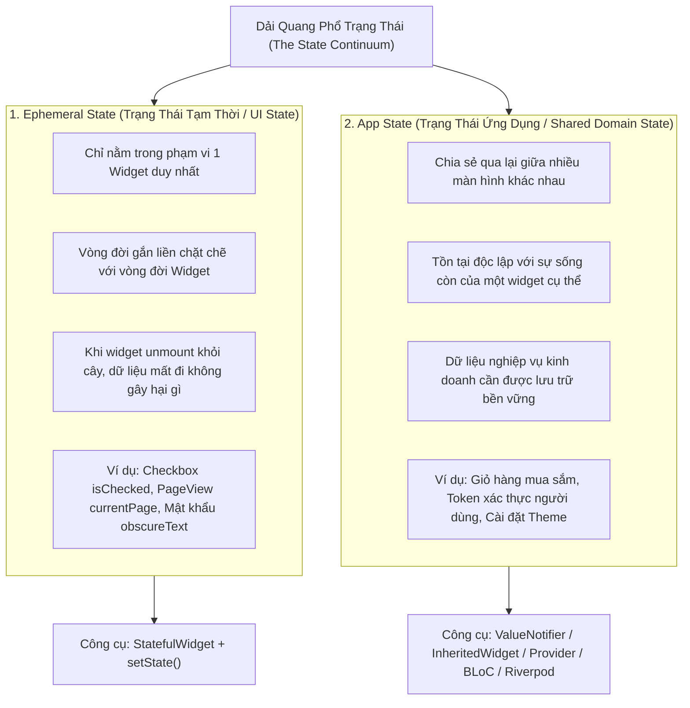
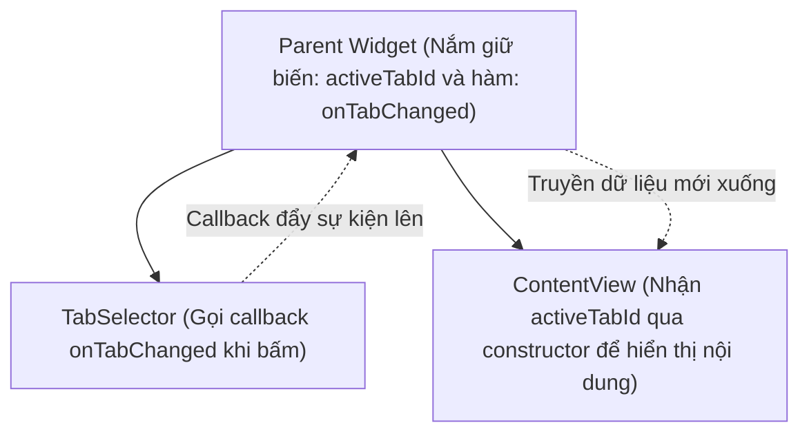
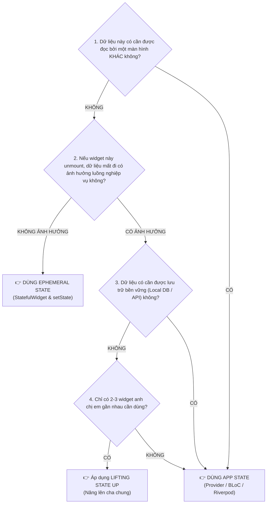

# Chuyên Đề 08 - Bài 01: Mô Hình Tư Duy: Ephemeral State vs App State

> **Trọng tâm**: Định nghĩa chính thức của Google về hai loại trạng thái trong ứng dụng Flutter: Ephemeral State (Cục bộ) vs App State (Toàn cục), Cơ chế "Lifting State Up" (Nâng trạng thái lên cha chung), Khung quyết định kiến trúc 4 câu hỏi, Cạm bẫy Over-engineering và Under-engineering, và bộ câu hỏi thẩm định năng lực kỹ thuật chuyên sâu.

---

## 1. Bản Đồ Phân Loại Trạng Thái Của Google (The State Continuum)

Trong tài liệu chính thức `flutter.dev`, các kỹ sư Google định nghĩa: **State (Trạng thái) là toàn bộ dữ liệu cần thiết để tái dựng lại giao diện người dùng tại bất kỳ thời điểm nào**.

Mọi trạng thái trong ứng dụng không đứng độc lập mà nằm trên một dải quang phổ liên tục (The State Continuum), được chia làm hai thái cực cốt lõi:



---

## 2. So Sánh Chi Tiết: Ephemeral State vs App State

| Tiêu Chí Đánh Giá | Ephemeral State (Cục Bộ) | App State (Toàn Cục / Chia Sẻ) |
| :--- | :--- | :--- |
| **Phạm vi nhận biết** | Cục bộ bên trong một `StatefulWidget`. Các widget khác bên ngoài hoàn toàn mù tịt về sự tồn tại của nó. | Nhiều widget ở các nhánh khác nhau trên cây cùng đọc và cập nhật. |
| **Vòng đời (Lifecycle)** | Khởi tạo trong `initState()` và bị tiêu hủy sạch sẽ trong `dispose()` khi widget bị gỡ khỏi cây. | Tồn tại xuyên suốt phiên làm việc của người dùng (Session), chỉ bị xóa khi đăng xuất hoặc đóng app. |
| **Nhu cầu đồng bộ mạng** | Hầu như không cần lưu xuống database hay đồng bộ qua API. | Thường xuyên đồng bộ với REST API, GraphQL hoặc lưu trữ cục bộ (Local Database / Cache). |
| **Công cụ kỹ thuật** | `StatefulWidget` + `setState()`, `ValueNotifier` cục bộ. | `ChangeNotifier`, `InheritedWidget`, `BlocProvider`, `Riverpod Providers`. |
| **Độ phức tạp** | Cực thấp, dựng nhanh, không cần boilerplate. | Đòi hỏi thiết kế kiến trúc (Clean Architecture, Immutable State, State Machine). |

---

## 3. Kỹ Thuật "Lifting State Up" (Nâng Trạng Thái Lên Cha Chung)

Khi hai widget anh chị em (Siblings) cần chia sẻ dữ liệu với nhau nhưng chưa đủ phức tạp để dùng một thư viện State Management cồng kềnh, quy tắc chuẩn của Flutter là **Nâng trạng thái lên Widget cha chung gần nhất (Lowest Common Ancestor)**:



```dart
class ParentDashboard extends StatefulWidget {
  const ParentDashboard({super.key});

  @override
  State<ParentDashboard> createState() => _ParentDashboardState();
}

class _ParentDashboardState extends State<ParentDashboard> {
  int _selectedTabIndex = 0; // 🌟 Trạng thái được nâng lên cha chung

  @override
  Widget build(BuildContext context) {
    return Column(
      children: [
        // Con 1: Gửi sự kiện thay đổi lên cha
        TabButtonsRow(
          selectedIndex: _selectedTabIndex,
          onTabSelected: (index) => setState(() => _selectedTabIndex = index),
        ),
        // Con 2: Nhận dữ liệu từ cha để hiển thị
        TabDisplayArea(currentTab: _selectedTabIndex),
      ],
    );
  }
}
```

---

## 4. Khung Quyết Định 4 Câu Hỏi (Architecture Decision Framework)

Trước khi viết bất kỳ biến trạng thái nào, hãy tự vấn qua 4 câu hỏi:



---

## 5. Cạm Bẫy Thực Tế: Over-Engineering vs Under-Engineering

> [!WARNING]
> **Cạm bẫy 1: Over-Engineering (Lạm dụng BLoC / Riverpod cho UI State)**  
> Nhiều lập trình viên đưa cả trạng thái "Dropdown đang mở hay đóng", "Checkbox đang tick hay chưa", hoặc "AnimationController đang ở frame nào" vào BLoC State.  
> *Hậu quả*: Phát sinh hàng tá Event và State vô nghĩa, làm chậm tốc độ phát triển và gây khó khăn khi viết Unit Test cho logic kinh doanh thực sự!

> [!CAUTION]
> **Cạm bẫy 2: Under-Engineering (Lạm dụng `setState` cho Shared Data)**  
> Cố tình truyền `userToken` hoặc danh sách giỏ hàng xuyên qua 10 tầng widget thông qua tham số constructor (Prop Drilling) kết hợp với `setState()` ở widget gốc.  
> *Hậu quả*: Mỗi lần giỏ hàng thay đổi, toàn bộ cây Widget của ứng dụng bị rebuild lại từ đầu, gây tụt FPS và sinh ra code spaghetti không thể bảo trì!

---

## 🎯 Thẩm Định Năng Lực & Phân Tích Chuyên Sâu (Technical Competency & Deep Dive)

### Câu hỏi 1: Hãy phân biệt sự khác nhau giữa Ephemeral State và App State theo tài liệu chính thức của Google. Hãy đưa ra 3 ví dụ thực tế cho mỗi loại trong một ứng dụng Fintech / Ngân hàng số.

#### 🎯 Điểm Đánh Giá Benchmark 10/10:
1. **Bản chất lý thuyết**:
   - **Ephemeral State (Local UI State)**: Là trạng thái tạm thời, tự cung tự cấp bên trong một widget duy nhất. Nó không ảnh hưởng đến bất kỳ phần nào khác của ứng dụng và có thể an toàn bị garbage collect khi widget unmount.
   - **App State (Shared / Domain State)**: Là trạng thái dùng chung giữa nhiều phần của ứng dụng, đại diện cho dữ liệu nghiệp vụ kinh doanh hoặc danh tính của phiên người dùng. Nó tồn tại độc lập với vòng đời của các màn hình đơn lẻ.
2. **Ví dụ trong ứng dụng Fintech / Ngân hàng số**:
   - **3 ví dụ Ephemeral State**:
     1. Trạng thái ẩn/hiện mật khẩu (biến `bool _obscureText`) trên ô nhập mã PIN.
     2. Chỉ số tab đang chọn (`_currentStep`) trong quy trình đăng ký KYC 3 bước.
     3. Trạng thái hiệu ứng xoay loading spinner trên nút bấm "Xác nhận chuyển khoản" trong khi đang chờ phản hồi.
   - **3 ví dụ App State**:
     1. Số dư tài khoản khả dụng (`accountBalance`) - cần hiển thị đồng thời ở AppBar trang chủ, màn hình chuyển tiền và thông báo biến động số dư.
     2. Mã phiên đăng nhập (`authToken / sessionToken`) - dùng để đính kèm vào header của mọi request HTTP và quyết định Route Guard bảo vệ ứng dụng.
     3. Cài đặt sinh trắc học của người dùng (`isBiometricEnabled`) - quyết định phương thức xác thực mở app trên toàn hệ thống.

---

### Câu hỏi 2: Trình bày khái niệm "Lifting State Up" (Nâng trạng thái lên cha chung) trong Flutter. Khi nào kỹ thuật này trở nên kém hiệu quả và cần phải chuyển sang một giải pháp State Management chuyên dụng?

#### 🎯 Điểm Đánh Giá Benchmark 10/10:
1. **Khái niệm "Lifting State Up"**:
   - Trong mô hình Declarative UI, dữ liệu luôn chảy xuôi dòng từ trên xuống dưới (Downwards), trong khi sự kiện tương tác được đẩy ngược dòng từ dưới lên trên qua callbacks (Upwards).
   - Khi hai widget con cùng cấp (không có quan hệ cha-con) cần chia sẻ dữ liệu hoặc phụ thuộc lẫn nhau, giải pháp tự nhiên nhất là dời biến trạng thái đó lên Widget cha chung gần nhất của chúng (Lowest Common Ancestor). Cha sẽ truyền biến đó xuống cho con cần đọc và truyền hàm callback xuống cho con cần sửa.
2. **Giới hạn và điểm gãy của kỹ thuật (Breakdown Point)**:
   - **Hiện tượng Prop Drilling**: Khi khoảng cách phân cấp giữa cha chung và con cháu cách nhau từ 4-5 tầng widget trở lên, bạn phải truyền tham số qua các widget trung gian hoàn toàn không có nhu cầu sử dụng dữ liệu đó.
   - **Lãng phí hiệu năng Rebuild**: Khi cha chung gọi `setState()`, không chỉ 2 widget con liên quan bị rebuild mà toàn bộ cây con bên dưới cha chung đó đều bị quét qua và rebuild theo, gây tụt khung hình trên các cây widget phức tạp.
   - **Khi đó**: Cần chuyển sang các giải pháp dựa trên `InheritedWidget` (như Provider, BLoC, Riverpod) để cho phép widget con kết nối trực tiếp với nguồn dữ liệu trong $O(1)$ mà không cần widget trung gian.

---

### Câu hỏi 3: Tại sao việc đưa toàn bộ trạng thái của ứng dụng (bao gồm cả trạng thái UI nhỏ nhặt) vào một State Management toàn cục (như BLoC hoặc Redux) lại bị coi là một Anti-Pattern (Over-engineering)?

#### 🎯 Điểm Đánh Giá Benchmark 10/10:
1. **Bùng nổ mã nguồn thừa thãi (Boilerplate Explosion)**:
   - Với mỗi thao tác UI nhỏ (ví dụ: mở một Accordion, chọn một Radio button), bạn phải tạo thêm một Event class, một trường trong State class, một hàm xử lý `on<Event>`, và một khối `BlocBuilder`. Điều này làm tăng kích thước codebase gấp 3-4 lần một cách không cần thiết.
2. **Làm bẩn ranh giới nghiệp vụ (Polluting Business Domain)**:
   - Mục tiêu cốt lõi của các mẫu kiến trúc như BLoC hay Redux là tách biệt logic kinh doanh (Business Logic) khỏi giao diện (Presentation).
   - Việc đưa các trạng thái thuần túy thị giác (Visual UI state) vào BLoC làm mờ ranh giới này, biến BLoC thành một bộ điều khiển giao diện chắp vá thay vì là bộ điều phối nghiệp vụ.
3. **Mất khả năng tái sử dụng linh kiện (Component Reusability)**:
   - Một widget tùy biến (ví dụ: một thẻ Card có thể mở rộng) nếu tự quản lý trạng thái mở/đóng bằng `StatefulWidget` thì có thể tái sử dụng ở bất kỳ dự án nào. Nếu nó bị gắn chặt vào một BLoC cụ thể của app, nó sẽ mất hoàn toàn tính độc lập và không thể mang sang màn hình khác hay module khác được nữa.
