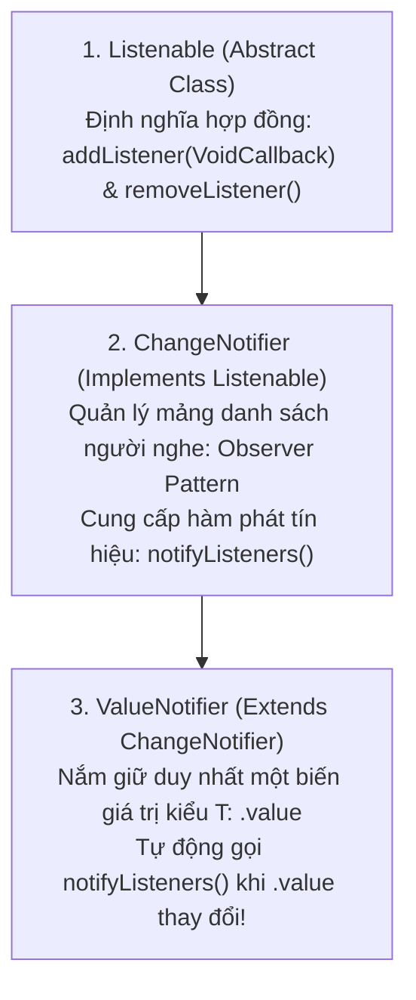
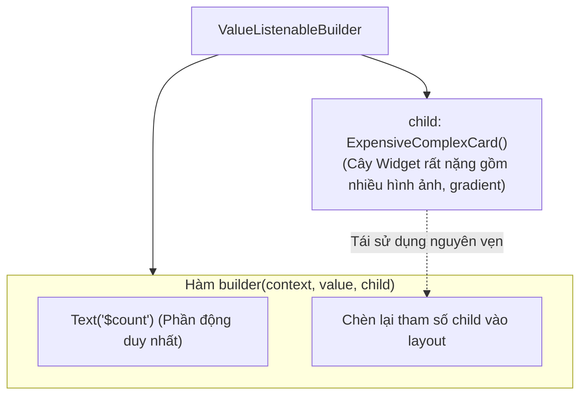

# Chuyên Đề 08 - Bài 02: Quản Lý Trạng Thái Tinh Gọn Với ValueNotifier & ListenableBuilder

> **Trọng tâm**: Phả hệ kiến trúc `Listenable` $\rightarrow$ `ChangeNotifier` $\rightarrow$ `ValueNotifier<T>`, Cạm bẫy toán tử bằng (`==`) khi biến đổi Collection trong `ValueNotifier`, Khai thác triệt để tham số `child` chống rebuild cây tĩnh, Sự ra đời của `ListenableBuilder` (Flutter 3.10+), và bộ câu hỏi phỏng vấn tuyển dụng top tech.

---

## 1. Phả Hệ Kiến Trúc: `Listenable` $\rightarrow$ `ChangeNotifier` $\rightarrow$ `ValueNotifier`

Hầu hết các giải pháp phản ứng (Reactive) trong Flutter SDK đều xoay quanh một giao diện duy nhất:



---

## 2. Cạm Bẫy Toán Tử Bằng (`==`): Tại Sao Thêm Phần Tử Vào List Không Rebuild?

Hãy xem đoạn mã nguồn thực tế của `ValueNotifier` trong Flutter SDK:

```dart
// Trích xuất mã nguồn Framework Flutter:
class ValueNotifier<T> extends ChangeNotifier implements ValueListenable<T> {
  T _value;

  set value(T newValue) {
    // ⚠️ ĐÂY LÀ ĐIỂM THEN CHỐT:
    if (_value == newValue) {
      return; // 💥 NẾU GIỐNG NHAU, THOÁT NGAY LẬP TỨC! KHÔNG PHÁT TÍN HIỆU!
    }
    _value = newValue;
    notifyListeners();
  }
}
```

### ❌ Sai lầm kinh điển với List / Map:

```dart
final listNotifier = ValueNotifier<List<String>>(['A', 'B']);

void addNewItem() {
  listNotifier.value.add('C'); // Sửa đổi trực tiếp trên mảng cũ (In-place Mutation)
  listNotifier.value = listNotifier.value; 
  // 💥 GIAO DIỆN HOÀN TOÀN KHÔNG VẼ LẠI!
}
```

### Tại sao lại không vẽ lại?
Vì `listNotifier.value` vẫn trỏ tới **cùng một vùng nhớ tham chiếu (Reference)** với `_value` cũ trong bộ nhớ Heap! Phép so sánh `_value == newValue` trả về `true`, Flutter lập tức thoát ra và **hoàn toàn không gọi `notifyListeners()`**!

---

### ✅ 2 Cách Khắc Phục Chuẩn Google:

#### Cách 1: Tạo bản sao danh sách mới (Immutability Pattern - Khuyến nghị):
```dart
void addNewItem() {
  // Tạo mảng mới với toán tử Spread (...): Địa chỉ tham chiếu mới khác mảng cũ!
  listNotifier.value = [...listNotifier.value, 'C']; // ✅ notifyListeners() kích hoạt ngay!
}
```

#### Cách 2: Kế thừa `ChangeNotifier` để chủ động gọi `notifyListeners()`:
```dart
class CartController extends ChangeNotifier {
  final List<String> _items = [];
  List<String> get items => List.unmodifiable(_items);

  void addItem(String item) {
    _items.add(item);
    notifyListeners(); // Chủ động phát tín hiệu
  }
}
```

---

## 3. Bí Mật Tối Ưu Rebuild Với Tham Số `child`

Cả `ValueListenableBuilder` và `ListenableBuilder` đều có một tham số mà nhiều lập trình viên bỏ qua: **`child`**.



```dart
ValueListenableBuilder<int>(
  valueListenable: myCounterNotifier,
  // 🌟 KHỞI TẠO CÂY NẶNG 1 LẦN DUY NHẤT Ở THAM SỐ child:
  child: const ExpensiveHeavyWidget(),
  builder: (context, count, child) {
    return Row(
      children: [
        Text('Số lượng: $count'), // Chỉ duy nhất dòng Text này bị vẽ lại!
        child!, // Tái sử dụng đối tượng Widget cũ, KHÔNG bị rebuild lại từ đầu!
      ],
    );
  },
)
```

---

## 4. `ListenableBuilder` (Flutter 3.10+): Tiêu Chuẩn Hiện Đại

Trước Flutter 3.10, lập trình viên thường phải "mượn" `AnimatedBuilder` để lắng nghe các `ChangeNotifier`.  
Từ Flutter 3.10, **`ListenableBuilder`** chính thức ra đời như một widget chuyên dụng để lắng nghe **bất kỳ đối tượng nào kế thừa `Listenable`** (`ChangeNotifier`, `ValueNotifier`, `ScrollController`, `TextEditingController`):

```dart
class ProfileViewModel extends ChangeNotifier {
  String name = 'Harry';
  int age = 25;

  void updateName(String newName) {
    name = newName;
    notifyListeners();
  }
}

// Trong UI:
class ProfileHeader extends StatelessWidget {
  final ProfileViewModel viewModel;
  const ProfileHeader({super.key, required this.viewModel});

  @override
  Widget build(BuildContext context) {
    return ListenableBuilder(
      listenable: viewModel,
      builder: (context, _) {
        return Text('Tên: ${viewModel.name} - Tuổi: ${viewModel.age}');
      },
    );
  }
}
```

---

## 🎯 Góc Phỏng Vấn Tuyển Dụng (Google & Top Tech Interview Q&A)

### Câu hỏi 1: Phân tích cơ chế kiểm tra tính bằng nhau (`_value == newValue`) trong setter của `ValueNotifier<T>`. Tại sao đoạn code `myListNotifier.value.add(item); myListNotifier.value = myListNotifier.value;` lại KHÔNG kích hoạt việc vẽ lại giao diện? Cách khắc phục chuẩn mực là gì?

#### 🎯 Điểm Đánh Giá Benchmark 10/10:
1. **Cơ chế so sánh trong `ValueNotifier`**:
   - Trong phương thức `set value(T newValue)`, `ValueNotifier` thực hiện kiểm tra:
     `if (_value == newValue) return;`.
   - Đối với các kiểu dữ liệu nguyên thủy (Primitive Types: `int`, `double`, `bool`, `String`), toán tử `==` so sánh theo giá trị.
   - Đối với các cấu trúc dữ liệu đối tượng hoặc Collection (`List`, `Map`, `Set`), toán tử `==` mặc định kiểm tra **tính đồng nhất về mặt tham chiếu con trỏ bộ nhớ (Identity / Memory Reference Equality)**.
2. **Nguyên nhân không kích hoạt render**:
   - Lệnh `myListNotifier.value.add(item)` thực hiện biến đổi nội dung trên chính đối tượng mảng hiện tại nằm trên bộ nhớ Heap (In-place Mutation).
   - Khi gán lại `myListNotifier.value = myListNotifier.value`, biến `_value` cũ và biến `newValue` mới đều đang cùng trỏ tới duy nhất một địa chỉ ô nhớ.
   - Phép so sánh `_value == newValue` trả về `true` $\rightarrow$ Setter lập tức gọi lệnh `return` mà không bao giờ chạm tới dòng `notifyListeners()`. UI hoàn toàn đứng yên.
3. **Cách khắc phục chuẩn kiến trúc**:
   - Tuân thủ nguyên tắc **Bất biến (Immutability)**: Không chỉnh sửa mảng cũ mà luôn sinh ra một đối tượng mảng hoàn toàn mới với toán tử Spread:
     ```dart
     myListNotifier.value = [...myListNotifier.value, item];
     ```
   - Việc tạo ra một mảng mới sẽ có địa chỉ ô nhớ mới, giúp phép so sánh `_value == newValue` trả về `false`, kích hoạt `notifyListeners()` và cập nhật giao diện ngay tức thì.

---

### Câu hỏi 2: Vai trò của tham số `child` trong `ValueListenableBuilder` (hoặc `ListenableBuilder`) là gì? Cơ chế này giúp tối ưu hiệu năng render như thế nào ở tầng Element Tree?

#### 🎯 Điểm Đánh Giá Benchmark 10/10:
1. **Vai trò của tham số `child`**:
   - Cho phép định nghĩa trước một cây widget tĩnh (Static Subtree) nằm ngoài phạm vi thực thi của hàm `builder(context, value, child)`.
   - Widget con này được khởi tạo một lần duy nhất khi cha nó được build và được chuyển giao vào trong hàm `builder` dưới dạng một tham số đối tượng đã tồn tại sẵn.
2. **Cơ chế tối ưu hóa ở tầng Element Tree**:
   - Khi `ValueNotifier` phát tín hiệu, chỉ có hàm callback `builder` được thực thi lại.
   - Nếu một widget con phức tạp được đặt ở tham số `child`, tham chiếu đối tượng của nó không đổi giữa các lần rebuild.
   - Khi Flutter thực hiện thuật toán Diffing (`Widget.canUpdate(oldWidget, newWidget)`):
     - `identical(oldWidget, newWidget) == true` (Cùng một đối tượng trên RAM).
     - Element tương ứng của `child` nhận diện được widget không thay đổi $\rightarrow$ **Nó lập tức bỏ qua toàn bộ việc rebuild cây con bên dưới `child`**, không gọi lại hàm `build()` của con và không tính toán lại layout.
   - Điều này giúp cô lập phạm vi render cực kỳ cục bộ, biến việc cập nhật giao diện thành thao tác siêu nhẹ chỉ tốn vài micro-giây.

---

### Câu hỏi 3: So sánh `ChangeNotifier` và `ValueNotifier<T>`. Khi nào bạn nên chọn `ValueNotifier` và khi nào nên kế thừa từ `ChangeNotifier` để quản lý logic trạng thái của một màn hình?

#### 🎯 Điểm Đánh Giá Benchmark 10/10:
1. **So sánh bản chất**:
   - `ValueNotifier<T>` thực chất là một lớp con của `ChangeNotifier`. Nó được chuyên biệt hóa để quản lý **duy nhất một giá trị dữ liệu đơn lẻ kiểu `T`**. Nó tự động gọi `notifyListeners()` mỗi khi thuộc tính `.value` được gán giá trị mới khác cũ.
   - `ChangeNotifier` là một lớp đa năng tổng quát. Nó có thể chứa nhiều biến trạng thái phức tạp, và nhà phát triển có toàn quyền kiểm soát thời điểm phát tín hiệu bằng cách gọi hàm `notifyListeners()` thủ công.
2. **Tiêu chí lựa chọn thực tế**:
   - **Chọn `ValueNotifier<T>` khi**:
     - Quản lý các trạng thái đơn lẻ độc lập: Một bộ đếm (Counter), một cờ bật tắt (`bool isLoading`), giá trị của một thanh trượt (`double progress`), hoặc số lượng giỏ hàng (`int cartCount`).
     - Khi muốn code siêu ngắn gọn, không cần tạo class mới, chỉ cần khai báo một biến duy nhất.
   - **Chọn `ChangeNotifier` khi**:
     - Quản lý một ViewModel hoặc Controller chứa nhiều trường dữ liệu có mối quan hệ phụ thuộc lẫn nhau (ví dụ: `UserSessionController` chứa `user`, `token`, `isAuthenticated`, `roles`).
     - Khi một hành động nghiệp vụ cần biến đổi nhiều biến cùng một lúc nhưng chỉ muốn phát đúng **1 tín hiệu notify duy nhất ở cuối hàm** để tránh việc UI bị rebuild liên tục nhiều lần.
