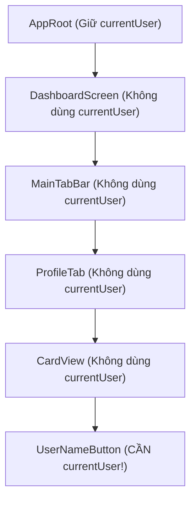
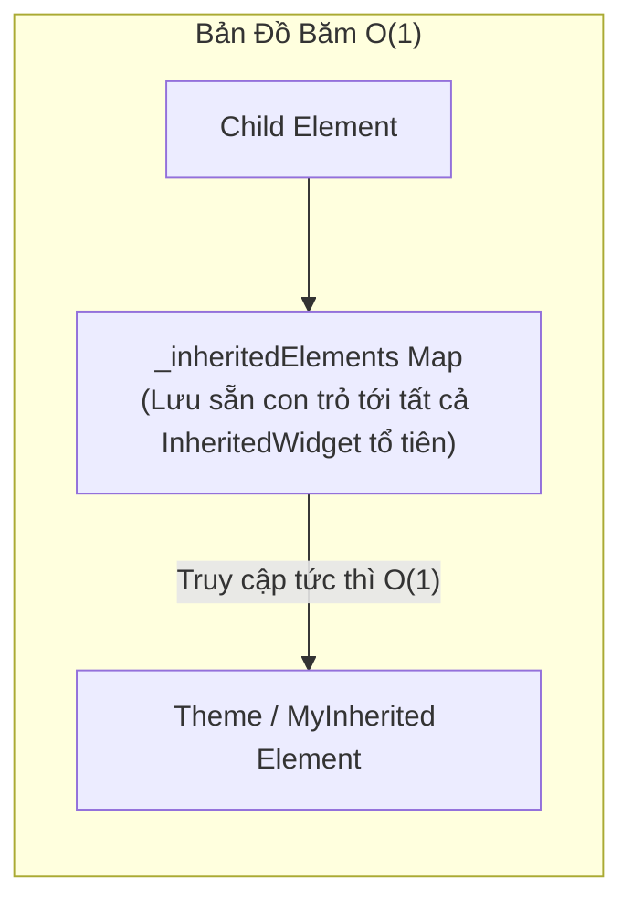

# Chuyên Đề 08 - Bài 03: Bản Chất Gốc Rễ Của State Trong Flutter: InheritedWidget

> **Trọng tâm**: Giải mã bài toán "Prop Drilling" (Phải truyền tham số qua 50 tầng widget con), Bản chất hoạt động của `InheritedWidget`, Cách Flutter tra cứu dữ liệu đạt tốc độ $O(1)$, và tự tay viết một InheritedWidget hoàn chỉnh từ đầu.

---

## 1. Nỗi Đau "Prop Drilling" & Cách Giải Quyết Của Flutter

Hãy tưởng tượng bạn lưu thông tin người dùng (`currentUser`) ở Widget gốc của ứng dụng (`AppRoot`). Một nút bấm nhỏ ở sâu tận đáy của cây widget (tầng thứ 30) cần đọc tên người dùng để hiển thị:



- Nếu không có giải pháp, bạn phải truyền `currentUser` qua constructor của **tất cả 5 tầng trung gian**!
- 👉 **`InheritedWidget` ra đời**: Cho phép bất kỳ Widget con nào ở bất kỳ độ sâu nào có thể "bắt sóng" trực tiếp dữ liệu từ tổ tiên chỉ bằng dòng lệnh: `MyInherited.of(context)`.

---

## 2. Bí Mật Tốc Độ $O(1)$ Của `InheritedWidget`

Nhiều người nghĩ rằng khi gọi `Theme.of(context)`, Flutter phải chạy một vòng lặp `while (element != null)` để duyệt ngược từng nốt trên cây từ dưới lên trên.  
**Thực tế không phải vậy!**



- Mỗi `Element` khi được đưa vào cây đều kế thừa một bảng băm `_inheritedElements` từ cha của nó.
- Do đó, việc gọi `context.dependOnInheritedWidgetOfExactType<T>()` là một phép tra cứu Map với độ phức tạp thời gian **chính xác $O(1)$**, bất kể cây widget của bạn sâu bao nhiêu trăm tầng!

---

## 3. Tự Tay Viết Một `InheritedWidget` Chuẩn Chỉnh

Dưới đây là mã nguồn tự xây dựng một hệ thống chia sẻ thông tin tài khoản người dùng:

```dart
class UserData {
  final String id;
  final String name;
  final int points;

  const UserData({required this.id, required this.name, required this.points});
}

// 1. Kế thừa InheritedWidget
class UserScope extends InheritedWidget {
  final UserData user;

  const UserScope({
    super.key,
    required this.user,
    required super.child,
  });

  // 2. Hàm quy định: Khi nào thì báo cho các widget con rebuild?
  @override
  bool updateShouldNotify(covariant UserScope oldWidget) {
    // Chỉ yêu cầu con rebuild nếu dữ liệu user thực sự thay đổi khác cũ
    return oldWidget.user != user;
  }

  // 3. Phương thức tĩnh "of" chuẩn mực của Flutter
  static UserScope of(BuildContext context) {
    // dependOnInheritedWidgetOfExactType: Đăng ký liên kết phụ thuộc!
    final UserScope? scope = context.dependOnInheritedWidgetOfExactType<UserScope>();
    assert(scope != null, 'Không tìm thấy UserScope nào ở tổ tiên của context này');
    return scope!;
  }
}
```

### Cách Sử Dụng Trong Ứng Dụng:

```dart
// Đặt ở trên đỉnh cây:
UserScope(
  user: const UserData(id: '1', name: 'Nguyễn Văn A', points: 150),
  child: const MainDashboard(),
)

// Ở bất kỳ widget con nào cách đó 50 tầng:
class PointsBadge extends StatelessWidget {
  const PointsBadge({super.key});

  @override
  Widget build(BuildContext context) {
    // Lấy dữ liệu trực tiếp trong O(1)!
    final user = UserScope.of(context).user;

    return Text('Điểm thưởng: ${user.points} pts');
  }
}
```

> [!NOTE]
> **Nền Tảng Của Toàn Bộ Các Thư Viện Lớn**:  
> Thư viện **`Provider`** thực chất chỉ là một lớp bọc tiện ích được xây dựng 100% dựa trên `InheritedWidget`!  
> Thư viện **`flutter_bloc`** với `BlocProvider.of(context)` cũng vận hành nhờ `InheritedWidget`!
