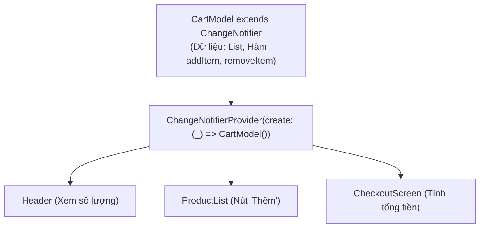

# Chuyên Đề 08 - Bài 04: Mô Hình Provider & ChangeNotifier (Chuẩn flutter.dev)

> **Trọng tâm**: Mô hình quản lý trạng thái chính thức được Google hướng dẫn trong tài liệu `flutter.dev`, Cung cấp State với `ChangeNotifierProvider` & `MultiProvider`, Phân biệt sống còn `context.watch()` vs `context.read()`, và tối ưu rebuild chi li bằng `Consumer` & `Selector`.

---

## 1. Kiến Trúc Chuẩn Của Provider

Mô hình `Provider` kết hợp 2 thành phần:
1. **`ChangeNotifier`**: Lớp chứa dữ liệu và các hàm logic kinh doanh (Business Logic).
2. **`Provider`**: Lớp bọc `InheritedWidget` giúp truyền đối tượng `ChangeNotifier` đó xuống cho toàn bộ cây con bên dưới.



---

## 2. Xây Dựng Model Nghiệp Vụ (`ChangeNotifier`)

```dart
class CartItem {
  final String id;
  final String title;
  final double price;

  const CartItem({required this.id, required this.title, required this.price});
}

class CartProvider extends ChangeNotifier {
  final List<CartItem> _items = [];

  // Getter bất biến bảo vệ dữ liệu không bị sửa tùy tiện từ ngoài
  List<CartItem> get items => List.unmodifiable(_items);
  
  double get totalPrice => _items.fold(0.0, (sum, item) => sum + item.price);
  int get itemCount => _items.length;

  void addItem(CartItem item) {
    _items.add(item);
    notifyListeners(); // 📢 Phát tín hiệu yêu cầu tất cả widget đang lắng nghe rebuild!
  }

  void removeItem(String id) {
    _items.removeWhere((item) => item.id == id);
    notifyListeners();
  }
}
```

---

## 3. Cung Cấp State Ở Tầng Gốc Với `MultiProvider`

```dart
void main() {
  runApp(
    MultiProvider(
      providers: [
        ChangeNotifierProvider(create: (_) => CartProvider()),
        // Có thể thêm nhiều provider khác tại đây: UserProvider, ThemeProvider...
      ],
      child: const MyApp(),
    ),
  );
}
```

---

## 4. `context.watch` vs `context.read`: Quy Tắc Bất Di Bất Dịch

| Lệnh | Ý Nghĩa | Khi Nào Được Dùng? | Cấm Kỵ Tuyệt Đối |
| :--- | :--- | :--- | :--- |
| **`context.watch<T>()`** | Đọc dữ liệu và **đăng ký lắng nghe**. Bất cứ khi nào model gọi `notifyListeners()`, widget này sẽ **bị rebuild lại**! | Chỉ dùng bên trong hàm `build(BuildContext context)`. | **CẤM DÙNG** bên trong các hàm callback sự kiện (`onPressed`, `onTap`). |
| **`context.read<T>()`** | Đọc đối tượng một lần duy nhất để **gọi một hàm thực thi**. **KHÔNG đăng ký lắng nghe rebuild**. | Dùng bên trong các hàm xử lý sự kiện như nút bấm `onPressed: () => context.read<CartProvider>().addItem(...)`. | **CẤM DÙNG** trực tiếp trong hàm `build` để hiển thị dữ liệu vì UI sẽ không cập nhật khi dữ liệu đổi! |

```dart
// Ví dụ thực tế:
class AddToCartButton extends StatelessWidget {
  final CartItem product;
  const AddToCartButton({super.key, required this.product});

  @override
  Widget build(BuildContext context) {
    return ElevatedButton(
      onPressed: () {
        // ✅ ĐÚNG: Dùng context.read() trong callback sự kiện:
        context.read<CartProvider>().addItem(product);
      },
      child: const Text('Thêm vào giỏ'),
    );
  }
}
```

---

## 5. Tối Ưu Hóa Cực Hạn Với `Selector`

Giả sử màn hình thanh toán chỉ cần hiển thị `totalPrice`. Nếu bạn dùng `context.watch<CartProvider>()`, thì khi người dùng đổi tên một món hàng trong giỏ, màn hình này vẫn bị rebuild oan uổng!  
👉 **`Selector` chỉ rebuild khi thuộc tính được chọn thực sự thay đổi giá trị**:

```dart
Selector<CartProvider, double>(
  // 1. Chỉ trích xuất riêng trường totalPrice:
  selector: (context, cart) => cart.totalPrice,
  // 2. Chỉ khi con số totalPrice này thay đổi thì builder mới chạy lại:
  builder: (context, totalPrice, child) {
    return Text('Tổng tiền: \$${totalPrice.toStringAsFixed(2)}');
  },
)
```
