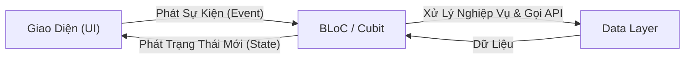
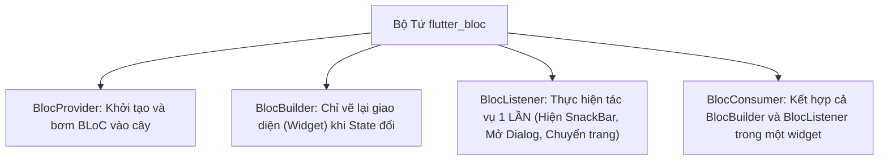

# Chuyên Đề 08 - Bài 05: Cầu Nối Lên Dự Án Lớn: BLoC & Cubit

> **Trọng tâm**: Tại sao các dự án doanh nghiệp lớn ưu tiên chọn BLoC / Cubit, Luồng dữ liệu một chiều (Unidirectional Data Flow), So sánh Cubit (hàm) vs BLoC (sự kiện), và bộ tứ quyền lực: `BlocProvider`, `BlocBuilder`, `BlocListener`, `BlocConsumer`.

---

## 1. Tại Sao Dự Án Lớn Chuyển Từ Provider Sang BLoC?

Provider rất tuyệt vời cho ứng dụng vừa và nhỏ. Nhưng khi dự án có **hơn 10 lập trình viên cùng làm việc**, `ChangeNotifier` bộc lộ một số nhược điểm:
1. Bất kỳ ai cũng có thể gọi `notifyListeners()` tùy tiện ở bất cứ đâu, khó theo dõi ai vừa làm thay đổi dữ liệu.
2. Không có cấu trúc State bắt buộc (Loading, Success, Failure) $\rightarrow$ mỗi người code một kiểu.

👉 **BLoC (Business Logic Component)** chuẩn hóa mọi thứ theo **Luồng Dữ Liệu Một Chiều (Unidirectional Data Flow)**:



---

## 2. Cubit: Phiên Bản Tinh Gọn, Dễ Học Của BLoC

Nếu BLoC yêu cầu bạn phải tạo các class Event riêng biệt, thì **Cubit** cho phép bạn gọi trực tiếp các hàm thông thường, nhưng vẫn phát ra các **State bất biến**:

### Bước 1: Định Nghĩa State Bằng `sealed class`

```dart
// auth_state.dart
sealed class AuthState {
  const AuthState();
}
class AuthInitial extends AuthState {}
class AuthLoading extends AuthState {}
class AuthSuccess extends AuthState {
  final String token;
  const AuthSuccess(this.token);
}
class AuthFailure extends AuthState {
  final String error;
  const AuthFailure(this.error);
}
```

### Bước 2: Viết Cubit Kế Thừa `Cubit<AuthState>`

```dart
// auth_cubit.dart
class AuthCubit extends Cubit<AuthState> {
  final AuthRepository _repo;

  AuthCubit(this._repo) : super(AuthInitial());

  Future<void> login(String username, String password) async {
    emit(AuthLoading()); // 📢 Phát trạng thái đang tải
    try {
      final token = await _repo.login(username, password);
      emit(AuthSuccess(token)); // 📢 Đăng nhập thành công
    } catch (e) {
      emit(AuthFailure(e.toString())); // 📢 Thất bại
    }
  }
}
```

---

## 3. Bộ Tứ Widget Của `flutter_bloc`

Khi kết nối BLoC/Cubit với giao diện, bạn có 4 công cụ chính:



### 3.1. `BlocBuilder` vs `BlocListener`: Đừng Nhầm Lẫn!

> [!CAUTION]
> **Sai lầm phổ biến**: Gọi `Navigator.push()` hoặc `ScaffoldMessenger.showSnackBar()` bên trong hàm `builder` của `BlocBuilder`.  
> *Hậu quả*: Hàm `builder` có thể bị gọi lại nhiều lần mỗi khi màn hình xoay hoặc widget cha rebuild, khiến thông báo lỗi hoặc popup bị hiện lặp lại 10 lần!

- **Dùng `BlocBuilder`**: Khi bạn muốn trả về một Widget (hiển thị Spinner, hiển thị danh sách).
- **Dùng `BlocListener`**: Khi bạn muốn thực hiện một hành động xảy ra đúng **1 lần duy nhất** theo trạng thái (One-off side effects: hiện SnackBar, chuyển trang, đóng popup).

---

### 3.2. `BlocConsumer`: Kết Hợp Cả Hai Hoàn Hảo

```dart
class LoginScreen extends StatelessWidget {
  const LoginScreen({super.key});

  @override
  Widget build(BuildContext context) {
    return BlocConsumer<AuthCubit, AuthState>(
      // 1. listener: Xử lý các tác vụ điều hướng & thông báo (Side-effects)
      listener: (context, state) {
        if (state is AuthFailure) {
          ScaffoldMessenger.of(context).showSnackBar(
            SnackBar(content: Text('Lỗi: ${state.error}'), backgroundColor: Colors.red),
          );
        } else if (state is AuthSuccess) {
          context.go('/home'); // Chuyển trang khi thành công
        }
      },
      // 2. builder: Chỉ tập trung vẽ giao diện tương ứng với State
      builder: (context, state) {
        if (state is AuthLoading) {
          return const Center(child: CircularProgressIndicator());
        }

        return ElevatedButton(
          onPressed: () {
            context.read<AuthCubit>().login('admin', '123456');
          },
          child: const Text('Đăng Nhập'),
        );
      },
    );
  }
}
```
