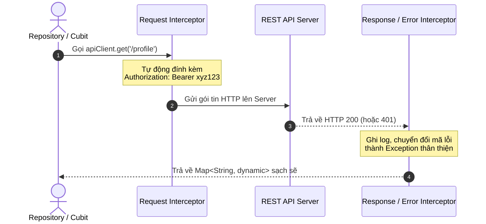

# Chuyên Đề 09 - Bài 01: Kiến Trúc Mạng (Networking) Với Dio & Interceptors

> **Trọng tâm**: So sánh `http` package vs `dio`, Thiết lập kiến trúc mạng chuẩn sản xuất (Production-ready Network Client), Quản lý `BaseOptions`, và tận dụng `Interceptors` để tự động chèn Bearer Token và bắt lỗi HTTP tập trung.

---

## 1. Tại Sao Dự Án Thực Tế Luôn Chọn `Dio` Thay Vì `http`?

Mặc dù package `http` của nhóm Dart rất nhẹ, nhưng trong dự án thực tế bạn sẽ phải đối mặt với:
1. Gắn Access Token vào header của **tất cả 50 request API** khác nhau.
2. Tự động ghi log request/response để debug.
3. Bắt lỗi mất mạng (Timeout, 401 Unauthorized, 500 Server Error) ở một nơi duy nhất thay vì viết `try-catch` lặp đi lặp lại ở từng hàm.  
👉 **`Dio`** cung cấp hệ thống **Interceptors (Bộ đánh chặn)** mạnh mẽ giải quyết toàn bộ các bài toán trên.

```yaml
dependencies:
  dio: ^5.4.0
```

---

## 2. Thiết Lập ApiClient Chuẩn Sản Xuất

```dart
class ApiClient {
  late final Dio _dio;

  ApiClient({String baseUrl = 'https://api.example.com/v1'}) {
    _dio = Dio(
      BaseOptions(
        baseUrl: baseUrl,
        connectTimeout: const Duration(seconds: 10), // Giới hạn chờ kết nối 10s
        receiveTimeout: const Duration(seconds: 10), // Giới hạn chờ nhận dữ liệu 10s
        headers: {
          'Content-Type': 'application/json',
          'Accept': 'application/json',
        },
      ),
    );

    // Gắn các Interceptor vào luồng xử lý
    _dio.interceptors.addAll([
      _authInterceptor(),
      _loggingInterceptor(),
      _errorInterceptor(),
    ]);
  }

  Dio get client => _dio;

  // 1. Interceptor tự động thêm Bearer Token vào Header
  Interceptor _authInterceptor() {
    return InterceptorsWrapper(
      onRequest: (options, handler) async {
        final token = await secureStorage.read(key: 'access_token');
        if (token != null) {
          options.headers['Authorization'] = 'Bearer $token';
        }
        return handler.next(options); // Tiếp tục gửi request đi
      },
    );
  }

  // 2. Interceptor ghi log chuyên nghiệp trong môi trường Debug
  Interceptor _loggingInterceptor() {
    return LogInterceptor(
      requestBody: true,
      responseBody: true,
      logPrint: (obj) => debugPrint('🌐 [HTTP] $obj'),
    );
  }

  // 3. Interceptor bắt mã lỗi tập trung
  Interceptor _errorInterceptor() {
    return InterceptorsWrapper(
      onError: (DioException error, handler) {
        if (error.response?.statusCode == 401) {
          // Xử lý khi Token hết hạn: Đăng xuất người dùng hoặc chuyển về màn login
          debugPrint('Phiên đăng nhập đã hết hạn! Cần chuyển trang Login.');
        }
        return handler.next(error); // Chuyển tiếp lỗi cho tầng Repository xử lý
      },
    );
  }
}
```

---

## 3. Sơ Đồ Luồng Hoạt Động Của Interceptors



> [!TIP]
> **Tổ Chức Code Thực Tế**:  
> Luôn khởi tạo `ApiClient` dưới dạng **Singleton** (thông qua `GetIt` hoặc `Provider`) và truyền vào các `Repository` (`UserRepository`, `ProductRepository`). Không bao giờ tạo mới `Dio()` rải rác bên trong từng màn hình Widget!
