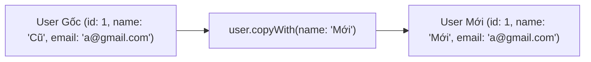

# Chuyên Đề 09 - Bài 02: Tuần Tự Hóa JSON & Xây Dựng Model Bất Biến (Freezed)

> **Trọng tâm**: Mối nguy hiểm chết người khi dùng `Map<String, dynamic>` trực tiếp, So sánh Parse JSON thủ công vs `json_serializable` vs `freezed`, Tính bất biến (Immutability), và phương thức sao chép `copyWith`.

---

## 1. Mối Nguy Hiểm Khi Dùng `Map<String, dynamic>` Trực Tiếp Trên UI

Rất nhiều người mới học Flutter viết code UI như sau:

```dart
// ❌ CỰC KỲ NGUY HIỂM:
Text(responseMap['data']['user']['first_name'])
```

### Tại sao cách này dẫn đến thảm họa?
1. **Sai chính tả không báo lỗi**: Chỉ cần bạn gõ nhầm `'firts_name'`, compiler hoàn toàn im lặng, nhưng khi app chạy sẽ bị `null` hoặc crash.
2. **Không có nhắc lệnh (IntelliSense/Autocomplete)**.
3. **Nếu Backend đổi tên trường**: Bạn sẽ phải tìm và sửa thủ công ở hàng chục màn hình khác nhau.

👉 **Quy Tắc Vàng**: Dữ liệu từ mạng về phải được **ánh xạ (Map) ngay lập tức thành một Class Model mạnh về kiểu (Type-safe Model)** trước khi đưa lên UI!

---

## 2. Mô Hình Dữ Liệu Bất Biến Chuẩn Mực Với `freezed`

`freezed` kết hợp cùng `json_serializable` là tiêu chuẩn vàng của cộng đồng Flutter để tạo ra các Model bất biến:
- Tự động sinh `fromJson` và `toJson`.
- Tự động sinh hàm sao chép `copyWith` (sửa thuộc tính mà không làm biến đổi object gốc).
- Tự động sinh toán tử so sánh bằng `operator ==` và `hashCode` dựa trên giá trị (Value Equality).

```yaml
dependencies:
  freezed_annotation: ^2.4.1
  json_annotation: ^4.8.1

dev_dependencies:
  build_runner: ^2.4.8
  freezed: ^2.4.6
  json_serializable: ^6.7.1
```

### Khai Báo Model Bằng Freezed:

```dart
// user_model.dart
import 'package:freezed_annotation/freezed_annotation.dart';

part 'user_model.freezed.dart';
part 'user_model.g.dart';

@freezed
class UserModel with _$UserModel {
  const factory UserModel({
    required String id,
    required String email,
    // Giá trị mặc định nếu Backend trả về null:
    @Default('Chưa cập nhật') String displayName,
    @Default(false) bool isVerified,
    String? avatarUrl,
  }) = _UserModel;

  // Tự động sinh hàm parse JSON
  factory UserModel.fromJson(Map<String, dynamic> json) => 
      _$UserModelFromJson(json);
}
```

Chạy lệnh sinh mã nguồn tự động:
```bash
dart run build_runner build --delete-conflicting-outputs
```

---

## 3. Sức Mạnh Của `copyWith`: Cập Nhật State Bất Biến

Trong lập trình phản ứng (Reactive / Declarative UI), bạn **không bao giờ được thay đổi trực tiếp thuộc tính của một object** (Mutation):
```dart
// ❌ SAI: Làm biến đổi trực tiếp đối tượng cũ
currentUser.displayName = 'Tên Mới'; 

// ✅ ĐÚNG: Tạo một bản sao mới với giá trị được cập nhật (Immutability):
final updatedUser = currentUser.copyWith(displayName: 'Tên Mới');
```


Nhờ có instance mới (`updatedUser != oldUser`), các thư viện như BLoC, Riverpod hay Element Tree mới phát hiện được có sự thay đổi và kích hoạt vẽ lại giao diện!
