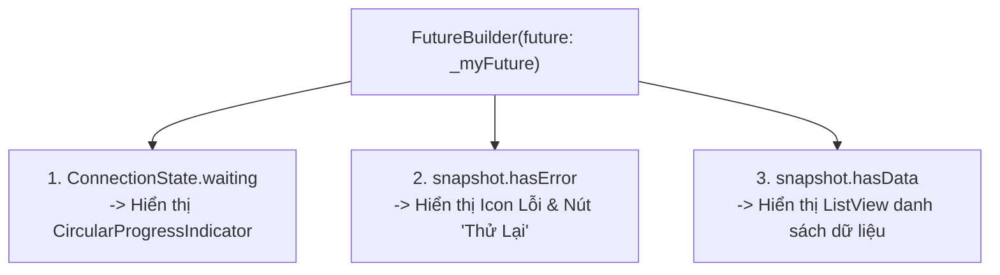

# Chuyên Đề 09 - Bài 03: FutureBuilder, StreamBuilder & Cạm Bẫy Gọi API Trong Hàm Build

> **Trọng tâm**: Xây dựng UI phản ứng theo tác vụ bất đồng bộ (`FutureBuilder` & `StreamBuilder`), Cạm bẫy tử thần: "Tại sao màn hình xoay một cái là API bị gọi lại 10 lần?", Kỹ thuật lưu Cache Future trong `initState()`, và mẫu thiết kế 3 trạng thái giao diện chuẩn (Loading $\rightarrow$ Data $\rightarrow$ Error Retry).

---

## 1. Bản Chất Hoạt Động Của `FutureBuilder`

`FutureBuilder<T>` là một widget tiện ích giúp bạn lắng nghe một `Future` và tự động vẽ lại giao diện tương ứng với tiến độ của `AsyncSnapshot`:



---

## 2. Cạm Bẫy Tử Thần: Gọi API Trực Tiếp Trong Thuộc Tính `future`

Hãy nhìn vào đoạn mã mà hầu như lập trình viên mới nào cũng từng viết:

```dart
class UserListScreen extends StatelessWidget {
  const UserListScreen({super.key});

  @override
  Widget build(BuildContext context) {
    return Scaffold(
      body: FutureBuilder<List<User>>(
        // ❌ CỰC KỲ TAI HẠI:
        future: apiService.fetchUsers(), 
        builder: (context, snapshot) {
          ...
        },
      ),
    );
  }
}
```

### Tại Sao Đoạn Code Này Gây Quá Tải Server?
- Như ta đã học ở Module 02: **Hàm `build()` có thể bị Flutter gọi lại bất kỳ lúc nào** (khi người dùng xoay màn hình, mở bàn phím, hoặc widget cha đổi theme).
- Mỗi khi `build()` chạy lại, biểu thức `apiService.fetchUsers()` **lại được thực thi một lần nữa**!
- Hậu quả:
  1. Điện thoại người dùng liên tục bắn request lên Server làm cạn pin và tốn 4G.
  2. Màn hình liên tục bị nhấp nháy chuyển về trạng thái Loading (Spinner) rồi mới hiện lại dữ liệu.

---

## 3. ✅ Giải Pháp Chuẩn Google: Khởi Tạo Future Trong `initState()`

Chuyển sang `StatefulWidget` và **chỉ gọi API đúng 1 lần duy nhất trong `initState()`**:

```dart
class UserListScreen extends StatefulWidget {
  const UserListScreen({super.key});

  @override
  State<UserListScreen> createState() => _UserListScreenState();
}

class _UserListScreenState extends State<UserListScreen> {
  // Biến lưu trữ kết quả Future
  late Future<List<User>> _usersFuture;

  @override
  void initState() {
    super.initState();
    // ✅ Chỉ kích hoạt gọi mạng đúng 1 lần duy nhất khi màn hình được tạo:
    _loadUsers();
  }

  void _loadUsers() {
    setState(() {
      _usersFuture = apiService.fetchUsers();
    });
  }

  @override
  Widget build(BuildContext context) {
    return Scaffold(
      appBar: AppBar(title: const Text('Danh Sách Người Dùng')),
      body: FutureBuilder<List<User>>(
        // Truyền biến tham chiếu đã lưu sẵn vào đây:
        future: _usersFuture,
        builder: (context, snapshot) {
          // 1. Trạng thái đang tải dữ liệu
          if (snapshot.connectionState == ConnectionState.waiting) {
            return const Center(child: CircularProgressIndicator());
          }

          // 2. Trạng thái gặp lỗi mạng
          if (snapshot.hasError) {
            return Center(
              child: Column(
                mainAxisSize: MainAxisSize.min,
                children: [
                  const Icon(Icons.error_outline, color: Colors.red, size: 48),
                  const SizedBox(height: 8),
                  Text('Lỗi: ${snapshot.error}'),
                  const SizedBox(height: 12),
                  ElevatedButton(
                    onPressed: _loadUsers, // Bấm để gọi lại API
                    child: const Text('Thử Lại'),
                  ),
                ],
              ),
            );
          }

          // 3. Trạng thái có dữ liệu thành công
          final users = snapshot.data ?? [];
          if (users.isEmpty) {
            return const Center(child: Text('Danh sách trống'));
          }

          return ListView.builder(
            itemCount: users.length,
            itemBuilder: (context, index) => ListTile(
              leading: CircleAvatar(child: Text(users[index].name[0])),
              title: Text(users[index].name),
              subtitle: Text(users[index].email),
            ),
          );
        },
      ),
    );
  }
}
```

---

## 4. `StreamBuilder`: Dữ Liệu Thời Gian Thực (Realtime)

Nếu dữ liệu là một dòng chảy liên tục (ví dụ: tin nhắn chat Firebase, sự kiện WebSocket):

```dart
StreamBuilder<List<ChatMessage>>(
  stream: chatService.messageStream,
  builder: (context, snapshot) {
    if (!snapshot.hasData) return const CircularProgressIndicator();
    final messages = snapshot.data!;
    return ListView.builder(
      itemCount: messages.length,
      itemBuilder: (context, i) => Text(messages[i].text),
    );
  },
)
```
*(Flutter sẽ tự động quản lý việc hủy StreamSubscription khi Widget bị dispose mà bạn không cần viết code dọn dẹp thủ công).*
