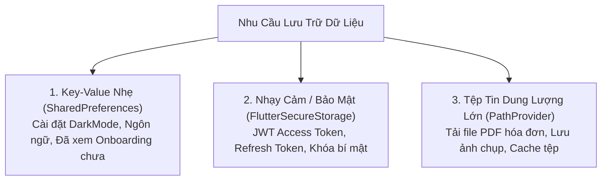

# Chuyên Đề 09 - Bài 04: Chiến Lược Lưu Trữ Dữ Liệu Cục Bộ (Local Storage)

> **Trọng tâm**: Phân cấp 3 tầng lưu trữ dữ liệu trên thiết bị di động: `shared_preferences` (Cài đặt người dùng), `flutter_secure_storage` (Mã hóa bảo mật Token & Khóa bí mật), và `path_provider` (Tệp tin và Tài liệu cục bộ).

---

## 1. Bản Đồ 3 Tầng Lưu Trữ Cục Bộ Trong Flutter

Không có một giải pháp lưu trữ nào phù hợp cho mọi bài toán. Google khuyến nghị phân chia rõ ràng:



---

## 2. Tầng 1: `shared_preferences` (Lưu Cài Đặt Nhẹ)

Dùng để lưu các kiểu dữ liệu nguyên thủy (`int`, `double`, `bool`, `String`, `List<String>`). Dữ liệu này được ghi trực tiếp vào `SharedPreferences` (Android) hoặc `NSUserDefaults` (iOS).

```yaml
dependencies:
  shared_preferences: ^2.2.2
```

```dart
class SettingsService {
  // Lưu cài đặt ngôn ngữ
  static Future<void> saveLanguage(String langCode) async {
    final prefs = await SharedPreferences.getInstance();
    await prefs.setString('selected_language', langCode);
  }

  // Đọc cài đặt ngôn ngữ
  static Future<String> getLanguage() async {
    final prefs = await SharedPreferences.getInstance();
    return prefs.getString('selected_language') ?? 'vi'; // Mặc định là 'vi'
  }
}
```

> [!WARNING]
> **Điều Cấm Kỵ Với `shared_preferences`**:  
> - **Tuyệt đối không lưu Access Token hoặc Mật khẩu**: File này được lưu dưới dạng văn bản thô (Plain Text XML/Plist) không mã hóa. Nếu máy bị Root hoặc Jailbreak, hacker có thể đọc trộm dễ dàng!  
> - **Không lưu mảng dữ liệu JSON khổng lồ**: Mỗi lần gọi `getInstance()`, toàn bộ dữ liệu sẽ được nạp hết vào RAM!

---

## 3. Tầng 2: `flutter_secure_storage` (Lưu Dữ Liệu Nhạy Cảm)

Sử dụng cơ chế mã hóa phần cứng an toàn nhất của hệ điều hành: **Android Keystore** (trong chip bảo mật TEE) và **iOS Keychain**:

```yaml
dependencies:
  flutter_secure_storage: ^9.0.0
```

```dart
class SecureAuthStorage {
  // Khởi tạo đối tượng lưu trữ bảo mật
  static const _storage = FlutterSecureStorage(
    aOptions: AndroidOptions(encryptedSharedPreferences: true),
  );

  // Lưu Access Token mã hóa
  static Future<void> saveToken(String token) async {
    await _storage.write(key: 'jwt_token', value: token);
  }

  // Đọc Token
  static Future<String?> getToken() async {
    return await _storage.read(key: 'jwt_token');
  }

  // Xóa Token khi người dùng Đăng xuất
  static Future<void> clearAll() async {
    await _storage.deleteAll();
  }
}
```

---

## 4. Tầng 3: `path_provider` (Lưu Tệp Tin Vào Bộ Nhớ Máy)

Dùng khi bạn tải về một tệp tin PDF, file âm thanh, hoặc hình ảnh từ server:

```yaml
dependencies:
  path_provider: ^2.1.2
```

```dart
import 'dart:io';
import 'package:path_provider/path_provider.dart';

Future<File> saveInvoicePdf(List<int> bytes, String fileName) async {
  // 1. Lấy thư mục lưu trữ tài liệu riêng tư của ứng dụng
  final directory = await getApplicationDocumentsDirectory();
  
  // 2. Tạo đường dẫn file
  final file = File('${directory.path}/$fileName.pdf');
  
  // 3. Ghi dữ liệu nhị phân vào ổ đĩa
  return await file.writeAsBytes(bytes);
}

Future<void> clearTemporaryCache() async {
  // Lấy thư mục cache tạm (Hệ điều hành có thể tự dọn dẹp khi hết bộ nhớ)
  final tempDir = await getTemporaryDirectory();
  if (tempDir.existsSync()) {
    tempDir.deleteSync(recursive: true);
  }
}
```
