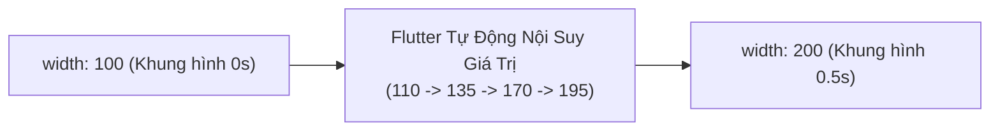

# Chuyên Đề 10 - Bài 01: Hoạt Họa Tự Động (Implicit Animations)

> **Trọng tâm**: Sức mạnh của các widget hoạt họa ngầm (Implicit Animations) không cần `AnimationController`: `AnimatedContainer`, `AnimatedOpacity`, `AnimatedCrossFade`, `AnimatedSwitcher`, và tùy biến nội suy với `TweenAnimationBuilder`.

---

## 1. Bản Chất Của Implicit Animations (Không Cần Controller)

Trong Flutter, hoạt họa được chia làm 2 trường phái:
1. **Implicit Animations (Ngầm định / Tự động)**: Bạn chỉ cần thay đổi thuộc tính (ví dụ: đổi `width` từ 100 thành 200), Flutter sẽ **tự động tính toán các giá trị trung gian và làm mượt chuyển động** trong khoảng thời gian `duration` quy định!
2. **Explicit Animations (Tường minh)**: Cần `AnimationController`, `TickerProvider`, `addListener`. (Xem ở Bài 02).



> [!TIP]
> **Quy Tắc Lựa Chọn Của Google**:  
> Nếu bạn chỉ muốn thay đổi kích thước, màu sắc, độ mờ hoặc vị trí của một widget khi người dùng bấm nút: **Luôn luôn dùng Implicit Animations**. Nó giúp giảm 80% số dòng code và không cần bận tâm về việc quản lý vòng đời `dispose()`!

---

## 2. Các Widget Hoạt Họa Ngầm Thường Dùng Nhất

### 2.1. `AnimatedContainer`: Hoạt Họa Mọi Thứ Của Hộp
Có thể tự động làm mượt: `width`, `height`, `color`, `borderRadius`, `padding`, `margin`, `alignment`:

```dart
class ExpandableCard extends StatefulWidget {
  const ExpandableCard({super.key});

  @override
  State<ExpandableCard> createState() => _ExpandableCardState();
}

class _ExpandableCardState extends State<ExpandableCard> {
  bool _isExpanded = false;

  @override
  Widget build(BuildContext context) {
    return GestureDetector(
      onTap: () => setState(() => _isExpanded = !_isExpanded),
      // ✅ Tự động biến đổi mượt mà khi _isExpanded thay đổi!
      child: AnimatedContainer(
        duration: const Duration(milliseconds: 300),
        curve: Curves.easeInOutBack, // Đường cong chuyển động có độ nảy
        width: _isExpanded ? 300.0 : 150.0,
        height: _isExpanded ? 200.0 : 60.0,
        decoration: BoxDecoration(
          color: _isExpanded ? Colors.indigo : Colors.blue,
          borderRadius: BorderRadius.circular(_isExpanded ? 24.0 : 8.0),
        ),
        alignment: Alignment.center,
        child: Text(
          _isExpanded ? 'Đã Mở Rộng Thẻ' : 'Chạm để mở',
          style: const TextStyle(color: Colors.white, fontWeight: FontWeight.bold),
        ),
      ),
    );
  }
}
```

---

### 2.2. `AnimatedCrossFade`: Hoán Đổi Mượt Giữa 2 Widget
Dùng khi chuyển đổi giữa trạng thái Loading Spinner và nội dung hoàn thành:

```dart
AnimatedCrossFade(
  duration: const Duration(milliseconds: 250),
  firstChild: const CircularProgressIndicator(),
  secondChild: const Text('Tải dữ liệu hoàn tất!'),
  crossFadeState: _isLoading ? CrossFadeState.showFirst : CrossFadeState.showSecond,
)
```

---

### 2.3. `AnimatedSwitcher`: Hiệu Ứng Chuyển Số / Icon
Dùng khi tăng/giảm con số (ví dụ số lượt Like hoặc số đếm giỏ hàng):

```dart
AnimatedSwitcher(
  duration: const Duration(milliseconds: 200),
  transitionBuilder: (child, animation) => ScaleTransition(scale: animation, child: child),
  // ⚠️ BẮT BUỘC có Key để AnimatedSwitcher biết nội dung đã thay đổi!
  child: Text(
    '$_likeCount',
    key: ValueKey<int>(_likeCount),
    style: const TextStyle(fontSize: 24, fontWeight: FontWeight.bold),
  ),
)
```

---

## 3. `TweenAnimationBuilder`: Khi Flutter Không Có Sẵn Widget
Nếu bạn muốn animate một thuộc tính tùy biến mà Flutter chưa làm sẵn widget `Animated...` (ví dụ: đếm một con số từ 0 lên 1,000,000 đồng khi mở app):

```dart
TweenAnimationBuilder<double>(
  tween: Tween<double>(begin: 0, end: 1250000), // Chạy từ 0 đến 1,250,000
  duration: const Duration(seconds: 2),
  curve: Curves.easeOutExpo,
  builder: (context, value, child) {
    return Text(
      '${value.toInt().toString().replaceAllMapped(RegExp(r'(\d{1,3})(?=(\d{3})+(?!\d))'), (m) => '${m[1]},')} đ',
      style: const TextStyle(fontSize: 28, fontWeight: FontWeight.bold, color: Colors.green),
    );
  },
)
```
