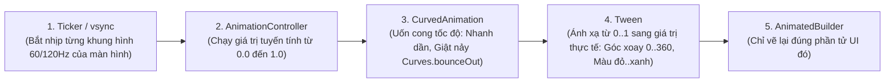

# Chuyên Đề 10 - Bài 02: Hoạt Họa Tường Minh (AnimationController & Tween)

> **Trọng tâm**: Khi nào bắt buộc dùng Explicit Animations, Cấu trúc bộ 3: `AnimationController` + `CurvedAnimation` + `Tween`, Hiểu đúng về `vsync` & `TickerProvider`, Tối ưu hóa render với `AnimatedBuilder`, và điều khiển luồng chuyển động lặp vô hạn (`repeat`) hoặc đảo chiều (`reverse`).

---

## 1. Khi Nào Cần Đến Explicit Animations?

Bạn bắt buộc phải dùng Explicit Animations khi:
1. Hoạt họa cần **lặp đi lặp lại vô tận** (ví dụ: vòng tròn radar quét sóng, hiệu ứng shimmer skeleton loading).
2. Cần **dừng lại, đảo chiều, hoặc tua chậm** chuyển động theo ngón tay người dùng kéo.
3. Cần kết hợp nhiều hoạt họa chạy so le nhau (Staggered Animations).

---

## 2. Giải Mã Bộ 3 Thành Phần Hoạt Họa Tường Minh



### Tại Sao Phải Có `vsync` (`SingleTickerProviderStateMixin`)?
- `vsync` liên kết AnimationController với **tần số quét thực tế của màn hình điện thoại** (60Hz hoặc 120Hz).
- **Tiết kiệm pin**: Khi ứng dụng bị ẩn xuống chạy nền (App Paused) hoặc màn hình này bị che khuất, `Ticker` sẽ tự động tạm dừng tính toán, ngăn không cho animation tiếp tục ngốn pin của máy!

---

## 3. Code Mẫu Hoàn Chỉnh: Hiệu Ứng Xoay & Phóng To (Pulse / Radar)

```dart
class RadarPulseScreen extends StatefulWidget {
  const RadarPulseScreen({super.key});

  @override
  State<RadarPulseScreen> createState() => _RadarPulseScreenState();
}

class _RadarPulseScreenState extends State<RadarPulseScreen>
    with SingleTickerProviderStateMixin {
  late final AnimationController _controller;
  late final Animation<double> _scaleAnimation;
  late final Animation<double> _opacityAnimation;

  @override
  void initState() {
    super.initState();
    // 1. Khởi tạo Controller chạy trong 1.5 giây
    _controller = AnimationController(
      vsync: this,
      duration: const Duration(milliseconds: 1500),
    );

    // 2. Định nghĩa đường cong chuyển động
    final curvedAnimation = CurvedAnimation(
      parent: _controller,
      curve: Curves.easeOutQuad,
    );

    // 3. Tween 1: Phóng to từ kích thước 1x lên 2.5x
    _scaleAnimation = Tween<double>(begin: 1.0, end: 2.5).animate(curvedAnimation);

    // 4. Tween 2: Mờ dần từ độ trong suốt 0.8 về 0.0
    _opacityAnimation = Tween<double>(begin: 0.8, end: 0.0).animate(curvedAnimation);

    // 5. Bắt đầu chạy lặp lại vô tận
    _controller.repeat();
  }

  @override
  void dispose() {
    // ⚠️ BẮT BUỘC HỦY CONTROLLER ĐỂ CHỐNG MEMORY LEAK!
    _controller.dispose();
    super.dispose();
  }

  @override
  Widget build(BuildContext context) {
    return Scaffold(
      body: Center(
        // ✅ AnimatedBuilder: Chỉ rebuild phần con này mỗi khi controller thay đổi giá trị!
        child: AnimatedBuilder(
          animation: _controller,
          builder: (context, child) {
            return Transform.scale(
              scale: _scaleAnimation.value,
              child: Opacity(
                opacity: _opacityAnimation.value,
                child: Container(
                  width: 100,
                  height: 100,
                  decoration: const BoxDecoration(
                    color: Colors.blue,
                    shape: BoxShape.circle,
                  ),
                ),
              ),
            );
          },
        ),
      ),
    );
  }
}
```

---

## 4. Các Lệnh Điều Khiển Phổ Biến Của Controller

```dart
_controller.forward();       // Chạy xuôi từ 0.0 đến 1.0
_controller.reverse();       // Chạy ngược từ 1.0 về 0.0
_controller.repeat(reverse: true); // Chạy xuôi xong tự chạy ngược lặp đi lặp lại (Hiệu ứng thở - Breathing)
_controller.reset();         // Đặt giá trị về 0.0
_controller.stop();          // Dừng ngay tại khung hình hiện tại
```
