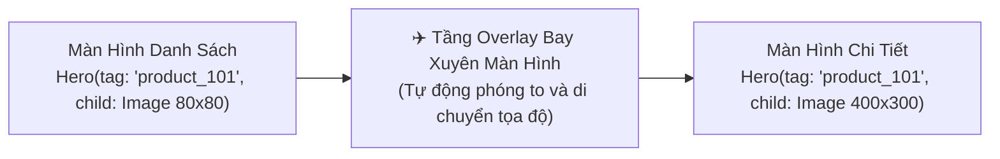

# Chuyên Đề 10 - Bài 03: Hiệu Ứng Bay Hero & Chuyển Cảnh Mượt Mà (Page Transitions)

> **Trọng tâm**: Cơ chế "Bay xuyên màn hình" của `Hero` Animation, Quy tắc đặt `tag` duy nhất, Xây dựng trải nghiệm thương mại điện tử (Bấm vào ảnh sản phẩm nhỏ ở Grid tự động bay phóng to thành Banner chi tiết), và xử lý lỗi trùng Hero tag.

---

## 1. Cơ Chế Hoạt Động Của `Hero` Animation

Khi bạn chuyển từ Màn hình A sang Màn hình B thông qua Navigator:
1. Flutter phát hiện cả 2 màn hình đều có một widget `Hero` mang **cùng một `tag` chuỗi định danh**.
2. Flutter tự động nhấc widget đó ra khỏi cả hai cây màn hình và đặt nó vào một tầng kính nổi trên cùng gọi là **`Overlay`**.
3. Flutter tự động tính toán tọa độ, kích thước của widget ở màn A và màn B, sau đó chạy một hiệu ứng chuyển động mượt mà để đưa widget bay từ vị trí cũ sang vị trí mới!



---

## 2. Triển Khai Thực Tế Trong Ứng Dụng Mua Sắm (E-Commerce)

### Màn Hình 1: Thẻ Sản Phẩm Trong Danh Sách (Grid)

```dart
class ProductGridItem extends StatelessWidget {
  final Product product;
  const ProductGridItem({super.key, required this.product});

  @override
  Widget build(BuildContext context) {
    return InkWell(
      onTap: () {
        Navigator.push(
          context,
          MaterialPageRoute(builder: (_) => ProductDetailScreen(product: product)),
        );
      },
      child: Column(
        children: [
          // Bọc ảnh bằng Hero với Tag là ID duy nhất của sản phẩm:
          Hero(
            tag: 'product_image_${product.id}',
            child: ClipRRect(
              borderRadius: BorderRadius.circular(12),
              child: Image.network(product.imageUrl, width: 120, height: 120, fit: BoxFit.cover),
            ),
          ),
          const SizedBox(height: 8),
          Text(product.name, style: const TextStyle(fontWeight: FontWeight.bold)),
        ],
      ),
    );
  }
}
```

### Màn Hình 2: Banner Chi Tiết Sản Phẩm (Detail Screen)

```dart
class ProductDetailScreen extends StatelessWidget {
  final Product product;
  const ProductDetailScreen({super.key, required this.product});

  @override
  Widget build(BuildContext context) {
    return Scaffold(
      appBar: AppBar(title: Text(product.name)),
      body: SingleChildScrollView(
        child: Column(
          children: [
            // ✅ ĐẶT CÙNG TAG ĐỂ KÍCH HOẠT HIỆU ỨNG BAY PHÓNG TO:
            Hero(
              tag: 'product_image_${product.id}',
              child: Image.network(
                product.imageUrl,
                width: double.infinity,
                height: 350,
                fit: BoxFit.cover,
              ),
            ),
            Padding(
              padding: const EdgeInsets.all(16.0),
              child: Text(product.description),
            ),
          ],
        ),
      ),
    );
  }
}
```

---

## 3. Cạm Bẫy: Lỗi Trùng Tag (There are multiple heroes that share the same tag)

Nếu bạn có 2 phần tử trên cùng một màn hình mang cùng một tag `Hero(tag: 'my_tag')`, Flutter sẽ báo lỗi đỏ rực ngay lập tức vì không biết phải chọn widget nào để bay!

> [!WARNING]
> **Quy Tắc Đặt Tag An Toàn**:  
> Luôn kết hợp **Tiền tố danh mục + ID duy nhất** làm tag:  
> `tag: 'product_img_${item.id}'`  
> Tuyệt đối không dùng các chuỗi tĩnh như `tag: 'avatar'` hay `tag: 'product'` cho các item trong danh sách lặp!
