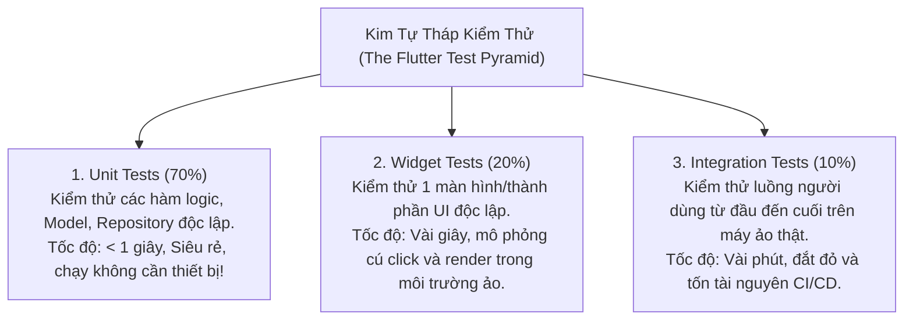

# Chuyên Đề 11 - Bài 01: Kiểm Thử Đơn Vị (Unit Testing) Logic Nghiệp Vụ

> **Trọng tâm**: Kim tự tháp kiểm thử (Testing Pyramid) trong Flutter, Cấu trúc một bài kiểm thử đơn vị chuẩn (AAA: Arrange - Act - Assert), Giả lập phụ thuộc (Mocking) với `mocktail`, và kiểm thử luồng bất đồng bộ của Cubit/Bloc.

---

## 1. Kim Tự Tháp Kiểm Thử Trong Flutter

Google chuẩn hóa quy trình kiểm thử ứng dụng Flutter thành 3 tầng:



---

## 2. Cấu Trúc AAA (Arrange - Act - Assert) Chuẩn Mực

Một bài kiểm thử đơn vị chuyên nghiệp luôn tuân thủ 3 bước:
1. **Arrange**: Chuẩn bị dữ liệu đầu vào và các đối tượng giả lập (Mocks).
2. **Act**: Kích hoạt hàm cần kiểm thử thực thi.
3. **Assert**: Đối chiếu kết quả trả về với kỳ vọng (`expect(actual, matcher)`).

```yaml
dev_dependencies:
  flutter_test:
    sdk: flutter
  mocktail: ^1.0.3
```

---

## 3. Thực Hành: Viết Unit Test Cho `AuthRepository` Với `mocktail`

Giả sử ta cần test hàm `login()` của `AuthRepository`. Chúng ta **không bao giờ gọi API thật** khi chạy test, mà sẽ giả lập `ApiClient`:

### File Mã Nguồn:
```dart
// auth_repository.dart
class AuthRepository {
  final ApiClient apiClient;
  const AuthRepository(this.apiClient);

  Future<String> login(String email, String password) async {
    if (email.isEmpty || password.isEmpty) {
      throw ArgumentError('Email và mật khẩu không được để trống');
    }
    final response = await apiClient.post('/login', {'email': email, 'password': password});
    return response.data['token'] as String;
  }
}
```

### File Kiểm Thử: `test/auth_repository_test.dart`
```dart
import 'package:flutter_test/flutter_test.dart';
import 'package:mocktail/mocktail.dart';

// 1. Tạo class giả lập ApiClient bằng mocktail
class MockApiClient extends Mock implements ApiClient {}

void main() {
  late MockApiClient mockApiClient;
  late AuthRepository repository;

  // setUp chạy trước mỗi bài test nhỏ
  setUp(() {
    mockApiClient = MockApiClient();
    repository = AuthRepository(mockApiClient);
  });

  group('AuthRepository.login', () {
    test('ném ra ArgumentError nếu email bị rỗng', () async {
      // Act & Assert: Kỳ vọng hàm ném lỗi
      expect(
        () => repository.login('', '123456'),
        throwsA(isA<ArgumentError>()),
      );
    });

    test('trả về token thành công khi API phản hồi 200', () async {
      // 1. Arrange: Giả lập khi gọi apiClient.post thì trả về token giả
      when(() => mockApiClient.post('/login', any())).thenAnswer(
        (_) async => Response(data: {'token': 'jwt_secret_token_123'}),
      );

      // 2. Act: Thực thi hàm
      final token = await repository.login('test@gmail.com', 'password123');

      // 3. Assert: Kiểm tra kết quả
      expect(token, equals('jwt_secret_token_123'));
      // Xác minh hàm post thực sự được gọi đúng 1 lần
      verify(() => mockApiClient.post('/login', any())).called(1);
    });
  });
}
```

### Chạy Test Cực Nhanh Bằng Terminal:
```bash
flutter test test/auth_repository_test.dart
```
*(Kết quả chạy trong chưa đầy 1 giây: `All tests passed!`)*
