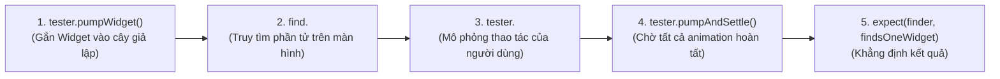

# Chuyên Đề 11 - Bài 02: Kiểm Thử Giao Diện Với WidgetTester

> **Trọng tâm**: Bản chất của Widget Testing (Kiểm thử giao diện không đầu - Headless UI Testing), Khởi tạo Widget với `tester.pumpWidget`, Tìm kiếm phần tử với `find`, Giả lập thao tác người dùng (`tap`, `enterText`), và phân biệt `pump()` vs `pumpAndSettle()`.

---

## 1. Widget Testing Là Gì?

Widget Test cho phép bạn kiểm tra hành vi của một màn hình giao diện trong một môi trường giả lập siêu nhanh mà **không cần khởi động máy ảo Android hay iPhone Simulator**:
- Khởi tạo cây Widget và kiểm tra xem các nút bấm, text có xuất hiện đúng không.
- Giả lập cú click chuột của người dùng và kiểm tra xem số đếm có tăng lên không.
- Tốc độ chạy: Chỉ mất từ **1 đến 2 giây** cho một bộ kiểm thử giao diện!

---

## 2. Giải Phẫu Hàm `testWidgets` & Các Công Cụ



### Bộ Matchers Kiểm Tra Số Lượng Widget Tìm Thấy:
- `findsOneWidget`: Phải tìm thấy chính xác 1 phần tử.
- `findsNothing`: Đảm bảo phần tử đó **không được phép xuất hiện** trên màn hình.
- `findsNWidgets(3)`: Phải có đúng 3 phần tử trùng khớp.

---

## 3. Thực Hành: Kiểm Thử Widget Đếm Số (Counter Widget)

Giả sử ta có màn hình Counter chuẩn: Khi bấm nút FAB, con số trên màn hình tăng từ 0 lên 1.

### File Test: `test/counter_widget_test.dart`

```dart
import 'package:flutter/material.dart';
import 'package:flutter_test/flutter_test.dart';

// Widget cần kiểm thử
class SimpleCounterScreen extends StatefulWidget {
  const SimpleCounterScreen({super.key});

  @override
  State<SimpleCounterScreen> createState() => _SimpleCounterScreenState();
}

class _SimpleCounterScreenState extends State<SimpleCounterScreen> {
  int _counter = 0;

  @override
  Widget build(BuildContext context) {
    return Scaffold(
      body: Center(
        child: Text('Số hiện tại: $_counter', style: const TextStyle(fontSize: 24)),
      ),
      floatingActionButton: FloatingActionButton(
        onPressed: () => setState(() => _counter++),
        child: const Icon(Icons.add),
      ),
    );
  }
}

void main() {
  testWidgets('Bấm nút + thì số đếm tăng từ 0 lên 1', (WidgetTester tester) async {
    // 1. Gắn Widget vào môi trường test (Luôn bọc trong MaterialApp!)
    await tester.pumpWidget(
      const MaterialApp(
        home: SimpleCounterScreen(),
      ),
    );

    // 2. Khẳng định: Ban đầu số đếm phải là 0
    expect(find.text('Số hiện tại: 0'), findsOneWidget);
    expect(find.text('Số hiện tại: 1'), findsNothing);

    // 3. Giả lập người dùng bấm vào icon dấu +
    await tester.tap(find.byIcon(Icons.add));

    // 4. ⚠️ BẮT BUỘC: Gọi pump để Flutter vẽ lại khung hình sau khi setState!
    await tester.pump();

    // 5. Khẳng định: Bây giờ trên màn hình phải hiển thị số 1!
    expect(find.text('Số hiện tại: 0'), findsNothing);
    expect(find.text('Số hiện tại: 1'), findsOneWidget);
  });
}
```

---

## 4. `tester.pump()` vs `tester.pumpAndSettle()`

- **`tester.pump(Duration duration)`**: Ra lệnh cho Flutter vẽ lại **1 khung hình đơn lẻ** (Frame). Thích hợp cho các cập nhật state tức thì (`setState`).
- **`tester.pumpAndSettle()`**: Liên tục vẽ các khung hình tiếp theo cho đến khi **toàn bộ các hiệu ứng chuyển động (Animation, Chuyển trang, Timer) dừng hẳn hoàn toàn**!  
  *(Dùng khi bạn vừa chuyển trang hoặc có animation trượt/mờ).*
