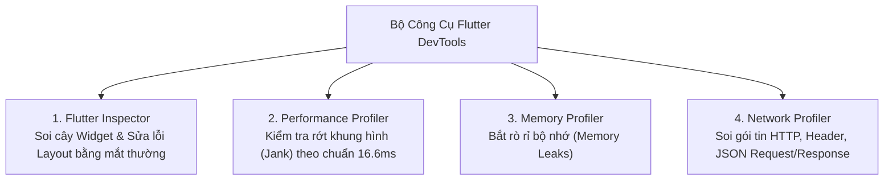

# Chuyên Đề 11 - Bài 03: Gỡ Lỗi & Tối Ưu Với Flutter DevTools & Inspector

> **Trọng tâm**: Sử dụng bộ công cụ chính thức **Flutter DevTools**, Tận dụng **Widget Inspector** & **Layout Explorer** để sửa lỗi tràn màn hình bằng mắt thường theo thời gian thực, Các cờ gỡ lỗi giao diện (`debugPaintSizeEnabled`), và kiểm tra giật khung hình (Frame Budget).

---

## 1. Bộ Công Cụ Flutter DevTools Là Gì?

Flutter DevTools là bộ công cụ phân tích hiệu năng và gỡ lỗi giao diện chạy trên trình duyệt web được Google tích hợp sẵn vào SDK.

### Khởi Động DevTools:
- Khi chạy ứng dụng với `flutter run`, bấm phím **`v`** trong Terminal.
- Hoặc trong VS Code / Android Studio: Bấm vào biểu tượng **"Open DevTools"** trên thanh công cụ Debug.



---

## 2. Làm Chủ Widget Inspector & Layout Explorer

### 2.1. Chế Độ "Select Widget Mode" (Chạm Là Soi Code)
Bấm nút hình ngón tay chỉ vào màn hình trên thanh công cụ DevTools, sau đó **chạm vào bất kỳ nút bấm hay dòng chữ nào trên màn hình điện thoại**:  
$\rightarrow$ Cây Widget trong IDE sẽ **tự động nhảy ngay lập tức đến đúng dòng code sinh ra widget đó**!

### 2.2. Layout Explorer: Cứu Tinh Của Lỗi Overflow
Khi bạn gặp lỗi vạch vàng đen tràn màn hình (`RenderFlex overflowed`), mở tab **Layout Explorer**:
- DevTools sẽ hiển thị trực quan kích thước của từng widget con bên trong `Row` hoặc `Column`.
- Bạn có thể **thay đổi trực tiếp thuộc tính `flex` (1, 2, 3) hoặc đổi `mainAxisAlignment` ngay trên giao diện web** và thấy ứng dụng trên điện thoại thay đổi lập tức mà không cần gõ code hay hot reload!

---

## 3. Các Cờ Debug Trực Quan (Debug Flags) Hữu Ích

Bạn có thể bật các cờ hiển thị này trong hàm `main()` để "nhìn xuyên qua" giao diện Flutter:

```dart
import 'package:flutter/rendering.dart';

void main() {
  // 1. Hiển thị đường viền khung bao quanh mọi Widget (Margins, Paddings, Baselines)
  // debugPaintSizeEnabled = true;

  // 2. Cầu vồng màu sắc: Mỗi khi một widget bị vẽ lại (Repaint), viền của nó sẽ đổi màu!
  // Giúp bạn phát hiện ngay widget nào đang bị rebuild/repaint vô tội vạ:
  // debugPaintRepaintRainbowEnabled = true;

  runApp(const MyApp());
}
```

---

## 4. Kiểm Soát Khung Hình (Frame Budget 16.6ms)

Trong tab **Performance** của DevTools:
- Mỗi thanh dọc đại diện cho 1 khung hình (Frame).
- Đường kẻ ngang nét đứt màu xanh đánh dấu mốc **16.6 mili-giây** (đối với màn hình 60 FPS) hoặc **8.33 mili-giây** (120 FPS).
- Nếu thanh nào **vượt qua đường kẻ và chuyển sang màu đỏ (Jank)**, nghĩa là frame đó bị trễ $\rightarrow$ người dùng sẽ cảm nhận thấy giao diện bị khựng lại!

> [!TIP]
> **Checklist Nhanh Khi Bị Đỏ Khung Hình (Jank)**:
> 1. Kiểm tra xem có hàm tính toán nặng nào đang chạy đồng bộ trên Main Isolate không.
> 2. Kiểm tra xem ảnh nạp vào có bị quá kích thước không (đã dùng `cacheWidth` chưa?).
> 3. Kiểm tra xem có widget nào gọi `setState()` liên tục mà không cần thiết không.
