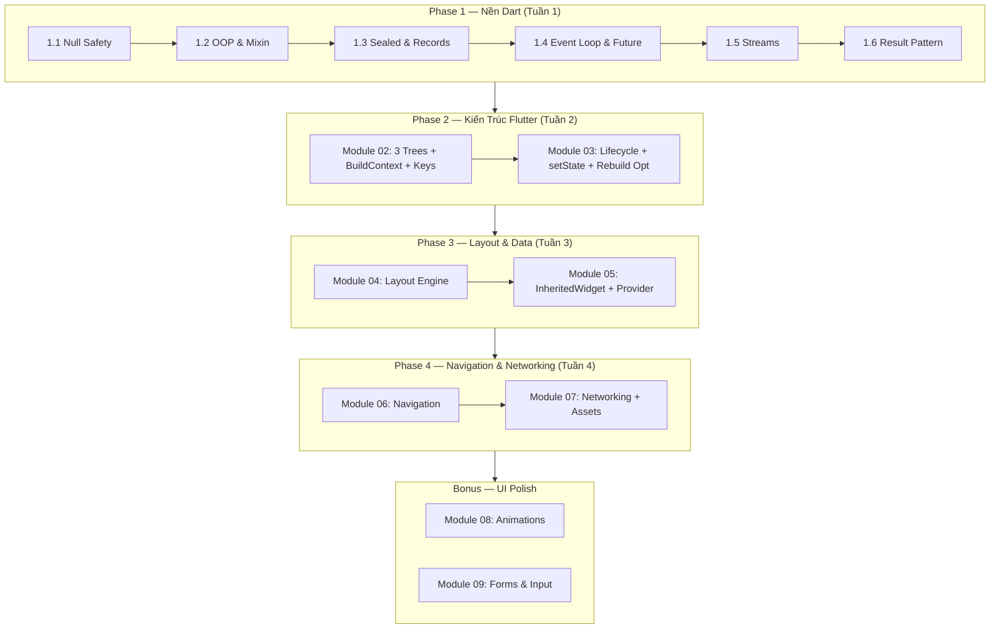

# 📘 Tập 1: Flutter Fundamentals & Dart Core Architecture — V2
### Chuẩn Google · Từ cơ chế nền tảng đến tư duy lập trình UI đúng đắn

> **Triết lý**: *"Hiểu sâu một lần, đúng mãi mãi."* Tập này không dạy bạn dùng widget nào — mà dạy bạn **tại sao** Flutter hoạt động theo cách nó hoạt động, để bạn tự suy ra câu trả lời cho mọi bài toán mới.

---

## Bốn Trụ Cột Của Tập 1

```
1. COMPOSITION    — Mọi UI là Widget lồng nhau; hiểu cây 3 tầng Widget-Element-RenderObject
2. CONSTRAINTS    — "Constraints go down, Sizes go up, Parent sets position" là nền tảng layout
3. STATE          — State không nằm trong Widget, mà trong Element; setState chỉ đánh dấu dirty
4. DART-FIRST     — Sound Null Safety, Event Loop, sealed class là nền móng trước khi mở Flutter
```

---

## 🗺️ Bảng Mục Lục

| # | Module | Chapter | Trọng tâm kỹ thuật |
|:---:|:---|:---:|:---|
| **01** | [Dart Engine & Language Fundamentals](#module-01--dart-engine--language-fundamentals) | 6 | Null Safety, OOP, Sealed, Event Loop, Stream, Result |
| **02** | [Flutter Core Architecture](#module-02--flutter-core-architecture) | 5 | 3 Trees, BuildContext, Keys, Immutability, RenderObject |
| **03** | [Widget Lifecycle & Local State](#module-03--widget-lifecycle--local-state) | 5 | Stateful lifecycle, setState, Ticker, Rebuild optimization |
| **04** | [Layout Engine](#module-04--layout-engine) | 6 | Constraints rule, BoxConstraints, Flex, Stack, Scroll, Responsive |
| **05** | [Data Passing & InheritedWidget](#module-05--data-passing--inheritedwidget) | 4 | Prop Drilling, InheritedWidget internals, Notifier, Provider |
| **06** | [Navigation & Routing Basics](#module-06--navigation--routing-basics) | 2 | Navigator 1.0 Imperative, GoRouter Declarative |
| **07** | [Networking, Assets & Multimedia](#module-07--networking-assets--multimedia) | 4 | Assets, HTTP/Dio, JSON serialization, FutureBuilder |
| **08** ★ | [Animations Fundamentals](#module-08--animations-fundamentals-bonus) | 4 | Implicit, Explicit, Hero, Staggered |
| **09** ★ | [Forms & User Input](#module-09--forms--user-input-bonus) | 4 | Gestures, TextField, Form validation, Keyboard |

★ = Bonus module

**Tổng:** 9 module · 40 chapter · ~15,500 dòng nội dung kỹ thuật

---

## Module 01 — Dart Engine & Language Fundamentals

| Bài | File | Nội dung |
|:---:|:---|:---|
| 1.1 | [Type System & Sound Null Safety](./01-dart-engine-language-fundamentals/01-type-system-sound-null-safety.md) | `T?`, `late`, type promotion, null-aware ops |
| 1.2 | [OOP — Abstract, Interface, Mixin](./01-dart-engine-language-fundamentals/02-oop-abstract-interface-mixin.md) | `implements` vs `extends` vs `with`, C3 linearization |
| 1.3 | [Sealed Classes, Records & Patterns](./01-dart-engine-language-fundamentals/03-sealed-classes-records-patterns.md) | ADT, exhaustive switch, Records, Pattern matching |
| 1.4 | [Event Loop, Microtask & Future](./01-dart-engine-language-fundamentals/04-event-loop-microtask-future.md) | Event Queue vs Microtask Queue, `async/await` |
| 1.5 | [Streams & Reactive Programming](./01-dart-engine-language-fundamentals/05-streams-reactive-programming.md) | Single-sub vs broadcast, `StreamController`, `async*` |
| 1.6 | [Exception Handling & Result Pattern](./01-dart-engine-language-fundamentals/06-exception-handling-result-pattern.md) | `try/catch`, typed Exception, sealed `Result<T, E>` |

---

## Module 02 — Flutter Core Architecture

| Bài | File | Nội dung |
|:---:|:---|:---|
| 2.1 | [Ba Cây: Widget – Element – RenderObject](./02-flutter-core-architecture/01-three-trees-widget-element-renderobject.md) | Blueprint vs cầu nối vs render, reconciliation |
| 2.2 | [BuildContext — Vị Trí Trong Element Tree](./02-flutter-core-architecture/02-buildcontext-location-in-element-tree.md) | Context = Element, async gap pitfall |
| 2.3 | [Keys — Cơ Chế & Hiệu Năng](./02-flutter-core-architecture/03-keys-mechanics-and-performance.md) | ValueKey, GlobalKey, chi phí và khi nào dùng |
| 2.4 | [Widget Immutability & Reconciliation](./02-flutter-core-architecture/04-widget-immutability-reconciliation.md) | `@immutable`, `const` = identity equal, skip build |
| 2.5 | [RenderObject & Layout Protocol](./02-flutter-core-architecture/05-renderobject-layout-protocol.md) | `performLayout`, `paint`, dirty propagation |

---

## Module 03 — Widget Lifecycle & Local State

| Bài | File | Nội dung |
|:---:|:---|:---|
| 3.1 | [StatelessWidget vs StatefulWidget Internals](./03-widget-lifecycle-local-state/01-stateless-vs-stateful-internals.md) | Element giữ State, Widget là factory |
| 3.2 | [Vòng Đời Đầy Đủ của StatefulWidget](./03-widget-lifecycle-local-state/02-state-full-lifecycle.md) | 7 phase lifecycle, thứ tự super() |
| 3.3 | [setState — Dùng Đúng Cách](./03-widget-lifecycle-local-state/03-setstate-correct-usage.md) | dirty marking, tách widget giảm scope |
| 3.4 | [Ticker & AnimationController Lifecycle](./03-widget-lifecycle-local-state/04-ticker-animationcontroller-lifecycle.md) | TickerProvider, dispose bắt buộc |
| 3.5 | [Widget Rebuild Optimization](./03-widget-lifecycle-local-state/05-widget-rebuild-optimization.md) | `const`, RepaintBoundary, Builder scope |

---

## Module 04 — Layout Engine

| Bài | File | Nội dung |
|:---:|:---|:---|
| 4.1 | [Constraints Go Down, Sizes Go Up](./04-layout-engine/01-constraints-go-down-sizes-go-up.md) | Quy tắc vàng, single-pass layout |
| 4.2 | [BoxConstraints: Tight / Loose / Unbounded](./04-layout-engine/02-box-constraints-tight-loose-unbounded.md) | 3 loại constraint, debug overflow |
| 4.3 | [Flex Layouts: Row, Column, Expanded](./04-layout-engine/03-flex-layouts-row-column.md) | MainAxis, CrossAxis, Flexible |
| 4.4 | [Stack, Positioned & Overlays](./04-layout-engine/04-stack-positioned-overlays.md) | Coordinate system, LayoutBuilder |
| 4.5 | [Scrollables & Virtualization](./04-layout-engine/05-scrollables-virtualization.md) | Slivers, Viewport, ScrollController |
| 4.6 | [Responsive & Adaptive Layouts](./04-layout-engine/06-responsive-adaptive-layouts.md) | MediaQuery, breakpoints, LayoutBuilder |

---

## Module 05 — Data Passing & InheritedWidget

| Bài | File | Nội dung |
|:---:|:---|:---|
| 5.1 | [Prop Drilling & InheritedWidget](./05-data-passing-inherited-widget/01-prop-drilling-and-inheritedwidget.md) | Bài toán, broadcast data, `updateShouldNotify` |
| 5.2 | [dependOnInheritedWidgetOfExactType](./05-data-passing-inherited-widget/02-dependoninheritedwidgetofexacttype.md) | Dependency registration, rebuild mechanics |
| 5.3 | [InheritedNotifier & ChangeNotifier](./05-data-passing-inherited-widget/03-inheritednotifier-changenotifier.md) | `ValueNotifier`, `ListenableBuilder` |
| 5.4 | [Provider Pattern Foundation](./05-data-passing-inherited-widget/04-provider-pattern-foundation.md) | Provider package = InheritedWidget wrapper |

---

## Module 06 — Navigation & Routing Basics
 
| Bài | File | Nội dung |
|:---:|:---|:---|
| 6.1 | [Navigator 1.0 Toàn Diện](./06-navigation-routing-basics/01-navigator-1-imperative-navigation.md) | Stack LIFO, PopScope, Data Passing, Named Routes, onGenerateRoute |
| 6.2 | [GoRouter & Declarative Routing](./06-navigation-routing-basics/02-gorouter-declarative-navigation.md) | GoRouter, StatefulShellRoute, Auth Guards, Deep Linking |

---

## Module 07 — Networking, Assets & Multimedia

| Bài | File | Nội dung |
|:---:|:---|:---|
| 7.1 | [Asset Management Pipeline](./07-networking-assets-multimedia/01-asset-management-pipeline.md) | `pubspec.yaml`, fonts, SVG, config JSON |
| 7.2 | [HTTP Client Basics](./07-networking-assets-multimedia/02-http-client-basics.md) | `http` package, Dio, interceptors |
| 7.3 | [JSON Serialization & Models](./07-networking-assets-multimedia/03-json-serialization-models.md) | `fromJson/toJson`, `copyWith`, immutable models |
| 7.4 | [FutureBuilder & StreamBuilder](./07-networking-assets-multimedia/04-futurebuilder-streambuilder.md) | ConnectionState, snapshot, late Future |

---

## Module 08 — Animations Fundamentals ★ BONUS

| Bài | File | Nội dung |
|:---:|:---|:---|
| 8.1 | [Implicit Animations](./08-animations-fundamentals/01-implicit-animations.md) | AnimatedContainer, TweenAnimationBuilder |
| 8.2 | [Explicit Animations & Controller](./08-animations-fundamentals/02-explicit-animations-controller.md) | AnimationController, Tween, CurvedAnimation |
| 8.3 | [Hero & Page Transitions](./08-animations-fundamentals/03-hero-page-transitions.md) | Hero tag, PageRouteBuilder, SharedAxisTransition |
| 8.4 | [Staggered Animations](./08-animations-fundamentals/04-staggered-animations.md) | Interval curve, drive() chaining |

---

## Module 09 — Forms & User Input ★ BONUS

| Bài | File | Nội dung |
|:---:|:---|:---|
| 9.1 | [Gestures & Hit Testing](./09-forms-input-interaction/01-gestures-hittesting-gesturedetector.md) | Pointer events, gesture arena |
| 9.2 | [TextField, Controller & Focus](./09-forms-input-interaction/02-textfields-controllers-focus.md) | TextEditingController, FocusNode |
| 9.3 | [Form, FormState & Validation](./09-forms-input-interaction/03-form-formstate-validation.md) | `GlobalKey<FormState>`, validator |
| 9.4 | [Keyboard Insets & Custom Input](./09-forms-input-interaction/04-keyboard-insets-custom-input.md) | viewInsets, custom `FormField<T>` |

---

## 📐 5-Part Article Blueprint

Mọi chapter trong tập này đều tuân thủ cấu trúc 5 phần sau:

```
## Phần 1 — Khái Niệm & Mục Tiêu Bài Học
  "Why it matters" trước, định nghĩa sau.
  Bạn sẽ hiểu được gì sau bài này.

## Phần 2 — Cơ Chế Hoạt Động (Under the Hood)
  Mermaid diagram / ASCII flow bắt buộc.
  Trả lời "Tại sao Flutter/Dart làm vậy?"

## Phần 3 — Code Mẫu Chuẩn Google
  Dart 3+, Sound Null Safety, flutter_lints compliant.
  Comment giải thích WHY không phải WHAT.
  Material 3 mặc định.

## Phần 4 — Lỗi Sai Phổ Biến & Best Practices
  ❌ Anti-pattern + ✅ Đúng + lý do kỹ thuật.
  Pitfall nào dẫn đến jank / leak / crash.

## Phần 5 — Bài Tập Củng Cố Tư Duy
  Challenge cụ thể, có hướng giải (không cho đáp án ngay).
  Thử thách thẩm định kỹ thuật liên quan.
```

---

## 🗺️ Lộ Trình Học Đề Xuất



---

*Bắt đầu tại [Bài 1.1: Type System & Sound Null Safety](./01-dart-engine-language-fundamentals/01-type-system-sound-null-safety.md).*
