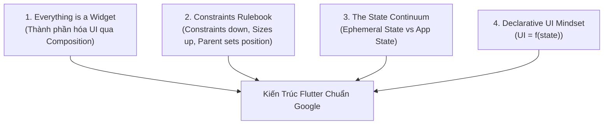

# 📘 Cẩm Nang Chuyên Sâu: Flutter Fundamentals (Chuẩn Google Flutter)

> **Tài liệu tham chiếu chính thống**: Dựa trên tiêu chuẩn kỹ thuật của Google (`flutter.dev`, Google Developers Codelabs, Flutter Architecture Guidelines và Material Design 3).  
> **Mục tiêu**: Nắm vững 100% bản chất cơ chế, kỹ thuật lập trình ứng dụng và các quy tắc thiết kế cốt lõi của Flutter Framework mà không bị quá tải bởi các kiến thức tầng sâu C++ Engine / FFI.

---

## 🏛️ Triết Lý Thiết Kế Của Flutter (The Google Way)

Trước khi viết bất kỳ dòng code nào, lập trình viên Flutter cần thấu suốt 4 trụ cột triết lý mà đội ngũ kỹ sư Google đã đặt làm nền tảng cho framework:

1. **Composition over Inheritance (Hợp thành thay vì Kế thừa)**:
   - Trong Flutter, bạn không kế thừa `Button` để đổi màu hay thêm icon. Bạn bọc `Text` và `Icon` vào bên trong `Row`, rồi đặt trong `InkWell` hoặc `ElevatedButton`.
   - Các widget được thiết kế siêu nhỏ, đơn nhiệm (Single Responsibility), dễ tái sử dụng và cực kỳ nhẹ (lightweight immutable configurations).

2. **Quy Tắc Bất Biến Về Layout (The Immutable Layout Rule)**:
   > *"Constraints go down. Sizes go up. Parent sets position."*  
   > *(Ràng buộc truyền xuống. Kích thước báo lên. Cha quyết định vị trí con.)*
   - Widget con không bao giờ có thể tự ý có kích thước bất kỳ; kích thước của nó luôn phải nằm trong khoảng ràng buộc (min/max width/height) mà widget cha áp đặt.

3. **Mô Hình UI Khai Báo (Declarative UI)**:
   - Công thức kinh điển: $$\text{UI} = f(\text{state})$$
   - Bạn không gọi `button.setText("...")` hay `view.setVisibility(GONE)`. Khi state thay đổi, Flutter tự động dựng lại cây Widget tương ứng với state mới.

4. **Sự Tách Biệt Giữa Cấu Hình và Trạng Thái**:
   - Widget là cấu hình **bất biến (`immutable`)** được tạo và hủy liên tục với chi phí cực rẻ.
   - Trạng thái lâu dài được lưu trữ an toàn trong đối tượng `State` riêng biệt, không bị mất đi khi widget rebuild.

---

## 🗺️ Mục Lục 11 Chuyên Đề Flutter Fundamentals

| Module | Tên Chuyên Đề & Bài Học Chi Tiết | Trạng Thái |
| :---: | :--- | :---: |
| **01** | [**Dart 3 Foundations For Flutter**](./01-dart-foundations-for-flutter/) • [Bài 01: Sound Null Safety & Hệ Thống Kiểu](./01-dart-foundations-for-flutter/01-sound-null-safety-and-types.md) • [Bài 02: Classes, Constructors & Mixins](./01-dart-foundations-for-flutter/02-classes-constructors-mixins.md) • [Bài 03: Modern Dart 3 Records & Patterns](./01-dart-foundations-for-flutter/03-modern-dart-records-patterns.md) • [Bài 04: Collections & Toán Tử UI](./01-dart-foundations-for-flutter/04-functional-collections-operators.md) • [Bài 05: Asynchronous Dart: Futures & Streams](./01-dart-foundations-for-flutter/05-asynchronous-dart-futures-streams.md) • [Bài 06: Extension Methods, Equality & Generics](./01-dart-foundations-for-flutter/06-extensions-equality-and-generics.md) | ✅ Hoàn thành |
| **02** | [**Widget Architecture & Lifecycle**](./02-widget-architecture-and-lifecycle/) • [Bài 01: Tính Bất Biến & Cây Widget](./02-widget-architecture-and-lifecycle/01-immutability-and-widget-tree.md) • [Bài 02: StatelessWidget vs StatefulWidget](./02-widget-architecture-and-lifecycle/02-stateless-vs-stateful-internals.md) • [Bài 03: Vòng Đời Chi Tiết Của State](./02-widget-architecture-and-lifecycle/03-state-lifecycle-in-depth.md) • [Bài 04: Bản Chất Của BuildContext](./02-widget-architecture-and-lifecycle/04-buildcontext-deep-dive.md) • [Bài 05: Cơ Chế Của Keys](./02-widget-architecture-and-lifecycle/05-keys-mechanics-and-usecases.md) • [Bài 06: Tối Ưu Rebuild & Anti-Patterns](./02-widget-architecture-and-lifecycle/06-widget-rebuild-optimization-and-anti-patterns.md) | ✅ Hoàn thành |
| **03** | [**Flutter Layout System Mastery**](./03-flutter-layout-system-mastery/) • [Bài 01: Quy Tắc Vàng: Constraints Go Down...](./03-flutter-layout-system-mastery/01-the-constraints-rulebook.md) • [Bài 02: Giải Phẫu BoxConstraints](./03-flutter-layout-system-mastery/02-box-constraints-tight-loose-unbounded.md) • [Bài 03: Flex Layouts: Row, Column, Expanded](./03-flutter-layout-system-mastery/03-flex-layouts-row-column-expanded.md) • [Bài 04: Stack, Positioned & Xếp Lớp](./03-flutter-layout-system-mastery/04-stack-positioned-and-overlays.md) • [Bài 05: Chẩn Đoán & Trị Lỗi Layout Kinh Điển](./03-flutter-layout-system-mastery/05-diagnosing-and-fixing-layout-errors.md) • [Bài 06: Thiết Kế Thích Ứng Responsive & Adaptive](./03-flutter-layout-system-mastery/06-responsive-and-adaptive-layouts.md) • [Bài 07: Intrinsics & Custom Layout Delegates](./03-flutter-layout-system-mastery/07-intrinsics-and-custom-layout-delegates.md) | ✅ Hoàn thành |
| **04** | [**Scrollables & Slivers In-Depth**](./04-scrollables-and-slivers-in-depth/) • [Bài 01: Cơ Chế Cuộn & ScrollPhysics](./04-scrollables-and-slivers-in-depth/01-scroll-mechanics-controller-physics.md) • [Bài 02: Ảo Hóa Viewport Với ListView & GridView](./04-scrollables-and-slivers-in-depth/02-listview-and-gridview-virtualization.md) • [Bài 03: SingleChildScrollView & Form Cuộn](./04-scrollables-and-slivers-in-depth/03-single-child-scroll-view-patterns.md) • [Bài 04: CustomScrollView & Hiệu Ứng Slivers](./04-scrollables-and-slivers-in-depth/04-custom-scroll-view-and-slivers.md) • [Bài 05: NestedScrollView & Kỹ Thuật Phối Hợp Cuộn](./04-scrollables-and-slivers-in-depth/05-nested-scroll-view-and-sliver-overlap-absorber.md) | ✅ Hoàn thành |
| **05** | [**Material 3 Design & Theming**](./05-material-3-design-and-theming/) • [Bài 01: Material 3 & ColorScheme.fromSeed](./05-material-3-design-and-theming/01-material-3-design-tokens.md) • [Bài 02: Kiểu Chữ Typography & TextTheme](./05-material-3-design-and-theming/02-typography-and-custom-text-themes.md) • [Bài 03: Dark/Light Mode & ThemeExtension](./05-material-3-design-and-theming/03-dark-light-mode-and-theme-extensions.md) • [Bài 04: Quản Lý Assets, SVG & Tối Ưu RAM Ảnh](./05-material-3-design-and-theming/04-asset-image-and-svg-pipeline.md) • [Bài 05: Tùy Biến Giao Diện Linh Kiện & WidgetState](./05-material-3-design-and-theming/05-component-themes-and-widget-state.md) | ✅ Hoàn thành |
| **06** | [**User Interactions, Inputs & Forms**](./06-user-interactions-inputs-and-forms/) • [Bài 01: Cử Chỉ Hit-Testing & InkWell](./06-user-interactions-inputs-and-forms/01-gestures-hit-testing-and-inkwell.md) • [Bài 02: TextField, Controllers & FocusNode](./06-user-interactions-inputs-and-forms/02-text-fields-and-controllers.md) • [Bài 03: Form & TextFormField Validation](./06-user-interactions-inputs-and-forms/03-form-validation-and-formstate.md) • [Bài 04: Xử Lý Bàn Phím Ảo & ViewInsets](./06-user-interactions-inputs-and-forms/04-keyboard-handling-and-insets.md) • [Bài 05: TextInputFormatter & Custom FormField](./06-user-interactions-inputs-and-forms/05-input-formatters-and-custom-form-fields.md) | ✅ Hoàn thành |
| **07** | [**Navigation, Routing & Deep Linking**](./07-navigation-routing-and-deeplinking/) • [Bài 01: Điều Hướng Mệnh Lệnh (Navigator 1.0)](./07-navigation-routing-and-deeplinking/01-imperative-navigation-navigator-1.md) • [Bài 02: Nút Back Với PopScope](./07-navigation-routing-and-deeplinking/02-handling-back-events-with-popscope.md) • [Bài 03: Điều Hướng Khai Báo Với GoRouter](./07-navigation-routing-and-deeplinking/03-declarative-routing-with-gorouter.md) • [Bài 04: Deep Linking & Xử Lý URL Web](./07-navigation-routing-and-deeplinking/04-deep-linking-and-url-strategies.md) | ✅ Hoàn thành |
| **08** | [**State Management Core Fundamentals**](./08-state-management-core-fundamentals/) • [Bài 01: Ephemeral State vs App State](./08-state-management-core-fundamentals/01-ephemeral-vs-app-state-mental-model.md) • [Bài 02: ValueNotifier & ListenableBuilder](./08-state-management-core-fundamentals/02-listenable-and-valuenotifier.md) • [Bài 03: Bản Chất Gốc Rễ: InheritedWidget](./08-state-management-core-fundamentals/03-inherited-widget-deep-dive.md) • [Bài 04: Mô Hình Provider & ChangeNotifier](./08-state-management-core-fundamentals/04-provider-and-changenotifier-pattern.md) • [Bài 05: Cầu Nối Lên Dự Án Lớn: BLoC & Cubit](./08-state-management-core-fundamentals/05-transition-to-bloc-and-cubit.md) | ✅ Hoàn thành |
| **09** | [**Networking, Serialization & Async UI**](./09-networking-serialization-and-async-ui/) • [Bài 01: Kiến Trúc Mạng Với Dio & Interceptors](./09-networking-serialization-and-async-ui/01-http-client-and-dio-architecture.md) • [Bài 02: Tuần Tự Hóa JSON & Model Freezed](./09-networking-serialization-and-async-ui/02-json-serialization-and-immutable-models.md) • [Bài 03: FutureBuilder, StreamBuilder & Cạm Bẫy Build](./09-networking-serialization-and-async-ui/03-futurebuilder-and-streambuilder.md) • [Bài 04: Chiến Lược Lưu Trữ Cục Bộ (Local Storage)](./09-networking-serialization-and-async-ui/04-local-persistence-strategies.md) | ✅ Hoàn thành |
| **10** | [**Animations Fundamentals**](./10-animations-fundamentals/) • [Bài 01: Hoạt Họa Tự Động (Implicit Animations)](./10-animations-fundamentals/01-implicit-animations.md) • [Bài 02: Hoạt Họa Tường Minh (AnimationController)](./10-animations-fundamentals/02-explicit-animations-controller.md) • [Bài 03: Hiệu Ứng Bay Hero & Chuyển Cảnh](./10-animations-fundamentals/03-hero-and-page-transitions.md) | ✅ Hoàn thành |
| **11** | [**Testing & Debugging The Google Way**](./11-testing-and-debugging-the-google-way/) • [Bài 01: Kiểm Thử Đơn Vị (Unit Testing) Với Mocktail](./11-testing-and-debugging-the-google-way/01-unit-testing-business-logic.md) • [Bài 02: Kiểm Thử Giao Diện Với WidgetTester](./11-testing-and-debugging-the-google-way/02-widget-testing-with-widget-tester.md) • [Bài 03: Gỡ Lỗi & Tối Ưu Với Flutter DevTools](./11-testing-and-debugging-the-google-way/03-flutter-devtools-and-profiling.md) | ✅ Hoàn thành |

---

## 🎯 Hướng Dẫn Tiếp Cận & Học Hiệu Quả

1. **Bắt đầu từ Module 01 đến Module 04**: Đây là nền tảng sống còn. Không hiểu rõ Constraints và Vòng đời Widget thì việc học State Management sẽ rất dễ gây bug và rebuild thừa thãi.
2. **Thực hành với code mẫu**: Mỗi bài viết đều có code mẫu chuẩn Dart 3 và Flutter mới nhất. Hãy copy và chạy trực tiếp trên simulator hoặc web để quan sát hành vi.
3. **Đọc kỹ mục Cạm Bẫy (Pitfalls)**: Nơi tổng hợp các lỗi sai phổ biến mà 90% lập trình viên thường vấp phải trong dự án thực tế.
