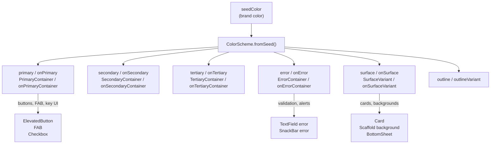

# Bài 1.1 — ThemeData, ColorScheme & Material 3

## Phần 1 — Khái Niệm & Mục Tiêu Bài Học

### Tại sao bài này quan trọng?

Material 3 (M3) là design system mới nhất của Google, ra mắt năm 2021 và trở thành default của Flutter từ version 3.16. Toàn bộ code trong `flutter-advanced/` đều giả định bạn hiểu M3 color roles và cách configure theme đúng.

Hiểu ThemeData + ColorScheme cho phép bạn:
- Build UI nhất quán trên toàn app chỉ bằng cách thay đổi theme
- Dark mode hoạt động tự động
- Customize widget theo brand color mà không hardcode màu

### Bạn sẽ hiểu được sau bài này:
- `ThemeData` cấu trúc và các field quan trọng nhất
- `ColorScheme.fromSeed()` — cách M3 sinh toàn bộ bảng màu từ 1 seed color
- 13 color roles của M3 và khi nào dùng role nào
- `Theme.of(context)` để access theme trong widget

---

## Phần 2 — Cơ Chế Hoạt Động (Under the Hood)

### Material 3 Color System



### ThemeData hierarchy

`ThemeData` là root object. Flutter components tự đọc theme — bạn không cần truyền màu tường minh xuống từng widget.

```
MaterialApp.theme
    └── ThemeData
         ├── colorScheme          ← Toàn bộ màu sắc
         ├── textTheme            ← Typography (xem bài 1.2)
         ├── elevatedButtonTheme  ← Override style của ElevatedButton
         ├── cardTheme            ← Override style của Card
         ├── inputDecorationTheme ← Override style của TextField
         └── ... (80+ component themes)
```

---

## Phần 3 — Code Mẫu Chuẩn Google

### 3.1 — Setup MaterialApp với M3 theme

```dart
// main.dart
void main() => runApp(const MyApp());

class MyApp extends StatelessWidget {
  const MyApp({super.key});

  @override
  Widget build(BuildContext context) {
    return MaterialApp(
      title: 'My App',
      // useMaterial3: true — bật M3 (default từ Flutter 3.16)
      theme: _buildLightTheme(),
      darkTheme: _buildDarkTheme(),
      // Theo system setting: light/dark/system
      themeMode: ThemeMode.system,
      home: const HomeScreen(),
    );
  }

  ThemeData _buildLightTheme() {
    // ColorScheme.fromSeed: sinh toàn bộ bảng màu M3 từ 1 seedColor
    // Flutter tự tính toán primary, secondary, surface, error... theo M3 algorithm
    final colorScheme = ColorScheme.fromSeed(
      seedColor: const Color(0xFF6750A4), // Brand purple
      brightness: Brightness.light,
    );

    return ThemeData(
      useMaterial3: true,
      colorScheme: colorScheme,
      // Component theme overrides
      elevatedButtonTheme: ElevatedButtonThemeData(
        style: ElevatedButton.styleFrom(
          // Dùng color roles thay vì hardcode màu
          backgroundColor: colorScheme.primary,
          foregroundColor: colorScheme.onPrimary,
          minimumSize: const Size(88, 48),
          shape: RoundedRectangleBorder(
            borderRadius: BorderRadius.circular(12),
          ),
        ),
      ),
      cardTheme: CardTheme(
        elevation: 1,
        shape: RoundedRectangleBorder(
          borderRadius: BorderRadius.circular(16),
        ),
        color: colorScheme.surface,
        surfaceTintColor: colorScheme.primary, // M3 elevation tint
      ),
      inputDecorationTheme: InputDecorationTheme(
        filled: true,
        fillColor: colorScheme.surfaceVariant,
        border: OutlineInputBorder(
          borderRadius: BorderRadius.circular(12),
          borderSide: BorderSide.none,
        ),
        enabledBorder: OutlineInputBorder(
          borderRadius: BorderRadius.circular(12),
          borderSide: BorderSide.none,
        ),
        focusedBorder: OutlineInputBorder(
          borderRadius: BorderRadius.circular(12),
          borderSide: BorderSide(color: colorScheme.primary, width: 2),
        ),
        errorBorder: OutlineInputBorder(
          borderRadius: BorderRadius.circular(12),
          borderSide: BorderSide(color: colorScheme.error),
        ),
      ),
    );
  }

  ThemeData _buildDarkTheme() {
    final colorScheme = ColorScheme.fromSeed(
      seedColor: const Color(0xFF6750A4),
      brightness: Brightness.dark, // Tự động sinh màu phù hợp dark mode
    );

    return ThemeData(
      useMaterial3: true,
      colorScheme: colorScheme,
      // Component overrides tương tự light theme
    );
  }
}
```

### 3.2 — Sử dụng color roles trong widget

```dart
// Dùng Theme.of(context).colorScheme — KHÔNG hardcode màu
class ProductCard extends StatelessWidget {
  final Product product;
  const ProductCard({super.key, required this.product});

  @override
  Widget build(BuildContext context) {
    // Access theme một lần, destructure để dễ dùng
    final cs = Theme.of(context).colorScheme;
    final tt = Theme.of(context).textTheme;

    return Card(
      child: Padding(
        padding: const EdgeInsets.all(16),
        child: Column(
          crossAxisAlignment: CrossAxisAlignment.start,
          children: [
            // Primary container: nền nhẹ cho highlight content
            Container(
              padding: const EdgeInsets.symmetric(horizontal: 8, vertical: 4),
              decoration: BoxDecoration(
                color: cs.primaryContainer,
                borderRadius: BorderRadius.circular(8),
              ),
              child: Text(
                product.category,
                style: tt.labelSmall?.copyWith(color: cs.onPrimaryContainer),
              ),
            ),
            const SizedBox(height: 8),
            Text(product.name, style: tt.titleMedium),
            Text(
              product.price,
              style: tt.headlineSmall?.copyWith(color: cs.primary),
            ),
            const SizedBox(height: 8),
            Row(
              mainAxisAlignment: MainAxisAlignment.end,
              children: [
                // Secondary: action ít quan trọng hơn primary action
                OutlinedButton(
                  onPressed: () {},
                  child: const Text('Lưu'),
                ),
                const SizedBox(width: 8),
                // Primary: main action
                FilledButton(
                  onPressed: () {},
                  child: const Text('Mua'),
                ),
              ],
            ),
          ],
        ),
      ),
    );
  }
}
```

### 3.3 — ColorScheme roles reference

```dart
// M3 Color Roles — khi nào dùng role nào:
void colorRolesGuide(BuildContext context) {
  final cs = Theme.of(context).colorScheme;

  // PRIMARY: FAB, key buttons, active states
  // ON_PRIMARY: text/icon trên nền primary
  cs.primary; cs.onPrimary;

  // PRIMARY_CONTAINER: nền nhẹ hơn primary (chip, selected items)
  // ON_PRIMARY_CONTAINER: text trên nền primaryContainer
  cs.primaryContainer; cs.onPrimaryContainer;

  // SECONDARY: chip, filter, less prominent actions
  cs.secondary; cs.onSecondary;
  cs.secondaryContainer; cs.onSecondaryContainer;

  // TERTIARY: complementary accent (calendar, progress)
  cs.tertiary; cs.onTertiary;
  cs.tertiaryContainer; cs.onTertiaryContainer;

  // SURFACE: backgrounds (cards, sheets, menus)
  // ON_SURFACE: body text, icons trên surface
  cs.surface; cs.onSurface;

  // SURFACE_VARIANT: chips, text fields background
  // ON_SURFACE_VARIANT: placeholder text, icons
  cs.surfaceVariant; cs.onSurfaceVariant;

  // ERROR: validation, alerts
  cs.error; cs.onError;
  cs.errorContainer; cs.onErrorContainer;

  // OUTLINE: borders, dividers
  // OUTLINE_VARIANT: softer borders
  cs.outline; cs.outlineVariant;
}
```

---

## Phần 4 — Lỗi Sai Phổ Biến & Best Practices

### ❌ Anti-pattern 1: Hardcode màu thay vì dùng color roles

```dart
// ❌ Không tốt: hardcode màu → dark mode bị sai, không thể rebrand
Container(
  color: const Color(0xFF6750A4), // Brand color hardcode
  child: Text(
    'Hello',
    style: const TextStyle(color: Colors.white), // Hardcode white
  ),
)

// ✅ Dùng color roles — tự động đúng ở cả light/dark mode
Container(
  color: Theme.of(context).colorScheme.primary,
  child: Text(
    'Hello',
    style: TextStyle(color: Theme.of(context).colorScheme.onPrimary),
  ),
)
```

### ❌ Anti-pattern 2: Tạo ThemeData trong build()

```dart
// ❌ ThemeData được tạo lại mỗi rebuild
Widget build(BuildContext context) {
  return MaterialApp(
    theme: ThemeData(colorScheme: ColorScheme.fromSeed(...)), // Tạo mới mỗi build!
  );
}

// ✅ Tạo một lần trong const hoặc tách ra method
final _lightTheme = ThemeData(
  useMaterial3: true,
  colorScheme: ColorScheme.fromSeed(seedColor: Colors.purple),
);

MaterialApp(theme: _lightTheme)
```

### ❌ Anti-pattern 3: Bật M3 nhưng quên useMaterial3: true

```dart
// ❌ Thiếu useMaterial3 → widgets render theo M2 style
ThemeData(colorScheme: ColorScheme.fromSeed(seedColor: Colors.blue))
// FloatingActionButton, NavigationBar... trông như M2

// ✅ Luôn khai báo tường minh
ThemeData(
  useMaterial3: true, // BẮT BUỘC với M3 color system
  colorScheme: ColorScheme.fromSeed(seedColor: Colors.blue),
)
```

---

## Phần 5 — Bài Tập Củng Cố Tư Duy

### Challenge: Branded App Theme

**Yêu cầu:**
1. Tạo `AppTheme` class với `static ThemeData light` và `static ThemeData dark`
2. Seed color: `#1B6CA8` (deep blue)
3. Override: `AppBar` background = `colorScheme.surface` (không phải primary — M3 standard)
4. Override: `FloatingActionButton` dùng `tertiaryContainer` thay vì `primary`
5. `NavigationBar` selected indicator = `secondaryContainer`
6. Viết widget nhỏ hiển thị tất cả 13 color roles thành dải màu

**Gợi ý:**
- `AppBarTheme(backgroundColor: colorScheme.surface, foregroundColor: colorScheme.onSurface)`
- `FloatingActionButtonThemeData(backgroundColor: colorScheme.tertiaryContainer)`

### Câu hỏi phỏng vấn liên quan:

1. **"ColorScheme.fromSeed vs ColorScheme.fromSwatch khác nhau như thế nào?"**
   - `fromSeed`: M3 algorithm, sinh toàn bộ palette từ seed — recommended
   - `fromSwatch`: M2 style, ít color roles hơn

2. **"Tại sao AppBar trong M3 thường dùng surface thay vì primary?"**
   - M3 guideline: AppBar là surface, primary chỉ dùng cho actions
   - Tránh "purple bar" effect — màu sắc nặng nề

3. **"SurfaceTintColor trong CardTheme dùng để làm gì?"**
   - M3 elevation model: thay vì shadow, dùng tint màu primary để biểu thị độ cao
   - Càng cao elevation → tint càng đậm
