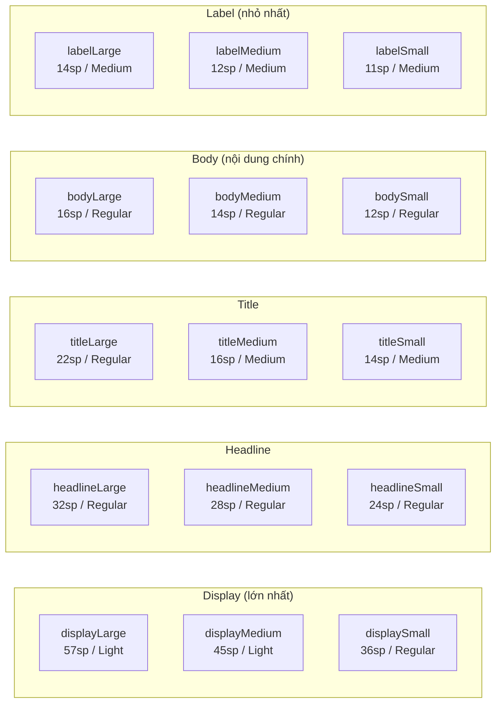

# Bài 1.2 — Typography, TextTheme & Custom Fonts

## Phần 1 — Khái Niệm & Mục Tiêu Bài Học

### Tại sao bài này quan trọng?

Typography là 30% visual design của một app. M3 định nghĩa 15 text roles có tên ngữ nghĩa (displayLarge, headlineMedium, bodySmall...) — thay vì magic numbers như `fontSize: 16`.

```dart
// ❌ Magic number — ai cũng tự đặt, không nhất quán
Text('Title', style: TextStyle(fontSize: 24, fontWeight: FontWeight.bold))

// ✅ M3 semantic naming — nhất quán toàn app
Text('Title', style: Theme.of(context).textTheme.headlineMedium)
```

### Bạn sẽ hiểu được sau bài này:
- 15 text roles của M3 TextTheme và khi nào dùng role nào
- Load custom fonts qua `pubspec.yaml`
- `google_fonts` package — sử dụng Google Fonts không cần download thủ công
- `copyWith` để customize từng text style mà không mất theme mặc định

---

## Phần 2 — Cơ Chế Hoạt Động (Under the Hood)

### M3 Type Scale



**Mapping thực tế:**
- `displayLarge/Medium/Small` → Hero text, onboarding screen
- `headlineLarge/Medium/Small` → Screen title, section header
- `titleLarge/Medium/Small` → Card title, dialog title, ListTile title
- `bodyLarge/Medium/Small` → Paragraph text, description
- `labelLarge/Medium/Small` → Button text, chip text, caption

---

## Phần 3 — Code Mẫu Chuẩn Google

### 3.1 — Custom font với pubspec.yaml

```yaml
# pubspec.yaml
flutter:
  fonts:
    - family: Inter
      fonts:
        - asset: assets/fonts/Inter-Regular.ttf
          weight: 400
        - asset: assets/fonts/Inter-Medium.ttf
          weight: 500
        - asset: assets/fonts/Inter-SemiBold.ttf
          weight: 600
        - asset: assets/fonts/Inter-Bold.ttf
          weight: 700
        - asset: assets/fonts/Inter-Italic.ttf
          style: italic
```

```dart
// Áp dụng font toàn app qua ThemeData
ThemeData(
  useMaterial3: true,
  colorScheme: ColorScheme.fromSeed(seedColor: Colors.blue),
  // fontFamily: override default font cho toàn bộ TextTheme
  fontFamily: 'Inter',
)
```

### 3.2 — Google Fonts package (recommended)

```dart
// pubspec.yaml: google_fonts: ^6.2.1

import 'package:google_fonts/google_fonts.dart';

ThemeData _buildTheme(ColorScheme colorScheme) {
  // textTheme: google_fonts tạo TextTheme với font tải từ mạng (cache offline)
  final baseTextTheme = GoogleFonts.interTextTheme();

  return ThemeData(
    useMaterial3: true,
    colorScheme: colorScheme,
    textTheme: baseTextTheme.copyWith(
      // Override chỉ những role cần thiết
      displayLarge: GoogleFonts.inter(
        fontSize: 57,
        fontWeight: FontWeight.w300,
        letterSpacing: -0.25,
      ),
      titleLarge: GoogleFonts.inter(
        fontSize: 22,
        fontWeight: FontWeight.w600, // SemiBold cho title
      ),
      labelLarge: GoogleFonts.inter(
        fontSize: 14,
        fontWeight: FontWeight.w500,
        letterSpacing: 0.1,
      ),
    ),
  );
}
```

### 3.3 — Sử dụng TextTheme trong widget

```dart
class ArticleCard extends StatelessWidget {
  final Article article;
  const ArticleCard({super.key, required this.article});

  @override
  Widget build(BuildContext context) {
    final tt = Theme.of(context).textTheme;
    final cs = Theme.of(context).colorScheme;

    return Card(
      child: Padding(
        padding: const EdgeInsets.all(16),
        child: Column(
          crossAxisAlignment: CrossAxisAlignment.start,
          children: [
            // Category label
            Text(
              article.category.toUpperCase(),
              style: tt.labelSmall?.copyWith(
                color: cs.primary,
                letterSpacing: 1.5,
              ),
            ),
            const SizedBox(height: 4),

            // Article title
            Text(article.title, style: tt.titleLarge),
            const SizedBox(height: 8),

            // Excerpt — body text
            Text(
              article.excerpt,
              style: tt.bodyMedium?.copyWith(color: cs.onSurfaceVariant),
              maxLines: 3,
              overflow: TextOverflow.ellipsis,
            ),
            const SizedBox(height: 12),

            // Meta info
            Row(
              children: [
                Text(article.author, style: tt.labelMedium),
                Text(' · ', style: tt.labelMedium?.copyWith(color: cs.outline)),
                Text(
                  article.readTime,
                  style: tt.labelMedium?.copyWith(color: cs.onSurfaceVariant),
                ),
              ],
            ),
          ],
        ),
      ),
    );
  }
}
```

### 3.4 — Extend TextTheme với custom styles

```dart
// Extension để thêm custom text styles vào theme
extension AppTextTheme on TextTheme {
  // Monospace font cho code snippets
  TextStyle get code => GoogleFonts.firaCode(
    fontSize: 13,
    fontWeight: FontWeight.w400,
  );

  // Price display — custom formatting
  TextStyle get price => const TextStyle(
    fontSize: 20,
    fontWeight: FontWeight.w700,
    letterSpacing: -0.5,
  );
}

// Sử dụng:
Text(
  'final result = 42;',
  style: Theme.of(context).textTheme.code,
)
Text(
  '₫299,000',
  style: Theme.of(context).textTheme.price.copyWith(
    color: Theme.of(context).colorScheme.primary,
  ),
)
```

---

## Phần 4 — Lỗi Sai Phổ Biến & Best Practices

### ❌ Anti-pattern 1: Magic fontSize numbers

```dart
// ❌ Magic numbers — inconsistent, không responsive
Text('Title', style: const TextStyle(fontSize: 20, fontWeight: FontWeight.bold))
Text('Body', style: const TextStyle(fontSize: 14))
Text('Caption', style: const TextStyle(fontSize: 11, color: Colors.grey))

// ✅ Semantic text roles
Text('Title', style: Theme.of(context).textTheme.titleLarge)
Text('Body', style: Theme.of(context).textTheme.bodyMedium)
Text('Caption', style: Theme.of(context).textTheme.labelSmall?.copyWith(
  color: Theme.of(context).colorScheme.onSurfaceVariant,
))
```

### ❌ Anti-pattern 2: Dùng `.apply()` thay vì `.copyWith()`

```dart
// ❌ textTheme.apply() thay đổi TẤT CẢ styles — ít kiểm soát
textTheme: GoogleFonts.interTextTheme().apply(
  fontSizeFactor: 1.1, // Scale tất cả sizes — có thể phá vỡ một số styles
)

// ✅ copyWith để override chọn lọc
textTheme: GoogleFonts.interTextTheme().copyWith(
  titleLarge: GoogleFonts.inter(fontSize: 24, fontWeight: FontWeight.w600),
  // Các styles khác giữ nguyên
)
```

---

## Phần 5 — Bài Tập Củng Cố Tư Duy

### Challenge: Typography Showcase Screen

**Yêu cầu:**
1. Setup `google_fonts` với font `Nunito` (display/headline) và `Source Sans Pro` (body/label)
2. Tạo screen hiển thị tất cả 15 text roles với tên role và sample text
3. Toggle button để switch giữa 2 font khác nhau (so sánh trực tiếp)
4. Thêm custom `code` style dùng `JetBrains Mono`

**Gợi ý:**
- Dùng `Theme.of(context).textTheme` và iterate qua tất cả properties
- `ThemeData.copyWith(textTheme: ...)` để switch font mà không cần restart app

### Thử thách thẩm định kỹ thuật:

1. **"Sự khác biệt giữa 15 text roles trong M3?"**
   - Display: hero text, marketing — không phải UI text
   - Headline: screen/section titles
   - Title: component titles (card, list)
   - Body: readable prose, descriptions
   - Label: small UI elements, buttons, captions

2. **"Google Fonts hoạt động offline không?"**
   - Có — font được cache local sau lần đầu download
   - Dùng `GoogleFonts.config.allowRuntimeFetching = false` để disable network và chỉ dùng bundled

3. **"textTheme.copyWith vs textTheme.apply?"**
   - `copyWith`: chỉ override styles bạn chỉ định — fine-grained control
   - `apply`: áp dụng transformation (scale, color) lên TẤT CẢ styles — blunt tool
