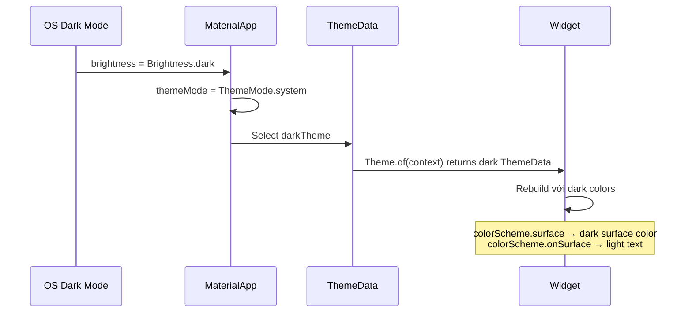

# Bài 1.3 — Dark Mode & Dynamic Theming

## Phần 1 — Khái Niệm & Mục Tiêu Bài Học

### Tại sao bài này quan trọng?

Dark mode là yêu cầu tiêu chuẩn trong mọi production app. Flutter + M3 làm cho điều này rất dễ — nếu bạn đã dùng color roles đúng cách (bài 1.1), bạn chỉ cần thêm `darkTheme` và dark mode tự hoạt động.

Dynamic theming (thay đổi theme lúc runtime) cũng là pattern phổ biến: user chọn accent color, app tự update toàn bộ UI.

### Bạn sẽ hiểu được sau bài này:
- `ThemeMode.system / light / dark` — theo hệ thống hay cho phép user chọn
- Lưu theme preference với `SharedPreferences`
- Dynamic color: thay đổi seed color lúc runtime
- `ThemeExtension` — thêm custom properties vào theme

---

## Phần 2 — Cơ Chế Hoạt Động (Under the Hood)

### Theme resolution flow



### ThemeExtension — custom theme properties

Khi bạn cần thêm custom values vào theme (brand-specific, không có trong M3), dùng `ThemeExtension`:

```
ThemeData
  └── extensions[AppSpacingTheme]  ← your custom extension
      ├── spacingXS: 4.0
      ├── spacingSM: 8.0
      └── spacingMD: 16.0
```

---

## Phần 3 — Code Mẫu Chuẩn Google

### 3.1 — ThemeController với SharedPreferences

```dart
// theme_controller.dart
import 'package:flutter/material.dart';
import 'package:shared_preferences/shared_preferences.dart';

class ThemeController extends ChangeNotifier {
  static const _themeModeKey = 'themeMode';
  static const _seedColorKey = 'seedColor';

  ThemeMode _themeMode = ThemeMode.system;
  Color _seedColor = const Color(0xFF6750A4);

  ThemeMode get themeMode => _themeMode;
  Color get seedColor => _seedColor;

  // Khởi tạo từ SharedPreferences
  Future<void> loadFromPrefs() async {
    final prefs = await SharedPreferences.getInstance();
    final themeModeIndex = prefs.getInt(_themeModeKey) ?? 0;
    final seedColorValue = prefs.getInt(_seedColorKey) ?? 0xFF6750A4;

    _themeMode = ThemeMode.values[themeModeIndex];
    _seedColor = Color(seedColorValue);
    notifyListeners();
  }

  Future<void> setThemeMode(ThemeMode mode) async {
    _themeMode = mode;
    notifyListeners();
    final prefs = await SharedPreferences.getInstance();
    await prefs.setInt(_themeModeKey, mode.index);
  }

  Future<void> setSeedColor(Color color) async {
    _seedColor = color;
    notifyListeners();
    final prefs = await SharedPreferences.getInstance();
    await prefs.setInt(_seedColorKey, color.value);
  }
}
```

```dart
// main.dart — kết nối ThemeController với MaterialApp
class MyApp extends StatelessWidget {
  final ThemeController themeController;
  const MyApp({super.key, required this.themeController});

  @override
  Widget build(BuildContext context) {
    return ChangeNotifierProvider.value(
      value: themeController,
      child: Consumer<ThemeController>(
        builder: (context, controller, _) {
          final lightCS = ColorScheme.fromSeed(
            seedColor: controller.seedColor,
            brightness: Brightness.light,
          );
          final darkCS = ColorScheme.fromSeed(
            seedColor: controller.seedColor,
            brightness: Brightness.dark,
          );

          return MaterialApp(
            title: 'My App',
            // Dynamic theme: rebuild khi seedColor hoặc themeMode thay đổi
            theme: ThemeData(useMaterial3: true, colorScheme: lightCS),
            darkTheme: ThemeData(useMaterial3: true, colorScheme: darkCS),
            themeMode: controller.themeMode, // System / Light / Dark
            home: const HomeScreen(),
          );
        },
      ),
    );
  }
}
```

### 3.2 — Settings screen để chọn theme

```dart
class ThemeSettingsScreen extends StatelessWidget {
  const ThemeSettingsScreen({super.key});

  static const _colorOptions = [
    ('Tím', Color(0xFF6750A4)),
    ('Xanh dương', Color(0xFF1B6CA8)),
    ('Xanh lá', Color(0xFF2E7D32)),
    ('Cam', Color(0xFFE65100)),
    ('Hồng', Color(0xFFAD1457)),
  ];

  @override
  Widget build(BuildContext context) {
    final controller = context.watch<ThemeController>();

    return Scaffold(
      appBar: AppBar(title: const Text('Giao diện')),
      body: ListView(
        children: [
          // Theme mode selector
          const ListTile(
            title: Text('Chế độ hiển thị'),
            subtitle: Text('Chọn light, dark, hoặc theo hệ thống'),
          ),
          ...ThemeMode.values.map((mode) => RadioListTile<ThemeMode>(
            title: Text(switch (mode) {
              ThemeMode.system => 'Theo hệ thống',
              ThemeMode.light => 'Sáng',
              ThemeMode.dark => 'Tối',
            }),
            value: mode,
            groupValue: controller.themeMode,
            onChanged: (v) => controller.setThemeMode(v!),
          )),

          const Divider(),

          // Seed color picker
          const ListTile(title: Text('Màu chủ đạo')),
          Padding(
            padding: const EdgeInsets.symmetric(horizontal: 16, vertical: 8),
            child: Wrap(
              spacing: 12,
              children: _colorOptions.map((option) {
                final (name, color) = option;
                final isSelected = controller.seedColor == color;
                return GestureDetector(
                  onTap: () => controller.setSeedColor(color),
                  child: Tooltip(
                    message: name,
                    child: AnimatedContainer(
                      duration: const Duration(milliseconds: 200),
                      width: 48,
                      height: 48,
                      decoration: BoxDecoration(
                        color: color,
                        shape: BoxShape.circle,
                        border: isSelected
                            ? Border.all(
                                color: Theme.of(context).colorScheme.onSurface,
                                width: 3,
                              )
                            : null,
                        boxShadow: isSelected
                            ? [BoxShadow(color: color.withOpacity(0.4), blurRadius: 8)]
                            : null,
                      ),
                      child: isSelected
                          ? Icon(
                              Icons.check,
                              color: ThemeData.estimateBrightnessForColor(color) ==
                                      Brightness.dark
                                  ? Colors.white
                                  : Colors.black,
                            )
                          : null,
                    ),
                  ),
                );
              }).toList(),
            ),
          ),
        ],
      ),
    );
  }
}
```

### 3.3 — ThemeExtension — custom theme properties

```dart
// Thêm custom spacing values vào theme
@immutable
class AppSpacing extends ThemeExtension<AppSpacing> {
  final double xs;
  final double sm;
  final double md;
  final double lg;
  final double xl;

  const AppSpacing({
    this.xs = 4,
    this.sm = 8,
    this.md = 16,
    this.lg = 24,
    this.xl = 32,
  });

  // lerp: required cho ThemeExtension — dùng khi animate theme change
  @override
  AppSpacing lerp(AppSpacing? other, double t) {
    if (other == null) return this;
    return AppSpacing(
      xs: lerpDouble(xs, other.xs, t)!,
      sm: lerpDouble(sm, other.sm, t)!,
      md: lerpDouble(md, other.md, t)!,
      lg: lerpDouble(lg, other.lg, t)!,
      xl: lerpDouble(xl, other.xl, t)!,
    );
  }

  @override
  AppSpacing copyWith({double? xs, double? sm, double? md, double? lg, double? xl}) {
    return AppSpacing(
      xs: xs ?? this.xs,
      sm: sm ?? this.sm,
      md: md ?? this.md,
      lg: lg ?? this.lg,
      xl: xl ?? this.xl,
    );
  }
}

// Extension để access dễ dàng
extension AppThemeX on BuildContext {
  AppSpacing get spacing =>
      Theme.of(this).extension<AppSpacing>() ?? const AppSpacing();
}

// Đăng ký vào ThemeData:
ThemeData(
  useMaterial3: true,
  colorScheme: colorScheme,
  extensions: const [AppSpacing()], // Thêm extension
)

// Sử dụng trong widget:
Padding(
  padding: EdgeInsets.all(context.spacing.md), // 16.0
)
```

---

## Phần 4 — Lỗi Sai Phổ Biến & Best Practices

### ❌ Anti-pattern 1: MediaQuery để detect dark mode thay vì Theme

```dart
// ❌ Sai cách: MediaQuery.platformBrightness chỉ detect system brightness
// Không phản ánh ThemeMode.light/dark được set bởi user
final isDark = MediaQuery.of(context).platformBrightness == Brightness.dark;

// ✅ Đúng: Theme.of(context).brightness phản ánh ThemeData được chọn
final isDark = Theme.of(context).brightness == Brightness.dark;
```

### ❌ Anti-pattern 2: Hardcode color dẫn đến dark mode sai

```dart
// ❌ Text không thể đọc trên dark background
Text('Hello', style: const TextStyle(color: Colors.black))

// ✅ onSurface tự adjust theo light/dark
Text('Hello', style: TextStyle(color: Theme.of(context).colorScheme.onSurface))
```

---

## Phần 5 — Bài Tập Củng Cố Tư Duy

### Challenge: Full Dynamic Theme App

**Yêu cầu:**
1. App có bottom nav: Home, Settings
2. Settings screen: chọn ThemeMode (3 options) + chọn seed color từ 5 options
3. Preference được persist với SharedPreferences — reload app vẫn nhớ
4. Thêm `AppSpacing` ThemeExtension và dùng trong ít nhất 3 widget

### Câu hỏi phỏng vấn liên quan:

1. **"ThemeMode.system vs ThemeMode.light/dark?"**
   - System: follow OS dark mode setting — recommended default
   - Light/Dark: override user OS setting — khi app có setting riêng

2. **"ThemeExtension có cần implement lerp không?"**
   - Có — Flutter dùng `lerp` khi animate giữa 2 themes
   - `lerpDouble` / `Color.lerp` cho các kiểu tương ứng
