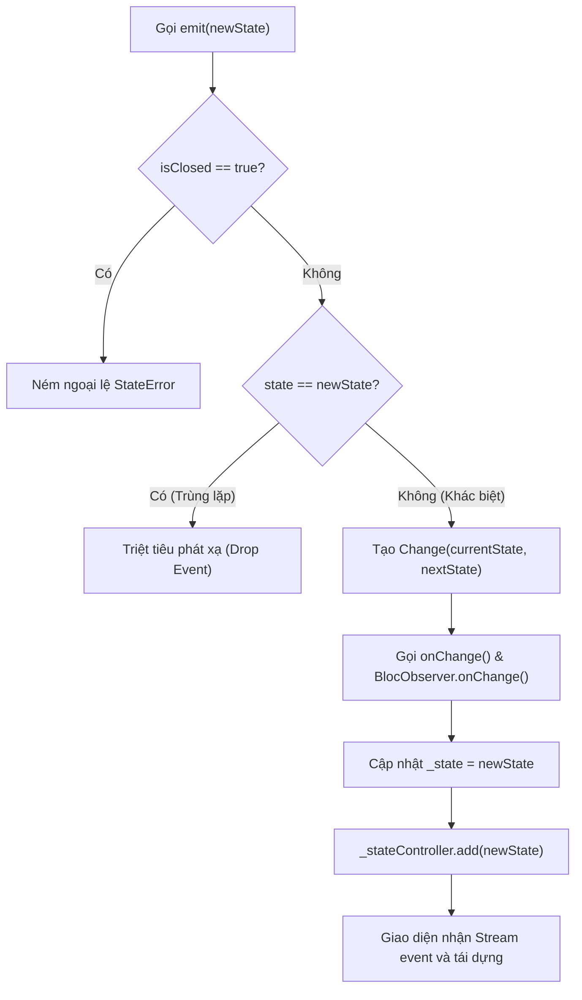

# Bài 2.1 — Kiến Trúc Cubit: Quản Lý Trạng Thái Đồng Bộ, Bất Biến & Vòng Đời BlocBase

## Dẫn Chiếu Tài Liệu Chính Thức
- **Cubit Core Concepts**: [bloclibrary.dev/#/coreconcepts?id=cubit](https://bloclibrary.dev/#/coreconcepts?id=cubit)
- **Flutter Bloc Package**: [pub.dev/packages/flutter_bloc](https://pub.dev/packages/flutter_bloc)
- **BlocBase Class Reference**: [pub.dev/documentation/bloc/latest/bloc/BlocBase-class.html](https://pub.dev/documentation/bloc/latest/bloc/BlocBase-class.html)
- **InheritedWidget Architecture**: [api.flutter.dev/flutter/widgets/InheritedWidget-class.html](https://api.flutter.dev/flutter/widgets/InheritedWidget-class.html)

---

## Phần 1 — Khái Niệm & Mục Tiêu Bài Học

### 1.1 — Bản Chất Của Cubit Trong Kiến Trúc Ứng Dụng

Trong phát triển ứng dụng Flutter, việc quản lý trạng thái trực tiếp trong cây giao diện (UI Tree) bằng `StatefulWidget` và `setState()` dẫn đến việc ghép nối chặt chẽ (tight coupling) giữa logic nghiệp vụ (business logic) và tầng hiển thị (presentation layer). Điều này gây cản trở nghiêm trọng cho quá trình kiểm thử tự động (Unit Testing) và khả năng tái sử dụng mã nguồn.

`Cubit` là một lớp quản lý trạng thái được thiết kế nhằm tách biệt hoàn toàn logic xử lý khỏi giao diện. Là một tập con tinh gọn của kiến trúc BLoC (Business Logic Component), `Cubit` tiếp nhận các tác vụ thông qua việc gọi hàm trực tiếp (function invocation) và phát xạ (emit) các trạng thái bất biến (immutable states) mới ra luồng dữ liệu (stream) để giao diện lắng nghe và tái dựng.

```
[UI Widget] ─── (1) Gọi phương thức (e.g. increment()) ───> [Cubit]
     ▲                                                         │
     │                                                (2) Xử lý logic
     │                                                         │
     └──────── (3) Phát xạ trạng thái mới (emit) ──────────────┘
```

### 1.2 — So Sánh Cubit Và ChangeNotifier

| Tiêu Chí Kỹ Thuật | `ChangeNotifier` (Provider) | `Cubit<State>` (Bloc Ecosystem) |
| :--- | :--- | :--- |
| **Mô hình trạng thái** | Trạng thái có thể biến đổi (Mutable state) nội tại. | Trạng thái bất biến (Immutable state) thay thế hoàn toàn. |
| **Cơ chế phát thông báo** | Gọi `notifyListeners()`, giao diện tự đọc thuộc tính. | Gọi `emit(newState)`, truyền trực tiếp payload qua Stream. |
| **Khả năng quan sát (Observability)** | Hạn chế; không có middleware theo dõi tập trung mặc định. | Hỗ trợ `BlocObserver` giám sát toàn diện mọi chuyển đổi trạng thái. |
| **Triệt tiêu phát xạ trùng** | Không tự động; phụ thuộc vào cách viết logic thủ công. | Tự động so sánh `state == newState`; nếu bằng nhau sẽ triệt tiêu. |
| **Khả năng kiểm thử (Testing)** | Cần khởi tạo đối tượng và kiểm tra thủ công các thuộc tính. | Kiểm thử khai báo luồng trạng thái với package `bloc_test`. |

### 1.3 — Mục Tiêu Kỹ Thuật Cần Đạt Được
- Nắm vững kiến trúc nội bộ của lớp cơ sở `BlocBase<State>` và phương thức phát xạ `emit()`.
- Hiểu rõ cơ chế triệt tiêu trạng thái trùng lặp dựa trên toán tử so bằng `operator ==`.
- Khai báo các trạng thái bất biến bằng kỹ thuật Dart 3 Sealed Classes và Record types.
- Quản lý vòng đời của `Cubit` trong cây phần tử (Element Tree) thông qua `BlocProvider`.
- Xử lý tác vụ bất đồng bộ an toàn, kiểm soát biến cờ `isClosed` để tránh rò rỉ bộ nhớ và lỗi ngoại lệ.

---

## Phần 2 — Cơ Chế Hoạt Động (Under the Hood)

### 2.1 — Cấu Trúc Nội Bộ Của `BlocBase<State>`

Cả `Cubit` và `Bloc` đều kế thừa từ lớp trừu tượng cơ sở `BlocBase<State>`. Lớp này chịu trách nhiệm:
1. Lưu trữ giá trị trạng thái hiện thời tại thuộc tính `_state`.
2. Khởi tạo một luồng phát sóng đa điểm `StreamController<State>.broadcast()`.
3. Đảm bảo trạng thái đầu tiên được cấp phát thông qua giá trị khởi tạo trong hàm dựng (`super(initialState)`).

```dart
// Trích xuất cấu trúc rút gọn của BlocBase trong thư viện bloc
abstract class BlocBase<State> {
  BlocBase(this._state) {
    Bloc.observer.onCreate(this);
  }

  State _state;
  final _stateController = StreamController<State>.broadcast();

  State get state => _state;
  Stream<State> get stream => _stateController.stream;
  bool get isClosed => _stateController.isClosed;
  // ...
}
```

### 2.2 — Chu Trình Thực Thi Của Phương Thức `emit()`

Khi một phương thức trong `Cubit` gọi `emit(newState)`, chu trình xử lý diễn ra tuần tự qua các bước nghiêm ngặt:

1. **Kiểm tra trạng thái đóng (`isClosed`)**: Nếu controller đã đóng, phương thức ném ra ngoại lệ `StateError` nhằm cảnh báo rò rỉ luồng.
2. **Kiểm tra tính đồng nhất (Equality Check)**: Phương thức thực hiện so sánh `state == newState`. Nếu trạng thái mới có giá trị tương đương với trạng thái hiện tại (và đã từng phát xạ ít nhất một lần), phương thức sẽ kết thúc lập tức mà không thực hiện bất kỳ thao tác nào tiếp theo.
3. **Kích hoạt hàm quan sát `onChange()`**: Một đối tượng `Change<State>(currentState: state, nextState: newState)` được khởi tạo và gửi tới phương thức `onChange()` của instance hiện tại, đồng thời chuyển tiếp tới `BlocObserver.onChange()`.
4. **Cập nhật trạng thái**: Thuộc tính `_state` được gán bằng `newState`.
5. **Đẩy dữ liệu vào Stream**: Gọi `_stateController.add(_state)` để thông báo tới tất cả các phần tử đang đăng ký lắng nghe trên cây widget.



### 2.3 — Vòng Đời Của `BlocProvider` Trong Cây Widget

`BlocProvider` là một `InheritedWidget` chuyên biệt (dựa trên nền tảng package `provider`), đóng vai trò quản lý vòng đời và cung cấp `Cubit`/`Bloc` xuống các nút con:
- **Cơ chế khởi tạo lười (Lazy Evaluation)**: Mặc định thuộc tính `lazy` được đặt là `true`. `Cubit` chỉ thực sự được tạo khi có một widget con đầu tiên truy xuất thông qua `BlocProvider.of<T>(context)` hoặc `context.read<T>()`. Nếu muốn khởi tạo ngay khi gắn vào cây phần tử, cần đặt `lazy: false`.
- **Cơ chế tự động dọn dẹp (Automatic Disposal)**: Khi `BlocProvider` bị tháo gỡ hoàn toàn khỏi cây phần tử (`unmount`), nó sẽ tự động gọi phương thức `close()` trên instance `Cubit` được tạo bởi tham số `create`.
- **Phân biệt `BlocProvider(create: ...)` và `BlocProvider.value(value: ...)`**: 
  - `create`: Chịu trách nhiệm tạo mới và sở hữu vòng đời (sẽ gọi `close()` khi dispose).
  - `value`: Chỉ chia sẻ tham chiếu của một instance đã tồn tại sang một subtree khác (ví dụ: mở Dialog hoặc Route mới); tuyệt đối **không** gọi `close()` khi widget unmount.

---

## Phần 3 — Triển Khai Kỹ Thuật (Implementation Details)

### 3.1 — Định Nghĩa Trạng Thái Bất Biến Với Dart 3 Sealed Classes

Mô hình hóa trạng thái một cách tường minh bằng cách sử dụng `sealed class` giúp trình biên dịch kiểm soát toàn diện mọi nhánh trạng thái thông qua Pattern Matching:

```dart
import 'package:flutter/foundation.dart';

/// Định nghĩa các trạng thái của màn hình quản lý số đếm
@immutable
sealed class CounterState {
  const CounterState();
}

/// Trạng thái khởi tạo mặc định
final class CounterInitial extends CounterState {
  const CounterInitial();
}

/// Trạng thái đang thực thi tác vụ bất đồng bộ
final class CounterLoading extends CounterState {
  const CounterLoading();
}

/// Trạng thái mang dữ liệu giá trị số đếm
final class CounterSuccess extends CounterState {
  final int value;
  final bool isEvenNumber;

  const CounterSuccess({
    required this.value,
    required this.isEvenNumber,
  });

  CounterSuccess copyWith({
    int? value,
    bool? isEvenNumber,
  }) {
    return CounterSuccess(
      value: value ?? this.value,
      isEvenNumber: isEvenNumber ?? this.isEvenNumber,
    );
  }

  @override
  bool operator ==(Object other) =>
      identical(this, other) ||
      other is CounterSuccess &&
          runtimeType == other.runtimeType &&
          value == other.value &&
          isEvenNumber == other.isEvenNumber;

  @override
  int get hashCode => Object.hash(value, isEvenNumber);
}

/// Trạng thái xảy ra lỗi xử lý
final class CounterFailure extends CounterState {
  final String errorMessage;

  const CounterFailure(this.errorMessage);

  @override
  bool operator ==(Object other) =>
      identical(this, other) ||
      other is CounterFailure &&
          runtimeType == other.runtimeType &&
          errorMessage == other.errorMessage;

  @override
  int get hashCode => errorMessage.hashCode;
}
```

### 3.2 — Cài Đặt Lớp Cubit Kèm Kiểm Soát Vòng Đời

```dart
import 'package:flutter_bloc/flutter_bloc.dart';
import 'counter_state.dart';

class CounterCubit extends Cubit<CounterState> {
  CounterCubit() : super(const CounterInitial());

  /// Tăng giá trị đồng bộ
  void increment() {
    final currentState = state;
    if (currentState is CounterSuccess) {
      final nextValue = currentState.value + 1;
      emit(CounterSuccess(
        value: nextValue,
        isEvenNumber: nextValue % 2 == 0,
      ));
    } else {
      emit(const CounterSuccess(value: 1, isEvenNumber: false));
    }
  }

  /// Giảm giá trị đồng bộ với ràng buộc nghiệp vụ
  void decrement() {
    final currentState = state;
    if (currentState is CounterSuccess) {
      if (currentState.value <= 0) {
        emit(const CounterFailure('Giá trị không thể nhỏ hơn 0'));
        return;
      }
      final nextValue = currentState.value - 1;
      emit(CounterSuccess(
        value: nextValue,
        isEvenNumber: nextValue % 2 == 0,
      ));
    }
  }

  /// Mô phỏng tác vụ tăng giá trị bất đồng bộ (Network/Database)
  Future<void> incrementAsync() async {
    emit(const CounterLoading());

    try {
      // Mô phỏng độ trễ xử lý I/O
      await Future<void>.delayed(const Duration(milliseconds: 800));

      // Kiểm tra xem Cubit đã bị hủy bỏ trong quá trình chờ đợi hay chưa
      if (isClosed) return;

      final currentState = state;
      final currentValue = (currentState is CounterSuccess) ? currentState.value : 0;
      final nextValue = currentValue + 1;

      emit(CounterSuccess(
        value: nextValue,
        isEvenNumber: nextValue % 2 == 0,
      ));
    } catch (error) {
      if (!isClosed) {
        emit(CounterFailure('Lỗi thực thi bất đồng bộ: ${error.toString()}'));
      }
    }
  }
}
```

### 3.3 — Cài Đặt Hệ Thống Giám Sát Toàn Cục Với `BlocObserver`

`BlocObserver` hoạt động như một middleware cho phép kiểm soát luồng di chuyển trạng thái của mọi Cubit và Bloc trong ứng dụng:

```dart
import 'package:flutter/foundation.dart';
import 'package:flutter_bloc/flutter_bloc.dart';

class AppBlocObserver extends BlocObserver {
  const AppBlocObserver();

  @override
  void onCreate(BlocBase<dynamic> bloc) {
    super.onCreate(bloc);
    debugPrint('[Bloc Lifecycle] Khởi tạo: ${bloc.runtimeType}');
  }

  @override
  void onChange(BlocBase<dynamic> bloc, Change<dynamic> change) {
    super.onChange(bloc, change);
    debugPrint(
      '[Bloc Transition] ${bloc.runtimeType} | '
      'Từ: ${change.currentState.runtimeType} -> Đến: ${change.nextState.runtimeType}',
    );
  }

  @override
  void onError(BlocBase<dynamic> bloc, Object error, StackTrace stackTrace) {
    debugPrint('[Bloc Error] ${bloc.runtimeType} gặp lỗi: $error');
    super.onError(bloc, error, stackTrace);
  }

  @override
  void onClose(BlocBase<dynamic> bloc) {
    debugPrint('[Bloc Lifecycle] Giải phóng: ${bloc.runtimeType}');
    super.onClose(bloc);
  }
}
```

### 3.4 — Gắn Kết Với Giao Diện Người Dùng (UI Integration)

```dart
import 'package:flutter/material.dart';
import 'package:flutter_bloc/flutter_bloc.dart';
import 'counter_cubit.dart';
import 'counter_state.dart';

void main() {
  Bloc.observer = const AppBlocObserver();
  runApp(const CounterApp());
}

class CounterApp extends StatelessWidget {
  const CounterApp({super.key});

  @override
  Widget build(BuildContext context) {
    return MaterialApp(
      theme: ThemeData(useMaterial3: true),
      home: BlocProvider<CounterCubit>(
        create: (context) => CounterCubit(),
        child: const CounterScreen(),
      ),
    );
  }
}

class CounterScreen extends StatelessWidget {
  const CounterScreen({super.key});

  @override
  Widget build(BuildContext context) {
    return Scaffold(
      appBar: AppBar(title: const Text('Kiến Trúc Cubit Cơ Bản')),
      body: Center(
        child: Column(
          mainAxisAlignment: MainAxisAlignment.center,
          children: [
            // BlocBuilder tái dựng giao diện phụ thuộc trạng thái
            BlocBuilder<CounterCubit, CounterState>(
              buildWhen: (previous, current) => previous != current,
              builder: (context, state) {
                return switch (state) {
                  CounterInitial() => const Text(
                      'Nhấn nút để khởi tạo giá trị',
                      style: TextStyle(fontSize: 18),
                    ),
                  CounterLoading() => const CircularProgressIndicator(),
                  CounterSuccess(:final value, :final isEvenNumber) => Column(
                      children: [
                        Text(
                          '$value',
                          style: Theme.of(context).textTheme.displayLarge,
                        ),
                        Text(
                          isEvenNumber ? 'Số chẵn' : 'Số lẻ',
                          style: Theme.of(context).textTheme.bodyMedium,
                        ),
                      ],
                    ),
                  CounterFailure(:final errorMessage) => Text(
                      errorMessage,
                      style: TextStyle(
                        color: Theme.of(context).colorScheme.error,
                        fontSize: 16,
                      ),
                    ),
                };
              },
            ),
          ],
        ),
      ),
      floatingActionButton: const _CounterActionButtons(),
    );
  }
}

class _CounterActionButtons extends StatelessWidget {
  const _CounterActionButtons();

  @override
  Widget build(BuildContext context) {
    return Column(
      mainAxisAlignment: MainAxisAlignment.end,
      children: [
        FloatingActionButton(
          heroTag: 'fab_increment',
          onPressed: () => context.read<CounterCubit>().increment(),
          child: const Icon(Icons.add),
        ),
        const SizedBox(height: 12),
        FloatingActionButton(
          heroTag: 'fab_decrement',
          onPressed: () => context.read<CounterCubit>().decrement(),
          child: const Icon(Icons.remove),
        ),
        const SizedBox(height: 12),
        FloatingActionButton.extended(
          heroTag: 'fab_async',
          onPressed: () => context.read<CounterCubit>().incrementAsync(),
          icon: const Icon(Icons.timer),
          label: const Text('Tăng Bất Đồng Bộ'),
        ),
      ],
    );
  }
}
```

---

## Phần 4 — Lỗi Kiến Trúc Thường Gặp & Biện Pháp Khắc Phục

### 4.1 — Đột Biến Trạng Thái Trực Tiếp (In-place Mutation)

#### Mô tả lỗi:
Chỉnh sửa trực tiếp nội dung bên trong một danh sách, map hoặc đối tượng hiện có rồi truyền chính đối tượng đó vào `emit()`:

```dart
// Lỗi: Đột biến trực tiếp instance hiện tại
class BadItemCubit extends Cubit<List<String>> {
  BadItemCubit() : super([]);

  void addItem(String item) {
    state.add(item); // Thay đổi phần tử trong mảng hiện tại
    emit(state);     // Giao diện không nhận diện được sự thay đổi
  }
}
```

#### Nguyên nhân kỹ thuật:
Phương thức `emit()` trong `BlocBase` thực thi toán tử so sánh `state == newState`. Do `state` và `newState` cùng trỏ tới một địa chỉ ô nhớ (cùng instance), biểu thức so sánh trả về `true`. Hệ quả là `BlocBase` xem đây là trạng thái trùng lặp và hủy bỏ chu trình phát xạ, khiến `BlocBuilder` hoàn toàn không được kích hoạt để vẽ lại.

#### Biện pháp khắc phục:
Luôn tạo một đối tượng hoặc tập hợp hoàn toàn mới thông qua toán tử trải nghiệm (spread operator) hoặc phương thức `List.of()`:

```dart
// Khắc phục: Khởi tạo danh sách mới hoàn toàn
class GoodItemCubit extends Cubit<List<String>> {
  GoodItemCubit() : super(const []);

  void addItem(String item) {
    emit([...state, item]); // Tạo tham chiếu mảng mới độc lập
  }
}
```

---

### 4.2 — Gọi `emit()` Sau Khi Cubit Bị Hủy Giải Phóng (Calling Emit After Close)

#### Mô tả lỗi:
Thực hiện tác vụ mạng hoặc độ trễ thời gian bất đồng bộ, sau đó gọi `emit()` mà không kiểm tra xem Cubit còn hoạt động hay không:

```dart
// Lỗi: Bỏ qua kiểm tra vòng đời Cubit
class BadAsyncCubit extends Cubit<String> {
  BadAsyncCubit() : super('Ban đầu');

  Future<void> fetchData() async {
    final result = await fetchFromApi(); // Người dùng back màn hình trong lúc này
    emit(result); // Ném ra ngoại lệ: Bad state: Cannot emit new states after calling close
  }
}
```

#### Nguyên nhân kỹ thuật:
Khi widget cha bị hủy (`unmount`), `BlocProvider` tự động gọi `close()` trên Cubit làm đóng luồng `StreamController`. Việc đẩy dữ liệu vào một `StreamController` đã đóng vi phạm hợp đồng vận hành của Dart và ném ra `StateError`.

#### Biện pháp khắc phục:
Luôn kiểm tra thuộc tính `isClosed` trước khi thực hiện phát xạ trạng thái sau bất kỳ điểm chờ bất đồng bộ (`await gap`) nào:

```dart
// Khắc phục: Kiểm soát chặt chẽ cờ isClosed
class GoodAsyncCubit extends Cubit<String> {
  GoodAsyncCubit() : super('Ban đầu');

  Future<void> fetchData() async {
    final result = await fetchFromApi();
    if (isClosed) return; // Hủy bỏ phát xạ nếu Cubit đã bị đóng
    emit(result);
  }
}
```

---

### 4.3 — Sử Dụng `context.watch()` Bên Trong Các Hàm Callback Sự Kiện

#### Mô tả lỗi:
Truy xuất instance của Cubit bằng `context.watch<T>()` bên trong các hàm xử lý sự kiện người dùng (`onPressed`, `onTap`):

```dart
// Lỗi: Sử dụng context.watch trong hàm phản hồi sự kiện
ElevatedButton(
  onPressed: () {
    context.watch<CounterCubit>().increment();
  },
  child: const Text('Tăng'),
)
```

#### Nguyên nhân kỹ thuật:
`context.watch<T>()` thiết lập một liên kết phụ thuộc (dependency) giữa widget hiện tại và `InheritedWidget`. Khi được gọi bên ngoài phương thức `build()` (như trong callback sự kiện), Flutter sẽ cảnh báo việc đăng ký phụ thuộc không hợp lệ và có thể gây lỗi tái dựng ngoài ý muốn hoặc memory leak.

#### Biện pháp khắc phục:
Sử dụng `context.read<T>()` cho các tương tác gọi hàm một chiều từ callback sự kiện:

```dart
// Khắc phục: Sử dụng context.read cho callback
ElevatedButton(
  onPressed: () {
    context.read<CounterCubit>().increment();
  },
  child: const Text('Tăng'),
)
```

---

### 4.4 — Nhầm Lẫn Giữa `BlocProvider(create: ...)` Và `BlocProvider.value(...)`

#### Mô tả lỗi:
Truyền một Cubit đã có từ màn hình trước sang màn hình mới (ví dụ qua `Navigator.push`) bằng hàm tạo mặc định `BlocProvider(create: ...)`:

```dart
// Lỗi: Tái tạo hoặc gán sai quyền sở hữu vòng đời
Navigator.of(context).push(
  MaterialPageRoute(
    builder: (_) => BlocProvider<CounterCubit>(
      create: (context) => existingCubit, // Lỗi: existingCubit sẽ bị đóng khi màn hình mới unmount
      child: const SecondScreen(),
    ),
  ),
);
```

#### Nguyên nhân kỹ thuật:
Khi `SecondScreen` bị pop khỏi Navigator stack, `BlocProvider` mới unmount và lập tức gọi `existingCubit.close()`. Khi quay trở lại màn hình đầu tiên, `existingCubit` đã rơi vào trạng thái chết (`isClosed == true`), khiến mọi tương tác tiếp theo đều gây sập ứng dụng.

#### Biện pháp khắc phục:
Sử dụng hàm tạo có tên `BlocProvider.value(...)` khi chia sẻ một Cubit hiện hữu sang một subtree mới:

```dart
// Khắc phục: Sử dụng BlocProvider.value để bảo tồn vòng đời
Navigator.of(context).push(
  MaterialPageRoute(
    builder: (_) => BlocProvider<CounterCubit>.value(
      value: context.read<CounterCubit>(), // Không tự động gọi close() khi unmount
      child: const SecondScreen(),
    ),
  ),
);
```

---

## Phần 5 — Khảo Sát Bản Chất Kỹ Thuật & Phân Tích Mã Nguồn (Deep-Dive & Code Tracing)

### 5.1 — Khảo Sát Bản Chất Kỹ Thuật

#### Câu hỏi 1: Tại sao `StreamController` bên trong `BlocBase` bắt buộc phải là một Broadcast Stream (`.broadcast()`)?
*Phân tích:*
Trong kiến trúc giao diện người dùng, một `Cubit` có thể được quan sát đồng thời bởi nhiều widget khác nhau trên cây phần tử (ví dụ: một `BlocBuilder` hiển thị số đếm trong AppBar, một `BlocBuilder` khác hiển thị giá trị trong Body, và một `BlocListener` xử lý điều hướng). Một Single-subscription Stream tiêu chuẩn của Dart chỉ cho phép duy nhất một listener đăng ký trong suốt vòng đời của nó; nỗ lực lắng nghe lần thứ hai sẽ ném ra ngoại lệ `StateError`. Do đó, `BlocBase` bắt buộc phải sử dụng Broadcast Stream để hỗ trợ cơ chế đa người nghe (multi-subscriber architecture).

---

#### Câu hỏi 2: Sự khác biệt bản chất giữa toán tử `identical(a, b)` và `operator ==` trong quá trình so sánh trạng thái của `BlocBase.emit()` là gì?
*Phân tích:*
- `identical(a, b)` kiểm tra xem hai biến có cùng trỏ tới một địa chỉ vật lý trong bộ nhớ heap hay không (tham chiếu đối tượng).
- `operator ==` kiểm tra sự tương đồng về mặt giá trị ngữ nghĩa (value equality).
Trong `BlocBase.emit()`, việc kiểm tra sử dụng `state == newState`. Nếu một lớp trạng thái ghi đè toán tử `operator ==` (hoặc sử dụng package `equatable`), hai instance khác nhau ở hai vùng nhớ riêng biệt nhưng có cùng thuộc tính dữ liệu sẽ được kết luận là bằng nhau. `emit()` sẽ chặn việc phát xạ này, giúp giao diện không phải gánh chịu các chu kỳ tái dựng dư thừa.

---

#### Câu hỏi 3: Nếu một hàm bất đồng bộ trong Cubit gọi `emit()` nhiều lần liên tiếp không có `await`, luồng phát xạ trạng thái sẽ diễn ra đồng bộ hay bất đồng bộ?
*Phân tích:*
Phương thức `emit()` trong `BlocBase` thực thi hoàn toàn đồng bộ (synchronous execution). Khi `emit()` được gọi, `_state` được gán ngay lập tức, `onChange` được kích hoạt ngay lập tức, và dữ liệu được nạp vào `_stateController`. Các listener đăng ký trên Stream sẽ nhận thông báo tại microtask tiếp theo của Dart Event Loop. Nếu không có `await`, tất cả các lệnh gọi `emit()` liên tiếp sẽ được xử lý tuần tự trong cùng một chu kỳ microtask hiện thời.

---

#### Câu hỏi 4: Thuộc tính `lazy: true` trong `BlocProvider` tương tác như thế nào với cây phần tử `Element` của Flutter?
*Phân tích:*
Khi `lazy: true`, `BlocProvider` trì hoãn việc thực thi callback `create` cho đến khi phương thức `InheritedElement.dependOnInheritedWidgetOfExactType` hoặc `getElementForInheritedWidgetOfExactType` được kích hoạt bởi một widget con. Điều này giúp tối ưu hóa tài nguyên phần cứng (CPU/RAM), tránh khởi tạo sớm các tác vụ nặng (như mở kết nối WebSocket hoặc đọc cơ sở dữ liệu) nếu màn hình chứa Cubit đó chưa thực sự được hiển thị hoặc tương tác tới.

---

#### Câu hỏi 5: `BlocObserver` có thể can thiệp thay đổi giá trị của `nextState` trước khi nó được phát xạ ra Stream hay không?
*Phân tích:*
Không. `BlocObserver.onChange` chỉ là một kênh lắng nghe giám sát thuần túy (read-only notification hook). Tại thời điểm `BlocObserver.onChange(bloc, change)` được gọi, đối tượng `Change` đã được tạo xong với `currentState` và `nextState` cố định. `BlocObserver` không cung cấp cơ chế trả về một giá trị mới để biến đổi luồng dữ liệu (khác với Interceptor trong mạng). Mọi biến đổi logic bắt buộc phải nằm bên trong phạm vi xử lý nội bộ của `Cubit`.

---

### 5.2 — Bài Tập Phân Tích Luồng Thực Thi (Code Tracing)

Xem xét đoạn mã kiểm thử sau và xác định thứ tự xuất dữ liệu console:

```dart
void main() async {
  print('Step 1');
  final cubit = TraceTestCubit();
  
  print('Step 2');
  cubit.triggerSequence();
  
  print('Step 3');
  await Future<void>.delayed(Duration.zero);
  
  print('Step 4');
  await cubit.close();
  print('Step 5');
}

class TraceTestCubit extends Cubit<int> {
  TraceTestCubit() : super(0) {
    print('Cubit Constructor: $state');
  }

  @override
  void onChange(Change<int> change) {
    super.onChange(change);
    print('onChange: ${change.currentState} -> ${change.nextState}');
  }

  void triggerSequence() {
    emit(1);
    emit(1); // Phát xạ giá trị trùng lặp
    emit(2);
  }
}
```

#### Phân tích chi tiết từng bước:
1. `Step 1` được in ra màn hình.
2. `TraceTestCubit()` được khởi tạo. Hàm dựng gọi `super(0)`, in ra: `Cubit Constructor: 0`.
3. `Step 2` được in ra màn hình.
4. Phương thức `triggerSequence()` được gọi đồng bộ:
   - `emit(1)`: Giá trị hiện tại là 0, giá trị mới là 1 (khác biệt). `onChange` được gọi đồng bộ ngay lập tức, in ra: `onChange: 0 -> 1`. Cập nhật `state = 1`.
   - `emit(1)`: Giá trị hiện tại là 1, giá trị mới là 1. Phép so sánh `1 == 1` trả về `true`. Lệnh phát xạ bị triệt tiêu hoàn toàn, không có log nào được in.
   - `emit(2)`: Giá trị hiện tại là 1, giá trị mới là 2 (khác biệt). `onChange` được gọi đồng bộ ngay lập tức, in ra: `onChange: 1 -> 2`. Cập nhật `state = 2`.
5. Phương thức `triggerSequence()` kết thúc. Tiếp tục dòng lệnh chính: in ra `Step 3`.
6. `await Future<void>.delayed(Duration.zero)` đẩy phần còn lại của hàm `main` xuống hàng đợi Event Queue, cho phép các microtask (nếu có) hoàn tất xử lý.
7. In ra `Step 4`.
8. `await cubit.close()` đóng luồng stream của Cubit.
9. In ra `Step 5`.

#### Kết quả hiển thị chính xác trên console:
```text
Step 1
Cubit Constructor: 0
Step 2
onChange: 0 -> 1
onChange: 1 -> 2
Step 3
Step 4
Step 5
```
