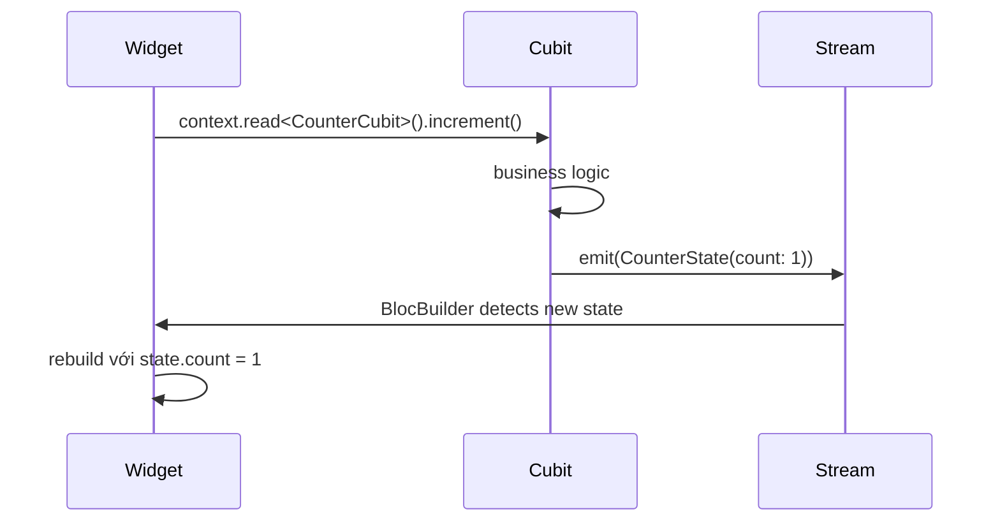

# Bài 2.1 — Cubit: State Management Đơn Giản

## Phần 1 — Khái Niệm & Mục Tiêu Bài Học

### Tại sao bài này quan trọng?

`Cubit` là phiên bản đơn giản hóa của BLoC — nó giải quyết một vấn đề cốt lõi: làm sao tách business logic ra khỏi UI widget một cách rõ ràng, testable.

```
❌ Logic trong Widget:
  Widget → setState() → rebuild

✅ Logic trong Cubit:
  Widget → calls Cubit method → Cubit.emit(newState) → Widget rebuild
```

Sau khi nắm Cubit, bạn sẽ sẵn sàng cho BLoC (thêm Event layer) và sau đó là Advanced BLoC (Event Transformers, concurrency policies).

### Bạn sẽ hiểu được sau bài này:
- `Cubit<State>`: class chứa logic, emit state mới
- `BlocProvider`: inject Cubit vào widget tree
- `BlocBuilder`: rebuild UI khi state thay đổi
- State class pattern: plain class vs sealed class

---

## Phần 2 — Cơ Chế Hoạt Động (Under the Hood)

### Cubit Data Flow



### Cubit vs Provider/ChangeNotifier

| | Cubit | ChangeNotifier |
|---|---|---|
| State | Immutable, emit new state | Mutable, notifyListeners |
| Testing | `blocTest<Cubit, State>` | Manual unit test |
| Stream | Built-in `stream` getter | Không có stream |
| Debugging | BlocObserver, state history | Không có |

---

## Phần 3 — Code Mẫu Chuẩn Google

### 3.1 — Counter Cubit cơ bản

```dart
// counter_state.dart — State class đơn giản
class CounterState {
  final int count;
  final bool isLoading;

  const CounterState({this.count = 0, this.isLoading = false});

  // copyWith: immutable update — không mutate state
  CounterState copyWith({int? count, bool? isLoading}) {
    return CounterState(
      count: count ?? this.count,
      isLoading: isLoading ?? this.isLoading,
    );
  }

  @override
  bool operator ==(Object other) =>
      other is CounterState && count == other.count && isLoading == other.isLoading;

  @override
  int get hashCode => Object.hash(count, isLoading);
}

// counter_cubit.dart
class CounterCubit extends Cubit<CounterState> {
  // super(initialState): trạng thái khởi đầu
  CounterCubit() : super(const CounterState());

  void increment() {
    // emit() → gửi state mới → tất cả BlocBuilder rebuild
    emit(state.copyWith(count: state.count + 1));
  }

  void decrement() {
    if (state.count <= 0) return; // Business rule
    emit(state.copyWith(count: state.count - 1));
  }

  void reset() => emit(const CounterState());

  Future<void> incrementAsync() async {
    emit(state.copyWith(isLoading: true));
    await Future.delayed(const Duration(milliseconds: 500)); // Simulate API
    emit(state.copyWith(count: state.count + 1, isLoading: false));
  }
}
```

### 3.2 — BlocProvider & BlocBuilder

```dart
// Inject Cubit vào widget tree
class CounterScreen extends StatelessWidget {
  const CounterScreen({super.key});

  @override
  Widget build(BuildContext context) {
    return BlocProvider(
      // create: Cubit lifecycle gắn với widget này
      // Tự động dispose khi widget unmount
      create: (_) => CounterCubit(),
      child: const _CounterView(),
    );
  }
}

class _CounterView extends StatelessWidget {
  const _CounterView();

  @override
  Widget build(BuildContext context) {
    return Scaffold(
      appBar: AppBar(title: const Text('Counter')),
      body: Center(
        child: Column(
          mainAxisAlignment: MainAxisAlignment.center,
          children: [
            // BlocBuilder: rebuild chỉ phần này khi state thay đổi
            BlocBuilder<CounterCubit, CounterState>(
              // buildWhen: tùy chọn — chỉ rebuild khi count thay đổi
              buildWhen: (prev, curr) => prev.count != curr.count,
              builder: (context, state) {
                return Text(
                  '${state.count}',
                  style: Theme.of(context).textTheme.displayLarge,
                );
              },
            ),
            const SizedBox(height: 16),
            // Loading indicator — rebuild riêng chỉ khi isLoading thay đổi
            BlocBuilder<CounterCubit, CounterState>(
              buildWhen: (prev, curr) => prev.isLoading != curr.isLoading,
              builder: (context, state) => state.isLoading
                  ? const CircularProgressIndicator()
                  : const SizedBox.shrink(),
            ),
          ],
        ),
      ),
      floatingActionButton: Column(
        mainAxisAlignment: MainAxisAlignment.end,
        children: [
          FloatingActionButton(
            heroTag: 'increment',
            // context.read: không subscribe, chỉ gọi method
            onPressed: () => context.read<CounterCubit>().increment(),
            child: const Icon(Icons.add),
          ),
          const SizedBox(height: 8),
          FloatingActionButton(
            heroTag: 'decrement',
            onPressed: () => context.read<CounterCubit>().decrement(),
            child: const Icon(Icons.remove),
          ),
          const SizedBox(height: 8),
          FloatingActionButton.extended(
            heroTag: 'async',
            onPressed: () => context.read<CounterCubit>().incrementAsync(),
            label: const Text('Async +1'),
          ),
        ],
      ),
    );
  }
}
```

### 3.3 — Sealed state class (recommended cho phức tạp)

```dart
// Dùng sealed class thay vì single class với nhiều flags
sealed class ProductsState {}

final class ProductsInitial extends ProductsState {}

final class ProductsLoading extends ProductsState {}

final class ProductsLoaded extends ProductsState {
  final List<Product> products;
  const ProductsLoaded(this.products);
}

final class ProductsError extends ProductsState {
  final String message;
  const ProductsError(this.message);
}

// Cubit
class ProductsCubit extends Cubit<ProductsState> {
  final ProductRepository _repository;

  ProductsCubit(this._repository) : super(ProductsInitial());

  Future<void> loadProducts() async {
    emit(ProductsLoading());
    try {
      final products = await _repository.getProducts();
      emit(ProductsLoaded(products));
    } catch (e) {
      emit(ProductsError(e.toString()));
    }
  }
}

// UI — exhaustive switch
BlocBuilder<ProductsCubit, ProductsState>(
  builder: (context, state) => switch (state) {
    ProductsInitial() => const SizedBox.shrink(),
    ProductsLoading() => const Center(child: CircularProgressIndicator()),
    ProductsLoaded(:final products) => ProductList(products: products),
    ProductsError(:final message) => ErrorView(message: message),
  },
)
```

---

## Phần 4 — Lỗi Sai Phổ Biến & Best Practices

### ❌ Anti-pattern 1: context.watch trong callback

```dart
// ❌ context.watch trong onPressed → rebuild sẽ re-register listener
ElevatedButton(
  onPressed: () {
    context.watch<CounterCubit>().increment(); // ❌ watch trong callback
  },
  child: const Text('Increment'),
)

// ✅ context.read trong callbacks, context.watch chỉ trong build()
ElevatedButton(
  onPressed: () => context.read<CounterCubit>().increment(), // ✅
  child: const Text('Increment'),
)
```

### ❌ Anti-pattern 2: Emit state bằng mutation (mutable state)

```dart
// ❌ Mutable state: BlocBuilder không detect change nếu object == cũ
class BadState {
  List<String> items = []; // Mutable list
}

class BadCubit extends Cubit<BadState> {
  BadCubit() : super(BadState());
  void addItem(String item) {
    state.items.add(item); // Mutate state hiện tại
    emit(state); // BlocBuilder có thể không rebuild! (same object reference)
  }
}

// ✅ Immutable: tạo state mới hoàn toàn
class GoodState {
  final List<String> items;
  const GoodState({this.items = const []});
  GoodState copyWith({List<String>? items}) => GoodState(items: items ?? this.items);
}

class GoodCubit extends Cubit<GoodState> {
  GoodCubit() : super(const GoodState());
  void addItem(String item) {
    emit(state.copyWith(items: [...state.items, item])); // New list instance
  }
}
```

---

## Phần 5 — Bài Tập Củng Cố Tư Duy

### Challenge: Todo List với Cubit

**Yêu cầu:**
1. `TodoCubit` quản lý danh sách todos
2. State dùng sealed class: `TodoInitial`, `TodoLoaded(todos, filter)`
3. Methods: `addTodo`, `toggleTodo`, `deleteTodo`, `setFilter(all/active/done)`
4. `BlocBuilder` chỉ rebuild list khi todos thay đổi, rebuild count khi filter thay đổi

### Câu hỏi phỏng vấn:

1. **"Cubit vs ChangeNotifier — khi nào dùng Cubit?"**
   - Cubit: cần test, cần stream, cần BlocObserver (logging, analytics)
   - ChangeNotifier: app nhỏ, không cần test state logic

2. **"emit() sau khi Cubit đã close có gây lỗi không?"**
   - Có — throw StateError. Dùng `if (!isClosed) emit(...)` cho async operations
