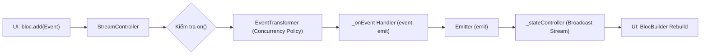

# Bài 2.2 — Kiến Trúc BLoC: Luồng Xử Lý Sự Kiện (Event-Driven), Concurrency & Event Transformers

## Dẫn Chiếu Tài Liệu Chính Thức
- **BLoC Core Concepts**: [bloclibrary.dev/#/coreconcepts?id=bloc](https://bloclibrary.dev/#/coreconcepts?id=bloc)
- **Bloc Concurrency Package**: [pub.dev/packages/bloc_concurrency](https://pub.dev/packages/bloc_concurrency)
- **RxDart Stream Transformers**: [pub.dev/packages/rxdart](https://pub.dev/packages/rxdart)
- **Dart Streams & Asynchronous Programming**: [dart.dev/tutorials/language/streams](https://dart.dev/tutorials/language/streams)

---

## Phần 1 — Khái Niệm & Mục Tiêu Bài Học

### 1.1 — Sự Khác Biệt Giữa Cubit Và BLoC

Trong bài trước, chúng ta đã tìm hiểu `Cubit` với cơ chế gọi hàm trực tiếp (`method call -> emit state`). Mặc dù tinh gọn và hiệu quả cho các bài toán thông thường, mô hình này bộc lộ giới hạn khi hệ thống đối mặt với các luồng tương tác phức tạp đòi hỏi kiểm soát sự kiện theo thời gian.

`BLoC` bổ sung một tầng trung gian có tính quyết định: **Sự Kiện (Events)**. Thay vì kích hoạt logic bằng một lời gọi hàm trực tiếp từ giao diện, giao diện chỉ đơn thuần phát xạ các sự kiện thể hiện hành động của người dùng (`add(Event)`). BLoC sẽ tiếp nhận các sự kiện này vào một hàng đợi phân tán, áp dụng các bộ biến đổi luồng (Event Transformers) và điều phối việc xử lý một cách tự động.

```
Mô hình Cubit:
[UI Widget] ─── calls method() ───> [Cubit Logic] ─── emit() ───> [New State]

Mô hình BLoC:
[UI Widget] ─── add(Event) ───> [Event Pipeline & Transformer] ───> [on<Event> Handler] ─── emit() ───> [New State]
```

### 1.2 — Giá Trị Cốt Lõi Của Tầng Sự Kiện (Event Layer)

1. **Khả năng kiểm soát xử lý đồng thời (Concurrency Control)**: Kiểm soát chặt chẽ thứ tự và hành vi khi nhiều sự kiện cùng xảy ra trong một khoảng thời gian ngắn (ví dụ: gõ phím tìm kiếm nhanh liên tục, bấm nút đặt hàng nhiều lần).
2. **Khả năng biến đổi luồng sự kiện (Event Transformation)**: Dễ dàng áp dụng các kỹ thuật phản ứng như Debounce (trì hoãn), Throttle (tiết lưu), hoặc Switch (hủy tác vụ cũ) trước khi sự kiện chạm tới logic xử lý.
3. **Lưu vết và kiểm toán (Audit Trail & Observability)**: Mọi tương tác của người dùng đều được biểu diễn dưới dạng các đối tượng dữ liệu cụ thể, giúp `BlocObserver` có thể ghi nhận lại toàn bộ lịch sử thao tác nhằm phục vụ gỡ lỗi hoặc phân tích hành vi.

### 1.3 — Mục Tiêu Kỹ Thuật Cần Đạt Được
- Nắm vững kiến trúc đường ống xử lý sự kiện (Event Processing Pipeline) trong BLoC.
- Hiểu rõ cơ chế của 4 chiến lược xử lý sự kiện đồng thời: `sequential`, `concurrent`, `droppable`, `restartable`.
- Quản lý vòng đời và cơ chế hủy bỏ (cancellation) của `Emitter<State>`.
- Định nghĩa hệ thống sự kiện và trạng thái phân cấp bằng Dart 3 `sealed class`.
- Lắng nghe và đồng bộ dữ liệu thời gian thực từ các luồng ngoại vi với phương thức `emit.forEach()`.

---

## Phần 2 — Cơ Chế Hoạt Động (Under the Hood)

### 2.1 — Đường Ống Xử Lý Sự Kiện (Event Processing Pipeline)

Khi phương thức `bloc.add(event)` được gọi từ giao diện:
1. Sự kiện được nạp vào một luồng `StreamController<Event>`.
2. BLoC kích hoạt bộ lắng nghe `on<E>()` đã được đăng ký cho kiểu sự kiện cụ thể tương ứng (`event is E`).
3. Sự kiện đi qua một hàm biến đổi `EventTransformer<E>` được chỉ định (hoặc mặc định là `sequential`).
4. Handler thực thi mã nguồn nghiệp vụ và phát xạ trạng thái mới thông qua đối tượng `Emitter<State>`.



### 2.2 — Bốn Chiến Lược Xử Lý Sự Kiện Đồng Thời (Concurrency Policies)

Mặc định, BLoC xử lý các sự kiện thuộc cùng một loại theo cơ chế tuần tự `sequential` (FIFO). Thông qua package `bloc_concurrency`, chúng ta có thể cấu hình các chính sách xử lý khác nhau:

| Chiến Lược | Toán Tử Reactive Tương Đương | Cơ Chế Hoạt Động | Kịch Bản Ứng Dụng Thực Tế |
| :--- | :--- | :--- | :--- |
| **`sequential`** *(Mặc định)* | `asyncExpand` | Xử lý lần lượt từng sự kiện. Sự kiện sau phải chờ sự kiện trước hoàn tất toàn bộ tiến trình. | Tác vụ thanh toán giao dịch, cập nhật số dư, ghi nhật ký tuần tự. |
| **`concurrent`** | `flatMap` | Xử lý song song tất cả các sự kiện cùng lúc khi chúng được thêm vào, không duy trì thứ tự kết thúc. | Tải nhiều tài nguyên độc lập cùng lúc (tải ảnh, lấy thông tin hồ sơ). |
| **`droppable`** | `exhaustMap` | Bỏ qua hoàn toàn các sự kiện mới nếu sự kiện trước đó vẫn đang trong quá trình thực thi. | Bấm nút Submit form, phân trang tải thêm dữ liệu (Pagination load more). |
| **`restartable`** | `switchMap` | Hủy bỏ (cancel) tác vụ đang xử lý của sự kiện trước đó và bắt đầu thực thi ngay sự kiện mới nhất. | Ô tìm kiếm gợi ý (Search-as-you-type), lọc danh sách theo bộ lọc mới. |

```mermaid
gantt
    title So Sánh Concurrency Policies Khi Nhận Event 1 Và Event 2 (Cách Nhau 100ms)
    dateFormat X
    axisFormat %s

    section Sequential
    Event 1 :active, 0, 400
    Event 2 : 400, 800

    section Concurrent
    Event 1 :active, 0, 400
    Event 2 : 100, 500

    section Droppable
    Event 1 :active, 0, 400
    Event 2 (Bị Hủy) :crit, 100, 101

    section Restartable
    Event 1 (Bị Hủy) :crit, 0, 100
    Event 2 :active, 100, 500
```



### 2.3 — Vòng Đời Và Cơ Chế Hoạt Động Của `Emitter<State>`

Trong một event handler `on<Event>((event, emit) async { ... })`:
- `Emitter` là một đối tượng trung gian được BLoC cung cấp cho từng phiên thực thi handler cụ thể.
- Thuộc tính `emit.isDone`: Trả về `true` khi tác vụ của sự kiện đó đã hoàn thành hoặc đã bị hủy bỏ bởi một Transformer (như `restartable`).
- Nếu một hàm bất đồng bộ cố tình gọi `emit()` khi `emit.isDone == true`, Flutter BLoC sẽ ném ra ngoại lệ `StateError: emit was called after an event handler completed normally`.
- Phương thức `emit.forEach<T>()`: Cho phép BLoC đăng ký lắng nghe một luồng dữ liệu bất đồng bộ bên ngoài (Stream), tự động quản lý việc giải phóng `StreamSubscription` khi handler bị hủy hoặc khi BLoC đóng.

---

## Phần 3 — Triển Khai Kỹ Thuật (Implementation Details)

### 3.1 — Mô Hình Hóa Sự Kiện Và Trạng Thái Với Dart 3 Sealed Classes

```dart
import 'package:flutter/foundation.dart';

// --- HỆ THỐNG SỰ KIỆN (EVENTS) ---
@immutable
sealed class SearchEvent {
  const SearchEvent();
}

/// Người dùng thay đổi ký tự trong ô tìm kiếm
final class SearchQueryChanged extends SearchEvent {
  final String query;
  const SearchQueryChanged(this.query);

  @override
  bool operator ==(Object other) =>
      identical(this, other) ||
      other is SearchQueryChanged && query == other.query;

  @override
  int get hashCode => query.hashCode;
}

/// Người dùng nhấn nút xóa nội dung tìm kiếm
final class SearchResetRequested extends SearchEvent {
  const SearchResetRequested();
}

/// Người dùng cuộn xuống đáy danh sách để tải thêm
final class SearchLoadMoreRequested extends SearchEvent {
  const SearchLoadMoreRequested();
}

// --- HỆ THỐNG TRẠNG THÁI (STATES) ---
@immutable
sealed class SearchState {
  const SearchState();
}

/// Trạng thái ban đầu, chưa nhập từ khóa
final class SearchInitial extends SearchState {
  const SearchInitial();
}

/// Trạng thái đang tải kết quả tìm kiếm mới
final class SearchLoading extends SearchState {
  final String query;
  const SearchLoading(this.query);
}

/// Trạng thái tìm kiếm thành công mang theo danh sách kết quả
final class SearchSuccess extends SearchState {
  final String query;
  final List<String> results;
  final bool hasReachedMax;

  const SearchSuccess({
    required this.query,
    required this.results,
    required this.hasReachedMax,
  });

  SearchSuccess copyWith({
    String? query,
    List<String>? results,
    bool? hasReachedMax,
  }) {
    return SearchSuccess(
      query: query ?? this.query,
      results: results ?? this.results,
      hasReachedMax: hasReachedMax ?? this.hasReachedMax,
    );
  }

  @override
  bool operator ==(Object other) =>
      identical(this, other) ||
      other is SearchSuccess &&
          query == other.query &&
          listEquals(results, other.results) &&
          hasReachedMax == other.hasReachedMax;

  @override
  int get hashCode => Object.hash(query, Object.hashAll(results), hasReachedMax);
}

/// Trạng thái xảy ra lỗi tìm kiếm
final class SearchFailure extends SearchState {
  final String query;
  final String errorMessage;

  const SearchFailure({
    required this.query,
    required this.errorMessage,
  });

  @override
  bool operator ==(Object other) =>
      identical(this, other) ||
      other is SearchFailure &&
          query == other.query &&
          errorMessage == other.errorMessage;

  @override
  int get hashCode => Object.hash(query, errorMessage);
}
```

### 3.2 — Cài Đặt BLoC Kết Hợp Event Transformers

Cài đặt `SearchBloc` xử lý sự kiện gõ phím với kỹ thuật Debounce và hủy tác vụ cũ thông qua `restartable()`, đồng thời áp dụng `droppable()` cho sự kiện tải thêm:

```dart
import 'dart:async';
import 'package:bloc_concurrency/bloc_concurrency.dart';
import 'package:flutter_bloc/flutter_bloc.dart';
import 'search_event.dart';
import 'search_state.dart';

/// Interface trừu tượng mô phỏng dịch vụ dữ liệu
abstract interface class SearchRepository {
  Future<List<String>> search(String query, {int offset = 0, int limit = 20});
  Stream<int> activeUserCountStream();
}

/// Tạo Custom Event Transformer kết hợp Debounce (trì hoãn thời gian) với restartable
EventTransformer<E> debounceRestartable<E>(Duration duration) {
  return (events, mapper) {
    // Trì hoãn sự kiện bằng Stream API tiêu chuẩn
    final debouncedStream = events.transform(
      StreamTransformer<E, E>.fromBind((stream) {
        Timer? timer;
        final controller = StreamController<E>.broadcast();

        stream.listen(
          (data) {
            timer?.cancel();
            timer = Timer(duration, () => controller.add(data));
          },
          onError: controller.addError,
          onDone: () {
            timer?.cancel();
            controller.close();
          },
        );

        return controller.stream;
      }),
    );
    // Áp dụng chính sách restartable (switchMap) lên luồng đã được debounce
    return restartable<E>().call(debouncedStream, mapper);
  };
}

class SearchBloc extends Bloc<SearchEvent, SearchState> {
  final SearchRepository _repository;

  SearchBloc({required SearchRepository repository})
      : _repository = repository,
        super(const SearchInitial()) {
    
    // 1. Xử lý tìm kiếm với Debounce 300ms và chính sách restartable
    on<SearchQueryChanged>(
      _onQueryChanged,
      transformer: debounceRestartable(const Duration(milliseconds: 300)),
    );

    // 2. Xử lý xóa từ khóa tìm kiếm (tuần tự)
    on<SearchResetRequested>(_onResetRequested);

    // 3. Xử lý tải thêm với chính sách droppable (chống spam cuộn trang)
    on<SearchLoadMoreRequested>(
      _onLoadMoreRequested,
      transformer: droppable(),
    );
  }

  Future<void> _onQueryChanged(
    SearchQueryChanged event,
    Emitter<SearchState> emit,
  ) async {
    final cleanQuery = event.query.trim();

    if (cleanQuery.isEmpty) {
      emit(const SearchInitial());
      return;
    }

    emit(SearchLoading(cleanQuery));

    try {
      final items = await _repository.search(cleanQuery, offset: 0, limit: 20);

      // Kiểm tra xem handler này có bị hủy bỏ bởi sự kiện mới hay không
      if (emit.isDone) return;

      emit(SearchSuccess(
        query: cleanQuery,
        results: items,
        hasReachedMax: items.length < 20,
      ));
    } catch (error) {
      if (!emit.isDone) {
        emit(SearchFailure(
          query: cleanQuery,
          errorMessage: 'Lỗi tìm kiếm: ${error.toString()}',
        ));
      }
    }
  }

  void _onResetRequested(
    SearchResetRequested event,
    Emitter<SearchState> emit,
  ) {
    emit(const SearchInitial());
  }

  Future<void> _onLoadMoreRequested(
    SearchLoadMoreRequested event,
    Emitter<SearchState> emit,
  ) async {
    final currentState = state;
    if (currentState is! SearchSuccess || currentState.hasReachedMax) return;

    try {
      final currentCount = currentState.results.length;
      final moreItems = await _repository.search(
        currentState.query,
        offset: currentCount,
        limit: 20,
      );

      emit(currentState.copyWith(
        results: [...currentState.results, ...moreItems],
        hasReachedMax: moreItems.length < 20,
      ));
    } catch (_) {
      // Trong kịch bản tải thêm thất bại, bảo lưu danh sách kết quả hiện tại
    }
  }
}
```

### 3.3 — Giao Diện Người Dùng Tích Hợp BLoC

```dart
import 'package:flutter/material.dart';
import 'package:flutter_bloc/flutter_bloc.dart';
import 'search_bloc.dart';
import 'search_event.dart';
import 'search_state.dart';

class SearchScreen extends StatefulWidget {
  const SearchScreen({super.key});

  @override
  State<SearchScreen> createState() => _SearchScreenState();
}

class _SearchScreenState extends State<SearchScreen> {
  final TextEditingController _textController = TextEditingController();
  final ScrollController _scrollController = ScrollController();

  @override
  void initState() {
    super.initState();
    _scrollController.addListener(_onScroll);
  }

  void _onScroll() {
    if (_isBottom) {
      context.read<SearchBloc>().add(const SearchLoadMoreRequested());
    }
  }

  bool get _isBottom {
    if (!_scrollController.hasClients) return false;
    final maxScroll = _scrollController.position.maxScrollExtent;
    final currentScroll = _scrollController.offset;
    return currentScroll >= (maxScroll * 0.9);
  }

  @override
  void dispose() {
    _textController.dispose();
    _scrollController.dispose();
    super.dispose();
  }

  @override
  Widget build(BuildContext context) {
    return Scaffold(
      appBar: AppBar(
        title: TextField(
          controller: _textController,
          decoration: InputDecoration(
            hintText: 'Nhập nội dung tìm kiếm...',
            border: InputBorder.none,
            suffixIcon: IconButton(
              icon: const Icon(Icons.clear),
              onPressed: () {
                _textController.clear();
                context.read<SearchBloc>().add(const SearchResetRequested());
              },
            ),
          ),
          onChanged: (text) {
            context.read<SearchBloc>().add(SearchQueryChanged(text));
          },
        ),
      ),
      body: BlocBuilder<SearchBloc, SearchState>(
        builder: (context, state) {
          return switch (state) {
            SearchInitial() => const Center(
                child: Text('Vui lòng nhập từ khóa để bắt đầu tìm kiếm'),
              ),
            SearchLoading(:final query) => Center(
                child: Column(
                  mainAxisAlignment: MainAxisAlignment.center,
                  children: [
                    const CircularProgressIndicator(),
                    const SizedBox(height: 16),
                    Text('Đang tra cứu "$query"...'),
                  ],
                ),
              ),
            SearchSuccess(:final results, :final hasReachedMax) =>
              results.isEmpty
                  ? const Center(child: Text('Không tìm thấy kết quả phù hợp'))
                  : ListView.builder(
                      controller: _scrollController,
                      itemCount: hasReachedMax ? results.length : results.length + 1,
                      itemBuilder: (context, index) {
                        if (index >= results.length) {
                          return const Center(
                            child: Padding(
                              padding: EdgeInsets.all(16.0),
                              child: CircularProgressIndicator(strokeWidth: 2),
                            ),
                          );
                        }
                        return ListTile(
                          leading: const Icon(Icons.article),
                          title: Text(results[index]),
                        );
                      },
                    ),
            SearchFailure(:final query, :final errorMessage) => Center(
                child: Column(
                  mainAxisAlignment: MainAxisAlignment.center,
                  children: [
                    Icon(Icons.error_outline, color: Theme.of(context).colorScheme.error, size: 48),
                    const SizedBox(height: 8),
                    Text('Tìm kiếm "$query" thất bại'),
                    Text(errorMessage, style: const TextStyle(color: Colors.grey)),
                  ],
                ),
              ),
          };
        },
      ),
    );
  }
}
```

---

## Phần 4 — Lỗi Kiến Trúc Thường Gặp & Biện Pháp Khắc Phục

### 4.1 — Gọi `emit()` Sau Khi Handler Bị Hủy Bỏ Bởi `restartable()`

#### Mô tả lỗi:
Khi áp dụng bộ biến đổi `restartable()`, nếu người dùng kích hoạt sự kiện mới trong lúc sự kiện trước đang đợi API, handler trước đó tiếp tục chạy và gọi `emit()`:

```dart
// Lỗi: Không kiểm tra trạng thái hủy của Emitter
on<SearchQueryChanged>(_onSearch, transformer: restartable());

Future<void> _onSearch(SearchQueryChanged event, Emitter<SearchState> emit) async {
  final data = await api.fetch(event.query);
  emit(SearchSuccess(data)); // Ném ra ngoại lệ: StateError: emit was called after an event handler completed
}
```

#### Nguyên nhân kỹ thuật:
Khi sự kiện mới xuất hiện, `restartable()` thực thi phép chuyển đổi `switchMap`, ngay lập tức hủy bỏ luồng xử lý của sự kiện trước đó. Đối tượng `Emitter` của sự kiện cũ chuyển sang trạng thái `emit.isDone == true`. Mọi hành động phát xạ tiếp theo của handler cũ bị coi là vi phạm và gây sập luồng.

#### Biện pháp khắc phục:
Luôn kiểm tra thuộc tính `emit.isDone` ngay sau các điểm chờ bất đồng bộ trước khi phát xạ:

```dart
// Khắc phục: Kiểm tra emit.isDone
Future<void> _onSearch(SearchQueryChanged event, Emitter<SearchState> emit) async {
  final data = await api.fetch(event.query);
  if (emit.isDone) return; // Hủy bỏ nếu sự kiện này đã bị ghi đè
  emit(SearchSuccess(data));
}
```

---

### 4.2 — Đăng Ký Trùng Lặp Nhiều Handler Cho Cùng Một Kiểu Sự Kiện

#### Mô tả lỗi:
Đăng ký hàm xử lý `on<MyEvent>()` nhiều hơn một lần trong cùng một lớp BLoC:

```dart
// Lỗi: Đăng ký hai handler cho cùng một Event type
class BrokenBloc extends Bloc<MyEvent, MyState> {
  BrokenBloc() : super(MyInitial()) {
    on<SubmitEvent>(_handleSubmit1);
    on<SubmitEvent>(_handleSubmit2); // Ném ra ngoại lệ StateError khi khởi tạo
  }
}
```

#### Nguyên nhân kỹ thuật:
Thư viện `bloc` quy định chặt chẽ: mỗi kiểu sự kiện chỉ được phép liên kết với duy nhất một handler. Quy tắc này nhằm ngăn chặn các xung đột trạng thái (race conditions) và đảm bảo tính dự đoán được (determinism) của luồng dữ liệu. Nếu phát hiện đăng ký trùng, BLoC sẽ ném ra ngoại lệ `StateError: on<SubmitEvent> was called multiple times`.

#### Biện pháp khắc phục:
Gộp chung các thao tác xử lý vào một handler duy nhất, hoặc phân chia thành các lớp sự kiện con độc lập nếu chúng phục vụ mục đích khác nhau:

```dart
// Khắc phục: Hợp nhất logic trong một handler duy nhất
class FixedBloc extends Bloc<MyEvent, MyState> {
  FixedBloc() : super(MyInitial()) {
    on<SubmitEvent>((event, emit) async {
      await _handleSubmitStep1(event, emit);
      await _handleSubmitStep2(event, emit);
    });
  }
}
```

---

### 4.3 — Quên Đăng Ký Handler Khiến Sự Kiện Bị Bỏ Qua Trong Im Lặng

#### Mô tả lỗi:
Tạo mới một lớp con của Event (ví dụ: `RefreshDataRequested`) và gọi `add(RefreshDataRequested())` từ UI, nhưng quên viết `on<RefreshDataRequested>` trong BLoC:

```dart
// Lỗi: Thiếu handler cho sự kiện con
sealed class AppEvent {}
final class LoadData extends AppEvent {}
final class RefreshData extends AppEvent {}

class AppBloc extends Bloc<AppEvent, AppState> {
  AppBloc() : super(AppInitial()) {
    on<LoadData>(_onLoadData);
    // Quên khai báo: on<RefreshData>(_onRefreshData);
  }
}
```

#### Nguyên nhân kỹ thuật:
Khi `add(event)` nhận một đối tượng không khớp với bất kỳ bộ lắng nghe `on<E>` nào, BLoC không ném lỗi ra UI mà đơn thuần bỏ qua sự kiện đó. Người dùng tương tác trên màn hình nhưng ứng dụng hoàn toàn không có phản hồi, gây khó khăn cho việc phát hiện nguyên nhân.

#### Biện pháp khắc phục:
Sử dụng Dart 3 Exhaustive Pattern Matching để rà soát danh sách sự kiện, đồng thời cấu hình `BlocObserver.onEvent` để giám sát xem mọi sự kiện phát ra có được tiếp nhận và xử lý hay không.

---

### 4.4 — Lạm Dụng Gọi `add(Event)` Bên Trong Chính Event Handler Của BLoC

#### Mô tả lỗi:
Gọi phương thức `add()` từ bên trong một hàm handler `_onEvent`:

```dart
// Lỗi: Phát xạ sự kiện vòng lặp từ trong handler
Future<void> _onFetch(FetchEvent event, Emitter<MyState> emit) async {
  try {
    final data = await api.get();
    emit(SuccessState(data));
  } catch (e) {
    add(RetryEvent()); // Kích hoạt sự kiện mới ngay trong handler
  }
}
```

#### Nguyên nhân kỹ thuật:
Việc kích hoạt sự kiện vòng lặp bên trong handler dễ tạo thành chuỗi đệ quy vô tận nếu gặp sự cố mạng kéo dài, làm nghẽn Event Loop và gây cạn kiệt bộ nhớ. Ngoài ra, việc này làm phân mảnh luồng logic, khiến cho việc kiểm thử Unit Test trở nên rất phức tạp.

#### Biện pháp khắc phục:
Xử lý trực tiếp các bước chuyển tiếp ngay trong phạm vi của handler, hoặc sử dụng vòng lặp kiểm soát hữu hạn:

```dart
// Khắc phục: Xử lý nội bộ có giới hạn số lần thử lại
Future<void> _onFetch(FetchEvent event, Emitter<MyState> emit) async {
  const maxRetries = 3;
  for (var attempt = 1; attempt <= maxRetries; attempt++) {
    try {
      final data = await api.get();
      emit(SuccessState(data));
      return;
    } catch (e) {
      if (attempt == maxRetries) {
        emit(FailureState(e.toString()));
      }
    }
  }
}
```

---

## Phần 5 — Khảo Sát Bản Chất Kỹ Thuật & Phân Tích Mã Nguồn (Deep-Dive & Code Tracing)

### 5.1 — Khảo Sát Bản Chất Kỹ Thuật

#### Câu hỏi 1: Tại sao `sequential()` sử dụng toán tử `asyncExpand` trong khi `concurrent()` sử dụng `flatMap`?
*Phân tích:*
- `asyncExpand` chuyển đổi mỗi phần tử của luồng nguồn thành một luồng con (Stream), và nó chỉ bắt đầu lắng nghe luồng con tiếp theo sau khi luồng con hiện tại đã hoàn toàn phát xạ xong tín hiệu `done`. Do đó, nó bảo đảm thứ tự tuần tự nghiêm ngặt (FIFO).
- `flatMap` (tương đương hợp nhất đa luồng) lắng nghe tất cả các luồng con phát sinh cùng một lúc mà không đợi luồng nào kết thúc. Các dữ liệu được đẩy ra ngay khi sẵn sàng, tạo ra tính chất xử lý song song không phụ thuộc thứ tự.

---

#### Câu hỏi 2: Điều gì xảy ra với các tác vụ HTTP Request đang chạy ngầm khi một handler bị hủy bỏ bởi `restartable()`?
*Phân tích:*
Khi `restartable()` kích hoạt `switchMap`, nó hủy bỏ quyền lắng nghe trên `StreamSubscription` của handler cũ và đánh dấu `emit.isDone = true`. Tuy nhiên, bản thân Dart Future (ví dụ: `http.get()`) không có cơ chế tự động hủy bỏ ở tầng socket nếu không được tích hợp `CancelToken` (như trong thư viện Dio). Yêu cầu mạng vẫn tiếp tục chạy ngầm trên hệ thống cho tới khi nhận phản hồi, nhưng kết quả trả về sẽ bị handler cũ bỏ qua và không thể phát xạ ra trạng thái mới.

---

#### Câu hỏi 3: Phương thức `emit.forEach<T>()` hoạt động như thế nào và có ưu điểm gì so với việc tự gọi `stream.listen()` trong handler?
*Phân tích:*
Nếu lập trình viên tự gọi `stream.listen()` bên trong handler:
1. Phải tự lưu trữ biến `StreamSubscription` và giải phóng thủ công khi BLoC đóng.
2. Dễ quên kiểm tra trạng thái hủy dẫn đến gọi `emit()` trái phép.
`emit.forEach<T>()` là một hàm tiện ích tích hợp sẵn của BLoC: nó nhận một `Stream<T>`, tự động bao bọc quá trình lắng nghe, chuyển đổi từng giá trị thành trạng thái thông qua callback `onData`, và tự động hủy bỏ subscription ngay khi handler kết thúc hoặc khi BLoC bị giải phóng (`close()`).

---

#### Câu hỏi 4: Khi nào nên sử dụng `droppable()` thay vì `restartable()`?
*Phân tích:*
- `restartable()` ưu tiên **giá trị mới nhất**, phù hợp cho các hành động mà kết quả của thao tác cũ không còn giá trị sử dụng (ví dụ: người dùng đang gõ tìm kiếm từ "flu" sang "flutter", kết quả của "flu" trở nên vô nghĩa).
- `droppable()` ưu tiên **thao tác đang diễn ra**, bỏ qua tất cả các thao tác tiếp theo cho đến khi thao tác hiện tại kết thúc. Kỹ thuật này bắt buộc phải áp dụng cho các hành vi mang tính tác động hệ thống hoặc thanh toán: ví dụ nút "Xác nhận đặt hàng" hoặc nút "Gửi dữ liệu biểu mẫu", nhằm ngăn chặn việc gửi nhiều yêu cầu trùng lặp lên máy chủ khi người dùng nhấp chuột liên tục.

---

#### Câu hỏi 5: Sự khác nhau về bản chất giữa `addError(error)` và `emit(FailureState(error))` trong BLoC là gì?
*Phân tích:*
- `emit(FailureState(error))` phát xạ một trạng thái UI mới ra `state` stream. Cây widget nhận diện được trạng thái này và tái dựng để hiển thị giao diện báo lỗi cho người dùng.
- `addError(error)` không trực tiếp thay đổi `state`. Nó đẩy lỗi vào luồng lỗi nội bộ của BLoC, kích hoạt callback `onError()` trên instance và `BlocObserver.onError()`. Cơ chế này được thiết kế chuyên biệt cho hệ thống giám sát, phân tích lỗi (như Firebase Crashlytics hoặc Sentry) mà không nhất thiết phải thay đổi giao diện đang hiển thị.

---

### 5.2 — Bài Tập Phân Tích Luồng Thực Thi (Code Tracing)

Xem xét kịch bản sau: `SearchBloc` sử dụng bộ biến đổi `debounce(300ms)` kết hợp `restartable()`. Thời gian phản hồi giả định của API tìm kiếm là `200ms`.

Người dùng thực hiện các thao tác nhập liệu sau trên dòng thời gian:
- **T = 0ms**: Nhập ký tự `'a'` $\to$ `add(SearchQueryChanged('a'))`
- **T = 100ms**: Nhập thêm ký tự `'b'` $\to$ `add(SearchQueryChanged('ab'))`
- **T = 250ms**: Nhập thêm ký tự `'c'` $\to$ `add(SearchQueryChanged('abc'))`
- Sau mốc 250ms, người dùng dừng gõ.

#### Phân tích luồng thực thi:

1. **Tại T = 0ms (`'a'`)**:
   - Bộ đếm thời gian Debounce (300ms) được kích hoạt cho sự kiện `'a'`. Dự kiến bắn sự kiện vào handler lúc $T = 300ms$.
2. **Tại T = 100ms (`'ab'`)**:
   - Sự kiện `'ab'` xuất hiện trước khi bộ đếm 300ms của `'a'` hết hạn.
   - Bộ đếm cũ bị hủy bỏ. Bộ đếm 300ms mới được kích hoạt cho `'ab'`. Dự kiến bắn vào handler lúc $T = 100 + 300 = 400ms$.
3. **Tại T = 250ms (`'abc'`)**:
   - Sự kiện `'abc'` xuất hiện trước khi bộ đếm của `'ab'` hết hạn (chỉ mới trôi qua 150ms).
   - Bộ đếm cũ bị hủy bỏ. Bộ đếm 300ms mới được kích hoạt cho `'abc'`. Dự kiến bắn vào handler lúc $T = 250 + 300 = 550ms$.
4. **Tại T = 550ms**:
   - Không có sự kiện mới nào xuất hiện trong khoảng 300ms.
   - Bộ đếm Debounce hoàn tất! Sự kiện `'abc'` chính thức được chuyển tới handler `_onQueryChanged`.
   - BLoC phát xạ: `emit(SearchLoading('abc'))`.
   - Bắt đầu gọi API: `api.search('abc')` (mất 200ms).
5. **Tại T = 750ms**:
   - API trả về kết quả cho từ khóa `'abc'`.
   - `emit.isDone` vẫn là `false`.
   - BLoC phát xạ: `emit(SearchSuccess(query: 'abc', ...))`.

#### Kết luận kết quả phát xạ:
- Các sự kiện `'a'` và `'ab'` bị triệt tiêu hoàn toàn bởi bộ lọc Debounce; không có bất kỳ API request nào được gửi đi cho 2 từ khóa này.
- Toàn bộ chu trình chỉ gửi duy nhất 1 yêu cầu mạng cho từ khóa `'abc'`.
- Trình tự chuyển đổi trạng thái ghi nhận trên `BlocObserver`:
  1. `SearchInitial -> SearchLoading('abc')` (tại T = 550ms)
  2. `SearchLoading('abc') -> SearchSuccess('abc')` (tại T = 750ms)
