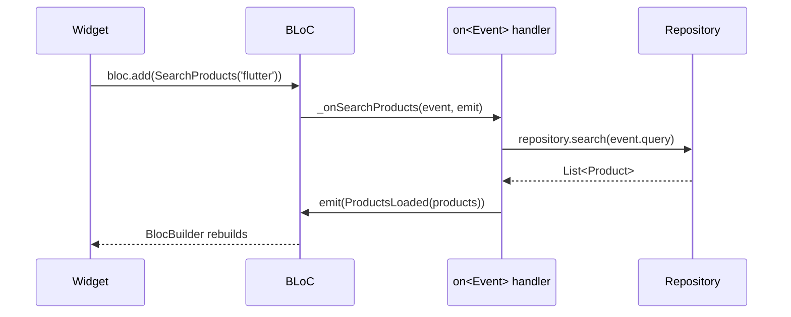

# Bài 2.2 — BLoC: Events & States

## Phần 1 — Khái Niệm & Mục Tiêu Bài Học

### Tại sao cần BLoC khi đã có Cubit?

Cubit: `method call → emit state` — đơn giản, đủ cho 80% use cases.

BLoC thêm một layer trung gian — **Events**:

```
Cubit: Widget → cubit.increment() → emit()
BLoC:  Widget → add(IncrementPressed()) → on<IncrementPressed> → emit()
```

Layer Event cho phép:
- **Debounce, throttle** một event cụ thể (search as you type)
- **Log/audit trail** rõ ràng: biết chính xác action nào trigger state change
- **Transform events** (Advanced BLoC — droppable, restartable)

### Bạn sẽ hiểu được sau bài này:
- Sự khác biệt Cubit vs BLoC — khi nào dùng cái nào
- Event class hierarchy với sealed class
- `on<Event>()` handler pattern
- `EventTransformer` cơ bản: sequential (default), concurrent

---

## Phần 2 — Cơ Chế Hoạt Động (Under the Hood)

### BLoC Internal Flow



### Cubit vs BLoC — Khi nào dùng cái nào

| Tiêu chí | Cubit | BLoC |
|---|---|---|
| Complexity | Đơn giản | Phức tạp hơn nhưng flexible |
| Traceability | Method name | Event object (log-able) |
| Event transform | Không có | Có (debounce, throttle) |
| Dùng khi | Counter, toggle, simple forms | Search, pagination, websocket |

---

## Phần 3 — Code Mẫu Chuẩn Google

### 3.1 — Search BLoC với Events & States

```dart
// --- EVENTS ---
sealed class SearchEvent {}

final class SearchQueryChanged extends SearchEvent {
  final String query;
  const SearchQueryChanged(this.query);
}

final class SearchCleared extends SearchEvent {}

final class SearchLoadMore extends SearchEvent {}

// --- STATES ---
sealed class SearchState {}

final class SearchInitial extends SearchState {}

final class SearchLoading extends SearchState {
  final String query;
  const SearchLoading(this.query);
}

final class SearchSuccess extends SearchState {
  final List<Product> results;
  final String query;
  final bool hasMore;

  const SearchSuccess({
    required this.results,
    required this.query,
    this.hasMore = false,
  });

  SearchSuccess copyWith({List<Product>? results, bool? hasMore}) {
    return SearchSuccess(
      results: results ?? this.results,
      query: query,
      hasMore: hasMore ?? this.hasMore,
    );
  }
}

final class SearchError extends SearchState {
  final String message;
  final String query;
  const SearchError({required this.message, required this.query});
}

// --- BLOC ---
class SearchBloc extends Bloc<SearchEvent, SearchState> {
  final ProductRepository _repository;

  SearchBloc(this._repository) : super(SearchInitial()) {
    // Đăng ký handler cho từng event type
    on<SearchQueryChanged>(
      _onQueryChanged,
      // transformer: debounce — chờ 300ms sau lần gõ cuối
      transformer: (events, mapper) => events
          .debounceTime(const Duration(milliseconds: 300))
          .switchMap(mapper),
    );
    on<SearchCleared>(_onCleared);
    on<SearchLoadMore>(_onLoadMore);
  }

  Future<void> _onQueryChanged(
    SearchQueryChanged event,
    Emitter<SearchState> emit,
  ) async {
    if (event.query.trim().isEmpty) {
      emit(SearchInitial());
      return;
    }

    emit(SearchLoading(event.query));

    try {
      final results = await _repository.search(event.query);
      emit(SearchSuccess(results: results, query: event.query, hasMore: results.length >= 20));
    } on NetworkException catch (e) {
      emit(SearchError(message: e.message, query: event.query));
    } catch (e) {
      emit(SearchError(message: 'Lỗi không xác định', query: event.query));
    }
  }

  void _onCleared(SearchCleared event, Emitter<SearchState> emit) {
    emit(SearchInitial());
  }

  Future<void> _onLoadMore(
    SearchLoadMore event,
    Emitter<SearchState> emit,
  ) async {
    final currentState = state;
    if (currentState is! SearchSuccess || !currentState.hasMore) return;

    try {
      final moreResults = await _repository.search(
        currentState.query,
        offset: currentState.results.length,
      );
      emit(currentState.copyWith(
        results: [...currentState.results, ...moreResults],
        hasMore: moreResults.length >= 20,
      ));
    } catch (_) {
      // Load more failure: giữ nguyên state hiện tại, không emit error
    }
  }
}
```

### 3.2 — UI với BlocProvider + BlocBuilder

```dart
class SearchScreen extends StatelessWidget {
  const SearchScreen({super.key});

  @override
  Widget build(BuildContext context) {
    return BlocProvider(
      create: (context) => SearchBloc(context.read<ProductRepository>()),
      child: const _SearchView(),
    );
  }
}

class _SearchView extends StatefulWidget {
  const _SearchView();
  @override State<_SearchView> createState() => _SearchViewState();
}

class _SearchViewState extends State<_SearchView> {
  final _controller = TextEditingController();

  @override
  void dispose() {
    _controller.dispose();
    super.dispose();
  }

  @override
  Widget build(BuildContext context) {
    return Scaffold(
      appBar: AppBar(
        title: TextField(
          controller: _controller,
          decoration: const InputDecoration(hintText: 'Tìm kiếm...'),
          onChanged: (query) =>
              context.read<SearchBloc>().add(SearchQueryChanged(query)),
        ),
        actions: [
          IconButton(
            icon: const Icon(Icons.clear),
            onPressed: () {
              _controller.clear();
              context.read<SearchBloc>().add(SearchCleared());
            },
          ),
        ],
      ),
      body: BlocBuilder<SearchBloc, SearchState>(
        builder: (context, state) => switch (state) {
          SearchInitial() => const Center(child: Text('Nhập để tìm kiếm')),
          SearchLoading(:final query) => Center(
              child: Column(
                mainAxisAlignment: MainAxisAlignment.center,
                children: [
                  const CircularProgressIndicator(),
                  const SizedBox(height: 8),
                  Text('Đang tìm "$query"...'),
                ],
              ),
            ),
          SearchSuccess(:final results, :final query, :final hasMore) =>
            _ResultList(results: results, query: query, hasMore: hasMore),
          SearchError(:final message, :final query) =>
            Center(child: Text('Lỗi tìm "$query": $message')),
        },
      ),
    );
  }
}
```

---

## Phần 4 — Lỗi Sai Phổ Biến & Best Practices

### ❌ Anti-pattern 1: Logic trong Widget thay vì BLoC

```dart
// ❌ Logic search trong widget — không testable, khó maintain
class _SearchViewState extends State<SearchView> {
  List<Product> _results = [];
  bool _loading = false;

  Future<void> _search(String query) async {
    setState(() => _loading = true);
    _results = await repository.search(query);
    setState(() => _loading = false);
  }
}

// ✅ Logic trong BLoC — widget chỉ dispatch events và render state
onChanged: (query) => context.read<SearchBloc>().add(SearchQueryChanged(query)),
```

### ❌ Anti-pattern 2: Quên đăng ký event handler

```dart
// ❌ Event được add nhưng không có handler → BLoC ignore silently
class MyBloc extends Bloc<MyEvent, MyState> {
  MyBloc() : super(MyInitial()) {
    on<EventA>(_onEventA);
    // Quên đăng ký EventB!
  }
  // add(EventB()) → không làm gì cả
}

// ✅ Đảm bảo tất cả Event subclass đều có handler
on<EventA>(_onEventA);
on<EventB>(_onEventB);
on<EventC>(_onEventC);
```

---

## Phần 5 — Bài Tập Củng Cố Tư Duy

### Challenge: Paginated Product List BLoC

**Yêu cầu:**
1. Events: `LoadProducts`, `LoadMoreProducts`, `RefreshProducts`
2. State: `ProductsInitial | ProductsLoading | ProductsLoaded(products, page, hasMore) | ProductsError`
3. `LoadMore`: nối thêm vào list hiện tại
4. `Refresh`: reset về page 1, emit loading rồi loaded
5. Error không xóa list cũ — chỉ hiện snackbar

### Thử thách thẩm định kỹ thuật:

1. **"BLoC vs Cubit — kiến trúc nào bạn ưu tiên và tại sao?"**
   - BLoC khi cần event transformation, audit trail, phức tạp
   - Cubit khi logic đơn giản, giảm boilerplate

2. **"Emitter<State> trong handler khác gì với Cubit.emit()?"**
   - `Emitter` trong BLoC handler là async-aware — `await emit.forEach(stream, ...)` để listen stream
   - Cubit.emit() là sync call
