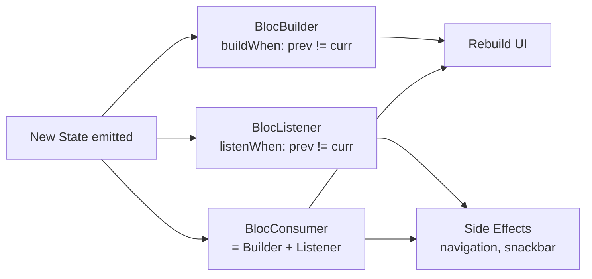

# Bài 2.3 — BlocBuilder, BlocListener & BlocConsumer

## Phần 1 — Khái Niệm & Mục Tiêu Bài Học

### Tại sao bài này quan trọng?

BLoC package cung cấp 3 widget để consume state — mỗi widget có mục đích khác nhau:

| Widget | Mục đích |
|--------|---------|
| `BlocBuilder` | Rebuild UI khi state thay đổi |
| `BlocListener` | Side effects: navigate, show snackbar, dialog |
| `BlocConsumer` | Kết hợp cả hai |

Nhầm lẫn giữa 3 widget này là bug phổ biến nhất khi mới học BLoC.

### Bạn sẽ hiểu được sau bài này:
- Khi nào dùng Builder vs Listener vs Consumer
- `buildWhen` và `listenWhen` để filter state changes
- `context.watch<Bloc>()` — shorthand của BlocBuilder
- `context.select<Bloc, T>()` — fine-grained rebuild

---

## Phần 2 — Cơ Chế Hoạt Động (Under the Hood)

### So sánh 3 widget



**Rule of thumb:**
- Navigation, SnackBar, Dialog → `BlocListener`
- Widget rebuild → `BlocBuilder`
- Cả hai → `BlocConsumer`

---

## Phần 3 — Code Mẫu Chuẩn Google

### 3.1 — BlocListener cho side effects

```dart
// Login screen: rebuild form (Builder) + navigate khi login thành công (Listener)
class LoginScreen extends StatelessWidget {
  const LoginScreen({super.key});

  @override
  Widget build(BuildContext context) {
    return BlocProvider(
      create: (_) => LoginBloc(context.read<AuthRepository>()),
      child: const _LoginView(),
    );
  }
}

class _LoginView extends StatelessWidget {
  const _LoginView();

  @override
  Widget build(BuildContext context) {
    return BlocListener<LoginBloc, LoginState>(
      // listenWhen: chỉ react khi status thay đổi
      listenWhen: (prev, curr) => prev.status != curr.status,
      listener: (context, state) {
        switch (state.status) {
          case LoginStatus.success:
            // Navigation là side effect → dùng Listener
            Navigator.pushReplacementNamed(context, '/home');
          case LoginStatus.failure:
            ScaffoldMessenger.of(context).showSnackBar(
              SnackBar(
                content: Text(state.errorMessage ?? 'Đăng nhập thất bại'),
                backgroundColor: Theme.of(context).colorScheme.error,
              ),
            );
          case LoginStatus.initial || LoginStatus.loading:
            break;
        }
      },
      child: Scaffold(
        body: BlocBuilder<LoginBloc, LoginState>(
          // buildWhen: chỉ rebuild form khi field hoặc loading thay đổi
          buildWhen: (prev, curr) =>
              prev.isLoading != curr.isLoading ||
              prev.emailError != curr.emailError ||
              prev.passwordError != curr.passwordError,
          builder: (context, state) => _LoginForm(state: state),
        ),
      ),
    );
  }
}
```

### 3.2 — BlocConsumer khi cần cả hai

```dart
// Delete confirmation: builder render button + listener show snackbar sau khi xóa
class ProductDetailScreen extends StatelessWidget {
  final Product product;
  const ProductDetailScreen({super.key, required this.product});

  @override
  Widget build(BuildContext context) {
    return BlocConsumer<ProductBloc, ProductState>(
      listenWhen: (prev, curr) => prev.deleteStatus != curr.deleteStatus,
      listener: (context, state) {
        if (state.deleteStatus == DeleteStatus.success) {
          ScaffoldMessenger.of(context).showSnackBar(
            const SnackBar(content: Text('Đã xóa sản phẩm')),
          );
          Navigator.pop(context); // Navigate back sau khi xóa
        } else if (state.deleteStatus == DeleteStatus.failure) {
          ScaffoldMessenger.of(context).showSnackBar(
            SnackBar(
              content: Text('Lỗi: ${state.errorMessage}'),
              backgroundColor: Theme.of(context).colorScheme.error,
            ),
          );
        }
      },
      buildWhen: (prev, curr) => prev.deleteStatus != curr.deleteStatus,
      builder: (context, state) {
        return Scaffold(
          appBar: AppBar(
            title: Text(product.name),
            actions: [
              if (state.deleteStatus == DeleteStatus.loading)
                const Padding(
                  padding: EdgeInsets.all(12),
                  child: SizedBox(
                    width: 24,
                    height: 24,
                    child: CircularProgressIndicator(strokeWidth: 2),
                  ),
                )
              else
                IconButton(
                  icon: const Icon(Icons.delete),
                  onPressed: () {
                    context.read<ProductBloc>().add(DeleteProduct(product.id));
                  },
                ),
            ],
          ),
          body: ProductDetailBody(product: product),
        );
      },
    );
  }
}
```

### 3.3 — context.watch và context.select

```dart
// context.watch — shorthand của BlocBuilder (rebuild khi bất kỳ state thay đổi)
// Chỉ dùng trong build() method
Widget build(BuildContext context) {
  final state = context.watch<CounterCubit>().state;
  return Text('${state.count}');
}

// context.select — fine-grained: chỉ rebuild khi selector value thay đổi
Widget build(BuildContext context) {
  // Chỉ rebuild khi count thay đổi (không rebuild khi isLoading thay đổi)
  final count = context.select<CounterCubit, int>((cubit) => cubit.state.count);
  return Text('$count');
}

// context.read — không rebuild, chỉ gọi method
ElevatedButton(
  onPressed: () => context.read<CounterCubit>().increment(),
  child: const Text('+'),
)
```

### 3.4 — MultiBlocProvider và MultiBlocListener

```dart
// Nhiều BLoC/Cubit trong cùng subtree
class App extends StatelessWidget {
  @override
  Widget build(BuildContext context) {
    return MultiBlocProvider(
      providers: [
        BlocProvider(create: (_) => AuthBloc(context.read<AuthRepository>())),
        BlocProvider(create: (_) => CartCubit(context.read<CartRepository>())),
        BlocProvider(create: (_) => ThemeCubit()),
      ],
      child: MultiBlocListener(
        listeners: [
          BlocListener<AuthBloc, AuthState>(
            listener: (context, state) {
              if (state is AuthUnauthenticated) {
                Navigator.pushNamedAndRemoveUntil(context, '/login', (_) => false);
              }
            },
          ),
        ],
        child: const AppNavigator(),
      ),
    );
  }
}
```

---

## Phần 4 — Lỗi Sai Phổ Biến & Best Practices

### ❌ Anti-pattern 1: Navigation trong BlocBuilder

```dart
// ❌ NGUY HIỂM: Navigation trong builder → rebuild → navigate lại → loop!
BlocBuilder<LoginBloc, LoginState>(
  builder: (context, state) {
    if (state.isSuccess) {
      Navigator.push(context, ...); // ❌ Gọi mỗi lần rebuild!
    }
    return LoginForm();
  },
)

// ✅ Navigation trong BlocListener — chỉ gọi một lần khi state thay đổi
BlocListener<LoginBloc, LoginState>(
  listenWhen: (prev, curr) => !prev.isSuccess && curr.isSuccess,
  listener: (context, state) => Navigator.push(context, ...),
  child: const LoginForm(),
)
```

### ❌ Anti-pattern 2: Quên listenWhen/buildWhen

```dart
// ❌ Mỗi state emit → listener chạy lại kể cả khi không cần
BlocListener<AuthBloc, AuthState>(
  listener: (context, state) {
    if (state.isLoggedOut) Navigator.pushNamedAndRemoveUntil(context, '/login', (_) => false);
    // Nhưng listener này trigger cho MỌI state thay đổi, kể cả loading!
  },
)

// ✅ listenWhen để chỉ react khi cần
BlocListener<AuthBloc, AuthState>(
  listenWhen: (prev, curr) => !prev.isLoggedOut && curr.isLoggedOut,
  listener: (context, state) => Navigator.pushNamedAndRemoveUntil(...),
)
```

---

## Phần 5 — Bài Tập Củng Cố Tư Duy

### Challenge: Cart Screen

**Yêu cầu:**
1. `CartCubit` với states: loading, loaded(items, total), error
2. `BlocBuilder`: hiển thị danh sách items + tổng tiền
3. `BlocListener`: khi checkout thành công → navigate đến OrderConfirmation
4. `BlocListener`: khi có lỗi → hiện SnackBar (không navigate)
5. `context.select` chỉ rebuild `TotalWidget` khi total thay đổi

### Câu hỏi phỏng vấn:

1. **"Tại sao không dùng BlocBuilder cho navigation?"**
   - Builder có thể chạy nhiều lần cho cùng một state (Flutter schedule rebuild)
   - Listener chỉ chạy khi state thực sự thay đổi (prev != curr)

2. **"context.watch vs BlocBuilder — khi nào dùng cái nào?"**
   - `context.watch`: nhanh, ngắn gọn — nhưng rebuild cả widget build()
   - `BlocBuilder`: scope rebuild nhỏ hơn — chỉ rebuild phần nằm trong builder
