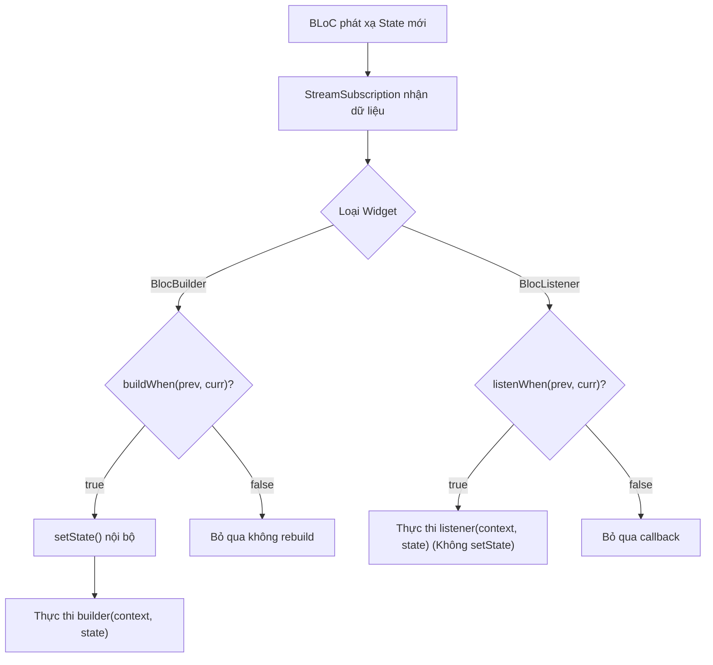

# Bài 2.3 — Tối Ưu Giao Diện Với BlocBuilder, BlocListener, BlocConsumer & BlocSelector

## Dẫn Chiếu Tài Liệu Chính Thức
- **Flutter Bloc Core Concepts**: [bloclibrary.dev/#/flutterbloccoreconcepts](https://bloclibrary.dev/#/flutterbloccoreconcepts)
- **BlocBuilder Class Reference**: [pub.dev/documentation/flutter_bloc/latest/flutter_bloc/BlocBuilder-class.html](https://pub.dev/documentation/flutter_bloc/latest/flutter_bloc/BlocBuilder-class.html)
- **InheritedWidget & BuildContext Extensions**: [api.flutter.dev/flutter/widgets/InheritedWidget-class.html](https://api.flutter.dev/flutter/widgets/InheritedWidget-class.html)
- **Flutter Widget Rebuild Optimization**: [docs.flutter.dev/perf/rendering/best-practices](https://docs.flutter.dev/perf/rendering/best-practices)

---

## Phần 1 — Khái Niệm & Mục Tiêu Bài Học

### 1.1 — Phân Định Ranh Giới: Tái Dựng Giao Diện Và Tác Vụ Phụ

Trong lập trình giao diện người dùng khai báo (Declarative UI), việc trộn lẫn giữa hành vi vẽ lại giao diện (Rebuilding UI) và hành vi thực thi tác vụ phụ (Side-Effects) là nguyên nhân hàng đầu gây ra các lỗi rò rỉ bộ nhớ, treo ứng dụng hoặc kích hoạt lặp vô hạn các hộp thoại:

- **Tái dựng giao diện (UI Rebuilding)**: Là một phép toán thuần túy (idempotent operation). Phương thức `build()` có thể được Flutter Engine gọi lại nhiều lần trong một khung hình (frame) khi có sự thay đổi về layout, focus hoặc theme. Quá trình này chỉ được phép trả về cây widget mô tả giao diện, tuyệt đối không được kích hoạt các hành vi mệnh lệnh (imperative calls).
- **Tác vụ phụ (Side-Effects)**: Là các hành vi mệnh lệnh một chiều cần được thực thi chính xác **một lần duy nhất** khi một trạng thái cụ thể xuất hiện (ví dụ: hiển thị `SnackBar`, bật `AlertDialog`, điều hướng `Navigator.push`, hoặc ghi nhận sự kiện analytics).

Thư viện `flutter_bloc` cung cấp một bộ công cụ phân tầng rõ rệt nhằm giải quyết triệt để sự phân định này:

| Widget | Mục Đích Cốt Lõi | Kích Hoạt `setState()` Nội Bộ? | Kịch Bản Ứng Dụng |
| :--- | :--- | :---: | :--- |
| **`BlocBuilder`** | Dựng lại một phần cây widget theo trạng thái mới. | **Có** (chỉ cho subtree con) | Hiển thị danh sách, nút bấm, vòng quay tải dữ liệu. |
| **`BlocListener`** | Thực thi tác vụ phụ một lần duy nhất khi trạng thái đổi. | **Không** | Điều hướng màn hình, mở Dialog, thông báo lỗi. |
| **`BlocConsumer`** | Kết hợp cả dựng lại giao diện và xử lý tác vụ phụ. | **Có** (chỉ cho phần builder) | Màn hình có biểu mẫu cần vừa đổi trạng thái nút bấm, vừa điều hướng khi thành công. |
| **`BlocSelector`** | Lọc và chỉ tái dựng khi một trường dữ liệu con thay đổi. | **Có** (khi giá trị trích xuất đổi) | Tối ưu hóa hiệu năng danh sách, theo dõi một trường số lượng trong giỏ hàng lớn. |

### 1.2 — Mục Tiêu Kỹ Thuật Cần Đạt Được
- Nắm vững kiến trúc vòng đời và cơ chế đăng ký `StreamSubscription` bên trong `BlocBuilderBase`.
- Phân biệt bản chất và cách sử dụng chuẩn xác của 3 phương thức mở rộng: `context.read()`, `context.watch()`, và `context.select()`.
- Kiểm soát phạm vi tái dựng (Rebuild Scope) tối thiểu thông qua `buildWhen` và `BlocSelector`.
- Tổ chức cây ứng dụng quy mô lớn một cách gọn gàng với `MultiBlocProvider` và `MultiBlocListener`.

---

## Phần 2 — Cơ Chế Hoạt Động (Under the Hood)

### 2.1 — Cơ Chế Đăng Ký Stream Nội Bộ Trong `BlocBuilderBase`

Cả `BlocBuilder`, `BlocListener` và `BlocConsumer` đều được xây dựng trên nền tảng lớp cơ sở `StatefulWidget` chuyên biệt:

1. **Khởi tạo (`initState`)**: State nội bộ trích xuất instance BLoC/Cubit (thông qua tham số `bloc` truyền vào hoặc tìm kiếm từ `context.read<B>()`) và bắt đầu đăng ký một `StreamSubscription` lắng nghe `bloc.stream`.
2. **Tiếp nhận chuyển đổi (`_handleChange`)**: Mỗi khi BLoC phát xạ một trạng thái mới:
   - Trong `BlocBuilder`: Đánh giá điều kiện `buildWhen?.call(_previousState, _currentState) ?? true`. Nếu trả về `true`, widget gọi `setState()` nội bộ để yêu cầu Flutter Render Pipeline đưa subtree của hàm `builder` vào danh sách cần dựng lại.
   - Trong `BlocListener`: Đánh giá điều kiện `listenWhen?.call(_previousState, _currentState) ?? true`. Nếu trả về `true`, widget gọi hàm callback `listener(context, _currentState)`. Quá trình này **hoàn toàn không gọi `setState()`**.
3. **Cập nhật widget (`didUpdateWidget`)**: Nếu widget cha tái cấu trúc dẫn đến instance của BLoC thay đổi, lớp cơ sở sẽ tự động hủy subscription cũ và thiết lập subscription mới cho BLoC mới.
4. **Giải phóng (`dispose`)**: Hủy đăng ký `_subscription.cancel()` an toàn để tránh rò rỉ bộ nhớ.



### 2.2 — So Sánh Chi Tiết Các Phương Thức Mở Rộng Trên `BuildContext`

Package `flutter_bloc` (dựa trên package `provider`) bổ sung 3 extension methods quan trọng trên `BuildContext`:

```
                    ┌────────────────────────┐
                    │ BuildContext Extension │
                    └───────────┬────────────┘
         ┌──────────────────────┼──────────────────────┐
         ▼                      ▼                      ▼
┌──────────────────┐  ┌──────────────────┐  ┌──────────────────────┐
│  context.read    │  │  context.watch   │  │    context.select    │
└────────┬─────────┘  └────────┬─────────┘  └──────────┬───────────┘
         │                     │                       │
Tìm kiếm tham chiếu   Đăng ký phụ thuộc      Lọc trường dữ liệu
   (Không rebuild)     (Rebuild toàn bộ)      (Rebuild có điều kiện)
```

1. **`context.read<T>()`**:
   - Sử dụng `InheritedElement.getElementForInheritedWidgetOfExactType()`.
   - **Đặc tính**: Tìm kiếm đối tượng $T$ gần nhất ngược lên gốc cây phần tử với độ phức tạp $O(1)$. **Không đăng ký bất kỳ liên kết phụ thuộc nào**.
   - **Phạm vi sử dụng**: Chỉ dùng trong các hàm callback phản hồi sự kiện (`onPressed`, `onTap`, timers). Tuyệt đối không dùng trực tiếp trong thân phương thức `build()` để đọc dữ liệu hiển thị.

2. **`context.watch<T>()`**:
   - Sử dụng `InheritedElement.dependOnInheritedWidgetOfExactType()`.
   - **Đặc tính**: Tìm kiếm đối tượng $T$ và đăng ký widget gọi nó vào danh sách `dependents`. Khi $T$ phát xạ bất kỳ trạng thái nào, **toàn bộ widget hiện tại sẽ bị gọi lại phương thức `build()`**.
   - **Phạm vi sử dụng**: Sử dụng trong thân phương thức `build()` của các widget con tinh gọn, nơi toàn bộ giao diện của widget đó đều cần cập nhật theo trạng thái mới.

3. **`context.select<T, R>(R Function(T state) selector)`**:
   - **Đặc tính**: Đăng ký liên kết phụ thuộc thông qua một hàm trích xuất giá trị $R$. Widget chỉ bị đánh dấu là bẩn (`dirty`) và vẽ lại khi giá trị $R$ của trạng thái mới khác biệt so với giá trị $R$ của trạng thái trước đó (dựa trên phép so sánh `==`).
   - **Phạm vi sử dụng**: Tối ưu hóa cục bộ trong phương thức `build()` mà không cần bọc thêm một widget `BlocSelector` riêng biệt.

---

## Phần 3 — Triển Khai Kỹ Thuật (Implementation Details)

### 3.1 — Mô Hình Hóa Trạng Thái Giỏ Hàng Thương Mại Điện Tử

```dart
import 'package:flutter/foundation.dart';

@immutable
class CartItem {
  final String id;
  final String name;
  final double price;
  final int quantity;

  const CartItem({
    required this.id,
    required this.name,
    required this.price,
    required this.quantity,
  });

  @override
  bool operator ==(Object other) =>
      identical(this, other) ||
      other is CartItem && id == other.id && quantity == other.quantity;

  @override
  int get hashCode => Object.hash(id, quantity);
}

enum CheckoutStatus { initial, processing, success, failure }

@immutable
class CartState {
  final List<CartItem> items;
  final CheckoutStatus checkoutStatus;
  final String? errorMessage;

  const CartState({
    this.items = const [],
    this.checkoutStatus = CheckoutStatus.initial,
    this.errorMessage,
  });

  double get totalPrice =>
      items.fold(0, (sum, item) => sum + (item.price * item.quantity));

  int get totalItemCount =>
      items.fold(0, (sum, item) => sum + item.quantity);

  CartState copyWith({
    List<CartItem>? items,
    CheckoutStatus? checkoutStatus,
    String? errorMessage,
  }) {
    return CartState(
      items: items ?? this.items,
      checkoutStatus: checkoutStatus ?? this.checkoutStatus,
      errorMessage: errorMessage ?? this.errorMessage,
    );
  }

  @override
  bool operator ==(Object other) =>
      identical(this, other) ||
      other is CartState &&
          listEquals(items, other.items) &&
          checkoutStatus == other.checkoutStatus &&
          errorMessage == other.errorMessage;

  @override
  int get hashCode => Object.hash(
        Object.hashAll(items),
        checkoutStatus,
        errorMessage,
      );
}
```

### 3.2 — Cài Đặt Cubit Quản Lý Giỏ Hàng

```dart
import 'package:flutter_bloc/flutter_bloc.dart';
import 'cart_state.dart';

class CartCubit extends Cubit<CartState> {
  CartCubit() : super(const CartState());

  void addItem(CartItem item) {
    final existingIndex = state.items.indexWhere((i) => i.id == item.id);
    List<CartItem> updatedList;

    if (existingIndex >= 0) {
      updatedList = List.of(state.items);
      final current = updatedList[existingIndex];
      updatedList[existingIndex] = CartItem(
        id: current.id,
        name: current.name,
        price: current.price,
        quantity: current.quantity + 1,
      );
    } else {
      updatedList = [...state.items, item];
    }

    emit(state.copyWith(items: updatedList));
  }

  Future<void> checkout() async {
    if (state.items.isEmpty) {
      emit(state.copyWith(
        checkoutStatus: CheckoutStatus.failure,
        errorMessage: 'Giỏ hàng đang trống',
      ));
      return;
    }

    emit(state.copyWith(checkoutStatus: CheckoutStatus.processing));

    try {
      // Mô phỏng tác vụ mạng xử lý thanh toán
      await Future<void>.delayed(const Duration(milliseconds: 1200));

      if (isClosed) return;

      emit(state.copyWith(
        items: const [],
        checkoutStatus: CheckoutStatus.success,
      ));
    } catch (e) {
      if (!isClosed) {
        emit(state.copyWith(
          checkoutStatus: CheckoutStatus.failure,
          errorMessage: 'Thanh toán thất bại: ${e.toString()}',
        ));
      }
    }
  }

  void resetStatus() {
    emit(state.copyWith(checkoutStatus: CheckoutStatus.initial));
  }
}
```

### 3.3 — Xây Dựng Giao Diện Phối Hợp `BlocConsumer`, `BlocSelector` Và `BlocBuilder`

```dart
import 'package:flutter/material.dart';
import 'package:flutter_bloc/flutter_bloc.dart';
import 'cart_cubit.dart';
import 'cart_state.dart';

class CartScreen extends StatelessWidget {
  const CartScreen({super.key});

  @override
  Widget build(BuildContext context) {
    return Scaffold(
      appBar: AppBar(
        title: const Text('Quản Lý Giỏ Hàng'),
        actions: const [
          // Tối ưu hóa: Chỉ rebuild phần huy hiệu khi tổng số lượng thay đổi
          _CartBadge(),
        ],
      ),
      body: const Column(
        children: [
          Expanded(child: _CartItemList()),
          Divider(height: 1),
          _CartSummarySection(),
        ],
      ),
    );
  }
}

/// Widget hiển thị số lượng với BlocSelector
class _CartBadge extends StatelessWidget {
  const _CartBadge();

  @override
  Widget build(BuildContext context) {
    return Padding(
      padding: const EdgeInsets.only(right: 16.0),
      child: Center(
        child: BlocSelector<CartCubit, CartState, int>(
          selector: (state) => state.totalItemCount,
          builder: (context, totalCount) {
            return Badge(
              label: Text('$totalCount'),
              child: const Icon(Icons.shopping_cart),
            );
          },
        ),
      ),
    );
  }
}

/// Danh sách sản phẩm chỉ rebuild khi items thay đổi
class _CartItemList extends StatelessWidget {
  const _CartItemList();

  @override
  Widget build(BuildContext context) {
    return BlocBuilder<CartCubit, CartState>(
      buildWhen: (previous, current) => previous.items != current.items,
      builder: (context, state) {
        if (state.items.isEmpty) {
          return const Center(child: Text('Giỏ hàng chưa có sản phẩm nào'));
        }

        return ListView.builder(
          itemCount: state.items.length,
          itemBuilder: (context, index) {
            final item = state.items[index];
            return ListTile(
              title: Text(item.name),
              subtitle: Text('Đơn giá: \$${item.price}'),
              trailing: Text('SL: ${item.quantity}'),
            );
          },
        );
      },
    );
  }
}

/// Phần tổng kết kết hợp BlocConsumer để vừa hiển thị vừa xử lý điều hướng/thông báo
class _CartSummarySection extends StatelessWidget {
  const _CartSummarySection();

  @override
  Widget build(BuildContext context) {
    return BlocConsumer<CartCubit, CartState>(
      // Chỉ lắng nghe khi trạng thái checkout thay đổi để thực thi Side-Effects
      listenWhen: (previous, current) =>
          previous.checkoutStatus != current.checkoutStatus,
      listener: (context, state) {
        switch (state.checkoutStatus) {
          case CheckoutStatus.success:
            ScaffoldMessenger.of(context).showSnackBar(
              const SnackBar(content: Text('Thanh toán thành công!')),
            );
            context.read<CartCubit>().resetStatus();
            break;
          case CheckoutStatus.failure:
            ScaffoldMessenger.of(context).showSnackBar(
              SnackBar(
                content: Text(state.errorMessage ?? 'Giao dịch thất bại'),
                backgroundColor: Theme.of(context).colorScheme.error,
              ),
            );
            context.read<CartCubit>().resetStatus();
            break;
          case CheckoutStatus.processing:
          case CheckoutStatus.initial:
            break;
        }
      },
      // Chỉ vẽ lại phần này khi tổng tiền hoặc trạng thái xử lý thay đổi
      buildWhen: (previous, current) =>
          previous.totalPrice != current.totalPrice ||
          previous.checkoutStatus != current.checkoutStatus,
      builder: (context, state) {
        final isProcessing = state.checkoutStatus == CheckoutStatus.processing;

        return Container(
          padding: const EdgeInsets.all(16.0),
          color: Theme.of(context).colorScheme.surfaceVariant.withOpacity(0.3),
          child: Row(
            mainAxisAlignment: MainAxisAlignment.spaceBetween,
            children: [
              Column(
                crossAxisAlignment: CrossAxisAlignment.start,
                mainAxisSize: MainAxisSize.min,
                children: [
                  const Text('Tổng thanh toán:', style: TextStyle(fontSize: 14)),
                  Text(
                    '\$${state.totalPrice.toStringAsFixed(2)}',
                    style: Theme.of(context).textTheme.titleLarge?.copyWith(
                          fontWeight: FontWeight.bold,
                        ),
                  ),
                ],
              ),
              ElevatedButton(
                onPressed: isProcessing
                    ? null
                    : () => context.read<CartCubit>().checkout(),
                child: isProcessing
                    ? const SizedBox(
                        width: 20,
                        height: 20,
                        child: CircularProgressIndicator(strokeWidth: 2),
                      )
                    : const Text('Thanh Toán'),
              ),
            ],
          ),
        );
      },
    );
  }
}
```

---

## Phần 4 — Lỗi Kiến Trúc Thường Gặp & Biện Pháp Khắc Phục

### 4.1 — Thực Thi Tác Vụ Phụ (Side-Effects) Bên Trong Hàm `builder`

#### Mô tả lỗi:
Gọi các hàm điều hướng hoặc thông báo giao diện (`Navigator.push`, `ScaffoldMessenger.showSnackBar`, `showDialog`) trực tiếp trong callback `builder` của `BlocBuilder`:

```dart
// Lỗi: Kích hoạt Side-Effect bên trong hàm builder
BlocBuilder<AuthCubit, AuthState>(
  builder: (context, state) {
    if (state is AuthFailure) {
      ScaffoldMessenger.of(context).showSnackBar(
        SnackBar(content: Text(state.error)), // Lỗi: Gọi trong quá trình build
      );
    }
    return const LoginForm();
  },
)
```

#### Nguyên nhân kỹ thuật:
Hàm `builder` được thực thi trong giai đoạn tính toán layout của Flutter Pipeline. Việc kích hoạt một tác vụ phụ làm thay đổi trạng thái của một phần tử khác (như `ScaffoldMessenger`) ngay trong quá trình xây dựng cây widget vi phạm quy tắc một chiều của Flutter và sẽ ném ra lỗi `setState() or markNeedsBuild() called during build`. Hơn nữa, nếu màn hình bị rebuild vì các lý do khác (như xoay màn hình), hàm `builder` sẽ chạy lại và làm hiển thị SnackBar liên tục nhiều lần.

#### Biện pháp khắc phục:
Chuyển toàn bộ các tác vụ phụ sang `BlocListener` hoặc nhánh `listener` của `BlocConsumer`:

```dart
// Khắc phục: Sử dụng BlocListener chuyên trách
BlocListener<AuthCubit, AuthState>(
  listenWhen: (previous, current) => current is AuthFailure,
  listener: (context, state) {
    if (state is AuthFailure) {
      ScaffoldMessenger.of(context).showSnackBar(
        SnackBar(content: Text(state.error)),
      );
    }
  },
  child: const LoginForm(),
)
```

---

### 4.2 — Gọi `context.watch()` Bên Trong Các Hàm Xử Lý Sự Kiện

#### Mô tả lỗi:
Truy cập instance BLoC bằng `context.watch()` bên trong các hàm callback tương tác của người dùng (`onPressed`, `onTap`):

```dart
// Lỗi: Sử dụng context.watch trong hàm phản hồi sự kiện
ElevatedButton(
  onPressed: () {
    context.watch<CartCubit>().addItem(newItem);
  },
  child: const Text('Thêm Sản Phẩm'),
)
```

#### Nguyên nhân kỹ thuật:
`context.watch()` đăng ký phụ thuộc giữa widget chứa nó và `InheritedWidget`. Flutter nghiêm cấm việc thiết lập phụ thuộc bên ngoài chu trình `build()`. Khi được gọi trong một callback sự kiện, nó làm sai lệch danh sách phần tử cần tái dựng và có thể gây rò rỉ bộ nhớ hoặc ném ra ngoại lệ runtime.

#### Biện pháp khắc phục:
Luôn sử dụng `context.read()` khi muốn thực thi hành động một chiều từ các hàm phản hồi sự kiện:

```dart
// Khắc phục: Sử dụng context.read trong callback
ElevatedButton(
  onPressed: () {
    context.read<CartCubit>().addItem(newItem);
  },
  child: const Text('Thêm Sản Phẩm'),
)
```

---

### 4.3 — Bỏ Qua Điều Kiện `buildWhen` / `listenWhen` Khi State Chứa Nhiều Thuộc Tính

#### Mô tả lỗi:
Xây dựng một trạng thái phức tạp chứa nhiều trường dữ liệu (`userInfo`, `notificationsCount`, `settings`), nhưng sử dụng `BlocBuilder` mà không có `buildWhen`:

```dart
// Lỗi: Rebuild toàn bộ form khi một thuộc tính không liên quan thay đổi
BlocBuilder<DashboardCubit, DashboardState>(
  builder: (context, state) {
    return UserAvatar(url: state.avatarUrl); // Bị vẽ lại cả khi settings thay đổi!
  },
)
```

#### Nguyên nhân kỹ thuật:
Mặc định nếu không cung cấp `buildWhen`, `BlocBuilder` sẽ kích hoạt `setState()` nội bộ cho mọi trạng thái mới được phát ra từ stream. Khi một trường không liên quan thay đổi, widget con bị buộc phải trải qua quá trình layout và render lại một cách lãng phí tài nguyên CPU/GPU.

#### Biện pháp khắc phục:
Cung cấp biểu thức so sánh cụ thể trong `buildWhen` hoặc sử dụng `BlocSelector`:

```dart
// Khắc phục 1: Sử dụng buildWhen
BlocBuilder<DashboardCubit, DashboardState>(
  buildWhen: (previous, current) => previous.avatarUrl != current.avatarUrl,
  builder: (context, state) => UserAvatar(url: state.avatarUrl),
)

// Khắc phục 2: Sử dụng BlocSelector chuyên biệt
BlocSelector<DashboardCubit, DashboardState, String>(
  selector: (state) => state.avatarUrl,
  builder: (context, avatarUrl) => UserAvatar(url: avatarUrl),
)
```

---

### 4.4 — Trả Về Đối Tượng Collection Mới Trong Hàm `selector` Của `BlocSelector`

#### Mô tả lỗi:
Thực hiện các thao tác lọc mảng hoặc khởi tạo instance mới ngay bên trong callback `selector`:

```dart
// Lỗi: Khởi tạo danh sách mới trong selector
BlocSelector<TaskCubit, TaskState, List<Task>>(
  selector: (state) => state.tasks.where((t) => t.isCompleted).toList(), // Luôn tạo List mới
  builder: (context, completedTasks) {
    return TaskListView(tasks: completedTasks);
  },
)
```

#### Nguyên nhân kỹ thuật:
`BlocSelector` so sánh giá trị cũ và giá trị mới thông qua toán tử `==` (`selectedState == newSelectedState`). Phương thức `.toList()` tạo ra một tham chiếu danh sách hoàn toàn mới trên bộ nhớ heap trong mỗi lần chạy. Toán tử `==` mặc định của `List` trong Dart so sánh theo tham chiếu địa chỉ, dẫn đến phép so sánh luôn trả về `false`. Do đó, `BlocSelector` sẽ liên tục vẽ lại ngay cả khi danh sách công việc hoàn thành không hề có sự thay đổi về nội dung.

#### Biện pháp khắc phục:
Lưu trữ danh sách đã lọc sẵn trong `State`, hoặc trả về một giá trị nguyên thủy (như số lượng `length`), hoặc sử dụng cấu trúc dữ liệu bất biến hỗ trợ Equality so sánh theo giá trị:

```dart
// Khắc phục: Trích xuất thuộc tính nguyên thủy hoặc danh sách đã tính toán sẵn
BlocSelector<TaskCubit, TaskState, int>(
  selector: (state) => state.completedTasksCount,
  builder: (context, count) => Text('Hoàn thành: $count'),
)
```

---

## Phần 5 — Khảo Sát Bản Chất Kỹ Thuật & Phân Tích Mã Nguồn (Deep-Dive & Code Tracing)

### 5.1 — Khảo Sát Bản Chất Kỹ Thuật

#### Câu hỏi 1: Tại sao `BlocBuilder` không trực tiếp sử dụng `StreamBuilder` có sẵn của Flutter mà lại tự tạo ra một `StatefulWidget` riêng với `StreamSubscription`?
*Phân tích:*
`StreamBuilder` của Flutter có một đặc tính kỹ thuật: khi một giá trị mới được đẩy vào luồng, nó luôn vô điều kiện kích hoạt `setState()` để rebuild toàn bộ subtree. `StreamBuilder` không có cơ chế lưu trữ `previousState` để cung cấp cho bộ lọc so sánh như `buildWhen(previous, current)`. `BlocBuilderBase` tự cài đặt `StatefulWidget` với `StreamSubscription` thủ công để kiểm soát tuyệt đối vòng đời, triệt tiêu các rebuild dư thừa dựa trên logic của `buildWhen`, và đồng bộ giá trị khởi tạo tức thời từ `bloc.state` mà không bị trễ một khung hình như `StreamBuilder`.

---

#### Câu hỏi 2: Điều gì xảy ra với các callback trong `BlocListener` nếu widget của nó nằm trong một TabBarView và bị chuyển tab?
*Phân tích:*
Nếu các trang trong `TabBarView` không sử dụng `AutomaticKeepAliveClientMixin`, khi người dùng chuyển sang tab khác, trang cũ sẽ bị tháo gỡ khỏi cây phần tử (`unmount`). Phương thức `dispose()` của `_BlocListenerBaseState` được gọi và hủy bỏ `StreamSubscription`. Do đó, nếu BLoC phát xạ trạng thái trong thời gian trang bị unmount, `listener` sẽ hoàn toàn không được kích hoạt. Nếu muốn `listener` tiếp tục hoạt động bất kể trạng thái hiển thị của tab, `BlocListener` phải được đặt ở tầng widget cha phía trên `TabBarView`.

---

#### Câu hỏi 3: Sự khác biệt về hiệu năng giữa `BlocSelector<B, S, T>` và việc chia nhỏ thành một `StatelessWidget` con sử dụng `context.select<B, T>()` là gì?
*Phân tích:*
Cả hai phương pháp đều có hiệu năng tương đương về mặt thuật toán: chỉ rebuild khi giá trị con $T$ thay đổi. Tuy nhiên:
- `BlocSelector` đóng gói logic ngay tại vị trí khai báo, giúp code tập trung nhưng tạo thêm một nút widget trong cây widget.
- Tách ra một `StatelessWidget` con kết hợp `context.select` giúp cô lập phạm vi của hàm `build()`, cho phép Flutter tận dụng cơ chế `const` constructor cho widget cha, giảm thiểu chi phí duyệt cây phần tử (Element Tree walk).

---

#### Câu hỏi 4: Khi một BLoC phát xạ liên tiếp 2 trạng thái khác nhau trong cùng một chu kỳ microtask, `BlocBuilder` sẽ rebuild bao nhiêu lần?
*Phân tích:*
Mỗi lệnh phát xạ trạng thái qua `emit()` đều kích hoạt hàm lắng nghe của `StreamSubscription`. Tuy nhiên, trong Flutter Engine, khi `setState()` được gọi nhiều lần liên tiếp trong cùng một microtask trước khi khung hình tiếp theo được vẽ, framework sẽ đánh dấu phần tử đó là `dirty`. Flutter chỉ lên lịch một chu kỳ vẽ lại (Schedule Frame) duy nhất. Do đó, phương thức `builder()` của `BlocBuilder` sẽ chỉ được thực thi **một lần duy nhất** với giá trị trạng thái cuối cùng được phát xạ.

---

#### Câu hỏi 5: `MultiBlocListener` cải thiện hiệu năng hay chỉ cải thiện tính thẩm mỹ của mã nguồn (syntactic sugar)?
*Phân tích:*
`MultiBlocListener` thuần túy là một cấu trúc cải thiện tính thẩm mỹ và khả năng đọc mã nguồn (syntactic sugar), giải quyết hiện tượng lồng nhau sâu (Pyramid of Doom). Về mặt bản chất kỹ thuật, `MultiBlocListener` chuyển đổi một mảng các listener thành các widget `BlocListener` lồng nhau tuần tự trên cây phần tử. Nó không làm thay đổi số lượng `StreamSubscription` hay cơ chế kích hoạt sự kiện của từng listener đơn lẻ.

---

### 5.2 — Bài Tập Phân Tích Luồng Thực Thi (Code Tracing)

Cho một cấu trúc cây widget sau:

```dart
BlocListener<CounterCubit, CounterState>(
  listenWhen: (prev, curr) => curr.value % 2 == 0,
  listener: (context, state) => print('Listener: ${state.value}'),
  child: BlocBuilder<CounterCubit, CounterState>(
    buildWhen: (prev, curr) => prev.value != curr.value,
    builder: (context, state) {
      print('Builder: ${state.value}');
      return Text('${state.value}');
    },
  ),
)
```

Giả sử `CounterCubit` có trạng thái ban đầu là `CounterState(value: 0)`. Khi widget gắn vào cây, `builder` chạy lần đầu in ra: `Builder: 0`.

Hệ thống lần lượt thực thi chuỗi phát xạ sau:
1. `emit(CounterState(value: 1))`
2. `emit(CounterState(value: 2))`
3. `emit(CounterState(value: 2))` *(Giá trị trùng lặp)*
4. `emit(CounterState(value: 3))`

#### Truy vết chi tiết từng bước:

1. **Bước 1: `emit(CounterState(value: 1))`**:
   - `listenWhen`: `1 % 2 == 0` $\to$ `false`. **Listener KHÔNG chạy**.
   - `buildWhen`: `0 != 1` $\to$ `true`. **Builder chạy**: in ra `Builder: 1`.
2. **Bước 2: `emit(CounterState(value: 2))`**:
   - `listenWhen`: `2 % 2 == 0` $\to$ `true`. **Listener chạy**: in ra `Listener: 2`.
   - `buildWhen`: `1 != 2` $\to$ `true`. **Builder chạy**: in ra `Builder: 2`.
3. **Bước 3: `emit(CounterState(value: 2))`**:
   - Trong `BlocBase`, phép so sánh equality check `state == newState` (`2 == 2`) trả về `true`.
   - Lệnh phát xạ bị triệt tiêu ngay tại tầng `Cubit`. Luồng Stream không nhận được dữ liệu.
   - **Cả Listener và Builder đều KHÔNG chạy**.
4. **Bước 4: `emit(CounterState(value: 3))`**:
   - `listenWhen`: `3 % 2 == 0` $\to$ `false`. **Listener KHÔNG chạy**.
   - `buildWhen`: `2 != 3` $\to$ `true`. **Builder chạy**: in ra `Builder: 3`.

#### Kết quả hiển thị tổng thể trên console:
```text
Builder: 0
Builder: 1
Listener: 2
Builder: 2
Builder: 3
```
