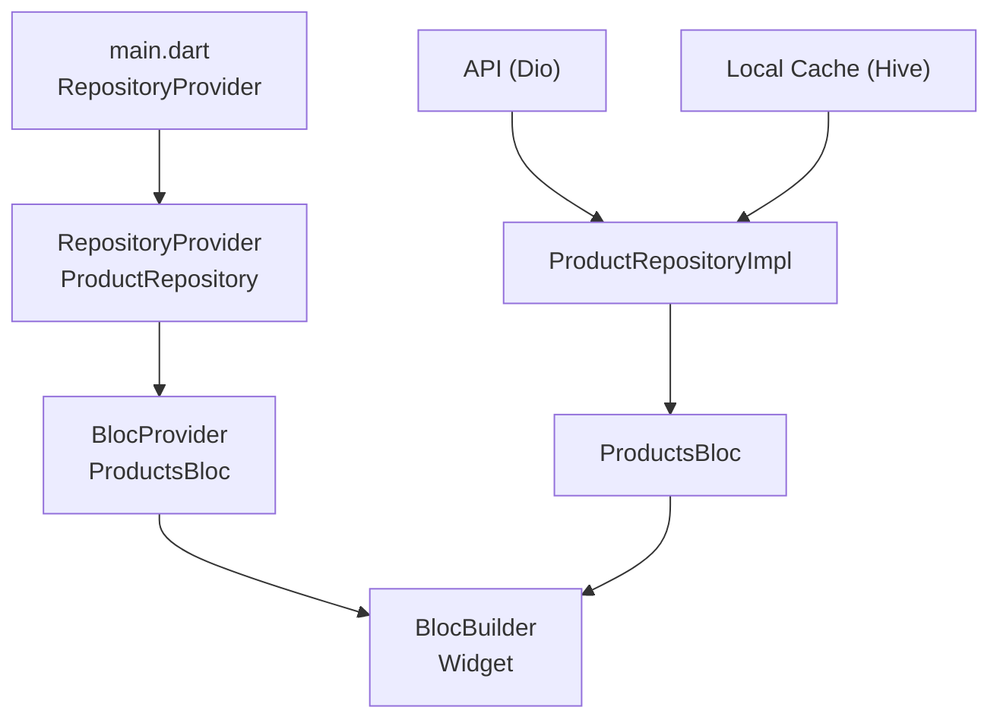

# Bài 2.4 — BLoC + Repository Pattern

## Phần 1 — Khái Niệm & Mục Tiêu Bài Học

### Tại sao bài này quan trọng?

BLoC được thiết kế để làm việc với Repository pattern — BLoC không gọi API trực tiếp mà thông qua Repository. Đây là kiến trúc chuẩn cho production app:

```
UI (Widget)
  ↓ Event
BLoC/Cubit
  ↓ calls
Repository (interface)
  ↓ impl
Data Source (API, DB, Cache)
```

Tách biệt này giúp:
- Test BLoC bằng cách mock Repository — không cần network thật
- Swap data source (remote → local) mà không sửa BLoC

### Bạn sẽ hiểu được sau bài này:
- Repository interface + implementation pattern
- Inject Repository vào BLoC qua constructor
- `RepositoryProvider` trong widget tree
- Error handling flow: DataSource → Repository → BLoC → UI state

---

## Phần 2 — Cơ Chế Hoạt Động (Under the Hood)

### Dependency Flow



---

## Phần 3 — Code Mẫu Chuẩn Google

### 3.1 — Repository interface & implementation

```dart
// repository/product_repository.dart — interface (abstract class)
abstract interface class ProductRepository {
  Future<List<Product>> getProducts({int page = 1, int limit = 20});
  Future<Product> getProductById(String id);
  Future<void> toggleFavorite(String productId);
}

// repository/product_repository_impl.dart — implementation
class ProductRepositoryImpl implements ProductRepository {
  final ProductApiService _apiService;
  final ProductLocalCache _cache;

  const ProductRepositoryImpl({
    required ProductApiService apiService,
    required ProductLocalCache cache,
  }) : _apiService = apiService, _cache = cache;

  @override
  Future<List<Product>> getProducts({int page = 1, int limit = 20}) async {
    try {
      // Try cache first
      if (page == 1) {
        final cached = await _cache.getProducts();
        if (cached.isNotEmpty) return cached;
      }

      // Fetch from API
      final dtos = await _apiService.fetchProducts(page: page, limit: limit);
      final products = dtos.map(Product.fromDto).toList();

      // Update cache (page 1 only)
      if (page == 1) await _cache.saveProducts(products);

      return products;
    } on DioException catch (e) {
      throw NetworkException.fromDioError(e);
    } catch (e) {
      throw UnexpectedException(e.toString());
    }
  }

  @override
  Future<Product> getProductById(String id) async {
    try {
      final dto = await _apiService.fetchProduct(id);
      return Product.fromDto(dto);
    } on DioException catch (e) {
      throw NetworkException.fromDioError(e);
    }
  }

  @override
  Future<void> toggleFavorite(String productId) async {
    await _apiService.toggleFavorite(productId);
  }
}
```

### 3.2 — BLoC nhận Repository qua constructor

```dart
// bloc/products_bloc.dart
class ProductsBloc extends Bloc<ProductsEvent, ProductsState> {
  // Nhận interface — không phải implementation → dễ mock khi test
  final ProductRepository _repository;

  ProductsBloc({required ProductRepository repository})
      : _repository = repository,
        super(const ProductsState()) {
    on<ProductsStarted>(_onStarted);
    on<ProductsRefreshed>(_onRefreshed);
    on<ProductsLoadedMore>(_onLoadedMore);
    on<ProductFavoriteToggled>(_onFavoriteToggled);
  }

  Future<void> _onStarted(
    ProductsStarted event,
    Emitter<ProductsState> emit,
  ) async {
    emit(state.copyWith(status: ProductsStatus.loading));
    try {
      final products = await _repository.getProducts();
      emit(state.copyWith(
        status: ProductsStatus.success,
        products: products,
        hasMore: products.length >= 20,
        currentPage: 1,
      ));
    } on NetworkException catch (e) {
      emit(state.copyWith(status: ProductsStatus.failure, errorMessage: e.message));
    }
  }

  Future<void> _onLoadedMore(
    ProductsLoadedMore event,
    Emitter<ProductsState> emit,
  ) async {
    if (!state.hasMore || state.status == ProductsStatus.loadingMore) return;
    emit(state.copyWith(status: ProductsStatus.loadingMore));
    try {
      final nextPage = state.currentPage + 1;
      final more = await _repository.getProducts(page: nextPage);
      emit(state.copyWith(
        status: ProductsStatus.success,
        products: [...state.products, ...more],
        hasMore: more.length >= 20,
        currentPage: nextPage,
      ));
    } catch (_) {
      // Revert về success state — không mất data cũ
      emit(state.copyWith(status: ProductsStatus.success));
    }
  }

  Future<void> _onFavoriteToggled(
    ProductFavoriteToggled event,
    Emitter<ProductsState> emit,
  ) async {
    // Optimistic update: update UI ngay, rollback nếu API fail
    final prev = state.products;
    final updated = state.products.map((p) {
      return p.id == event.productId ? p.copyWith(isFavorite: !p.isFavorite) : p;
    }).toList();

    emit(state.copyWith(products: updated));

    try {
      await _repository.toggleFavorite(event.productId);
    } catch (_) {
      // Rollback
      emit(state.copyWith(products: prev));
    }
  }

  Future<void> _onRefreshed(
    ProductsRefreshed event,
    Emitter<ProductsState> emit,
  ) async {
    emit(state.copyWith(status: ProductsStatus.loading));
    await _onStarted(const ProductsStarted(), emit);
  }
}
```

### 3.3 — Wiring trong main.dart với RepositoryProvider

```dart
void main() async {
  WidgetsFlutterBinding.ensureInitialized();
  final dio = Dio()..interceptors.add(LogInterceptor());
  runApp(MyApp(dio: dio));
}

class MyApp extends StatelessWidget {
  final Dio dio;
  const MyApp({super.key, required this.dio});

  @override
  Widget build(BuildContext context) {
    return MultiRepositoryProvider(
      providers: [
        // Repository khởi tạo ở đây — không phụ thuộc vào route
        RepositoryProvider<ProductRepository>(
          create: (_) => ProductRepositoryImpl(
            apiService: ProductApiService(dio),
            cache: ProductLocalCache(),
          ),
        ),
        RepositoryProvider<AuthRepository>(
          create: (_) => AuthRepositoryImpl(
            apiService: AuthApiService(dio),
          ),
        ),
      ],
      child: MaterialApp(
        home: BlocProvider(
          // BlocProvider đọc Repository từ context
          create: (context) => ProductsBloc(
            repository: context.read<ProductRepository>(),
          )..add(const ProductsStarted()),
          child: const HomeScreen(),
        ),
      ),
    );
  }
}
```

---

## Phần 4 — Lỗi Sai Phổ Biến & Best Practices

### ❌ Anti-pattern 1: BLoC gọi API trực tiếp

```dart
// ❌ BLoC phụ thuộc vào Dio trực tiếp — không testable
class ProductsBloc extends Bloc<...> {
  final Dio _dio; // ← Dependency cụ thể, không thể mock

  Future<void> _onLoad(_, emit) async {
    final response = await _dio.get('/products'); // ← Network call trong BLoC!
    // ...
  }
}

// ✅ BLoC nhận Repository interface
class ProductsBloc extends Bloc<...> {
  final ProductRepository _repository; // ← Abstract — có thể mock

  Future<void> _onLoad(_, emit) async {
    final products = await _repository.getProducts(); // ← Testable
  }
}
```

### ❌ Anti-pattern 2: Throw exception ra UI thay vì emit error state

```dart
// ❌ Exception bubble lên UI → crash
Future<void> _onLoad(_, emit) async {
  final products = await _repository.getProducts(); // throw → không catch!
  emit(ProductsLoaded(products));
}

// ✅ Catch và emit error state
Future<void> _onLoad(_, emit) async {
  try {
    final products = await _repository.getProducts();
    emit(ProductsLoaded(products));
  } on NetworkException catch (e) {
    emit(ProductsError(e.message));
  } catch (e) {
    emit(const ProductsError('Lỗi không xác định'));
  }
}
```

---

## Phần 5 — Bài Tập Củng Cố Tư Duy

### Challenge: Authentication Flow

**Yêu cầu:**
1. `AuthRepository` interface: `login()`, `logout()`, `getUser()`
2. `AuthBloc` với events: `AuthStarted`, `AuthLoggedIn`, `AuthLoggedOut`
3. `AuthBloc` trong `main.dart` dùng `RepositoryProvider`
4. Các screen khác dùng `context.read<AuthBloc>()` để trigger login/logout
5. `BlocListener` ở app level: khi `AuthUnauthenticated` → navigate to LoginScreen

### Thử thách thẩm định kỹ thuật:

1. **"RepositoryProvider vs BlocProvider — khác nhau gì?"**
   - `RepositoryProvider`: inject data/service layer (Repository, ApiService)
   - `BlocProvider`: inject state management layer (Bloc, Cubit)
   - Repository thường sống lâu hơn (app level), BLoC có thể theo route

2. **"Optimistic update là gì? Khi nào dùng?"**
   - Update UI ngay (trước khi API confirm), rollback nếu fail
   - Dùng cho low-risk actions: like, favorite, reorder
   - Không dùng cho high-risk: payment, delete permanent
