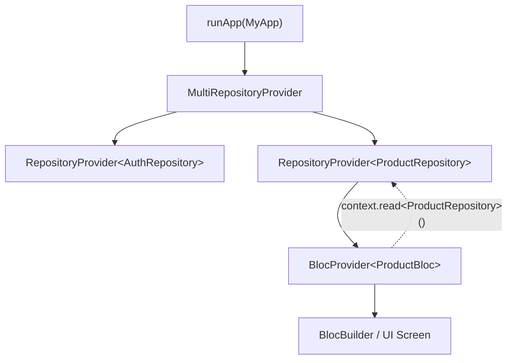
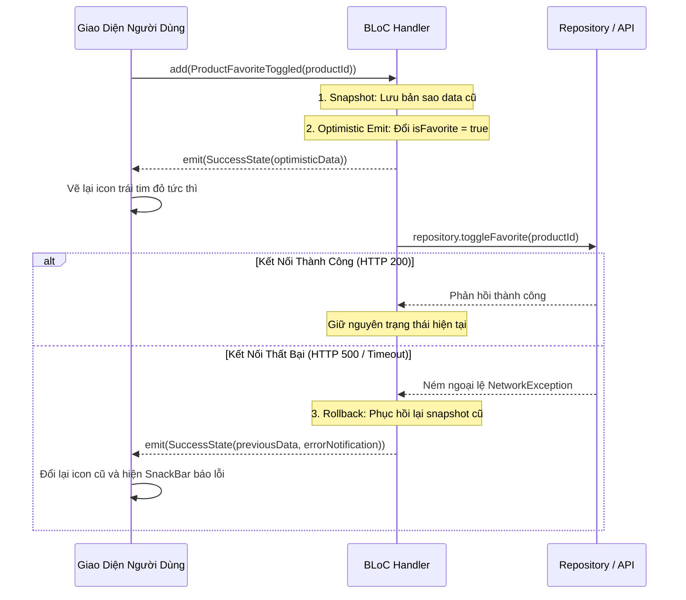

# Bài 2.4 — Tích Hợp Repository Pattern: Phân Tách Tầng Dữ Liệu, Xử Lý Lỗi & Optimistic Updates

## Dẫn Chiếu Tài Liệu Chính Thức
- **BLoC Architecture Guide**: [bloclibrary.dev/#/architecture](https://bloclibrary.dev/#/architecture)
- **RepositoryProvider Reference**: [pub.dev/documentation/flutter_bloc/latest/flutter_bloc/RepositoryProvider-class.html](https://pub.dev/documentation/flutter_bloc/latest/flutter_bloc/RepositoryProvider-class.html)
- **Dart Interface & Abstract Classes**: [dart.dev/language/class-modifiers#interface](https://dart.dev/language/class-modifiers#interface)
- **Flutter Error Handling Best Practices**: [docs.flutter.dev/testing/errors](https://docs.flutter.dev/testing/errors)

---

## Phần 1 — Khái Niệm & Mục Tiêu Bài Học

### 1.1 — Vị Trí Của Repository Trong Kiến Trúc Phân Tầng

Trong kiến trúc phần mềm hướng đối tượng, việc đặt các lời gọi mạng trực tiếp (HTTP requests, truy vấn cơ sở dữ liệu) bên trong `BLoC` hoặc `Cubit` sẽ làm vi phạm nguyên lý Trách Nhiệm Đơn Lẻ (Single Responsibility Principle - SRP). Khi BLoC vừa phải điều phối trạng thái giao diện, vừa phải phân tích chuỗi JSON, xử lý mã HTTP status code và quản lý bộ nhớ đệm, mã nguồn sẽ trở nên cồng kềnh, dễ phát sinh lỗi và bất khả thi trong việc viết Unit Test cô lập.

`Repository Pattern` đóng vai trò là một lớp trừu tượng trung gian nằm giữa tầng nghiệp vụ hiển thị (Presentation Layer - UI & BLoC) và tầng truy xuất dữ liệu (Data Layer - Remote API & Local Database):

```
┌────────────────────────────────────────────────────────┐
│               PRESENTATION LAYER (UI)                  │
│   Widgets ─── (Event) ───> BLoC ─── (State) ───> UI    │
└───────────────────────────┬────────────────────────────┘
                            │ (Gọi hàm nghiệp vụ dữ liệu)
                            ▼
┌────────────────────────────────────────────────────────┐
│                 DOMAIN / DATA LAYER                    │
│             Repository Interface (Contract)            │
│                            │                           │
│              Repository Implementation                 │
│              ┌─────────────┴─────────────┐             │
│              ▼                           ▼             │
│      Remote Data Source          Local Data Source     │
│       (Dio / REST API)           (Isar / Cache / Shp)  │
└────────────────────────────────────────────────────────┘
```

### 1.2 — Nguyên Lý Đảo Ngược Phụ Thuộc (Dependency Inversion Principle)

Thay vì BLoC phụ thuộc trực tiếp vào một lớp cụ thể (`ProductRepositoryImpl`), BLoC chỉ phụ thuộc vào một hợp đồng giao diện trừu tượng (`abstract interface class ProductRepository`). Điều này đem lại hai lợi ích kỹ thuật mang tính sống còn:
1. **Khả năng kiểm thử (Testability)**: Khi viết Unit Test cho BLoC, chúng ta có thể dễ dàng thay thế `ProductRepositoryImpl` bằng một đối tượng giả lập (`MockProductRepository`) mà không cần kết nối Internet thật.
2. **Khả năng thay thế hạ tầng (Flexibility)**: Có thể chuyển đổi thư viện mạng từ `http` sang `Dio`, hoặc thay đổi cơ sở dữ liệu từ `SharedPreferences` sang `Isar` mà không làm thay đổi dù chỉ một dòng mã bên trong BLoC.

### 1.3 — Mục Tiêu Kỹ Thuật Cần Đạt Được
- Nắm vững cấu trúc và vòng đời của `RepositoryProvider` trong cây widget.
- Phân biệt hai chiến lược mô hình hóa trạng thái: `Enum Status` kết hợp `copyWith` so với `Dart 3 Sealed Classes`.
- Xây dựng quy trình xử lý và ánh xạ lỗi phân tầng (Exception Mapping Pipeline).
- Triển khai kỹ thuật Cập nhật Lạc quan (Optimistic Updates) kèm cơ chế Khôi phục trạng thái (Rollback) an toàn khi gặp sự cố mạng.

---

## Phần 2 — Cơ Chế Hoạt Động (Under the Hood)

### 2.1 — Bản Chất Kỹ Thuật Của `RepositoryProvider`

`RepositoryProvider` là một `InheritedWidget` chuyên biệt tương tự như `BlocProvider`, nhưng được tối ưu hóa cho các dịch vụ dữ liệu không phát xạ stream:
- **Phạm vi tồn tại (Scope)**: Trong khi các `BLoC` thường có vòng đời ngắn (gắn liền với từng Route hoặc từng màn hình cụ thể), các `Repository` thường có vòng đời dài, tồn tại xuyên suốt phiên làm việc của ứng dụng (Application Scope) và được cung cấp ở nút gốc trên cùng của cây widget (`main.dart`).
- **Tìm kiếm phụ thuộc**: `BlocProvider` có thể truy xuất một `Repository` từ `BuildContext` thông qua lệnh `context.read<MyRepository>()` ngay trong hàm tạo `create`.
- **Cơ chế dọn dẹp**: `RepositoryProvider` cung cấp thuộc tính `dispose` tùy chọn, cho phép đóng các kết nối cơ sở dữ liệu hoặc giải phóng tài nguyên mạng khi ứng dụng kết thúc.



### 2.2 — So Sánh Hai Chiến Lược Mô Hình Hóa Trạng Thái Bất Đồng Bộ

| Tiêu Chí Kỹ Thuật | Status-based (`enum Status` + `copyWith`) | Sealed Classes Phân Cấp Polymorphic |
| :--- | :--- | :--- |
| **Bảo lưu dữ liệu cũ** | **Rất tốt**: Khi chuyển cờ sang `loadingMore` hoặc `refreshing`, danh sách `products` cũ vẫn được giữ nguyên để hiển thị trên UI. | **Phức tạp hơn**: Cần phải truyền lại thuộc tính `products` qua từng constructor của `ProductsLoadingMore`, `ProductsRefreshing`. |
| **Kiểm soát tính triệt để** | Không bắt buộc; lập trình viên có thể quên kiểm tra trường hợp lỗi `status == failure`. | **Tuyệt đối**: Trình biên dịch Dart 3 bắt buộc mệnh đề `switch` phải bao phủ hết toàn bộ các lớp con. |
| **Kịch bản phù hợp nhất** | Màn hình danh sách có tính năng phân trang (Pagination), lọc tìm kiếm và kéo để làm mới (Pull-to-refresh). | Luồng trạng thái rẽ nhánh rõ rệt (ví dụ: Xác thực đăng nhập: Khởi tạo, Đang kiểm tra, Đã đăng nhập, Chưa đăng nhập). |

### 2.3 — Cơ Chế Hoạt Động Của Optimistic Updates & Rollback

Cập nhật Lạc quan (Optimistic Update) là kỹ thuật phản hồi giao diện ngay lập tức trước khi nhận được tín hiệu phản hồi xác nhận từ máy chủ, giúp tăng cảm giác mượt mà cho trải nghiệm người dùng (đặc biệt trong các thao tác thích bài viết, đánh dấu yêu thích, hoặc tăng giảm số lượng sản phẩm):



---

## Phần 3 — Triển Khai Kỹ Thuật (Implementation Details)

### 3.1 — Định Nghĩa Entity, Exception Và Repository Interface

```dart
import 'package:flutter/foundation.dart';

// --- ENTITY ---
@immutable
class Product {
  final String id;
  final String title;
  final double price;
  final bool isFavorite;

  const Product({
    required this.id,
    required this.title,
    required this.price,
    this.isFavorite = false,
  });

  Product copyWith({
    String? id,
    String? title,
    double? price,
    bool? isFavorite,
  }) {
    return Product(
      id: id ?? this.id,
      title: title ?? this.title,
      price: price ?? this.price,
      isFavorite: isFavorite ?? this.isFavorite,
    );
  }

  @override
  bool operator ==(Object other) =>
      identical(this, other) ||
      other is Product && id == other.id && isFavorite == other.isFavorite;

  @override
  int get hashCode => Object.hash(id, isFavorite);
}

// --- HỆ THỐNG NGOẠI LỆ ĐẶC THÙ (CUSTOM EXCEPTIONS) ---
sealed class DataException implements Exception {
  final String message;
  const DataException(this.message);

  @override
  String toString() => message;
}

final class NetworkException extends DataException {
  const NetworkException([super.message = 'Không có kết nối mạng ổn định']);
}

final class ServerException extends DataException {
  final int statusCode;
  const ServerException(this.statusCode, [super.message = 'Máy chủ phản hồi lỗi']);
}

// --- REPOSITORY INTERFACE ---
abstract interface class ProductRepository {
  Future<List<Product>> fetchProducts({int page = 1, int limit = 20});
  Future<void> toggleFavorite(String productId);
}
```

### 3.2 — Cài Đặt Lớp Triển Khai `ProductRepositoryImpl`

```dart
class ProductRepositoryImpl implements ProductRepository {
  // Giả lập lưu trữ bộ nhớ đệm cục bộ
  final List<Product> _inMemoryCache = [];

  @override
  Future<List<Product>> fetchProducts({int page = 1, int limit = 20}) async {
    try {
      // Mô phỏng độ trễ truyền dữ liệu qua mạng
      await Future<void>.delayed(const Duration(milliseconds: 600));

      // Mô phỏng việc sinh dữ liệu mẫu
      final generatedList = List.generate(
        limit,
        (index) {
          final id = 'prod_${(page - 1) * limit + index + 1}';
          return Product(
            id: id,
            title: 'Sản phẩm số ${(page - 1) * limit + index + 1}',
            price: 29.99 + index,
            isFavorite: false,
          );
        },
      );

      if (page == 1) {
        _inMemoryCache.clear();
        _inMemoryCache.addAll(generatedList);
      } else {
        _inMemoryCache.addAll(generatedList);
      }

      return List.unmodifiable(_inMemoryCache);
    } catch (e) {
      throw const NetworkException('Không thể tải danh sách sản phẩm từ máy chủ');
    }
  }

  @override
  Future<void> toggleFavorite(String productId) async {
    // Mô phỏng độ trễ ghi dữ liệu vào cơ sở dữ liệu từ xa
    await Future<void>.delayed(const Duration(milliseconds: 500));

    // Giả lập xác suất 30% gặp sự cố mạng để kiểm chứng cơ chế Rollback
    final isNetworkInterrupted = (productId == 'prod_2');
    if (isNetworkInterrupted) {
      throw const NetworkException('Lỗi kết nối: Không thể cập nhật trạng thái yêu thích');
    }

    final index = _inMemoryCache.indexWhere((p) => p.id == productId);
    if (index >= 0) {
      final current = _inMemoryCache[index];
      _inMemoryCache[index] = current.copyWith(isFavorite: !current.isFavorite);
    }
  }
}
```

### 3.3 — Cài Đặt `ProductListBloc` Với Optimistic Updates

```dart
import 'package:bloc_concurrency/bloc_concurrency.dart';
import 'package:flutter_bloc/flutter_bloc.dart';
import 'product_models.dart';

// --- SỰ KIỆN (EVENTS) ---
sealed class ProductListEvent {
  const ProductListEvent();
}

final class ProductsFetchRequested extends ProductListEvent {
  const ProductsFetchRequested();
}

final class ProductsLoadMoreRequested extends ProductListEvent {
  const ProductsLoadMoreRequested();
}

final class ProductFavoriteToggled extends ProductListEvent {
  final String productId;
  const ProductFavoriteToggled(this.productId);
}

// --- TRẠNG THÁI (STATES) ---
enum ProductListStatus { initial, loading, success, failure }

class ProductListState {
  final ProductListStatus status;
  final List<Product> products;
  final bool hasReachedMax;
  final int currentPage;
  final String? errorMessage;
  final String? transientNotification; // Thông báo dạng SnackBar (không làm đổi status)

  const ProductListState({
    this.status = ProductListStatus.initial,
    this.products = const [],
    this.hasReachedMax = false,
    this.currentPage = 1,
    this.errorMessage,
    this.transientNotification,
  });

  ProductListState copyWith({
    ProductListStatus? status,
    List<Product>? products,
    bool? hasReachedMax,
    int? currentPage,
    String? errorMessage,
    String? transientNotification,
  }) {
    return ProductListState(
      status: status ?? this.status,
      products: products ?? this.products,
      hasReachedMax: hasReachedMax ?? this.hasReachedMax,
      currentPage: currentPage ?? this.currentPage,
      errorMessage: errorMessage ?? this.errorMessage,
      transientNotification: transientNotification,
    );
  }
}

// --- BLOC ---
class ProductListBloc extends Bloc<ProductListEvent, ProductListState> {
  final ProductRepository _repository;

  ProductListBloc({required ProductRepository repository})
      : _repository = repository,
        super(const ProductListState()) {
    on<ProductsFetchRequested>(_onFetchRequested);
    on<ProductsLoadMoreRequested>(_onLoadMoreRequested, transformer: droppable());
    on<ProductFavoriteToggled>(_onFavoriteToggled);
  }

  Future<void> _onFetchRequested(
    ProductsFetchRequested event,
    Emitter<ProductListState> emit,
  ) async {
    emit(state.copyWith(status: ProductListStatus.loading));

    try {
      final items = await _repository.fetchProducts(page: 1, limit: 15);
      emit(state.copyWith(
        status: ProductListStatus.success,
        products: items,
        hasReachedMax: items.length < 15,
        currentPage: 1,
      ));
    } on DataException catch (e) {
      emit(state.copyWith(
        status: ProductListStatus.failure,
        errorMessage: e.message,
      ));
    }
  }

  Future<void> _onLoadMoreRequested(
    ProductsLoadMoreRequested event,
    Emitter<ProductListState> emit,
  ) async {
    if (state.hasReachedMax || state.status == ProductListStatus.loading) return;

    try {
      final nextPage = state.currentPage + 1;
      final moreItems = await _repository.fetchProducts(page: nextPage, limit: 15);

      emit(state.copyWith(
        status: ProductListStatus.success,
        products: [...state.products, ...moreItems],
        hasReachedMax: moreItems.length < 15,
        currentPage: nextPage,
      ));
    } catch (_) {
      // Trong kịch bản phân trang, lỗi kết nối không làm mất danh sách hiện có
    }
  }

  Future<void> _onFavoriteToggled(
    ProductFavoriteToggled event,
    Emitter<ProductListState> emit,
  ) async {
    // 1. Snapshot: Lưu trữ bản sao lưu danh sách hiện tại trước khi biến đổi
    final previousProducts = state.products;

    // 2. Optimistic Update: Biến đổi dữ liệu trên giao diện ngay lập tức
    final updatedProducts = state.products.map((p) {
      return p.id == event.productId ? p.copyWith(isFavorite: !p.isFavorite) : p;
    }).toList();

    emit(state.copyWith(products: updatedProducts));

    // 3. Thực thi lời gọi mạng ngầm
    try {
      await _repository.toggleFavorite(event.productId);
    } on DataException catch (e) {
      // 4. Rollback: Phục hồi lại dữ liệu cũ khi gặp sự cố
      if (emit.isDone) return;

      emit(state.copyWith(
        products: previousProducts,
        transientNotification: 'Khôi phục thay đổi: ${e.message}',
      ));
    }
  }
}
```

### 3.4 — Cấu Hình Toàn Cục Với `MultiRepositoryProvider`

```dart
import 'package:flutter/material.dart';
import 'package:flutter_bloc/flutter_bloc.dart';
import 'product_bloc.dart';
import 'product_models.dart';

void main() {
  runApp(const MainApplication());
}

class MainApplication extends StatelessWidget {
  const MainApplication({super.key});

  @override
  Widget build(BuildContext context) {
    return MultiRepositoryProvider(
      providers: [
        // Khởi tạo Repository tại gốc ứng dụng; tồn tại theo suốt vòng đời app
        RepositoryProvider<ProductRepository>(
          create: (context) => ProductRepositoryImpl(),
        ),
      ],
      child: MaterialApp(
        theme: ThemeData(useMaterial3: true),
        home: BlocProvider<ProductListBloc>(
          // BLoC lấy Repository từ BuildContext thông qua context.read()
          create: (context) => ProductListBloc(
            repository: context.read<ProductRepository>(),
          )..add(const ProductsFetchRequested()),
          child: const ProductCatalogScreen(),
        ),
      ),
    );
  }
}

class ProductCatalogScreen extends StatelessWidget {
  const ProductCatalogScreen({super.key});

  @override
  Widget build(BuildContext context) {
    return Scaffold(
      appBar: AppBar(title: const Text('Danh Mục Sản Phẩm')),
      body: BlocListener<ProductListBloc, ProductListState>(
        listenWhen: (prev, curr) =>
            curr.transientNotification != null &&
            prev.transientNotification != curr.transientNotification,
        listener: (context, state) {
          if (state.transientNotification != null) {
            ScaffoldMessenger.of(context).showSnackBar(
              SnackBar(
                content: Text(state.transientNotification!),
                backgroundColor: Theme.of(context).colorScheme.error,
              ),
            );
          }
        },
        child: BlocBuilder<ProductListBloc, ProductListState>(
          builder: (context, state) {
            return switch (state.status) {
              ProductListStatus.initial || ProductListStatus.loading =>
                const Center(child: CircularProgressIndicator()),
              ProductListStatus.failure => Center(
                  child: Column(
                    mainAxisAlignment: MainAxisAlignment.center,
                    children: [
                      Text(state.errorMessage ?? 'Xảy ra lỗi tải dữ liệu'),
                      const SizedBox(height: 12),
                      ElevatedButton(
                        onPressed: () => context
                            .read<ProductListBloc>()
                            .add(const ProductsFetchRequested()),
                        child: const Text('Thử lại'),
                      ),
                    ],
                  ),
                ),
              ProductListStatus.success => ListView.builder(
                  itemCount: state.hasReachedMax
                      ? state.products.length
                      : state.products.length + 1,
                  itemBuilder: (context, index) {
                    if (index >= state.products.length) {
                      context
                          .read<ProductListBloc>()
                          .add(const ProductsLoadMoreRequested());
                      return const Center(
                        child: Padding(
                          padding: EdgeInsets.all(16.0),
                          child: CircularProgressIndicator(strokeWidth: 2),
                        ),
                      );
                    }

                    final product = state.products[index];
                    return ListTile(
                      title: Text(product.title),
                      subtitle: Text('\$${product.price.toStringAsFixed(2)}'),
                      trailing: IconButton(
                        icon: Icon(
                          product.isFavorite
                              ? Icons.favorite
                              : Icons.favorite_border,
                          color: product.isFavorite ? Colors.red : null,
                        ),
                        onPressed: () {
                          context
                              .read<ProductListBloc>()
                              .add(ProductFavoriteToggled(product.id));
                        },
                      ),
                    );
                  },
                ),
            };
          },
        ),
      ),
    );
  }
}
```

---

## Phần 4 — Lỗi Kiến Trúc Thường Gặp & Biện Pháp Khắc Phục

### 4.1 — BLoC Phụ Thuộc Trực Tiếp Vào Lớp Triển Khai Hoặc Thư Viện Tầng Thấp

#### Mô tả lỗi:
Khai báo trực tiếp đối tượng `Dio`, `HttpClient` hoặc `ProductRepositoryImpl` bên trong `BLoC`:

```dart
// Lỗi: Phụ thuộc trực tiếp vào triển khai cụ thể
class BadProductBloc extends Bloc<ProductEvent, ProductState> {
  final Dio dio; // Lỗi: Ghép nối chặt với thư viện mạng
  BadProductBloc(this.dio) : super(...) { ... }
}
```

#### Nguyên nhân kỹ thuật:
Khi BLoC nắm giữ trực tiếp `Dio`, việc viết Unit Test bắt buộc phải mock thư viện `Dio` ở tầng HTTP Adapter rất phức tạp. Ngoài ra, nếu trong tương lai dự án chuyển đổi sang GraphQL hoặc gRPC, toàn bộ các file BLoC sẽ phải viết lại từ đầu.

#### Biện pháp khắc phục:
Luôn inject interface trừu tượng thông qua hàm dựng của BLoC:

```dart
// Khắc phục: Phụ thuộc vào interface trừu tượng
class GoodProductBloc extends Bloc<ProductEvent, ProductState> {
  final ProductRepository repository;
  GoodProductBloc({required this.repository}) : super(...) { ... }
}
```

---

### 4.2 — Để Ngoại Lệ (Exception) Rò Rỉ Lên Tầng Giao Diện

#### Mô tả lỗi:
Không sử dụng khối lệnh `try / catch` bên trong BLoC, để ngoại lệ từ Repository tự do bong bóng (bubble up) lên hệ thống:

```dart
// Lỗi: Bỏ qua bắt ngoại lệ trong event handler
Future<void> _onFetch(FetchEvent event, Emitter<MyState> emit) async {
  final data = await repository.getData(); // Ném SocketException khi mất mạng
  emit(SuccessState(data));
}
```

#### Nguyên nhân kỹ thuật:
Ngoại lệ không được bắt sẽ kích hoạt cơ chế `onError` của Dart Zone và có thể làm crash ứng dụng trên thiết bị người dùng. Hơn nữa, giao diện sẽ bị kẹt vĩnh viễn ở trạng thái `Loading` vì không có trạng thái `Failure` nào được phát xạ ra stream.

#### Biện pháp khắc phục:
Luôn bao bọc các lời gọi nghiệp vụ trong khối `try / on SpecificException / catch` và chuyển đổi ngoại lệ thành một trạng thái lỗi tường minh:

```dart
// Khắc phục: Bắt ngoại lệ và chuyển đổi thành trạng thái lỗi
Future<void> _onFetch(FetchEvent event, Emitter<MyState> emit) async {
  try {
    final data = await repository.getData();
    emit(SuccessState(data));
  } on DataException catch (e) {
    emit(FailureState(e.message));
  } catch (e) {
    emit(const FailureState('Xảy ra lỗi không xác định'));
  }
}
```

---

### 4.3 — Khởi Tạo Lại Repository Bên Trong Mỗi Route Màn Hình

#### Mô tả lỗi:
Khai báo `RepositoryProvider` bên trong hàm `builder` của `MaterialPageRoute` tại mỗi lần chuyển trang:

```dart
// Lỗi: Khởi tạo lại Repository tại mỗi route
Navigator.push(
  context,
  MaterialPageRoute(
    builder: (_) => RepositoryProvider<UserRepository>(
      create: (_) => UserRepositoryImpl(), // Mất sạch in-memory cache
      child: const UserProfileScreen(),
    ),
  ),
);
```

#### Nguyên nhân kỹ thuật:
Mỗi lần mở màn hình mới, một instance `UserRepositoryImpl` mới hoàn toàn được cấp phát trên bộ nhớ heap. Toàn bộ dữ liệu bộ nhớ đệm (in-memory cache) đã lưu từ các màn hình trước bị mất hoàn toàn, đồng thời làm lãng phí chu kỳ CPU để tái khởi tạo các client kết nối mạng.

#### Biện pháp khắc phục:
Cung cấp các Repository ở tầng cao nhất của ứng dụng thông qua `MultiRepositoryProvider` bao bọc bên ngoài `MaterialApp`.

---

### 4.4 — Thực Hiện Optimistic Update Nhưng Quên Tạo Bản Sao Lưu (Snapshot)

#### Mô tả lỗi:
Cập nhật trạng thái trực tiếp trên giao diện nhưng không lưu lại bản sao lưu của danh sách trước khi biến đổi:

```dart
// Lỗi: Biến đổi danh sách mà không giữ lại snapshot cũ
Future<void> _onToggle(ToggleEvent event, Emitter<State> emit) async {
  emit(state.copyWith(items: updatedItems));
  try {
    await repository.toggle(event.id);
  } catch (e) {
    // Không thể khôi phục lại trạng thái cũ chính xác vì không lưu snapshot!
    emit(state.copyWith(errorMessage: 'Lỗi'));
  }
}
```

#### Nguyên nhân kỹ thuật:
Khi thao tác cập nhật trên máy chủ thất bại, nếu BLoC không giữ một bản sao lưu (snapshot) độc lập tại thời điểm trước khi thao tác diễn ra, dữ liệu trên giao diện người dùng sẽ rơi vào trạng thái không đồng bộ (Desynchronized State): giao diện hiển thị thành công nhưng trên máy chủ lại là thất bại.

#### Biện pháp khắc phục:
Luôn tạo biến `final previousItems = state.items;` trước khi phát xạ trạng thái lạc quan đầu tiên.

---

## Phần 5 — Khảo Sát Bản Chất Kỹ Thuật & Phân Tích Mã Nguồn (Deep-Dive & Code Tracing)

### 5.1 — Khảo Sát Bản Chất Kỹ Thuật

#### Câu hỏi 1: Tại sao nên tách Data Source ra khỏi Repository thay vì để Repository trực tiếp gọi HTTP client?
*Phân tích:*
Một Repository thường phải điều phối dữ liệu từ nhiều nguồn khác nhau (Data Sources). Ví dụ: kiểm tra bộ nhớ đệm Local Database trước, nếu không có mới gọi Remote API. Việc tách biệt giúp:
1. `RemoteDataSource` chỉ tập trung vào việc giao tiếp với endpoint API, parse JSON DTO.
2. `LocalDataSource` chỉ tập trung vào việc đọc/ghi bảng dữ liệu trong SQLite/Isar.
3. `Repository` nắm giữ logic nghiệp vụ dữ liệu: quyết định khi nào đọc cache, khi nào gọi mạng, và ánh xạ DTO (Data Transfer Object) thành Entity của tầng Domain.

---

#### Câu hỏi 2: Trong trường hợp xảy ra xung đột dữ liệu đồng thời (Concurrent Mutations), cơ chế Optimistic Update có thể gây ra hiện tượng gì?
*Phân tích:*
Nếu người dùng thực hiện liên tiếp 2 thao tác lạc quan khác nhau trên cùng một đối tượng trước khi yêu cầu đầu tiên nhận được phản hồi: nếu yêu cầu thứ nhất thất bại và kích hoạt Rollback, nó có thể ghi đè và làm mất luôn kết quả của thao tác thứ hai (Race Condition). Để khắc phục trong các hệ thống lớn, cần áp dụng Versioning hoặc Vector Clock: mỗi trạng thái mang theo một số phiên bản (`version`), và lệnh Rollback chỉ được phép áp dụng cho phiên bản tương ứng của sự kiện đó.

---

#### Câu hỏi 3: Sự khác biệt cơ bản giữa `Data Transfer Object (DTO)` và `Domain Entity` là gì?
*Phân tích:*
- `DTO` phản ánh chính xác cấu trúc dữ liệu JSON thô mà máy chủ trả về (thường chứa các trường kỹ thuật như `created_at_timestamp`, `snake_case_keys`). DTO chịu trách nhiệm tuần tự hóa (serialization) và giải tuần tự hóa (deserialization).
- `Domain Entity` đại diện cho khái niệm nghiệp vụ cốt lõi trong ứng dụng (sử dụng kiểu dữ liệu thuần Dart như `DateTime`, loại bỏ các trường thừa không dùng tới). Tầng giao diện và BLoC chỉ tương tác với Entity, hoàn toàn cách ly khỏi sự thay đổi cấu trúc schema của API máy chủ.

---

#### Câu hỏi 4: Khi nào nên chuyển giao tiếp từ Repository về BLoC dưới dạng một `Stream` thay vì một `Future`?
*Phân tích:*
- Dùng `Future` khi tác vụ mang tính yêu cầu - phản hồi một lần (Request-Response model) như đăng nhập, tải trang phân trang, gửi biểu mẫu.
- Dùng `Stream` khi nguồn dữ liệu có tính chất biến đổi liên tục trong thời gian thực (Real-time updates) như tin nhắn chat qua WebSocket, định vị GPS từ cảm biến thiết bị, hoặc theo dõi trạng thái mạng với `Connectivity`. Khi đó BLoC sẽ sử dụng phương thức `emit.forEach()` để đồng bộ trạng thái.

---

#### Câu hỏi 5: Thuộc tính `transientNotification` trong `ProductListState` giải quyết vấn đề kiến trúc gì?
*Phân tích:*
Khi thực hiện Optimistic Update thất bại, chúng ta cần hiển thị một thông báo SnackBar cảnh báo người dùng nhưng **không được phép chuyển đổi `status` của toàn bộ màn hình sang `ProductListStatus.failure`** (vì nếu chuyển sang failure, `BlocBuilder` sẽ vẽ lại toàn bộ màn hình thành giao diện báo lỗi và làm biến mất toàn bộ danh sách sản phẩm). Trường `transientNotification` cho phép `BlocListener` bắt sự kiện để hiện thông báo cục bộ trong khi `status` vẫn giữ nguyên là `success`.

---

### 5.2 — Bài Tập Phân Tích Luồng Thực Thi (Code Tracing)

Xem xét kịch bản kiểm thử luồng Optimistic Update khi người dùng tương tác với sản phẩm `'prod_2'` (sản phẩm được cài đặt sẽ gây lỗi mạng):

```dart
// Trạng thái ban đầu:
// state.products = [Product(id: 'prod_2', isFavorite: false)]

bloc.add(const ProductFavoriteToggled('prod_2'));
```

Giả sử `BlocObserver` đang theo dõi toàn bộ các chuyển đổi trạng thái (`onChange`).

#### Phân tích luồng thực thi chi tiết:

1. **Sự kiện được nạp vào**: `bloc.add(ProductFavoriteToggled('prod_2'))`.
2. **Bắt đầu handler `_onFavoriteToggled`**:
   - Biến snapshot `previousProducts` ghi nhận: `[Product(id: 'prod_2', isFavorite: false)]`.
   - Tạo danh sách mới `updatedProducts`: `[Product(id: 'prod_2', isFavorite: true)]`.
3. **Phát xạ lạc quan lần 1**:
   - `emit(state.copyWith(products: updatedProducts))`.
   - `BlocObserver` ghi nhận chuyển đổi trạng thái:
     - `currentState.products[0].isFavorite == false`
     - `nextState.products[0].isFavorite == true`
   - Giao diện người dùng nhận trạng thái mới ngay lập tức, icon trái tim chuyển sang màu đỏ.
4. **Gọi hàm ngoại vi bất đồng bộ**:
   - `await _repository.toggleFavorite('prod_2')`.
   - Sau 500ms, repository ném ra `NetworkException('Lỗi kết nối...')`.
5. **Bắt ngoại lệ trong khối `catch`**:
   - `emit.isDone` được kiểm tra và trả về `false`.
   - BLoC kích hoạt cơ chế Rollback:
     - `emit(state.copyWith(products: previousProducts, transientNotification: 'Khôi phục thay đổi...'))`.
6. **Phát xạ phục hồi lần 2**:
   - `BlocObserver` ghi nhận chuyển đổi trạng thái:
     - `currentState.products[0].isFavorite == true`
     - `nextState.products[0].isFavorite == false`
     - `nextState.transientNotification == 'Khôi phục thay đổi...'`
   - Giao diện: `BlocBuilder` vẽ lại icon trái tim về dạng rỗng (`false`), `BlocListener` bắt được chuỗi `transientNotification` và kích hoạt hiển thị SnackBar báo lỗi.

#### Chuỗi chuyển đổi trạng thái tóm tắt:
```text
State 0 (Initial): [prod_2: false], notification: null
   ↓ (add ProductFavoriteToggled)
State 1 (Optimistic): [prod_2: true], notification: null
   ↓ (NetworkException caught after 500ms)
State 2 (Rollback): [prod_2: false], notification: 'Khôi phục thay đổi: Lỗi kết nối...'
```
