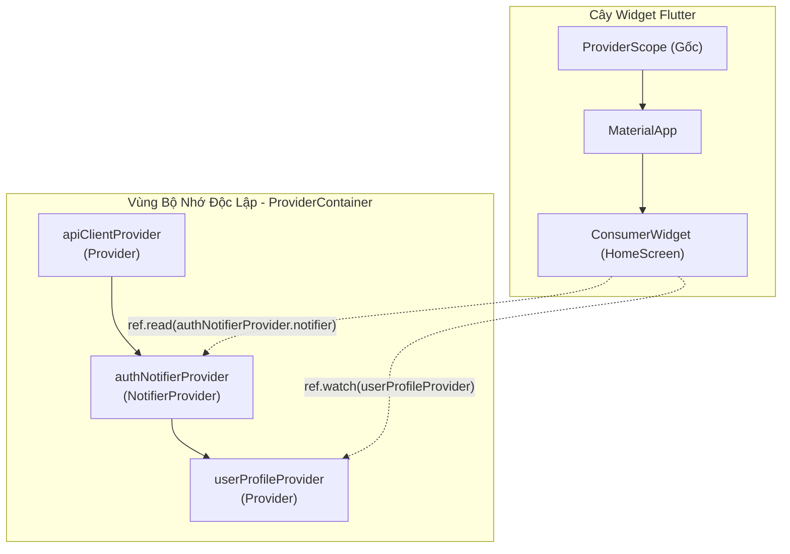

# Bài 3.1 — Kiến Trúc Riverpod: ProviderScope, ConsumerWidget & Cơ Chế Quản Lý Phụ Thuộc (Dependency Graph)

## Dẫn Chiếu Tài Liệu Chính Thức
- **Reading Providers in Riverpod**: [riverpod.dev/docs/concepts/reading](https://riverpod.dev/docs/concepts/reading)
- **Providers Definition Guide**: [riverpod.dev/docs/concepts/providers](https://riverpod.dev/docs/concepts/providers)
- **ProviderScope API Reference**: [pub.dev/documentation/flutter_riverpod/latest/flutter_riverpod/ProviderScope-class.html](https://pub.dev/documentation/flutter_riverpod/latest/flutter_riverpod/ProviderScope-class.html)
- **ConsumerWidget & Consumer API**: [pub.dev/documentation/flutter_riverpod/latest/flutter_riverpod/ConsumerWidget-class.html](https://pub.dev/documentation/flutter_riverpod/latest/flutter_riverpod/ConsumerWidget-class.html)

---

## Phần 1 — Khái Niệm & Bài Toán Kiến Trúc (Nó Là Gì & Giải Quyết Bài Toán Gì?)

### 1.1 — Nó Là Gì? Định Vị Kiến Trúc Của Riverpod
Riverpod là một hệ thống quản trị trạng thái phản ứng (Reactive State Management) và tiêm phụ thuộc (Dependency Injection) độc lập hoàn toàn với cây Widget của Flutter. Không giống như package `provider` truyền thống vốn là một lớp bọc quanh `InheritedWidget`, Riverpod quản lý trạng thái tại một vùng nhớ độc lập gọi là `ProviderContainer` và mô hình hóa các mối quan hệ phụ thuộc thành một Đồ thị có hướng không chu trình (Directed Acyclic Graph - DAG).

Các Provider trong Riverpod được định nghĩa dưới dạng các biến toàn cục bất biến (`top-level final`). Điều này không biến dữ liệu thành biến toàn cục có thể thay đổi tùy tiện (mutable global state), mà biến Provider thành một **định danh mô tả bất biến (immutable key)** dùng để tra cứu trạng thái bên trong container.

### 1.2 — Giải Quyết Bài Toán Gì? Những Nỗi Đau Kỹ Thuật Của InheritedWidget / Provider Cũ
Package `provider` trước đây phụ thuộc 100% vào `BuildContext` và vị trí cây widget, dẫn đến 3 vấn đề kiến trúc nghiêm trọng trong các ứng dụng enterprise:
1. **Ngoại lệ thời gian chạy (`ProviderNotFoundException`)**: Nếu một widget cố gắng truy xuất dữ liệu từ một provider nằm ngoài nhánh cây của nó (ví dụ: route mới tạo bởi Navigator, dialog, hoặc bottom sheet), ứng dụng sẽ sụp đổ (crash) tại runtime.
2. **Khó khăn khi kết hợp dữ liệu (Provider Combination)**: Việc Provider A phụ thuộc vào Provider B đòi hỏi widget của Provider B phải là tổ tiên của Provider A trên cây widget, buộc lập trình viên phải sử dụng các cấu trúc lồng nhau phức tạp và dễ lỗi như `ProxyProvider`.
3. **Không an toàn kiểu dữ liệu tại thời điểm biên dịch (Compile-time Type Safety)**: Việc tìm kiếm provider dựa trên `runtimeType`, dẫn đến việc không thể khai báo hai Provider có cùng kiểu dữ liệu (ví dụ: hai đối tượng `String` hoặc hai đối tượng cấu hình khác nhau) trong cùng một phạm vi cây.
4. **Hạn chế trong kiểm thử tự động (Unit Testing)**: Vì phụ thuộc chặt chẽ vào `BuildContext`, việc viết Unit Test cho logic trạng thái trong `provider` thường đòi hỏi phải dựng môi trường widget test giả lập, làm chậm tốc độ thực thi kiểm thử.

```
┌──────────────────────────────────────────────────────────┐
│              RIVERPOD DEPENDENCY GRAPH (DAG)             │
│                                                          │
│   [UserRepository] ◄───── [AuthNotifier]                 │
│          ▲                       ▲                       │
│          │                       │                       │
│   [ApiClient]              [ProfileScreen]               │
└──────────────────────────────────┬───────────────────────┘
                                   │ Đăng ký phụ thuộc
                                   ▼
┌──────────────────────────────────────────────────────────┐
│                   FLUTTER WIDGET TREE                    │
│   ProviderScope                                          │
│     └── MaterialApp                                      │
│           └── ConsumerWidget (ProfileScreen)             │
└──────────────────────────────────────────────────────────┘
```

### 1.3 — Hệ Thống Khái Niệm Cốt Lõi: Ref, WidgetRef Và ProviderContainer

| Khái Niệm | Vị Trí Xuất Hiện | Trách Nhiệm Kỹ Thuật |
| :--- | :--- | :--- |
| **`ProviderContainer`** | Bộ nhớ độc lập (Standalone Object) | Lưu trữ toàn bộ trạng thái thực tế của các provider, quản lý vòng đời và đồ thị DAG. |
| **`ProviderScope`** | Widget gốc trên cùng (`runApp`) | Nhúng `ProviderContainer` vào Flutter Tree và hỗ trợ ghi đè (`overrides`) cho subtree. |
| **`Ref`** | Bên trong thân hàm của Provider | Cho phép provider đọc, lắng nghe các provider khác và quản lý vòng đời nội bộ của chính nó. |
| **`WidgetRef`** | Tham số trong `ConsumerWidget` / `Consumer` | Cầu nối cho phép widget tương tác với `ProviderContainer` từ môi trường giao diện người dùng. |

### 1.4 — Mục Tiêu Kỹ Thuật Cần Đạt Được
- Nắm vững kiến trúc nội bộ của `ProviderContainer` và cơ chế hoạt động của `ProviderScope`.
- Phân biệt bản chất và kịch bản áp dụng chuẩn xác của 4 cơ chế tương tác: `ref.watch`, `ref.read`, `ref.listen`, và `ref.select`.
- Xây dựng các Computed Provider (giá trị tính toán phái sinh) tự động đồng bộ theo đồ thị DAG.
- Tối ưu hóa phạm vi tái dựng giao diện bằng cách kết hợp `ConsumerWidget` và widget cục bộ `Consumer`.
- Thiết lập hệ sinh thái giám sát toàn cục với `ProviderObserver`.

---

## Phần 2 — Bản Chất Là Gì? (Under the Hood & Cơ Chế Hoạt Động)

### 2.1 — Cấu Trúc Nội Bộ Của `ProviderContainer` Và Đồ Thị DAG

Khi một ứng dụng Flutter khởi chạy với `ProviderScope(child: MyApp())`:
1. `ProviderScope` khởi tạo một instance `ProviderContainer` nội bộ.
2. Bản thân các biến provider khai báo toàn cục (`final myProvider = ...`) thực chất chỉ là **các định danh mô tả (Provider Definition / Key)**, hoàn toàn không chứa dữ liệu.
3. Khi có lệnh tương tác đầu tiên, `ProviderContainer` cấp phát một đối tượng `ProviderElement` tương ứng để lưu trữ trạng thái thực tế.
4. Mỗi khi Provider A gọi `ref.watch(Provider B)`, `ProviderContainer` sẽ thiết lập một cạnh có hướng từ B sang A trong đồ thị DAG:
   - **B** trở thành phụ thuộc (dependency) của **A**.
   - **A** trở thành đối tượng theo dõi (subscriber/dependent) của **B**.
5. Khi trạng thái của B thay đổi, `ProviderContainer` thực hiện thuật toán duyệt đồ thị (Graph Traversal) để đánh dấu A là bẩn (`dirty`), tính toán lại giá trị của A và lan truyền tín hiệu vẽ lại tới các widget đang theo dõi A.



### 2.2 — So Sánh 4 Phương Thức Tương Tác Qua `ref`

`WidgetRef` và `Ref` cung cấp 4 phương thức nền tảng để giao tiếp với hệ thống provider:

```
                               ┌─────────────────────────┐
                               │   Tương Tác Qua ref     │
                               └────────────┬────────────┘
         ┌──────────────────────┬───────────┴───────────┬──────────────────────┐
         ▼                      ▼                       ▼                      ▼
┌──────────────────┐  ┌──────────────────┐  ┌──────────────────────┐  ┌──────────────────┐
│    ref.watch     │  │     ref.read     │  │      ref.listen      │  │    ref.select    │
└────────┬─────────┘  └────────┬─────────┘  └──────────┬───────────┘  └────────┬─────────┘
         │                     │                       │                       │
 Đăng ký lắng nghe      Đọc giá trị O(1)       Lắng nghe Side-Effect    Lắng nghe thuộc
  (Rebuild widget)     (Không lắng nghe)       (Không rebuild widget)   tính con cụ thể
```

1. **`ref.watch(provider)`**:
   - Đăng ký widget làm đối tượng lắng nghe (subscriber) của provider.
   - Khi provider thay đổi giá trị, phương thức `build()` của widget được đánh dấu để chạy lại trong khung hình tiếp theo.
   - **Quy tắc**: Chỉ sử dụng trong thân phương thức `build()` của `ConsumerWidget` hoặc bên trong hàm tạo của một Provider khác.

2. **`ref.read(provider)`**:
   - Truy xuất giá trị hiện tại của provider tại thời điểm gọi với độ phức tạp $O(1)$.
   - **Hoàn toàn không đăng ký bất kỳ liên kết lắng nghe nào**.
   - **Quy tắc**: Chỉ sử dụng bên trong các hàm callback phản hồi sự kiện (`onPressed`, `onTap`, `initState`, timers). Tuyệt đối **không** dùng trong thân hàm `build()` để lấy dữ liệu hiển thị.

3. **`ref.listen(provider, (previous, next) { ... })`**:
   - Đăng ký một hàm callback thực thi mỗi khi provider chuyển đổi trạng thái từ `previous` sang `next`.
   - **Không gây rebuild widget**.
   - **Quy tắc**: Chuyên biệt cho các tác vụ phụ (Side-Effects) như điều hướng màn hình (`Navigator`), mở hộp thoại (`showDialog`), hoặc hiển thị thanh thông báo (`ScaffoldMessenger`).

4. **`ref.watch(provider.select((state) => state.subProperty))`**:
   - Trích xuất một trường dữ liệu con từ trạng thái của provider.
   - Widget chỉ bị kích hoạt vẽ lại khi giá trị con được trích xuất thay đổi (thông qua phép so sánh `==`).
   - **Quy tắc**: Áp dụng khi trạng thái là một đối tượng lớn chứa nhiều thuộc tính nhưng widget chỉ cần hiển thị một trường duy nhất.

---

## Phần 3 — Triển Khai Kỹ Thuật (Triển Khai Như Nào? Step-by-Step Implementation)

### 3.1 — Khai Báo Hệ Thống Model Và Provider Chuẩn Hóa

Xây dựng hệ thống quản lý danh sách công việc (Todo List) với các bộ lọc dữ liệu:

```dart
import 'package:flutter/foundation.dart';
import 'package:flutter_riverpod/flutter_riverpod.dart';

// --- ENTITY MODEL ---
@immutable
class TodoItem {
  final String id;
  final String title;
  final bool isCompleted;

  const TodoItem({
    required this.id,
    required this.title,
    this.isCompleted = false,
  });

  TodoItem copyWith({
    String? id,
    String? title,
    bool? isCompleted,
  }) {
    return TodoItem(
      id: id ?? this.id,
      title: title ?? this.title,
      isCompleted: isCompleted ?? this.isCompleted,
    );
  }

  @override
  bool operator ==(Object other) =>
      identical(this, other) ||
      other is TodoItem && id == other.id && isCompleted == other.isCompleted;

  @override
  int get hashCode => Object.hash(id, isCompleted);
}

enum TodoFilter { all, active, completed }

// --- NOTIFIER QUẢN LÝ DANH SÁCH GỐC ---
class TodoListNotifier extends Notifier<List<TodoItem>> {
  @override
  List<TodoItem> build() {
    // Trạng thái khởi tạo mặc định
    return const [
      TodoItem(id: '1', title: 'Học kiến trúc Riverpod', isCompleted: true),
      TodoItem(id: '2', title: 'Xây dựng đồ thị DAG', isCompleted: false),
      TodoItem(id: '3', title: 'Tối ưu hóa ConsumerWidget', isCompleted: false),
    ];
  }

  void addTodo(String title) {
    if (title.trim().isEmpty) return;
    final newItem = TodoItem(
      id: DateTime.now().millisecondsSinceEpoch.toString(),
      title: title.trim(),
    );
    // Luôn tạo List mới để bảo đảm tính bất biến (Immutable)
    state = [...state, newItem];
  }

  void toggleTodo(String id) {
    state = state.map((todo) {
      return todo.id == id
          ? todo.copyWith(isCompleted: !todo.isCompleted)
          : todo;
    }).toList();
  }

  void removeTodo(String id) {
    state = state.where((todo) => todo.id != id).toList();
  }
}

// 1. Provider quản lý trạng thái danh sách gốc
final todoListProvider = NotifierProvider<TodoListNotifier, List<TodoItem>>(
  TodoListNotifier.new,
);

// 2. Provider quản lý tiêu chí bộ lọc (đơn giản, đồng bộ)
class TodoFilterNotifier extends Notifier<TodoFilter> {
  @override
  TodoFilter build() => TodoFilter.all;

  void setFilter(TodoFilter filter) => state = filter;
}

final todoFilterProvider = NotifierProvider<TodoFilterNotifier, TodoFilter>(
  TodoFilterNotifier.new,
);

// 3. Computed Provider: Tính toán danh sách đã lọc (Phụ thuộc vào 1 và 2)
final filteredTodoListProvider = Provider<List<TodoItem>>((ref) {
  final filter = ref.watch(todoFilterProvider);
  final todos = ref.watch(todoListProvider);

  return switch (filter) {
    TodoFilter.all => todos,
    TodoFilter.active => todos.where((t) => !t.isCompleted).toList(),
    TodoFilter.completed => todos.where((t) => t.isCompleted).toList(),
  };
});

// 4. Computed Provider: Đếm số lượng công việc chưa hoàn tất
final uncompletedCountProvider = Provider<int>((ref) {
  final todos = ref.watch(todoListProvider);
  return todos.where((t) => !t.isCompleted).length;
});
```

### 3.2 — Cài Đặt Hệ Thống Giám Sát Toàn Cục Với `ProviderObserver`

```dart
class AppProviderObserver extends ProviderObserver {
  const AppProviderObserver();

  @override
  void didAddProvider(
    ProviderBase<Object?> provider,
    Object? value,
    ProviderContainer container,
  ) {
    debugPrint('[Riverpod] Khởi tạo Provider: ${provider.name ?? provider.runtimeType} | Giá trị: $value');
  }

  @override
  void didUpdateProvider(
    ProviderBase<Object?> provider,
    Object? previousValue,
    Object? newValue,
    ProviderContainer container,
  ) {
    debugPrint(
      '[Riverpod] Cập nhật Provider: ${provider.name ?? provider.runtimeType} | '
      'Cũ: $previousValue -> Mới: $newValue',
    );
  }

  @override
  void didDisposeProvider(
    ProviderBase<Object?> provider,
    ProviderContainer container,
  ) {
    debugPrint('[Riverpod] Giải phóng Provider: ${provider.name ?? provider.runtimeType}');
  }
}
```

### 3.3 — Xây Dựng Giao Diện Người Dùng Tích Hợp `ConsumerWidget` Và `Consumer`

```dart
import 'package:flutter/material.dart';
import 'package:flutter_riverpod/flutter_riverpod.dart';
import 'todo_providers.dart';

void main() {
  runApp(
    const ProviderScope(
      observers: [AppProviderObserver()],
      child: TodoApplication(),
    ),
  );
}

class TodoApplication extends StatelessWidget {
  const TodoApplication({super.key});

  @override
  Widget build(BuildContext context) {
    return MaterialApp(
      theme: ThemeData(useMaterial3: true),
      home: const TodoScreen(),
    );
  }
}

/// Màn hình chính sử dụng ConsumerWidget để tiếp cận WidgetRef
class TodoScreen extends ConsumerWidget {
  const TodoScreen({super.key});

  @override
  Widget build(BuildContext context, WidgetRef ref) {
    // 1. Lắng nghe Side-Effect: Cảnh báo khi tất cả công việc đã hoàn thành
    ref.listen<int>(uncompletedCountProvider, (previous, next) {
      if (previous != null && previous > 0 && next == 0) {
        ScaffoldMessenger.of(context).showSnackBar(
          const SnackBar(content: Text('Chúc mừng! Bạn đã hoàn thành mọi công việc!')),
        );
      }
    });

    return Scaffold(
      appBar: AppBar(
        title: const Text('Quản Lý Công Việc Riverpod'),
        actions: const [
          // Sử dụng Consumer cục bộ để chỉ rebuild duy nhất phần hiển thị số đếm
          _UncompletedBadge(),
        ],
      ),
      body: const Column(
        children: [
          _TodoInputField(),
          _FilterButtonGroup(),
          Divider(height: 1),
          Expanded(child: _TodoListSection()),
        ],
      ),
    );
  }
}

/// Widget cục bộ hiển thị số lượng với Consumer
class _UncompletedBadge extends StatelessWidget {
  const _UncompletedBadge();

  @override
  Widget build(BuildContext context) {
    return Padding(
      padding: const EdgeInsets.only(right: 16.0),
      child: Center(
        child: Consumer(
          builder: (context, ref, child) {
            final uncompletedCount = ref.watch(uncompletedCountProvider);
            return Badge(
              label: Text('$uncompletedCount'),
              child: const Icon(Icons.checklist),
            );
          },
        ),
      ),
    );
  }
}

/// Ô nhập liệu sử dụng ref.read trong callback sự kiện
class _TodoInputField extends ConsumerStatefulWidget {
  const _TodoInputField();

  @override
  ConsumerState<_TodoInputField> createState() => _TodoInputFieldState();
}

class _TodoInputFieldState extends ConsumerState<_TodoInputField> {
  final TextEditingController _controller = TextEditingController();

  @override
  void dispose() {
    _controller.dispose();
    super.dispose();
  }

  void _submit() {
    // Chỉ dùng ref.read trong callback sự kiện
    ref.read(todoListProvider.notifier).addTodo(_controller.text);
    _controller.clear();
  }

  @override
  Widget build(BuildContext context) {
    return Padding(
      padding: const EdgeInsets.all(16.0),
      child: Row(
        children: [
          Expanded(
            child: TextField(
              controller: _controller,
              decoration: const InputDecoration(
                hintText: 'Thêm công việc mới...',
                border: OutlineInputBorder(),
              ),
              onSubmitted: (_) => _submit(),
            ),
          ),
          const SizedBox(width: 8),
          IconButton.filled(
            onPressed: _submit,
            icon: const Icon(Icons.add),
          ),
        ],
      ),
    );
  }
}

/// Nhóm nút lọc chỉ rebuild khi Filter thay đổi
class _FilterButtonGroup extends ConsumerWidget {
  const _FilterButtonGroup();

  @override
  Widget build(BuildContext context, WidgetRef ref) {
    final currentFilter = ref.watch(todoFilterProvider);

    return Padding(
      padding: const EdgeInsets.symmetric(horizontal: 16.0, vertical: 8.0),
      child: SegmentedButton<TodoFilter>(
        segments: const [
          ButtonSegment(value: TodoFilter.all, label: Text('Tất cả')),
          ButtonSegment(value: TodoFilter.active, label: Text('Đang làm')),
          ButtonSegment(value: TodoFilter.completed, label: Text('Hoàn tất')),
        ],
        selected: {currentFilter},
        onSelectionChanged: (newSelection) {
          ref.read(todoFilterProvider.notifier).setFilter(newSelection.first);
        },
      ),
    );
  }
}

/// Danh sách công việc theo dõi filteredTodoListProvider
class _TodoListSection extends ConsumerWidget {
  const _TodoListSection();

  @override
  Widget build(BuildContext context, WidgetRef ref) {
    final todos = ref.watch(filteredTodoListProvider);

    if (todos.isEmpty) {
      return const Center(child: Text('Không có công việc nào'));
    }

    return ListView.builder(
      itemCount: todos.length,
      itemBuilder: (context, index) {
        final todo = todos[index];
        return ListTile(
          leading: Checkbox(
            value: todo.isCompleted,
            onChanged: (_) {
              ref.read(todoListProvider.notifier).toggleTodo(todo.id);
            },
          ),
          title: Text(
            todo.title,
            style: TextStyle(
              decoration: todo.isCompleted ? TextDecoration.lineThrough : null,
            ),
          ),
          trailing: IconButton(
            icon: const Icon(Icons.delete_outline),
            onPressed: () {
              ref.read(todoListProvider.notifier).removeTodo(todo.id);
            },
          ),
        );
      },
    );
  }
}
```

---

## Phần 4 — Best Practices & Phòng Chống Cạm Bẫy (Defensive Engineering)

### 4.1 — Sử Dụng `ref.read()` Bên Trong Phương Thức `build()` Để Lấy Dữ Liệu Hiển Thị

#### Mô tả lỗi:
Gọi `ref.read()` bên trong phương thức `build()` của `ConsumerWidget`:

```dart
// Lỗi: Đọc dữ liệu bằng ref.read trong phương thức build
@override
Widget build(BuildContext context, WidgetRef ref) {
  final count = ref.read(counterProvider); // Giao diện KHÔNG cập nhật khi count đổi!
  return Text('$count');
}
```

#### Nguyên nhân kỹ thuật:
`ref.read()` chỉ lấy giá trị tức thời một lần duy nhất mà **không thiết lập liên kết lắng nghe (subscription)** trong đồ thị phụ thuộc của `ProviderContainer`. Khi `counterProvider` phát sinh giá trị mới, `ProviderContainer` không ghi nhận widget này là subscriber, dẫn đến widget không bao giờ được đánh dấu bẩn để vẽ lại, tạo ra lỗi giao diện bất động.

#### Biện pháp khắc phục:
Luôn luôn sử dụng `ref.watch()` để đọc dữ liệu phục vụ hiển thị bên trong hàm `build()`:

```dart
// Khắc phục: Sử dụng ref.watch để tự động phản ứng
@override
Widget build(BuildContext context, WidgetRef ref) {
  final count = ref.watch(counterProvider); // Tự động rebuild khi count đổi
  return Text('$count');
}
```

---

### 4.2 — Sử Dụng `ref.watch()` Bên Trong Các Hàm Callback Phản Hồi Sự Kiện

#### Mô tả lỗi:
Gọi `ref.watch()` bên trong các hàm `onPressed`, `onTap` hoặc các tác vụ bất đồng bộ:

```dart
// Lỗi: Sử dụng ref.watch trong callback tương tác
ElevatedButton(
  onPressed: () {
    final notifier = ref.watch(counterProvider.notifier); // Lỗi kiến trúc
    notifier.increment();
  },
  child: const Text('Tăng'),
)
```

#### Nguyên nhân kỹ thuật:
`ref.watch()` được thiết kế để đăng ký một luồng lắng nghe kéo dài theo vòng đời của hàm `build()`. Việc gọi `ref.watch()` trong một callback diễn ra tức thời vi phạm hợp đồng vận hành của Riverpod, gây lãng phí tài nguyên tạo liên kết thừa và có thể làm phát sinh các lỗi luồng ngoài ý muốn.

#### Biện pháp khắc phục:
Chỉ sử dụng `ref.read()` trong các hàm xử lý sự kiện:

```dart
// Khắc phục: Sử dụng ref.read trong callback
ElevatedButton(
  onPressed: () {
    ref.read(counterProvider.notifier).increment();
  },
  child: const Text('Tăng'),
)
```

---

### 4.3 — Kích Hoạt Tác Vụ Phụ (Side-Effects) Bên Trong Hàm `build()`

#### Mô tả lỗi:
Thực hiện điều hướng màn hình hoặc hiển thị thông báo SnackBar trực tiếp trong phương thức `build()` khi dữ liệu thay đổi:

```dart
// Lỗi: Kích hoạt Side-Effect trong build()
@override
Widget build(BuildContext context, WidgetRef ref) {
  final authState = ref.watch(authProvider);
  if (authState.hasError) {
    ScaffoldMessenger.of(context).showSnackBar( // Lỗi: Gọi trong quá trình build
      SnackBar(content: Text(authState.errorMessage!)),
    );
  }
  return const LoginForm();
}
```

#### Nguyên nhân kỹ thuật:
Phương thức `build()` phải là một hàm thuần túy (pure function) không có tác dụng phụ. Kích hoạt thay đổi trạng thái của widget khác (như `ScaffoldMessenger`) khi Flutter đang trong chu trình render sẽ ném ra ngoại lệ `setState() or markNeedsBuild() called during build`. Hơn nữa, mỗi khi màn hình rebuild vì lý do khác, SnackBar sẽ tiếp tục bị bật lên lặp lại.

#### Biện pháp khắc phục:
Sử dụng `ref.listen()` chuyên trách bên trong hàm `build()`:

```dart
// Khắc phục: Sử dụng ref.listen để xử lý tác vụ phụ an toàn
@override
Widget build(BuildContext context, WidgetRef ref) {
  ref.listen<AuthState>(authProvider, (previous, next) {
    if (next.hasError) {
      ScaffoldMessenger.of(context).showSnackBar(
        SnackBar(content: Text(next.errorMessage!)),
      );
    }
  });

  return const LoginForm();
}
```

---

### 4.4 — Tạo Vòng Lặp Phụ Thuộc Chu Trình (Circular Dependency)

#### Mô tả lỗi:
Khai báo hai provider theo dõi chéo lẫn nhau:

```dart
// Lỗi: Provider A watch Provider B, và Provider B watch Provider A
final providerA = Provider<int>((ref) {
  final b = ref.watch(providerB);
  return b + 1;
});

final providerB = Provider<int>((ref) {
  final a = ref.watch(providerA);
  return a * 2;
});
```

#### Nguyên nhân kỹ thuật:
Riverpod quản lý các provider dưới dạng Đồ thị vô hướng không chu trình (DAG). Việc thiết lập chu trình khép kín ($A \to B \to A$) khiến thuật toán duyệt đồ thị rơi vào đệ quy vô tận và ngay lập tức ném ra ngoại lệ `CircularDependencyException`.

#### Biện pháp khắc phục:
Tách phần logic hoặc trạng thái dùng chung ra một provider độc lập thứ ba đóng vai trò nguồn gốc (Single Source of Truth) để cả A và B cùng theo dõi:

```dart
// Khắc phục: Tách nguồn dữ liệu chung
final baseValueProvider = Provider<int>((ref) => 10);

final providerA = Provider<int>((ref) {
  final base = ref.watch(baseValueProvider);
  return base + 1;
});

final providerB = Provider<int>((ref) {
  final base = ref.watch(baseValueProvider);
  return base * 2;
});
```

---

## Phần 5 — Khảo Sát Bản Chất Kỹ Thuật & Phân Tích Mã Nguồn (Deep-Dive & Code Tracing)

### 5.1 — Khảo Sát Bản Chất Kỹ Thuật

#### Câu hỏi 1: Tại sao Riverpod có thể ngăn chặn hoàn toàn lỗi `ProviderNotFoundException` tại thời điểm biên dịch?
*Phân tích:*
Trong package `provider` cũ, các provider được gắn trực tiếp vào cây widget thông qua các phần tử `InheritedWidget`. Việc tìm kiếm diễn ra lúc runtime bằng cách duyệt ngược từ `BuildContext` hiện tại lên gốc cây; nếu widget con nằm sai nhánh, Flutter không thể tìm thấy và ném ra ngoại lệ. 
Trong Riverpod, mọi Provider đều được khai báo dưới dạng biến toàn cục (`top-level final variable`). Để đọc được một provider, lập trình viên bắt buộc phải truyền trực tiếp biến định danh đó vào `ref.watch(myProvider)`. Nếu biến không tồn tại, mã nguồn sẽ báo lỗi cú pháp biên dịch ngay lập tức (Compile-time error), triệt tiêu hoàn toàn khả năng phát sinh lỗi runtime.

---

#### Câu hỏi 2: Vai trò kỹ thuật của tham số `overrides` trong `ProviderScope` là gì?
*Phân tích:*
`overrides: [...]` cho phép ghi đè giá trị hoặc hành vi của một provider bên trong phạm vi của `ProviderScope` đó. Kỹ thuật này có hai ứng dụng kiến trúc quan trọng:
1. **Kiểm thử tự động (Unit / Widget Test)**: Dễ dàng thay thế các provider gọi mạng thật bằng các Mock Provider mà không cần can thiệp vào mã nguồn logic.
2. **Phân vùng dữ liệu cục bộ (Subtree Scoping)**: Đặt một `ProviderScope` lồng nhau bên trong một phần tử của `ListView` để gán dữ liệu riêng biệt cho từng dòng mà không làm ảnh hưởng tới các dòng khác.

---

#### Câu hỏi 3: Sự khác nhau về mặt cơ chế giữa `ConsumerWidget` và việc bọc widget bằng `Consumer(builder: ...)` là gì?
*Phân tích:*
- `ConsumerWidget` biến toàn bộ widget thành một subscriber. Khi bất kỳ provider nào được gọi bởi `ref.watch` bên trong phương thức `build()` thay đổi, **toàn bộ widget đó** sẽ được đánh dấu để rebuild.
- `Consumer` là một widget con chuyên biệt thu hẹp phạm vi. Chỉ có khối mã nằm bên trong hàm `builder` của `Consumer` bị vẽ lại khi provider thay đổi. Phần giao diện bên ngoài `Consumer` (như các nút bấm tĩnh, layout nền) được bảo toàn tuyệt đối, giúp giảm thiểu đáng kể chi phí render.

---

#### Câu hỏi 4: Khi nào nên sử dụng `ref.watch(provider.select(...))` thay vì `ref.watch(provider)`?
*Phân tích:*
Khi trạng thái của provider là một đối tượng phức hợp (Compound State Object) chứa nhiều trường dữ liệu (ví dụ: `UserProfile` gồm `name`, `avatarUrl`, `balance`, `settings`). Nếu widget chỉ hiển thị tên người dùng (`Text(user.name)`), việc sử dụng `ref.watch(userProfileProvider)` sẽ khiến widget bị vẽ lại ngay cả khi số dư `balance` thay đổi. Sử dụng `ref.watch(userProfileProvider.select((u) => u.name))` giúp thiết lập bộ lọc Equality: widget chỉ rebuild khi chuỗi `name` thực sự biến đổi.

---

#### Câu hỏi 5: `UncontrolledProviderScope` trong mã nguồn Riverpod là gì và khi nào nó được sử dụng?
*Phân tích:*
`ProviderScope` tiêu chuẩn chịu trách nhiệm tự động khởi tạo và giải phóng một `ProviderContainer` nội bộ. Tuy nhiên, trong một số kịch bản nâng cao (như kiểm thử thuần Dart hoặc chia sẻ một container duy nhất giữa Flutter và môi trường Isolate), lập trình viên tự tạo và quản lý `ProviderContainer`. Khi đó, widget `UncontrolledProviderScope(container: myContainer, child: ...)` được sử dụng để liên kết trực tiếp container tự quản lý này vào cây widget mà không tạo ra container mới.

---

### 5.2 — Bài Tập Phân Tích Luồng Thực Thi (Code Tracing)

Xem xét đồ thị phụ thuộc giữa 3 providers và 2 widgets sau:

```dart
// 1. Provider gốc
final countProvider = NotifierProvider<CounterNotifier, int>(CounterNotifier.new);

// 2. Computed Provider nhân đôi
final doubleCountProvider = Provider<int>((ref) {
  print('Computed: doubleCountProvider');
  final count = ref.watch(countProvider);
  return count * 2;
});

// 3. Computed Provider chuỗi hiển thị
final labelProvider = Provider<String>((ref) {
  print('Computed: labelProvider');
  final count = ref.watch(countProvider);
  return 'Giá trị: $count';
});
```

Cấu trúc giao diện:
- `Widget A` thực hiện: `final doubleVal = ref.watch(doubleCountProvider);` (in: `Build Widget A`).
- `Widget B` thực hiện: `final label = ref.watch(labelProvider);` (in: `Build Widget B`).

Giả định giá trị ban đầu của `countProvider` là `0`. Cả hệ thống hoàn tất chu trình dựng đầu tiên:
```text
Computed: doubleCountProvider
Build Widget A
Computed: labelProvider
Build Widget B
```

Thực hiện lệnh: `ref.read(countProvider.notifier).state = 1;`

#### Phân tích chi tiết các bước lan truyền trong đồ thị DAG:

1. `countProvider` cập nhật giá trị từ `0` sang `1`.
2. `ProviderContainer` kiểm tra danh sách các nút phụ thuộc vào `countProvider` trong đồ thị DAG:
   - Phát hiện `doubleCountProvider` và `labelProvider` đang watch `countProvider`.
   - Cả hai provider này bị đánh dấu là bẩn (`dirty`).
3. Đánh giá lại `doubleCountProvider`:
   - Hàm tính toán chạy lại với `count = 1`.
   - In ra console: `Computed: doubleCountProvider`.
   - Giá trị mới là `2` (khác `0`). Đánh dấu `Widget A` là bẩn.
4. Đánh giá lại `labelProvider`:
   - Hàm tính toán chạy lại với `count = 1`.
   - In ra console: `Computed: labelProvider`.
   - Giá trị mới là `'Giá trị: 1'` (khác `'Giá trị: 0'`). Đánh dấu `Widget B` là bẩn.
5. Flutter Engine bắt đầu giai đoạn vẽ khung hình (Draw Frame):
   - `Widget A` thực thi lại hàm `build()`, in ra console: `Build Widget A`.
   - `Widget B` thực thi lại hàm `build()`, in ra console: `Build Widget B`.

#### Kết quả hiển thị chính xác trên console sau khi gán `state = 1`:
```text
Computed: doubleCountProvider
Computed: labelProvider
Build Widget A
Build Widget B
```
