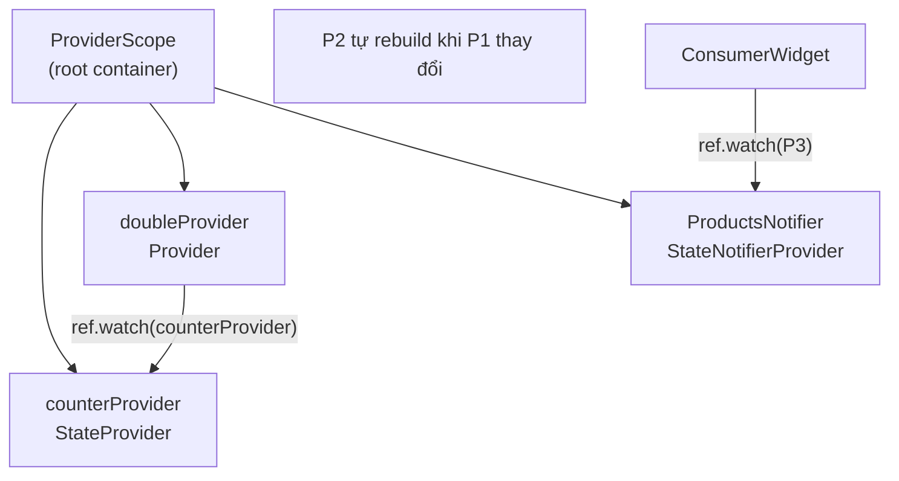

# Bài 3.1 — ProviderScope, ConsumerWidget & ref

## Phần 1 — Khái Niệm & Mục Tiêu Bài Học

### Tại sao Riverpod khác với Provider package?

```dart
// Provider package (flutter-fundamentals-v2):
context.watch<MyModel>()     // Phụ thuộc vào BuildContext
context.read<MyModel>()

// Riverpod:
ref.watch(myProvider)        // Phụ thuộc vào ProviderRef — KHÔNG cần context
ref.read(myProvider)
```

Sự khác biệt cốt lõi:
- **Provider package** — wrapper trên `InheritedWidget`, phụ thuộc vào BuildContext
- **Riverpod** — framework độc lập, providers được đăng ký global, compile-time safe

Sau khi nắm bài này + bài 3.2-3.3, bạn sẵn sàng cho Advanced Riverpod (AsyncNotifier, Codegen) trong `flutter-advanced/`.

### Bạn sẽ hiểu được sau bài này:
- `ProviderScope` — root của Riverpod app
- `Provider`, `StateProvider`, `StateNotifierProvider` cơ bản
- `ConsumerWidget` / `Consumer` — cách rebuild UI
- `ref.watch`, `ref.read`, `ref.listen` — 3 cách interact với provider

---

## Phần 2 — Cơ Chế Hoạt Động (Under the Hood)

### Riverpod Provider Graph



**Dependency tracking**: Riverpod tự động track dependency — khi provider A watch provider B, A rebuild khi B thay đổi.

---

## Phần 3 — Code Mẫu Chuẩn Google

### 3.1 — Setup ProviderScope và providers cơ bản

```dart
// main.dart
void main() {
  runApp(
    // ProviderScope: BẮT BUỘC ở root — chứa tất cả provider state
    const ProviderScope(child: MyApp()),
  );
}

// providers.dart — định nghĩa providers ở global level
// StateProvider: cho simple mutable state
final counterProvider = StateProvider<int>((ref) => 0);

// Provider: computed/derived value — read-only
final doubleCounterProvider = Provider<int>((ref) {
  final count = ref.watch(counterProvider); // Watch dep
  return count * 2; // Tự động recompute khi counterProvider thay đổi
});

// Provider với family — parameterized
final productProvider = Provider.family<Product?, String>((ref, productId) {
  final products = ref.watch(productsProvider).valueOrNull ?? [];
  return products.firstWhereOrNull((p) => p.id == productId);
});
```

### 3.2 — ConsumerWidget và ref

```dart
// ConsumerWidget: giống StatelessWidget nhưng có ref
class CounterScreen extends ConsumerWidget {
  const CounterScreen({super.key});

  @override
  Widget build(BuildContext context, WidgetRef ref) {
    // ref.watch: subscribe → rebuild khi provider thay đổi
    final count = ref.watch(counterProvider);
    final doubleCount = ref.watch(doubleCounterProvider);

    return Scaffold(
      appBar: AppBar(title: const Text('Counter')),
      body: Center(
        child: Column(
          mainAxisAlignment: MainAxisAlignment.center,
          children: [
            Text('Count: $count', style: Theme.of(context).textTheme.displayMedium),
            Text('Double: $doubleCount', style: Theme.of(context).textTheme.titleLarge),
          ],
        ),
      ),
      floatingActionButton: FloatingActionButton(
        onPressed: () {
          // ref.read: không subscribe — chỉ dùng trong callbacks
          // .notifier: access StateController để mutate
          ref.read(counterProvider.notifier).state++;
        },
        child: const Icon(Icons.add),
      ),
    );
  }
}
```

### 3.3 — StateNotifierProvider cho phức tạp hơn

```dart
// state
class TodoState {
  final List<Todo> todos;
  final bool isLoading;
  final String? error;

  const TodoState({this.todos = const [], this.isLoading = false, this.error});

  TodoState copyWith({List<Todo>? todos, bool? isLoading, String? error}) {
    return TodoState(
      todos: todos ?? this.todos,
      isLoading: isLoading ?? this.isLoading,
      error: error,
    );
  }
}

// StateNotifier: class chứa business logic
class TodoNotifier extends StateNotifier<TodoState> {
  final TodoRepository _repo;

  TodoNotifier(this._repo) : super(const TodoState()) {
    _loadTodos();
  }

  Future<void> _loadTodos() async {
    state = state.copyWith(isLoading: true);
    try {
      final todos = await _repo.getTodos();
      state = state.copyWith(todos: todos, isLoading: false);
    } catch (e) {
      state = state.copyWith(error: e.toString(), isLoading: false);
    }
  }

  void addTodo(String title) {
    final todo = Todo(id: uuid(), title: title, done: false);
    state = state.copyWith(todos: [...state.todos, todo]);
  }

  void toggleTodo(String id) {
    state = state.copyWith(
      todos: state.todos.map((t) => t.id == id ? t.copyWith(done: !t.done) : t).toList(),
    );
  }
}

// Provider — inject dependency
final todoNotifierProvider = StateNotifierProvider<TodoNotifier, TodoState>((ref) {
  return TodoNotifier(ref.watch(todoRepositoryProvider));
});

// Consumer
class TodoScreen extends ConsumerWidget {
  @override
  Widget build(BuildContext context, WidgetRef ref) {
    final state = ref.watch(todoNotifierProvider);

    return switch ((state.isLoading, state.error)) {
      (true, _) => const Center(child: CircularProgressIndicator()),
      (_, String error) => Center(child: Text('Error: $error')),
      _ => TodoList(
          todos: state.todos,
          onToggle: (id) => ref.read(todoNotifierProvider.notifier).toggleTodo(id),
        ),
    };
  }
}
```

### 3.4 — ref.listen — side effects

```dart
class CartScreen extends ConsumerStatefulWidget {
  @override
  ConsumerState<CartScreen> createState() => _CartScreenState();
}

class _CartScreenState extends ConsumerState<CartScreen> {
  @override
  void initState() {
    super.initState();
    // ref.listen trong initState để watch side effects
    ref.listen<CartState>(cartProvider, (prev, next) {
      if (next.checkoutSuccess) {
        Navigator.pushReplacementNamed(context, '/order-success');
      }
      if (next.error != null) {
        ScaffoldMessenger.of(context).showSnackBar(
          SnackBar(content: Text(next.error!)),
        );
      }
    });
  }

  @override
  Widget build(BuildContext context) {
    final cart = ref.watch(cartProvider);
    return CartView(cart: cart);
  }
}
```

---

## Phần 4 — Lỗi Sai Phổ Biến & Best Practices

### ❌ Anti-pattern 1: ref.watch trong callback

```dart
// ❌ ref.watch trong onPressed → undefined behavior
ElevatedButton(
  onPressed: () {
    final count = ref.watch(counterProvider); // ❌ KHÔNG dùng watch trong callback
    print(count);
  },
  child: const Text('Log'),
)

// ✅ ref.read cho one-time reads trong callbacks
ElevatedButton(
  onPressed: () {
    final count = ref.read(counterProvider); // ✅
    print(count);
  },
  child: const Text('Log'),
)
```

### ❌ Anti-pattern 2: Quên ProviderScope

```dart
// ❌ Không có ProviderScope → ProviderNotFoundException runtime error
void main() => runApp(const MyApp()); // Không có ProviderScope!

// ✅
void main() => runApp(const ProviderScope(child: MyApp()));
```

### ❌ Anti-pattern 3: StateProvider cho complex state

```dart
// ❌ StateProvider cho list → không detect mutation
final todosProvider = StateProvider<List<Todo>>((ref) => []);

// ref.read(todosProvider.notifier).state.add(todo); // Mutation không trigger rebuild!

// ✅ StateNotifierProvider cho complex/mutable state
final todosProvider = StateNotifierProvider<TodoNotifier, List<Todo>>(
  (ref) => TodoNotifier(),
);
```

---

## Phần 5 — Bài Tập Củng Cố Tư Duy

### Challenge: Theme Provider với Riverpod

**Yêu cầu:**
1. `themeProvider = StateProvider<ThemeMode>((ref) => ThemeMode.system)`
2. `MaterialApp` watch `themeProvider` để đổi themeMode
3. Settings screen dùng `ref.read` để set theme
4. Persist preference bằng `SharedPreferences` trong `StateNotifier`

### Thử thách thẩm định kỹ thuật:

1. **"Riverpod vs Provider package — điểm khác biệt lớn nhất?"**
   - Riverpod: compile-time safe, không cần context, providers global
   - Provider: runtime errors, BuildContext required, limited scope

2. **"ref.watch vs ref.read vs ref.listen?"**
   - `watch`: subscribe → rebuild khi provider đổi (dùng trong build)
   - `read`: one-time read (dùng trong callbacks)
   - `listen`: react side effects (navigate, snackbar) khi provider đổi
