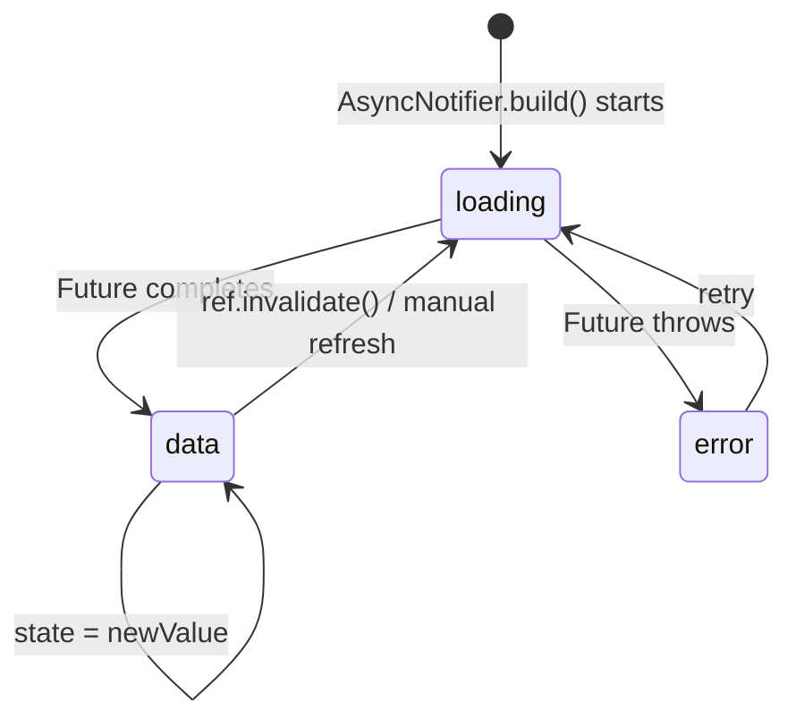

# Bài 3.2 — Notifier, AsyncNotifier & AsyncValue

## Phần 1 — Khái Niệm & Mục Tiêu Bài Học

### StateNotifier đã bị deprecated — Notifier là tương lai

Từ Riverpod 2.0, `StateNotifier` được thay thế bởi `Notifier` và `AsyncNotifier` — cleaner API, tích hợp với code generation.

```dart
// Cũ (StateNotifier):
class CounterNotifier extends StateNotifier<int> {
  CounterNotifier() : super(0);
  void increment() => state++;
}
final counterProvider = StateNotifierProvider<CounterNotifier, int>(...);

// Mới (Notifier — Riverpod 2.x):
class CounterNotifier extends Notifier<int> {
  @override int build() => 0;
  void increment() => state++;
}
final counterProvider = NotifierProvider<CounterNotifier, int>(CounterNotifier.new);
```

`AsyncNotifier` tương đương cho async state — tự động handle `AsyncValue<T>` (loading/data/error).

### Bạn sẽ hiểu được sau bài này:
- `Notifier<T>` — sync state với `build()` pattern
- `AsyncNotifier<T>` — async state, `AsyncValue` data/loading/error
- `AsyncValue.when()` — declarative UI cho async states
- So sánh với BLoC để biết khi nào chọn Riverpod

---

## Phần 2 — Cơ Chế Hoạt Động (Under the Hood)

### AsyncValue States



`AsyncValue<T>` là sealed class:
- `AsyncLoading<T>` — đang fetch
- `AsyncData<T>` — có data
- `AsyncError<T>` — có error + stacktrace

---

## Phần 3 — Code Mẫu Chuẩn Google

### 3.1 — AsyncNotifier cho data fetching

```dart
// products_notifier.dart
class ProductsNotifier extends AsyncNotifier<List<Product>> {
  @override
  Future<List<Product>> build() async {
    // build() được gọi khi provider được tạo lần đầu
    // Return value → AsyncData(value)
    // Throw → AsyncError(error, stack)
    return ref.watch(productRepositoryProvider).getProducts();
  }

  // Refresh: gọi build() lại
  Future<void> refresh() async {
    // ref.invalidateSelf() → rebuild provider → gọi lại build()
    ref.invalidateSelf();
    // Chờ cho đến khi reload xong (optional)
    await future;
  }

  Future<void> addProduct(Product product) async {
    // state = AsyncLoading() → không làm mất data cũ
    // AsyncLoading có .value (data trước đó) nếu đang refresh
    final previous = state.requireValue; // Throw nếu chưa có data

    // Optimistic update
    state = AsyncData([...previous, product]);

    try {
      await ref.read(productRepositoryProvider).addProduct(product);
    } catch (e, st) {
      // Rollback
      state = AsyncData(previous);
      // Re-throw hoặc handle
      state = AsyncError(e, st);
    }
  }

  Future<void> deleteProduct(String id) async {
    final previous = state.requireValue;
    state = AsyncData(previous.where((p) => p.id != id).toList());
    try {
      await ref.read(productRepositoryProvider).deleteProduct(id);
    } catch (e, st) {
      state = AsyncData(previous); // Rollback
    }
  }
}

final productsProvider = AsyncNotifierProvider<ProductsNotifier, List<Product>>(
  ProductsNotifier.new,
);
```

### 3.2 — AsyncValue.when() trong UI

```dart
class ProductListScreen extends ConsumerWidget {
  const ProductListScreen({super.key});

  @override
  Widget build(BuildContext context, WidgetRef ref) {
    final productsAsync = ref.watch(productsProvider);

    return Scaffold(
      appBar: AppBar(title: const Text('Sản phẩm')),
      body: RefreshIndicator(
        onRefresh: () => ref.read(productsProvider.notifier).refresh(),
        child: productsAsync.when(
          // data: có dữ liệu
          data: (products) => products.isEmpty
              ? const Center(child: Text('Chưa có sản phẩm'))
              : ListView.builder(
                  itemCount: products.length,
                  itemBuilder: (_, i) => ProductTile(product: products[i]),
                ),

          // loading: đang fetch
          loading: () => const Center(child: CircularProgressIndicator()),

          // error: lỗi xảy ra
          error: (error, stack) => Center(
            child: Column(
              mainAxisAlignment: MainAxisAlignment.center,
              children: [
                Text('Lỗi: $error'),
                ElevatedButton(
                  onPressed: () => ref.invalidate(productsProvider),
                  child: const Text('Thử lại'),
                ),
              ],
            ),
          ),

          // skipLoadingOnRefresh: không show loading khi đang có data (pull-to-refresh)
          skipLoadingOnRefresh: true,
        ),
      ),
      floatingActionButton: FloatingActionButton(
        onPressed: () => _showAddDialog(context, ref),
        child: const Icon(Icons.add),
      ),
    );
  }

  void _showAddDialog(BuildContext context, WidgetRef ref) {
    // ...
  }
}
```

### 3.3 — Notifier (sync) cho form state

```dart
class LoginFormState {
  final String email;
  final String password;
  final bool isSubmitting;
  final String? emailError;
  final String? passwordError;
  final bool isSuccess;

  const LoginFormState({
    this.email = '',
    this.password = '',
    this.isSubmitting = false,
    this.emailError,
    this.passwordError,
    this.isSuccess = false,
  });

  LoginFormState copyWith({...}) => LoginFormState(...);

  bool get isValid => emailError == null && passwordError == null
      && email.isNotEmpty && password.isNotEmpty;
}

class LoginFormNotifier extends Notifier<LoginFormState> {
  @override
  LoginFormState build() => const LoginFormState();

  void onEmailChanged(String email) {
    state = state.copyWith(
      email: email,
      emailError: _validateEmail(email),
    );
  }

  void onPasswordChanged(String password) {
    state = state.copyWith(
      password: password,
      passwordError: _validatePassword(password),
    );
  }

  String? _validateEmail(String email) {
    if (email.isEmpty) return 'Bắt buộc';
    if (!email.contains('@')) return 'Email không hợp lệ';
    return null;
  }

  String? _validatePassword(String password) {
    if (password.isEmpty) return 'Bắt buộc';
    if (password.length < 6) return 'Tối thiểu 6 ký tự';
    return null;
  }

  Future<void> submit() async {
    if (!state.isValid) return;
    state = state.copyWith(isSubmitting: true);
    try {
      await ref.read(authRepositoryProvider).login(state.email, state.password);
      state = state.copyWith(isSubmitting: false, isSuccess: true);
    } catch (e) {
      state = state.copyWith(isSubmitting: false);
    }
  }
}

final loginFormProvider = NotifierProvider<LoginFormNotifier, LoginFormState>(
  LoginFormNotifier.new,
);
```

---

## Phần 4 — Lỗi Sai Phổ Biến & Best Practices

### ❌ Anti-pattern 1: ref.watch trong build() của Notifier

```dart
// ❌ ref.watch trong method của Notifier (không phải build())
// → Sẽ throw assertion error
class MyNotifier extends Notifier<int> {
  @override int build() => 0;

  void doSomething() {
    final value = ref.watch(someProvider); // ❌ chỉ dùng được trong build()
  }
}

// ✅ ref.read trong methods
void doSomething() {
  final value = ref.read(someProvider); // ✅
}
```

### ❌ Anti-pattern 2: Dùng AsyncNotifier khi state là sync

```dart
// ❌ AsyncNotifier cho state không async → overcomplicated
class CounterNotifier extends AsyncNotifier<int> {
  @override Future<int> build() async => 0; // Không cần async!
  void increment() => state = AsyncData(state.requireValue + 1);
}

// ✅ Notifier cho sync state
class CounterNotifier extends Notifier<int> {
  @override int build() => 0;
  void increment() => state++;
}
```

---

## Phần 5 — Bài Tập Củng Cố Tư Duy

### Challenge: User Profile với AsyncNotifier

**Yêu cầu:**
1. `UserProfileNotifier extends AsyncNotifier<UserProfile>`
2. `build()`: fetch profile từ API
3. Method `updateAvatar(File)`: upload + update state
4. Method `updateBio(String)`: optimistic update
5. UI dùng `when(data, loading, error)` + skipLoadingOnRefresh

### Thử thách thẩm định kỹ thuật:

1. **"AsyncValue.when() vs AsyncValue.maybeWhen()?"**
   - `when`: phải handle tất cả 3 cases (data/loading/error)
   - `maybeWhen`: có `orElse` fallback — không cần handle tất cả

2. **"ref.invalidate vs ref.invalidateSelf?"**
   - `ref.invalidate(provider)`: từ bên ngoài provider, force rebuild
   - `ref.invalidateSelf()`: từ trong Notifier, rebuild chính mình
