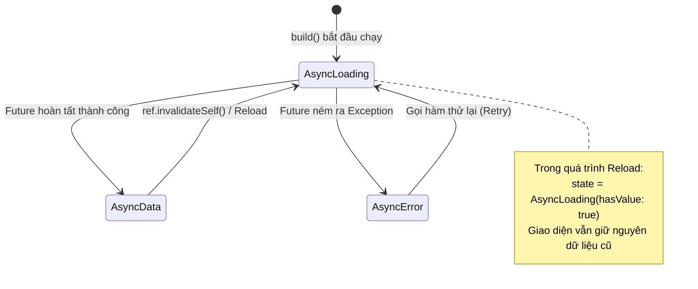

# Bài 3.2 — Quản Lý Trạng Thái Bất Đồng Bộ Hiện Đại: Notifier, AsyncNotifier & Cơ Chế AsyncValue

## Dẫn Chiếu Tài Liệu Chính Thức
- **NotifierProvider Guide**: [riverpod.dev/docs/providers/notifier_provider](https://riverpod.dev/docs/providers/notifier_provider)
- **AsyncNotifierProvider Guide**: [riverpod.dev/docs/providers/async_notifier_provider](https://riverpod.dev/docs/providers/async_notifier_provider)
- **AsyncValue Class Documentation**: [pub.dev/documentation/riverpod/latest/riverpod/AsyncValue-class.html](https://pub.dev/documentation/riverpod/latest/riverpod/AsyncValue-class.html)
- **Dart Asynchronous Programming**: [dart.dev/codelabs/async-await](https://dart.dev/codelabs/async-await)

---

## Phần 1 — Khái Niệm & Mục Tiêu Bài Học

### 1.1 — Sự Chuyển Dịch Kiến Trúc Từ StateNotifier Sang Notifier / AsyncNotifier

Trong phiên bản Riverpod 1.x, lớp `StateNotifier` (được kế thừa từ package bên ngoài `state_notifier`) là công cụ chính để quản lý trạng thái phức tạp. Tuy nhiên, kiến trúc này bộc lộ nhiều điểm hạn chế:
1. **Khởi tạo trạng thái cứng nhắc**: Phải truyền trạng thái khởi tạo thông qua hàm dựng `super(initialState)`, không thể gọi các tác vụ bất đồng bộ hoặc đọc các provider khác một cách tự nhiên trong lúc khởi tạo.
2. **Xử lý tác vụ bất đồng bộ thủ công**: Lập trình viên phải tự quản lý các cờ phân mảnh như `bool isLoading`, `String? errorMessage`, và `T? data`.
3. **Không tích hợp sâu với cơ chế phản xạ của Riverpod**: Khó tự động kích hoạt tính toán lại khi các phụ thuộc thay đổi.

Từ Riverpod 2.0+, hệ thống giới thiệu cặp đôi kiến trúc thế hệ mới: **`Notifier`** (cho trạng thái đồng bộ) và **`AsyncNotifier`** (cho trạng thái bất đồng bộ):
- Khởi tạo trạng thái thông qua phương thức khai báo **`build()`**.
- Cho phép gọi `ref.watch()` trực tiếp bên trong `build()`. Khi bất kỳ provider phụ thuộc nào thay đổi, Notifier sẽ tự động chạy lại `build()` để tái tạo trạng thái mới.
- Tích hợp sẵn mô hình lớp đa hình tiêu chuẩn **`AsyncValue<T>`** để bao bọc mọi tác vụ bất đồng bộ.

```
Mô hình cũ (StateNotifier):
class MyNotifier extends StateNotifier<MyState> {
  MyNotifier(this.ref) : super(MyState.initial()); // Khởi tạo cứng
}

Mô hình hiện đại (AsyncNotifier):
class MyNotifier extends AsyncNotifier<MyData> {
  @override
  Future<MyData> build() async {
    // Tự động lắng nghe phụ thuộc và nạp dữ liệu bất đồng bộ
    return ref.watch(apiClientProvider).fetchData();
  }
}
```

### 1.2 — Bản Chất Của Lớp Đa Hình `AsyncValue<T>`

`AsyncValue<T>` là một `sealed class` đại diện cho kết quả của một tác vụ bất đồng bộ với 3 trạng thái phân cấp rõ rệt:
- **`AsyncData<T>`**: Tác vụ đã hoàn tất thành công, mang theo đối tượng dữ liệu `value`.
- **`AsyncLoading<T>`**: Tác vụ đang được thực thi trong nền. Điểm đặc biệt của Riverpod 2 là `AsyncLoading` vẫn có thể mang theo giá trị dữ liệu cũ (`hasValue == true`) trong quá trình làm mới (Refreshing/Reloading).
- **`AsyncError<T>`**: Tác vụ thất bại, chứa đối tượng lỗi `error` và vết ngăn xếp `stackTrace`.

### 1.3 — Mục Tiêu Kỹ Thuật Cần Đạt Được
- Nắm vững vòng đời và cơ chế tái thực thi của phương thức `build()` trong `AsyncNotifier`.
- Phân biệt các cờ logic chuyển tiếp trong `AsyncValue`: `hasValue`, `isLoading`, `isRefreshing`, và `isReloading`.
- Áp dụng phương thức an toàn `AsyncValue.guard()` để tự động bắt lỗi và ánh xạ trạng thái.
- Làm chủ các kỹ thuật làm mới dữ liệu: `ref.invalidateSelf()`, `ref.refresh()`, và getter `future`.
- Xây dựng giao diện mượt mà không chớp nháy với phương thức `asyncValue.when(skipLoadingOnReload: true)`.

---

## Phần 2 — Cơ Chế Hoạt Động (Under the Hood)

### 2.1 — Vòng Đời Của `AsyncNotifier` Và Cơ Chế Chuyển Đổi Trạng Thái

Khi một `AsyncNotifierProvider` được lắng nghe lần đầu tiên:
1. Riverpod khởi tạo instance của lớp `AsyncNotifier`.
2. Phương thức `build()` được kích hoạt tự động.
3. Trong lúc `build()` đang chờ kết quả từ `Future<T>`, thuộc tính `state` được gán giá trị khởi điểm là `const AsyncLoading<T>()`.
4. Khi `Future` hoàn tất thành công, `state` tự động chuyển sang `AsyncData<T>(result)`.
5. Nếu `Future` ném ra ngoại lệ, `state` lập tức chuyển thành `AsyncError<T>(error, stackTrace)`.



### 2.2 — Giải Mã Các Cờ Kiểm Soát (Inspection Flags) Của `AsyncValue`

Một trong những ưu thế vượt trội của `AsyncValue` là khả năng phân biệt giữa việc tải dữ liệu lần đầu tiên (Initial Load) và việc làm mới dữ liệu ngầm (Background Refreshing):

| Thuộc Tính / Cờ | Kiểu Dữ Liệu | Ý Nghĩa Kỹ Thuật |
| :--- | :---: | :--- |
| **`hasValue`** | `bool` | Trả về `true` nếu đối tượng hiện tại có chứa dữ liệu hợp lệ (áp dụng cho cả `AsyncData` và `AsyncLoading` khi đang làm mới). |
| **`isLoading`** | `bool` | Trả về `true` khi tác vụ đang diễn ra (bao gồm cả tải lần đầu và tải lại). |
| **`isRefreshing`** | `bool` | Trả về `true` khi đang tải lại dữ liệu mà **đã có sẵn dữ liệu trước đó** (`isLoading && hasValue`). |
| **`isReloading`** | `bool` | Trả về `true` khi đang tải lại dữ liệu sau khi vừa gặp lỗi (`isLoading && hasError`). |
| **`valueOrNull`** | `T?` | Trích xuất dữ liệu an toàn; trả về `null` nếu chưa có dữ liệu hoặc đang gặp lỗi lần đầu. |
| **`requireValue`** | `T` | Trích xuất dữ liệu cưỡng bức; ném ra ngoại lệ `StateError` nếu `hasValue == false`. |

### 2.3 — Cơ Chế Hoạt Động Của `AsyncValue.guard()`

Phương thức tĩnh `AsyncValue.guard(Future<T> Function() future)` là một tiện ích bao bọc an toàn:

```dart
// Cách viết thủ công:
try {
  state = const AsyncLoading();
  final result = await repository.fetchData();
  state = AsyncData(result);
} catch (error, stackTrace) {
  state = AsyncError(error, stackTrace);
}

// Cách viết tinh gọn với AsyncValue.guard:
state = const AsyncLoading();
state = await AsyncValue.guard(() => repository.fetchData());
```

`AsyncValue.guard()` tự động thực thi khối mã, bắt toàn bộ ngoại lệ và trả về instance `AsyncData` hoặc `AsyncError` kèm theo chính xác `StackTrace`, ngăn ngừa việc rò rỉ ngoại lệ chưa được xử lý (Unhandled Exceptions) ra ngoài hệ thống.

---

## Phần 3 — Triển Khai Kỹ Thuật (Implementation Details)

### 3.1 — Xây Dựng Entity Và Data Service

```dart
import 'package:flutter/foundation.dart';
import 'package:flutter_riverpod/flutter_riverpod.dart';

// --- ENTITY MODEL ---
@immutable
class Product {
  final String id;
  final String name;
  final double price;
  final int stock;

  const Product({
    required this.id,
    required this.name,
    required this.price,
    required this.stock,
  });

  Product copyWith({
    String? id,
    String? name,
    double? price,
    int? stock,
  }) {
    return Product(
      id: id ?? this.id,
      name: name ?? this.name,
      price: price ?? this.price,
      stock: stock ?? this.stock,
    );
  }

  @override
  bool operator ==(Object other) =>
      identical(this, other) ||
      other is Product &&
          id == other.id &&
          name == other.name &&
          price == other.price &&
          stock == other.stock;

  @override
  int get hashCode => Object.hash(id, name, price, stock);
}

// --- DỊCH VỤ DỮ LIỆU ---
abstract interface class ProductRepository {
  Future<List<Product>> getProducts();
  Future<Product> addProduct(String name, double price);
  Future<void> deleteProduct(String id);
}

class FakeProductRepository implements ProductRepository {
  final List<Product> _storage = [
    const Product(id: 'p1', name: 'Bàn phím cơ không dây', price: 129.99, stock: 15),
    const Product(id: 'p2', name: 'Chuột công thái học', price: 79.50, stock: 22),
    const Product(id: 'p3', name: 'Tai nghe chống ồn chủ động', price: 249.00, stock: 8),
  ];

  @override
  Future<List<Product>> getProducts() async {
    await Future<void>.delayed(const Duration(milliseconds: 800));
    return List.unmodifiable(_storage);
  }

  @override
  Future<Product> addProduct(String name, double price) async {
    await Future<void>.delayed(const Duration(milliseconds: 600));
    final newProduct = Product(
      id: 'p_${DateTime.now().millisecondsSinceEpoch}',
      name: name,
      price: price,
      stock: 10,
    );
    _storage.add(newProduct);
    return newProduct;
  }

  @override
  Future<void> deleteProduct(String id) async {
    await Future<void>.delayed(const Duration(milliseconds: 500));
    _storage.removeWhere((p) => p.id == id);
  }
}

// Provider cung cấp tầng Repository
final productRepositoryProvider = Provider<ProductRepository>((ref) {
  return FakeProductRepository();
});
```

### 3.2 — Cài Đặt `AsyncNotifier` Toàn Diện Các Tác Vụ CRUD

```dart
class ProductListNotifier extends AsyncNotifier<List<Product>> {
  ProductRepository get _repository => ref.read(productRepositoryProvider);

  @override
  Future<List<Product>> build() async {
    // build() được tự động gọi khi provider khởi tạo
    return _fetchProducts();
  }

  Future<List<Product>> _fetchProducts() {
    return _repository.getProducts();
  }

  /// Làm mới dữ liệu có kiểm soát
  Future<void> refresh() async {
    // Invalidate đánh dấu provider là dirty và gọi lại build()
    ref.invalidateSelf();
    // Chờ cho tới khi quá trình nạp lại dữ liệu hoàn tất
    await future;
  }

  /// Thêm sản phẩm với kỹ thuật Optimistic Update
  Future<void> addProduct(String name, double price) async {
    // 1. Snapshot: Giữ lại dữ liệu hiện thời
    final previousState = state;
    final currentList = state.valueOrNull ?? [];

    // 2. Tạo đối tượng tạm thời trên giao diện
    final tempProduct = Product(
      id: 'temp_${DateTime.now().millisecondsSinceEpoch}',
      name: name,
      price: price,
      stock: 1,
    );

    // Cập nhật giao diện tức thì
    state = AsyncData([...currentList, tempProduct]);

    // 3. Thực thi yêu cầu máy chủ thông qua AsyncValue.guard
    try {
      final actualProduct = await _repository.addProduct(name, price);

      // Thay thế đối tượng tạm thời bằng đối tượng chính thức từ server
      state = AsyncData(
        state.requireValue.map((p) => p.id == tempProduct.id ? actualProduct : p).toList(),
      );
    } catch (error, stackTrace) {
      // 4. Rollback: Phục hồi lại dữ liệu cũ khi gặp lỗi
      state = previousState;
      // Ghi nhận lỗi nhưng không làm sập ứng dụng
      state = AsyncError(error, stackTrace).copyWithPrevious(previousState);
    }
  }

  /// Xóa sản phẩm
  Future<void> deleteProduct(String id) async {
    final previousState = state;
    final currentList = state.valueOrNull ?? [];

    // Optimistic remove
    state = AsyncData(currentList.where((p) => p.id != id).toList());

    try {
      await _repository.deleteProduct(id);
    } catch (error, stackTrace) {
      // Rollback
      state = previousState;
      state = AsyncError(error, stackTrace).copyWithPrevious(previousState);
    }
  }
}

// Khai báo AsyncNotifierProvider với constructor tear-off
final productListProvider = AsyncNotifierProvider<ProductListNotifier, List<Product>>(
  ProductListNotifier.new,
);
```

### 3.3 — Giao Diện Khai Báo Với `asyncValue.when()`

```dart
import 'package:flutter/material.dart';
import 'package:flutter_riverpod/flutter_riverpod.dart';
import 'product_async_notifier.dart';

class ProductCatalogScreen extends ConsumerWidget {
  const ProductCatalogScreen({super.key});

  @override
  Widget build(BuildContext context, WidgetRef ref) {
    // Đăng ký lắng nghe trạng thái bất đồng bộ
    final asyncProducts = ref.watch(productListProvider);

    // Bắt các thông báo lỗi phát sinh từ thao tác mutating (Rollback)
    ref.listen<AsyncValue<List<Product>>>(productListProvider, (previous, next) {
      if (next.hasError && !next.isLoading) {
        ScaffoldMessenger.of(context).showSnackBar(
          SnackBar(
            content: Text('Thao tác thất bại: ${next.error}'),
            backgroundColor: Theme.of(context).colorScheme.error,
          ),
        );
      }
    });

    return Scaffold(
      appBar: AppBar(
        title: const Text('Kho Sản Phẩm Trực Tuyến'),
        actions: [
          IconButton(
            icon: const Icon(Icons.refresh),
            onPressed: () => ref.read(productListProvider.notifier).refresh(),
          ),
        ],
      ),
      // Kéo để làm mới (Pull-to-refresh)
      body: RefreshIndicator(
        onRefresh: () => ref.read(productListProvider.notifier).refresh(),
        child: asyncProducts.when(
          // Bỏ qua hiển thị loading indicator khi đang reload nếu đã có data cũ
          skipLoadingOnReload: true,
          data: (products) {
            if (products.isEmpty) {
              return const Center(child: Text('Kho hàng hiện đang trống'));
            }

            return ListView.builder(
              physics: const AlwaysScrollableScrollPhysics(),
              itemCount: products.length,
              itemBuilder: (context, index) {
                final product = products[index];
                return ListTile(
                  leading: CircleAvatar(child: Text('${index + 1}')),
                  title: Text(product.name),
                  subtitle: Text('Giá: \$${product.price} | Tồn kho: ${product.stock}'),
                  trailing: IconButton(
                    icon: const Icon(Icons.delete_outline, color: Colors.red),
                    onPressed: () {
                      ref.read(productListProvider.notifier).deleteProduct(product.id);
                    },
                  ),
                );
              },
            );
          },
          loading: () => const Center(
            child: Column(
              mainAxisAlignment: MainAxisAlignment.center,
              children: [
                CircularProgressIndicator(),
                SizedBox(height: 12),
                Text('Đang nạp dữ liệu từ máy chủ...'),
              ],
            ),
          ),
          error: (error, stackTrace) => Center(
            child: Column(
              mainAxisAlignment: MainAxisAlignment.center,
              children: [
                const Icon(Icons.error_outline, size: 48, color: Colors.red),
                const SizedBox(height: 12),
                Text('Lỗi: $error'),
                const SizedBox(height: 12),
                ElevatedButton(
                  onPressed: () => ref.read(productListProvider.notifier).refresh(),
                  child: const Text('Thử lại'),
                ),
              ],
            ),
          ),
        ),
      ),
      floatingActionButton: FloatingActionButton.extended(
        onPressed: () => _showAddProductDialog(context, ref),
        icon: const Icon(Icons.add),
        label: const Text('Thêm Mới'),
      ),
    );
  }

  void _showAddProductDialog(BuildContext context, WidgetRef ref) {
    final nameController = TextEditingController();
    final priceController = TextEditingController();

    showDialog(
      context: context,
      builder: (dialogContext) {
        return AlertDialog(
          title: const Text('Thêm Sản Phẩm Mới'),
          content: Column(
            mainAxisSize: MainAxisSize.min,
            children: [
              TextField(
                controller: nameController,
                decoration: const InputDecoration(labelText: 'Tên sản phẩm'),
              ),
              TextField(
                controller: priceController,
                decoration: const InputDecoration(labelText: 'Giá bán'),
                keyboardType: TextInputType.number,
              ),
            ],
          ),
          actions: [
            TextButton(
              onPressed: () => Navigator.pop(dialogContext),
              child: const Text('Hủy'),
            ),
            ElevatedButton(
              onPressed: () {
                final name = nameController.text.trim();
                final price = double.tryParse(priceController.text) ?? 0.0;
                if (name.isNotEmpty && price > 0) {
                  ref.read(productListProvider.notifier).addProduct(name, price);
                  Navigator.pop(dialogContext);
                }
              },
              child: const Text('Lưu'),
            ),
          ],
        );
      },
    );
  }
}
```

---

## Phần 4 — Lỗi Kiến Trúc Thường Gặp & Biện Pháp Khắc Phục

### 4.1 — Truy Cập Trực Tiếp `state.requireValue` Mà Không Kiểm Tra Tính Khả Dụng

#### Mô tả lỗi:
Gọi `state.requireValue` ngay trong các phương thức của Notifier khi trạng thái đang là `loading` hoặc `error`:

```dart
// Lỗi: Truy xuất cưỡng bức khi chưa có dữ liệu
void updateItem(Product item) {
  final currentList = state.requireValue; // Ném ra ngoại lệ: StateError (No value)
  // ...
}
```

#### Nguyên nhân kỹ thuật:
Thuộc tính `requireValue` được thiết kế với cơ chế ném ngoại lệ nghiêm ngặt nếu `hasValue == false`. Nếu người dùng thực hiện tương tác này khi ứng dụng đang trong quá trình tải dữ liệu lần đầu hoặc vừa bị lỗi mạng, ứng dụng sẽ bị sập ngay lập tức.

#### Biện pháp khắc phục:
Sử dụng `state.valueOrNull` và kiểm tra giá trị khả dụng trước khi xử lý:

```dart
// Khắc phục: Sử dụng valueOrNull an toàn
void updateItem(Product item) {
  final currentList = state.valueOrNull;
  if (currentList == null) return; // Hủy thao tác an toàn
  // ...
}
```

---

### 4.2 — Gán Thủ Công `state = const AsyncLoading()` Khi Làm Mới Dữ Liệu

#### Mô tả lỗi:
Chủ động gán lại trạng thái `AsyncLoading()` trong phương thức làm mới:

```dart
// Lỗi: Phá hủy dữ liệu cũ khi làm mới
Future<void> refresh() async {
  state = const AsyncLoading(); // Lỗi: Xóa sạch dữ liệu cũ trong RAM
  final newData = await _repository.getProducts();
  state = AsyncData(newData);
}
```

#### Nguyên nhân kỹ thuật:
Việc gán trực tiếp `state = const AsyncLoading()` làm biến đổi `hasValue` từ `true` về `false`. Khi đó trên giao diện người dùng, toàn bộ danh sách đang hiển thị bị biến mất hoàn toàn và thay thế bằng một vòng tròn tải dữ liệu (`CircularProgressIndicator`), tạo ra hiện tượng chớp nháy trắng màn hình rất khó chịu.

#### Biện pháp khắc phục:
Sử dụng `state = const AsyncLoading<List<Product>>().copyWithPrevious(state)` hoặc phương thức chuẩn tắc `ref.invalidateSelf()`:

```dart
// Khắc phục: Giữ lại dữ liệu cũ trong lúc tải mới
Future<void> refresh() async {
  ref.invalidateSelf(); // Tự động chuyển thành AsyncLoading mang theo data cũ
  await future;
}
```

---

### 4.3 — Khởi Tạo Notifier Thủ Công Bằng Từ Khóa `new` Bên Ngoài Provider

#### Mô tả lỗi:
Tự tạo instance của Notifier ở ngoài rồi truyền vào provider:

```dart
// Lỗi: Khởi tạo instance tĩnh thủ công
final myNotifier = ProductListNotifier();
final productListProvider = AsyncNotifierProvider<ProductListNotifier, List<Product>>(
  () => myNotifier, // Lỗi: Phá vỡ vòng đời quản lý của Riverpod
);
```

#### Nguyên nhân kỹ thuật:
`NotifierProvider` và `AsyncNotifierProvider` quản lý vòng đời của Notifier thông qua việc gắn kết với một `ProviderElement`. Việc khởi tạo bên ngoài làm mất đi ngữ cảnh `ref` nội bộ của Notifier, khiến các lời gọi `ref.watch()` trong `build()` bị ném lỗi `LateInitializationError` hoặc `StateError`.

#### Biện pháp khắc phục:
Luôn truyền hàm tạo dạng tear-off (`MyNotifier.new`):

```dart
// Khắc phục: Sử dụng tear-off constructor
final productListProvider = AsyncNotifierProvider<ProductListNotifier, List<Product>>(
  ProductListNotifier.new,
);
```

---

### 4.4 — Không Bắt Lỗi Bất Đồng Bộ Trong Các Phương Thức Biến Đổi Dữ Liệu (Mutating Methods)

#### Mô tả lỗi:
Gọi các hàm API trong Notifier mà không có khối `try/catch` hoặc `AsyncValue.guard()`:

```dart
// Lỗi: Bỏ qua bắt lỗi trong phương thức mutating
Future<void> deleteProduct(String id) async {
  await _repository.deleteProduct(id); // Ném ngoại lệ chưa bắt nếu mất kết nối
  ref.invalidateSelf();
}
```

#### Nguyên nhân kỹ thuật:
Phương thức `build()` của `AsyncNotifier` được framework tự động bao bọc để bắt lỗi, nhưng các phương thức nghiệp vụ tùy chỉnh (như `addProduct`, `deleteProduct`) thì **không**. Nếu có lỗi mạng xảy ra, ngoại lệ sẽ bong bóng lên Flutter framework và có thể làm crash ứng dụng.

#### Biện pháp khắc phục:
Luôn bao bọc các thao tác gọi mạng trong khối `try/catch` hoặc `AsyncValue.guard`:

```dart
// Khắc phục: Xử lý ngoại lệ với copyWithPrevious
Future<void> deleteProduct(String id) async {
  final previous = state;
  try {
    await _repository.deleteProduct(id);
    ref.invalidateSelf();
  } catch (error, stackTrace) {
    state = AsyncError(error, stackTrace).copyWithPrevious(previous);
  }
}
```

---

## Phần 5 — Khảo Sát Bản Chất Kỹ Thuật & Phân Tích Mã Nguồn (Deep-Dive & Code Tracing)

### 5.1 — Khảo Sát Bản Chất Kỹ Thuật

#### Câu hỏi 1: Tại sao `AsyncNotifier.build()` không nhận bất kỳ tham số nào trong phiên bản chuẩn?
*Phân tích:*
Trong triết lý thiết kế của Riverpod 2, `build()` đóng vai trò là hàm khởi tạo không đối số (Default Initializer). Tất cả các tham số hoặc cấu hình mà `build()` cần đều phải được cung cấp thông qua việc theo dõi các provider khác (`ref.watch(dependencyProvider)`). Nếu cần một Notifier phụ thuộc vào một tham số đầu vào từ giao diện (như `productId`), lập trình viên sẽ áp dụng bộ điều chỉnh `.family`, khi đó `build(String productId)` sẽ tiếp nhận tham số đó.

---

#### Câu hỏi 2: Thuộc tính `future` trong `AsyncNotifier` khác gì so với việc gọi lại `build()`?
*Phân tích:*
- `this.future` là một getter trả về đối tượng `Future<T>` đại diện cho tiến trình nạp dữ liệu hiện tại của Notifier. Nếu Notifier đang ở trạng thái `AsyncData`, `future` trả về ngay một `Future.value(data)`. Nếu Notifier đang trong quá trình tải (`AsyncLoading`), `future` sẽ đợi cho tới khi quá trình tải đó hoàn tất.
- Gọi lại `build()` sẽ ép buộc thực thi lại toàn bộ logic từ đầu. Do đó, việc `await future` trong các hàm xử lý giúp đồng bộ hóa chặt chẽ với tiến trình đang chạy mà không kích hoạt thêm tác vụ thừa.

---

#### Câu hỏi 3: Tham số `skipLoadingOnReload: true` trong `asyncValue.when()` hoạt động như thế nào ở tầng Render Pipeline?
*Phân tích:*
Khi `skipLoadingOnReload: true`:
- Nếu `asyncValue` chuyển sang trạng thái `AsyncLoading` nhưng `hasValue == true` (đang làm mới dữ liệu), phương thức `when()` sẽ **bỏ qua nhánh `loading:`** và tiếp tục thực thi nhánh `data(previousValue)`.
- Nhờ vậy, cây widget con hiện tại được giữ nguyên vẹn trên màn hình, không bị tháo gỡ (unmount) và không phải khởi tạo lại các RenderObject, triệt tiêu hoàn toàn hiện tượng chớp màn hình trắng trong các thao tác Pull-to-refresh.

---

#### Câu hỏi 4: Sự khác nhau giữa `ref.invalidateSelf()` và `ref.refresh(provider)` là gì?
*Phân tích:*
- `ref.invalidateSelf()` được gọi từ **bên trong** chính Notifier. Nó đánh dấu trạng thái hiện tại là hết hạn (`dirty`), hủy bỏ giá trị cũ và lên lịch gọi lại `build()` ở microtask tiếp theo. Hàm này trả về kiểu `void`.
- `ref.refresh(provider)` được gọi từ **bên ngoài** (từ Widget hoặc Provider khác). Nó kết hợp hai hành động: lập tức `invalidate` provider và trả về ngay kết quả tính toán mới dưới dạng giá trị đồng bộ hoặc `AsyncValue`.

---

#### Câu hỏi 5: Phương thức `.copyWithPrevious()` trong `AsyncValue` giải quyết bài toán trải nghiệm người dùng nào?
*Phân tích:*
Khi một thao tác bất đồng bộ gặp sự cố mạng, nếu chuyển thẳng sang `AsyncError` thuần túy, màn hình sẽ bị che khuất bởi giao diện báo lỗi và toàn bộ danh sách dữ liệu trước đó bị biến mất. `.copyWithPrevious(previousState)` cho phép tạo ra một đối tượng `AsyncError` nhưng vẫn bảo lưu toàn bộ dữ liệu của `previousState` bên trong trường `value`. Nhờ đó, giao diện vẫn hiển thị được danh sách cũ, đồng thời kích hoạt được `SnackBar` thông báo lỗi cục bộ.

---

### 5.2 — Bài Tập Phân Tích Luồng Thực Thi (Code Tracing)

Cho một `AsyncNotifier` quản lý danh sách sản phẩm. Xét chuỗi sự kiện khi người dùng thực hiện thao tác kéo để làm mới (Pull-to-refresh):

```dart
// Trạng thái ban đầu:
// state = AsyncData([Product A, Product B])

await notifier.refresh();
```

Giả sử `FakeProductRepository.getProducts()` mất `300ms` để phản hồi dữ liệu mới `[Product A, Product B, Product C]`.

#### Phân tích biến đổi trạng thái qua từng thời điểm:

1. **Tại T = 0ms (Lệnh `ref.invalidateSelf()` được kích hoạt)**:
   - Trạng thái hiện tại được chuyển đổi sang `AsyncLoading`.
   - Vì có dữ liệu trước đó, Riverpod áp dụng cờ `copyWithPrevious`:
     - `state is AsyncLoading<List<Product>>`: `true`
     - `state.hasValue`: `true` (Vẫn giữ `[Product A, Product B]`)
     - `state.isLoading`: `true`
     - `state.isRefreshing`: `true` (`isLoading == true && hasValue == true`)
     - `state.isReloading`: `false`
   - Giao diện có `skipLoadingOnReload: true`: Nhánh `data` tiếp tục chạy với danh sách 2 sản phẩm cũ, vòng xoay `RefreshIndicator` của hệ thống hiển thị quay tròn trên đầu danh sách.

2. **Tại T = 1ms đến T = 299ms**:
   - `build()` đang thực thi `await _repository.getProducts()`.
   - Trạng thái duy trì `isRefreshing == true`. Người dùng vẫn có thể cuộn xem danh sách sản phẩm cũ bình thường.

3. **Tại T = 300ms (Máy chủ phản hồi danh sách 3 sản phẩm)**:
   - `Future` hoàn tất thành công.
   - Trạng thái chuyển đổi sang `AsyncData([Product A, Product B, Product C])`:
     - `state is AsyncData<List<Product>>`: `true`
     - `state.hasValue`: `true`
     - `state.isLoading`: `false`
     - `state.isRefreshing`: `false`
     - `state.isReloading`: `false`
   - Giao diện kích hoạt hàm `builder` của nhánh `data`: Danh sách cập nhật thêm sản phẩm C, `RefreshIndicator` thu lại và ẩn đi.

#### Tóm tắt các giai đoạn trạng thái:
```text
T = 0ms:   AsyncData(2 items) [hasValue: true, isLoading: false]
   ↓ (ref.invalidateSelf())
T = 1ms:   AsyncLoading(hasValue: true, 2 items) [isLoading: true, isRefreshing: true]
   ↓ (API fetch completed at 300ms)
T = 300ms: AsyncData(3 items) [hasValue: true, isLoading: false, isRefreshing: false]
```
