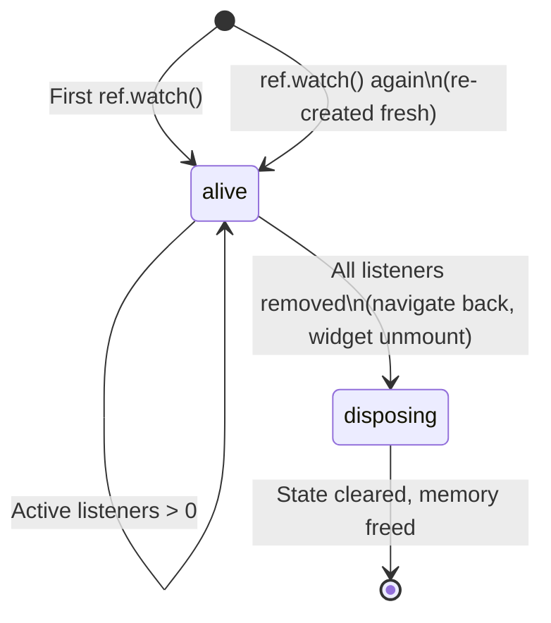

# Bài 3.3 — Provider Modifiers: autoDispose, family & Composition

## Phần 1 — Khái Niệm & Mục Tiêu Bài Học

### Tại sao modifiers quan trọng?

Một trong những điểm mạnh nhất của Riverpod là lifecycle management qua modifiers:

- **`autoDispose`**: Provider tự hủy khi không còn được watch → không memory leak
- **`family`**: Parameterize provider → một provider template cho nhiều instances

```dart
// Không autoDispose: provider sống mãi sau khi tạo
final productsProvider = AsyncNotifierProvider<...>(...);

// autoDispose: tự hủy khi không còn được watch (ví dụ: navigate back)
final productsProvider = AsyncNotifierProvider.autoDispose<...>(...);

// family: một template, nhiều instances theo parameter
final productDetailProvider = AsyncNotifierProvider.autoDispose.family<...>(
  (ref, productId) => ProductDetailNotifier(productId),
);
```

### Bạn sẽ hiểu được sau bài này:
- `autoDispose`: khi nào dùng và side effects
- `family`: parameterized providers — product detail, user profile
- `keepAlive`: giữ provider sống khi cần cache
- Provider composition: provider watch provider khác

---

## Phần 2 — Cơ Chế Hoạt Động (Under the Hood)

### autoDispose Lifecycle



**keepAlive**: `ref.keepAlive()` trong provider → ngăn autoDispose — dùng để cache.

---

## Phần 3 — Code Mẫu Chuẩn Google

### 3.1 — autoDispose: prevent memory leak

```dart
// Không autoDispose: ProductDetailNotifier sống mãi sau khi navigate back
// Vấn đề: giữ memory, có thể giữ stream subscription
final productDetailProvider = AsyncNotifierProvider<ProductDetailNotifier, Product>(
  ProductDetailNotifier.new,
);

// ✅ autoDispose: tự cleanup khi navigate back
final productDetailProvider = AsyncNotifierProvider.autoDispose<ProductDetailNotifier, Product>(
  ProductDetailNotifier.new,
);

class ProductDetailNotifier extends AutoDisposeAsyncNotifier<Product> {
  @override
  Future<Product> build() async {
    // Khi dispose: tất cả ref.onDispose callbacks chạy
    ref.onDispose(() {
      // Cleanup stream subscriptions, timers, v.v.
      print('ProductDetailNotifier disposed');
    });
    return ref.read(productRepositoryProvider).getProduct('id');
  }
}
```

### 3.2 — family: parameterized provider

```dart
// family: một provider template với parameter
// Syntax: Provider.family<ReturnType, ParameterType>
final productDetailProvider = AsyncNotifierProvider.autoDispose
    .family<ProductDetailNotifier, Product, String>(
  ProductDetailNotifier.new,
);

class ProductDetailNotifier
    extends AutoDisposeFamilyAsyncNotifier<Product, String> {
  @override
  Future<Product> build(String productId) async {
    // arg: parameter được truyền vào (productId)
    return ref.read(productRepositoryProvider).getProduct(productId);
  }

  Future<void> refresh() async {
    ref.invalidateSelf();
    await future;
  }
}

// Sử dụng với argument:
class ProductDetailScreen extends ConsumerWidget {
  final String productId;
  const ProductDetailScreen({super.key, required this.productId});

  @override
  Widget build(BuildContext context, WidgetRef ref) {
    // Truyền productId vào provider — mỗi productId tạo instance riêng
    final productAsync = ref.watch(productDetailProvider(productId));

    return Scaffold(
      body: productAsync.when(
        data: (product) => ProductDetailBody(product: product),
        loading: () => const CircularProgressIndicator(),
        error: (e, _) => ErrorView(error: e.toString()),
      ),
    );
  }
}
```

### 3.3 — keepAlive: cache strategy

```dart
// Cache provider: giữ alive để không re-fetch khi navigate back-forward
final productsProvider = AsyncNotifierProvider.autoDispose<ProductsNotifier, List<Product>>(
  ProductsNotifier.new,
);

class ProductsNotifier extends AutoDisposeAsyncNotifier<List<Product>> {
  @override
  Future<List<Product>> build() async {
    // keepAlive: ngăn autoDispose trong 5 phút
    final link = ref.keepAlive();

    // Cancel keepAlive sau 5 phút
    final timer = Timer(const Duration(minutes: 5), link.close);
    ref.onDispose(timer.cancel); // Cleanup timer khi dispose

    return ref.read(productRepositoryProvider).getProducts();
  }
}
```

### 3.4 — Provider composition

```dart
// Provider watch provider khác — dependency graph tự động
final currentUserProvider = StreamProvider<User?>((ref) {
  return ref.watch(authRepositoryProvider).authStateChanges();
});

final userCartProvider = AsyncNotifierProvider.autoDispose<CartNotifier, Cart>((ref) {
  // Watch currentUser → khi user thay đổi, provider tự rebuild
  final user = ref.watch(currentUserProvider).valueOrNull;
  return CartNotifier(user?.id);
});

// Derived state — computed từ nhiều providers
final cartItemCountProvider = Provider.autoDispose<int>((ref) {
  return ref.watch(userCartProvider).valueOrNull?.items.length ?? 0;
});

// Sử dụng nhiều providers trong widget
class AppBar extends ConsumerWidget {
  @override
  Widget build(BuildContext context, WidgetRef ref) {
    // Chỉ rebuild khi cartItemCount thay đổi (không phải toàn bộ cart)
    final cartCount = ref.watch(cartItemCountProvider);
    return Badge(
      count: cartCount,
      child: const Icon(Icons.shopping_cart),
    );
  }
}
```

---

## Phần 4 — Lỗi Sai Phổ Biến & Best Practices

### ❌ Anti-pattern 1: family với non-comparable parameter

```dart
// ❌ Object không implement == → mỗi lần tạo instance mới
final searchProvider = Provider.family<List<Product>, SearchFilter>((ref, filter) {
  // SearchFilter không override == → filter != filter → provider rebuilt mỗi lần!
});

// ✅ Parameter phải implement ==
// Dùng record (Dart 3) hoặc override ==
final searchProvider = Provider.autoDispose.family<List<Product>, (String, int)>((ref, params) {
  final (query, page) = params;
  // Record tự implement == theo structural equality
});
```

### ❌ Anti-pattern 2: Quên autoDispose cho detail screens

```dart
// ❌ productDetailProvider không autoDispose:
// Navigate vào 10 products → 10 instances trong memory
// Navigate back → instances vẫn còn, không cleanup
final productDetailProvider = AsyncNotifierProvider.family<...>(...);

// ✅ autoDispose.family: cleanup khi không còn ai watch
final productDetailProvider = AsyncNotifierProvider.autoDispose.family<...>(...);
```

---

## Phần 5 — Bài Tập Củng Cố Tư Duy

### Challenge: News Feed App

**Yêu cầu:**
1. `newsProvider = AsyncNotifierProvider.autoDispose` — fetch latest news
2. `newsDetailProvider = AsyncNotifierProvider.autoDispose.family<Article, String>` — detail theo id
3. Implement `keepAlive` 10 phút cho newsProvider
4. `commentCountProvider = Provider.autoDispose.family<int, String>` — computed từ news detail
5. Widget chỉ rebuild khi commentCount thay đổi (không phải toàn bộ article)

### Thử thách thẩm định kỹ thuật:

1. **"autoDispose vs không autoDispose — khi nào dùng cái nào?"**
   - autoDispose: detail screens, search results, user-specific data
   - Không autoDispose: app-wide state (auth, cart, settings)

2. **"family parameter types gì tốt?"**
   - Primitive: `String`, `int`, `bool` — tự implement ==
   - Record: `(String, int)` — structural equality
   - Tránh: custom class không override ==

3. **"Riverpod vs BLoC — khi nào chọn Riverpod?"**
   - Riverpod: provider composition mạnh, ít boilerplate, autoDispose tiện
   - BLoC: event transformers, audit trail, team đã quen BLoC
