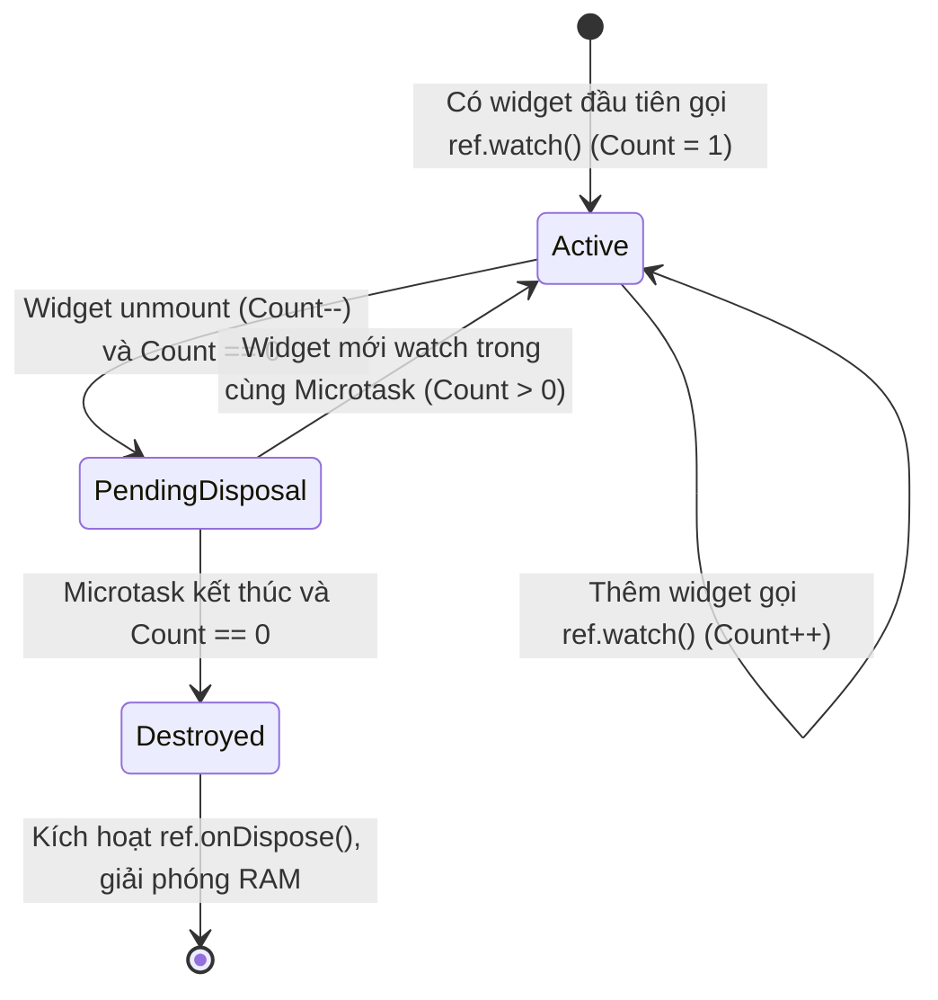
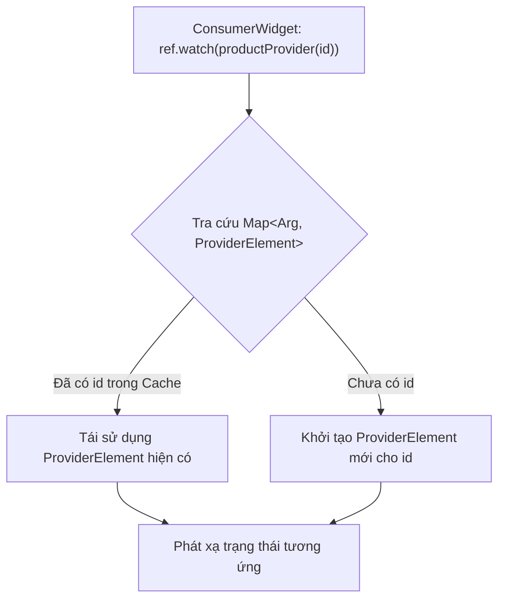

# Bài 3.3 — Tối Ưu Hóa Vòng Đời & Tham Số Hóa: autoDispose, family & Provider Composition

## Dẫn Chiếu Tài Liệu Chính Thức
- **Riverpod AutoDispose Modifier**: [riverpod.dev/docs/concepts/modifiers/auto_dispose](https://riverpod.dev/docs/concepts/modifiers/auto_dispose)
- **Riverpod Family Modifier**: [riverpod.dev/docs/concepts/modifiers/family](https://riverpod.dev/docs/concepts/modifiers/family)
- **KeepAliveLink API Reference**: [pub.dev/documentation/riverpod/latest/riverpod/KeepAliveLink-class.html](https://pub.dev/documentation/riverpod/latest/riverpod/KeepAliveLink-class.html)
- **Dart Object Equality & HashCode**: [dart.dev/guides/language/effective-dart/design#equality](dart.dev/guides/language/effective-dart/design#equality)

---

## Phần 1 — Khái Niệm & Bài Toán Kiến Trúc (Nó Là Gì & Giải Quyết Bài Toán Gì?)

### 1.1 — Nó Là Gì? Bộ Điều Chỉnh autoDispose, family & Provider Composition
Trong Riverpod, **Modifiers (Bộ điều chỉnh)** là các hàm bao (decorators) được gắn kèm vào định nghĩa của Provider nhằm can thiệp và biến đổi hành vi mặc định về vòng đời và tham số hóa dữ liệu:
- **`autoDispose`**: Cơ chế dọn dẹp bộ nhớ tự động, giải phóng trạng thái của Provider ngay khi không còn bất kỳ widget hay provider nào theo dõi nó.
- **`family`**: Cơ chế tham số hóa Provider, cho phép truyền các đối số động (Dynamic Arguments) từ tầng giao diện vào phương thức tạo lập trạng thái.
- **`Provider Composition`**: Mẫu thiết kế liên kết các Provider đơn nhiệm thành một đường ống xử lý phụ thuộc nhiều tầng (Multi-tier Dependency Pipeline) thông qua đồ thị DAG.

```
┌────────────────────────────────────────────────────────┐
│               PROVIDER VỚI CÁC MODIFIERS               │
│                                                        │
│  AsyncNotifierProvider                                 │
│    ├── .autoDispose  ──> Tự dọn dẹp khi hết listeners  │
│    └── .family       ──> Nhận tham số động (productId) │
└────────────────────────────────────────────────────────┘
```

### 1.2 — Giải Quyết Bài Toán Gì? Tràn Bộ Nhớ, Dữ Liệu Lỗi Thời & Tham Số Hóa Truy Vấn
Mặc định trong Riverpod, một Provider sau khi khởi tạo sẽ tồn tại vĩnh viễn trên Heap RAM của `ProviderContainer` cho đến khi toàn bộ ứng dụng bị tắt. Điều này gây ra 3 vấn đề kỹ thuật lớn:
1. **Lãng phí tài nguyên bộ nhớ (Memory Bloat)**: Khi người dùng lướt qua 50 sản phẩm khác nhau, nếu mỗi màn hình chi tiết đều giữ nguyên trạng thái trên RAM, ứng dụng sẽ nhanh chóng bị hệ điều hành tắt ngầm do vượt quá hạn ngạch bộ nhớ (Out of Memory - OOM).
2. **Trạng thái lỗi thời (Stale State)**: Khi mở lại cùng một màn hình với tham số khác, nếu không có cơ chế hủy trạng thái cũ, người dùng có thể thấy dữ liệu của sản phẩm trước đó trong một khoảnh khắc trước khi dữ liệu mới được tải xong.
3. **Phân mảnh truy vấn có tham số**: Nếu không có `family`, lập trình viên phải tự viết các logic lưu trữ `Map<String, Data>` thủ công bên trong StateNotifier/Cubit, gây phình to mã nguồn và dễ xảy ra lỗi đồng bộ.
4. **Tải lại mạng không cần thiết (Cache Inefficiency)**: Giải phóng tức thời khi rời màn hình cũng gây lãng phí băng thông nếu người dùng chỉ chuyển đổi qua lại giữa các tab trong vài giây. `KeepAliveLink` giải quyết bằng cơ chế bộ đệm có thời hạn (Time-To-Live Cache).

### 1.3 — Bảng So Sánh Các Bộ Điều Chỉnh Vòng Đời

| Bộ Điều Chỉnh | Thời Điểm Thu Hồi RAM | Kịch Bản Sử Dụng Chuẩn |
| :--- | :--- | :--- |
| **Mặc định (Không modifier)** | Khi `ProviderContainer` / `ProviderScope` bị hủy (thường là khi tắt ứng dụng). | Dịch vụ cấp cao: `ApiClient`, `AuthRepository`, `ThemeNotifier`. |
| **`.autoDispose`** | Khi toàn bộ listener unmount và chu kỳ Microtask kế tiếp kết thúc. | Màn hình phụ, form nhập liệu tạm thời, bộ lọc tìm kiếm. |
| **`.family`** | Phụ thuộc vào modifier đi kèm (`autoDispose` hoặc mặc định). | Chi tiết bài viết (`articleId`), thông tin đơn hàng (`orderId`). |
| **`.autoDispose` + `keepAlive()`** | Tự hủy sau khi hết hạn bộ đệm thời gian (Time-To-Live). | Trang danh mục, feed tin tức, tab chuyển đổi thường xuyên. |

### 1.4 — Mục Tiêu Kỹ Thuật Cần Đạt Được
- Nắm vững thuật toán đếm tham chiếu (Reference Counting) và chu trình dọn dẹp của `autoDispose`.
- Cài đặt cơ chế lưu đệm thông minh có thời hạn (Time-based Smart Caching) với `KeepAliveLink`.
- Hiểu rõ cơ chế bảng băm (HashMap) của `family` và các yêu cầu khắt khe về toán tử `operator ==`.
- Xây dựng chuỗi tổng hợp phụ thuộc 3 tầng an toàn và tối ưu hiệu năng.

---

## Phần 2 — Bản Chất Là Gì? (Under the Hood & Cơ Chế Hoạt Động)

### 2.1 — Thuật Toán Đếm Tham Chiếu (Reference Counting) Trong `autoDispose`

Khi một provider được gắn bộ điều chỉnh `.autoDispose`:
1. `ProviderContainer` duy trì một bộ đếm số lượng người theo dõi (Subscriber Count) cho `ProviderElement` đó.
2. Mỗi khi có một widget gọi `ref.watch(myProvider)` hoặc một provider khác theo dõi nó, bộ đếm tăng lên 1.
3. Khi widget unmount hoặc provider kia bị hủy, bộ đếm giảm đi 1.
4. **Cơ chế trì hoãn dọn dẹp (Disposal Delay)**: Khi bộ đếm chạm mốc 0, Riverpod **không giải phóng tức thì**, mà lên lịch một tác vụ dọn dẹp tại chu kỳ Microtask tiếp theo của Dart Event Loop.
   - Nếu trong cùng chu kỳ đó, một widget khác xuất hiện và gọi `ref.watch` (ví dụ: trong quá trình đổi trang hoặc chuyển hướng Hero animation), bộ đếm tăng trở lại $> 0$, tác vụ dọn dẹp bị hủy bỏ, giúp tránh việc tái tạo provider tốn kém tài nguyên.
   - Nếu hết chu kỳ Microtask mà bộ đếm vẫn bằng 0, phương thức `ref.onDispose` được kích hoạt, trạng thái bị xóa khỏi RAM.



### 2.2 — Cơ Chế Lưu Đệm Thông Minh Với `KeepAliveLink`

Trong nhiều trường hợp, việc giải phóng trạng thái ngay lập tức khi người dùng vừa rời khỏi màn hình là quá vội vàng (ví dụ: người dùng tạm thời chuyển tab hoặc mở ứng dụng khác trong vài giây). Riverpod cung cấp đối tượng `KeepAliveLink` để can thiệp vào thuật toán đếm tham chiếu:

```dart
final link = ref.keepAlive(); // Ngăn chặn việc dọn dẹp kể cả khi Count == 0
// Khi muốn dọn dẹp:
link.close(); // Cho phép autoDispose hoạt động trở lại
```

Bằng cách kết hợp `ref.keepAlive()` với `Timer`, chúng ta có thể thiết lập chính sách lưu đệm trong một khoảng thời gian cố định (Time-To-Live Cache): nếu người dùng quay lại trong vòng 60 giây, dữ liệu cũ vẫn còn nguyên; nếu quá 60 giây không ai xem, tài nguyên sẽ tự động giải phóng.

### 2.3 — Cơ Chế Bảng Băm Của Bộ Điều Chỉnh `family`

Khi khai báo một Provider có gắn `.family<ReturnType, ArgType>`:
- Riverpod khởi tạo một bảng băm nội bộ: `Map<ArgType, ProviderElement>`.
- Mỗi khi tầng giao diện gọi `ref.watch(productDetailProvider(productId))`, Riverpod tra cứu tham số `productId` trong bảng băm:
  - Nếu đã tồn tại một phần tử có khóa tương đương (dựa trên `operator ==` và `hashCode`), Riverpod tái sử dụng lại `ProviderElement` đó.
  - Nếu chưa có, Riverpod cấp phát một `ProviderElement` mới độc lập cho riêng tham số đó.
- **Yêu cầu bắt buộc**: Kiểu dữ liệu `ArgType` phải là kiểu bất biến (Immutable) và bắt buộc phải cài đặt chính xác toán tử so bằng `operator ==` và `hashCode`. Nếu truyền một đối tượng không ghi đè Equality, mỗi lần widget chạy lại hàm `build()` sẽ tạo ra một instance khóa mới, làm rò rỉ bộ nhớ vô tận.



---

## Phần 3 — Triển Khai Kỹ Thuật (Triển Khai Như Nào? Step-by-Step Implementation)

### 3.1 — Xây Dựng `AsyncNotifier` Kết Hợp `.autoDispose` Và `.family`

Cài đặt chi tiết màn hình chi tiết sản phẩm nhận `productId` làm tham số, tích hợp bộ nhớ đệm tự hủy sau 60 giây:

```dart
import 'dart:async';
import 'package:flutter/foundation.dart';
import 'package:flutter_riverpod/flutter_riverpod.dart';

// --- ENTITY MODEL ---
@immutable
class ProductDetail {
  final String id;
  final String title;
  final String description;
  final double price;
  final DateTime lastFetched;

  const ProductDetail({
    required this.id,
    required this.title,
    required this.description,
    required this.price,
    required this.lastFetched,
  });

  @override
  bool operator ==(Object other) =>
      identical(this, other) ||
      other is ProductDetail && id == other.id && lastFetched == other.lastFetched;

  @override
  int get hashCode => Object.hash(id, lastFetched);
}

// --- DỊCH VỤ DỮ LIỆU ---
abstract interface class ProductDetailRepository {
  Future<ProductDetail> fetchDetail(String id);
}

class FakeProductDetailRepository implements ProductDetailRepository {
  @override
  Future<ProductDetail> fetchDetail(String id) async {
    await Future<void>.delayed(const Duration(milliseconds: 700));
    return ProductDetail(
      id: id,
      title: 'Thiết Bị Điện Tử $id',
      description: 'Thông số kỹ thuật chi tiết của thiết bị mang định danh $id.',
      price: 199.99,
      lastFetched: DateTime.now(),
    );
  }
}

final productDetailRepositoryProvider = Provider<ProductDetailRepository>((ref) {
  return FakeProductDetailRepository();
});

// --- NOTIFIER KẾT HỢP AUTODISPOSE + FAMILY ---
class ProductDetailNotifier
    extends AutoDisposeFamilyAsyncNotifier<ProductDetail, String> {
  Timer? _cacheTimer;
  KeepAliveLink? _keepAliveLink;

  @override
  Future<ProductDetail> build(String arg) async {
    // 1. Quản lý dọn dẹp khi provider chính thức bị hủy
    ref.onDispose(() {
      _cacheTimer?.cancel();
      debugPrint('[Vòng đời] ProductDetailNotifier($arg) đã bị giải phóng khỏi RAM');
    });

    // 2. Kích hoạt cơ chế Smart Caching khi provider không còn ai theo dõi
    ref.onCancel(() {
      // Khi số lượng listener về 0, giữ lại cache trong 60 giây
      _keepAliveLink = ref.keepAlive();
      _cacheTimer?.cancel();
      _cacheTimer = Timer(const Duration(seconds: 60), () {
        // Hết 60 giây: Đóng liên kết giữ để autoDispose tiến hành dọn dẹp
        _keepAliveLink?.close();
      });
    });

    // 3. Hủy bộ đếm thời gian nếu có một widget khác kết nối lại trước khi hết 60s
    ref.onResume(() {
      _cacheTimer?.cancel();
    });

    // Nạp dữ liệu từ repository
    return ref.read(productDetailRepositoryProvider).fetchDetail(arg);
  }

  /// Làm mới thông tin chi tiết
  Future<void> refresh() async {
    ref.invalidateSelf();
    await future;
  }
}

// Khai báo Provider kết hợp autoDispose và family
final productDetailProvider = AsyncNotifierProvider.autoDispose
    .family<ProductDetailNotifier, ProductDetail, String>(
  ProductDetailNotifier.new,
);
```

### 3.2 — Kiến Trúc Tổng Hợp Provider (Provider Composition) 3 Tầng

Minh họa việc kết hợp nhiều provider độc lập để tạo ra một chuỗi xử lý danh mục sản phẩm hoàn chỉnh:

```dart
// --- TẦNG 1: CÁC NGUỒN TRẠNG THÁI NGUYÊN BẢN (PRIMITIVE PROVIDERS) ---

/// 1.1 Quản lý chuỗi tìm kiếm của người dùng
class SearchQueryNotifier extends AutoDisposeNotifier<String> {
  @override
  String build() => '';

  void setQuery(String query) => state = query.trim().toLowerCase();
}

final searchQueryProvider =
    NotifierProvider.autoDispose<SearchQueryNotifier, String>(
  SearchQueryNotifier.new,
);

/// 1.2 Quản lý danh mục được chọn
enum ProductCategory { all, electronics, fashion, home }

class CategoryFilterNotifier extends AutoDisposeNotifier<ProductCategory> {
  @override
  ProductCategory build() => ProductCategory.all;

  void selectCategory(ProductCategory category) => state = category;
}

final categoryFilterProvider =
    NotifierProvider.autoDispose<CategoryFilterNotifier, ProductCategory>(
  CategoryFilterNotifier.new,
);

/// 1.3 Kho dữ liệu tổng hợp thô
final rawCatalogProvider = Provider.autoDispose<List<ProductDetail>>((ref) {
  return [
    ProductDetail(
      id: '101',
      title: 'Máy Tính Xách Tay Mỏng Nhẹ',
      description: 'Dòng máy tính xách tay cao cấp',
      price: 1200.0,
      lastFetched: DateTime.now(),
    ),
    ProductDetail(
      id: '102',
      title: 'Áo Khoác Gió',
      description: 'Chất liệu chống thấm nước',
      price: 45.0,
      lastFetched: DateTime.now(),
    ),
    ProductDetail(
      id: '103',
      title: 'Nồi Cơm Điện Tử',
      description: 'Gia dụng thông minh',
      price: 85.0,
      lastFetched: DateTime.now(),
    ),
  ];
});

// --- TẦNG 2: COMPUTED PROVIDER TỔNG HỢP DỮ LIỆU ---

/// Provider này tự động tính toán lại khi BẤT KỲ nguồn dữ liệu nào ở tầng 1 thay đổi
final filteredCatalogProvider = Provider.autoDispose<List<ProductDetail>>((ref) {
  final query = ref.watch(searchQueryProvider);
  final category = ref.watch(categoryFilterProvider);
  final allItems = ref.watch(rawCatalogProvider);

  return allItems.where((item) {
    final matchesQuery = query.isEmpty ||
        item.title.toLowerCase().contains(query) ||
        item.description.toLowerCase().contains(query);

    // Giả định logic lọc danh mục theo giá trị đơn giản
    final matchesCategory = (category == ProductCategory.all) ||
        (category == ProductCategory.electronics && item.price > 500);

    return matchesQuery && matchesCategory;
  }).toList();
});

// --- TẦNG 3: COMPUTED METRICS PROVIDER ---

/// Tính toán tổng giá trị của các sản phẩm đang hiển thị
final totalCatalogValueProvider = Provider.autoDispose<double>((ref) {
  final filteredItems = ref.watch(filteredCatalogProvider);
  return filteredItems.fold(0.0, (sum, item) => sum + item.price);
});
```

### 3.3 — Giao Diện Người Dùng Tích Hợp Chi Tiết Sản Phẩm

```dart
import 'package:flutter/material.dart';
import 'package:flutter_riverpod/flutter_riverpod.dart';
import 'product_detail_notifier.dart';

class ProductDetailScreen extends ConsumerWidget {
  final String productId;

  const ProductDetailScreen({
    super.key,
    required this.productId,
  });

  @override
  Widget build(BuildContext context, WidgetRef ref) {
    // Truyền tham số productId vào family provider
    final asyncDetail = ref.watch(productDetailProvider(productId));

    return Scaffold(
      appBar: AppBar(
        title: Text('Sản Phẩm #$productId'),
        actions: [
          IconButton(
            icon: const Icon(Icons.refresh),
            onPressed: () {
              ref.read(productDetailProvider(productId).notifier).refresh();
            },
          ),
        ],
      ),
      body: asyncDetail.when(
        data: (detail) {
          return Padding(
            padding: const EdgeInsets.all(20.0),
            child: Column(
              crossAxisAlignment: CrossAxisAlignment.start,
              children: [
                Text(
                  detail.title,
                  style: Theme.of(context).textTheme.headlineMedium,
                ),
                const SizedBox(height: 8),
                Text(
                  '\$${detail.price.toStringAsFixed(2)}',
                  style: Theme.of(context).textTheme.titleLarge?.copyWith(
                        color: Theme.of(context).colorScheme.primary,
                        fontWeight: FontWeight.bold,
                      ),
                ),
                const SizedBox(height: 16),
                Text(detail.description),
                const Spacer(),
                Text(
                  'Dữ liệu tải lúc: ${detail.lastFetched.toIso8601String()}',
                  style: const TextStyle(color: Colors.grey, fontSize: 12),
                ),
              ],
            ),
          );
        },
        loading: () => const Center(child: CircularProgressIndicator()),
        error: (error, _) => Center(
          child: Column(
            mainAxisAlignment: MainAxisAlignment.center,
            children: [
              Text('Không thể tải thông tin: $error'),
              const SizedBox(height: 12),
              ElevatedButton(
                onPressed: () {
                  ref.read(productDetailProvider(productId).notifier).refresh();
                },
                child: const Text('Thử lại'),
              ),
            ],
          ),
        ),
      ),
    );
  }
}
```

---

## Phần 4 — Best Practices & Phòng Chống Cạm Bẫy (Defensive Engineering)

### 4.1 — Truyền Tham Số Vào `family` Mà Không Cài Đặt `operator ==`

#### Mô tả lỗi:
Truyền một lớp cấu hình hoặc một danh sách làm tham số cho `family` nhưng không ghi đè toán tử so bằng:

```dart
// Lỗi: Class không ghi đè operator ==
class FilterConfig {
  final String category;
  final int minPrice;
  const FilterConfig(this.category, this.minPrice);
}

final filteredProductsProvider = Provider.family<List<Product>, FilterConfig>((ref, config) {
  // ...
});

// Tầng giao diện:
@override
Widget build(BuildContext context, WidgetRef ref) {
  // Mỗi lần build() chạy, một instance FilterConfig MỚI được cấp phát trên Heap
  final products = ref.watch(filteredProductsProvider(FilterConfig('Laptop', 500)));
  return ListView(...);
}
```

#### Nguyên nhân kỹ thuật:
`family` sử dụng một bảng băm `Map<Arg, ProviderElement>`. Toán tử `==` mặc định của Dart so sánh theo tham chiếu địa chỉ bộ nhớ (`identical`). Vì mỗi lần hàm `build()` thực thi, từ khóa `FilterConfig(...)` tạo ra một địa chỉ ô nhớ mới, bảng băm kết luận đây là một tham số hoàn toàn mới chưa từng xuất hiện. Hệ quả là Riverpod liên tục tạo mới các `ProviderElement`, kích hoạt lại logic từ đầu và làm rò rỉ bộ nhớ nghiêm trọng.

#### Biện pháp khắc phục:
Sử dụng kiểu dữ liệu nguyên thủy (`String`, `int`), hoặc Dart 3 Record `(String category, int minPrice)`, hoặc ghi đè đầy đủ `operator ==` và `hashCode`:

```dart
// Khắc phục 1: Sử dụng Dart 3 Record (tự động hỗ trợ Value Equality)
final filteredProductsProvider = Provider.family<List<Product>, ({String category, int minPrice})>(
  (ref, config) { ... }
);

// Khắc phục 2: Ghi đè đầy đủ operator == trên class
@immutable
class FilterConfig {
  final String category;
  final int minPrice;
  const FilterConfig(this.category, this.minPrice);

  @override
  bool operator ==(Object other) =>
      identical(this, other) ||
      other is FilterConfig && category == other.category && minPrice == other.minPrice;

  @override
  int get hashCode => Object.hash(category, minPrice);
}
```

---

### 4.2 — Provider Thông Thường Lắng Nghe Provider Có Gắn `autoDispose`

#### Mô tả lỗi:
Một provider sống mãi (không có `autoDispose`) gọi `ref.watch()` một provider có gắn `autoDispose`:

```dart
// Lỗi: Provider sống mãi theo dõi Provider tự hủy
final tempDataProvider = Provider.autoDispose<String>((ref) => 'Dữ liệu tạm');

final permanentProvider = Provider<String>((ref) {
  return ref.watch(tempDataProvider); // Vi phạm quy tắc kiến trúc!
});
```

#### Nguyên nhân kỹ thuật:
`permanentProvider` không bao giờ bị giải phóng, đồng nghĩa với việc nó sẽ giữ một kết nối lắng nghe vĩnh viễn tới `tempDataProvider`. Số lượng subscriber của `tempDataProvider` sẽ không bao giờ giảm về 0, vô hiệu hóa hoàn toàn cơ chế tự dọn dẹp của `autoDispose`. Để bảo vệ tính toàn vẹn của đồ thị DAG, Riverpod sẽ báo lỗi cảnh báo hoặc ném ngoại lệ khi phát hiện liên kết này.

#### Biện pháp khắc phục:
Nếu một provider theo dõi một provider `autoDispose`, chính nó cũng bắt buộc phải được gắn bộ điều chỉnh `autoDispose`:

```dart
// Khắc phục: Gắn autoDispose đồng bộ trên toàn chuỗi phụ thuộc
final tempDataProvider = Provider.autoDispose<String>((ref) => 'Dữ liệu tạm');

final permanentProvider = Provider.autoDispose<String>((ref) {
  return ref.watch(tempDataProvider); // Hợp lệ
});
```

---

### 4.3 — Quên Đóng `KeepAliveLink` Gây Rò Rỉ Tài Nguyên Vĩnh Viễn

#### Mô tả lỗi:
Khởi tạo `ref.keepAlive()` nhưng không thiết lập cơ chế đóng link:

```dart
// Lỗi: Giữ vĩnh viễn không đóng
@override
Future<Data> build() async {
  ref.keepAlive(); // Không bao giờ gọi link.close()
  return fetchData();
}
```

#### Nguyên nhân kỹ thuật:
Phương thức `ref.keepAlive()` báo cho `ProviderElement` bỏ qua hoàn toàn số đếm listeners. Nếu không bao giờ gọi `link.close()`, provider này sẽ biến thành một provider thông thường tồn tại vĩnh viễn trên RAM, làm mất đi hoàn toàn mục đích sử dụng ban đầu của `autoDispose`.

#### Biện pháp khắc phục:
Luôn lưu trữ tham chiếu `KeepAliveLink` và đóng nó sau một khoảng thời gian chờ (Timer) hoặc khi có sự kiện hủy bỏ:

```dart
// Khắc phục: Đóng link qua bộ đếm thời gian
ref.onCancel(() {
  final link = ref.keepAlive();
  final timer = Timer(const Duration(seconds: 30), () => link.close());
  ref.onDispose(() => timer.cancel());
});
```

---

### 4.4 — Lạm Dụng `family` Với Các Tham Số Biến Thiên Liên Tục Mà Không Có `autoDispose`

#### Mô tả lỗi:
Khai báo `Provider.family` mà không có `.autoDispose` với tham số là các giá trị ngẫu nhiên hoặc timestamp:

```dart
// Lỗi: family không có autoDispose với tham số động
final transactionProvider = Provider.family<Receipt, DateTime>((ref, timestamp) {
  return generateReceipt(timestamp);
});
```

#### Nguyên nhân kỹ thuật:
Mỗi lần truyền một `DateTime` mới, một entry mới được bổ sung vào bảng băm của `family`. Vì không có `autoDispose`, tất cả các phần tử này sẽ nằm lại vĩnh viễn trong RAM. Khi ứng dụng hoạt động liên tục trong thời gian dài, bảng băm sẽ phình to tới hàng ngàn phần tử, gây ra hiện tượng tràn bộ nhớ (Out Of Memory).

#### Biện pháp khắc phục:
Bắt buộc phải kết hợp `.autoDispose` bất cứ khi nào sử dụng `family` với các tham số mang tính biến thiên:

```dart
// Khắc phục: Luôn gắn autoDispose cho family động
final transactionProvider = Provider.autoDispose.family<Receipt, DateTime>((ref, timestamp) {
  return generateReceipt(timestamp);
});
```

---

## Phần 5 — Khảo Sát Bản Chất Kỹ Thuật & Phân Tích Mã Nguồn (Deep-Dive & Code Tracing)

### 5.1 — Khảo Sát Bản Chất Kỹ Thuật

#### Câu hỏi 1: Tại sao Riverpod sử dụng cơ chế trì hoãn Microtask (Disposal Delay) thay vì xóa ngay khi listener count = 0?
*Phân tích:*
Trong quá trình Flutter vẽ lại cây widget (Rebuilding) hoặc khi thực hiện hiệu ứng chuyển trang (PageRoute transition), một widget cũ có thể bị unmount ở khung hình $N$, và một widget mới sử dụng cùng provider đó sẽ được gắn vào cây ở khung hình $N$ ngay sau đó vài microsecond. Nếu Riverpod xóa dữ liệu ngay lập tức khi widget cũ unmount, hệ thống sẽ phải hủy bỏ socket, xóa cache và nạp lại toàn bộ dữ liệu từ đầu cho widget mới. Cơ chế trì hoãn một chu kỳ Microtask hoạt động như một bộ đệm (Debounce), giúp triệt tiêu các chu kỳ hủy/tạo lặp lại không đáng có.

---

#### Câu hỏi 2: Có giới hạn nào về số lượng tham số mà bộ điều chỉnh `.family` có thể tiếp nhận hay không?
*Phân tích:*
Về mặt cú pháp tiêu chuẩn của Riverpod, `.family` chỉ tiếp nhận duy nhất một tham số `ArgType`. Để truyền nhiều tham số cùng lúc (ví dụ: `categoryId`, `sortBy`, `page`), lập trình viên sử dụng tính năng **Record** của Dart 3:
`Provider.family<Data, ({String categoryId, String sortBy, int page})>`.
Record của Dart 3 tự động ghi đè sẵn `operator ==` và `hashCode` dựa trên các trường cấu thành, vừa đáp ứng chuẩn xác yêu cầu bảng băm của Riverpod, vừa đảm bảo tính an toàn kiểu dữ liệu mà không cần phải viết thêm boilerplate class.

---

#### Câu hỏi 3: Khi một Provider ở tầng gốc trong chuỗi Provider Composition bị `invalidate`, luồng tính toán lại sẽ diễn ra theo thứ tự nào?
*Phân tích:*
Thuật toán duyệt đồ thị DAG của Riverpod áp dụng cơ chế đánh dấu lười (Lazy Topological Sort):
1. Provider gốc bị `invalidate`, chuyển trạng thái sang `dirty`.
2. Tín hiệu lan truyền xuống các provider phụ thuộc trực tiếp ở tầng 2, đánh dấu chúng là `dirty`.
3. Tín hiệu tiếp tục lan xuống tầng 3 và các widget.
4. Quá trình tính toán lại chỉ thực sự diễn ra khi có một `ConsumerWidget` hoặc một lệnh đọc yêu cầu dữ liệu. Các provider sẽ được tính toán tuần tự từ gốc tới ngọn (Top-Down), đảm bảo mỗi provider chỉ tính toán lại đúng một lần duy nhất với giá trị mới nhất của các phụ thuộc.

---

#### Câu hỏi 4: Sự khác nhau giữa `ref.onCancel()` và `ref.onDispose()` là gì?
*Phân tích:*
- `ref.onCancel(callback)`: Được kích hoạt ngay khi **số lượng listeners giảm về 0**. Lúc này provider vẫn còn sống trong bộ nhớ (chưa bị hủy) và đang chờ trong chu kỳ Microtask trì hoãn hoặc được giữ bởi `keepAlive`.
- `ref.onDispose(callback)`: Được kích hoạt khi provider **chính thức bị xóa sổ khỏi bộ nhớ**. Đây là cơ hội cuối cùng để giải phóng các tài nguyên phần cứng tầng thấp như đóng file, ngắt kết nối WebSocket, hoặc hủy bỏ các Timer.

---

#### Câu hỏi 5: Bộ nhớ heap sẽ phản ứng như thế nào nếu một ứng dụng liên tục gọi `family` với 10.000 tham số khác nhau nhưng có gắn `.autoDispose`?
*Phân tích:*
Nhờ có `.autoDispose`, ngay khi widget kết thúc việc hiển thị dữ liệu của một tham số cụ thể, `ProviderElement` tương ứng với tham số đó sẽ tự hủy và tự động gỡ bỏ khóa của nó ra khỏi bảng băm `Map<Arg, ProviderElement>`. Do đó, tại bất kỳ thời điểm nào, số lượng phần tử tồn tại trong RAM chỉ tương ứng với số lượng widget đang thực sự hiển thị trên màn hình (thường chỉ từ vài phần tử tới vài chục phần tử), bộ nhớ heap hoàn toàn ổn định và không bao giờ bị rò rỉ.

---

### 5.2 — Bài Tập Phân Tích Luồng Thực Thi (Code Tracing)

Xét kịch bản kiểm thử vòng đời của một `productDetailProvider.autoDispose.family`:

```dart
// Người dùng điều hướng:
// Màn hình Danh Sách -> Màn hình Chi Tiết ('p1') -> Quay lại Danh Sách -> Mở lại Chi Tiết ('p1')
```

Giả sử `ProductDetailNotifier` cài đặt bộ nhớ đệm `ref.keepAlive()` có thời hạn `30 giây`.

#### Phân tích biến đổi vòng đời qua từng giai đoạn:

1. **Giai đoạn 1: Mở màn hình Chi tiết 'p1' lần đầu**:
   - `ref.watch(productDetailProvider('p1'))` được gọi.
   - Bảng băm chưa có `'p1'`. Cấp phát `ProviderElement('p1')`.
   - Hàm `build('p1')` chạy: Nạp dữ liệu từ máy chủ.
   - Số lượng Listeners = 1.

2. **Giai đoạn 2: Người dùng nhấn nút Back quay lại Danh sách (T = 5s)**:
   - Màn hình Chi tiết unmount.
   - Số lượng Listeners của `'p1'` giảm từ 1 về 0.
   - Callback `ref.onCancel` được kích hoạt:
     - Gọi `_keepAliveLink = ref.keepAlive();`.
     - Bắt đầu bộ đếm thời gian 30 giây (`Timer(Duration(seconds: 30), ...)`).
   - Microtask kết thúc: Vì có `KeepAliveLink`, `ProviderElement('p1')` **KHÔNG bị giải phóng**. Trạng thái dữ liệu của `'p1'` vẫn tồn tại nguyên vẹn trong RAM.

3. **Giai đoạn 3: Người dùng mở lại màn hình Chi tiết 'p1' tại T = 15s (Chưa hết 30s)**:
   - `ref.watch(productDetailProvider('p1'))` được gọi lại.
   - Bảng băm tra cứu thấy `'p1'` đã tồn tại sẵn.
   - Callback `ref.onResume` được kích hoạt:
     - Hủy bộ đếm thời gian `_cacheTimer?.cancel()`.
   - **Không gọi lại API máy chủ!** Dữ liệu cũ hiển thị tức thì trên màn hình mà không cần vòng quay tải dữ liệu (`CircularProgressIndicator`).
   - Số lượng Listeners tăng trở lại = 1.

4. **Giai đoạn 4: Người dùng nhấn Back lần 2 và không quay lại trong 35 giây (T > 45s)**:
   - Listeners giảm về 0 $\to$ `onCancel` bật lại bộ đếm 30s.
   - Sau 30 giây trôi qua: Callback của `Timer` thực thi `_keepAliveLink?.close()`.
   - Liên kết giữ bị đóng. Microtask tiếp theo phát hiện Listeners = 0 và không còn `KeepAliveLink`.
   - Kích hoạt callback `ref.onDispose`: In log giải phóng và dọn dẹp RAM hoàn toàn.
