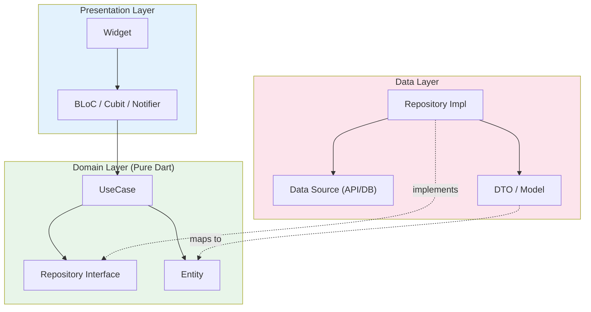

# Bài 4.1 — Layers: Domain, Data & Presentation

## Phần 1 — Khái Niệm & Mục Tiêu Bài Học

### Tại sao Clean Architecture?

Khi app tăng lên 20, 50, 100 màn hình — code trở nên khó maintain nếu:
- Business logic trộn lẫn trong Widget
- ViewModel gọi API trực tiếp
- Thay đổi API response format → phải sửa khắp nơi

Clean Architecture giải quyết bằng cách tách thành **3 layer độc lập**:

```
Presentation (UI)
    ↓ calls
Domain (Business Logic) ← không phụ thuộc ai
    ↓ calls interface
Data (API, DB, Cache)
```

**Dependency Rule**: Luồng phụ thuộc chỉ đi vào trong. Data biết về Domain. Domain không biết về Data hay Presentation.

### Bạn sẽ hiểu được sau bài này:
- 3 layers và trách nhiệm của từng layer
- Feature-first folder structure (khuyến nghị cho Flutter)
- Dependency Rule và cách triển khai với interface
- Sự khác biệt với Layer-first structure

---

## Phần 2 — Cơ Chế Hoạt Động (Under the Hood)

### Dependency Flow



---

## Phần 3 — Code Mẫu Chuẩn Google

### 3.1 — Feature-First Folder Structure

```
lib/
├── main.dart
├── core/
│   ├── error/
│   │   ├── exceptions.dart
│   │   └── failures.dart
│   ├── network/
│   │   └── dio_client.dart
│   └── di/
│       └── injection.dart          ← get_it setup
│
├── features/
│   ├── auth/
│   │   ├── domain/
│   │   │   ├── entities/
│   │   │   │   └── user.dart
│   │   │   ├── repositories/
│   │   │   │   └── auth_repository.dart   ← INTERFACE
│   │   │   └── usecases/
│   │   │       ├── login_usecase.dart
│   │   │       └── logout_usecase.dart
│   │   ├── data/
│   │   │   ├── datasources/
│   │   │   │   ├── auth_remote_datasource.dart
│   │   │   │   └── auth_local_datasource.dart
│   │   │   ├── models/
│   │   │   │   └── user_model.dart          ← DTO extends/maps to Entity
│   │   │   └── repositories/
│   │   │       └── auth_repository_impl.dart ← IMPLEMENTATION
│   │   └── presentation/
│   │       ├── bloc/
│   │       │   ├── auth_bloc.dart
│   │       │   └── auth_state.dart
│   │       ├── pages/
│   │       │   ├── login_page.dart
│   │       │   └── register_page.dart
│   │       └── widgets/
│   │           └── login_form.dart
│   │
│   └── products/
│       ├── domain/
│       ├── data/
│       └── presentation/
```

### 3.2 — Domain Layer: Entity (Pure Dart, no Flutter imports)

```dart
// features/auth/domain/entities/user.dart
// Entity: business object — KHÔNG import Flutter, KHÔNG import Dart:io
class User {
  final String id;
  final String name;
  final String email;
  final UserRole role;
  final DateTime createdAt;

  const User({
    required this.id,
    required this.name,
    required this.email,
    required this.role,
    required this.createdAt,
  });

  // Business logic thuộc về Entity
  bool get isAdmin => role == UserRole.admin;
  bool get isPremium => role == UserRole.premium || isAdmin;
  String get displayName => name.isEmpty ? email.split('@').first : name;

  @override
  bool operator ==(Object other) =>
      other is User && id == other.id;

  @override
  int get hashCode => id.hashCode;
}

enum UserRole { user, premium, admin }
```

```dart
// features/auth/domain/repositories/auth_repository.dart
// Interface: Domain định nghĩa contract — Data implement
// Domain KHÔNG biết implementation là API hay DB
abstract interface class AuthRepository {
  Future<User> login({required String email, required String password});
  Future<User> register({required String name, required String email, required String password});
  Future<void> logout();
  Future<User?> getCurrentUser();
  Stream<User?> get authStateChanges;
}
```

### 3.3 — Data Layer: DTO & Repository Implementation

```dart
// features/auth/data/models/user_model.dart
// DTO (Data Transfer Object): mirror API JSON structure
// Tách biệt với Entity — Entity không bị ảnh hưởng khi API thay đổi
class UserModel {
  final String id;
  final String name;
  final String email;
  final String role;
  final String createdAt;

  const UserModel({
    required this.id,
    required this.name,
    required this.email,
    required this.role,
    required this.createdAt,
  });

  factory UserModel.fromJson(Map<String, dynamic> json) => UserModel(
    id: json['id'] as String,
    name: json['name'] as String,
    email: json['email'] as String,
    role: json['role'] as String? ?? 'user',
    createdAt: json['created_at'] as String,
  );

  Map<String, dynamic> toJson() => {
    'id': id,
    'name': name,
    'email': email,
    'role': role,
    'created_at': createdAt,
  };

  // Map DTO → Entity (Domain object)
  User toEntity() => User(
    id: id,
    name: name,
    email: email,
    role: UserRole.values.firstWhere(
      (r) => r.name == role,
      orElse: () => UserRole.user,
    ),
    createdAt: DateTime.parse(createdAt),
  );
}

// features/auth/data/repositories/auth_repository_impl.dart
class AuthRepositoryImpl implements AuthRepository {
  final AuthRemoteDataSource _remote;
  final AuthLocalDataSource _local;

  const AuthRepositoryImpl({
    required AuthRemoteDataSource remote,
    required AuthLocalDataSource local,
  }) : _remote = remote, _local = local;

  @override
  Future<User> login({required String email, required String password}) async {
    try {
      final userModel = await _remote.login(email: email, password: password);
      await _local.cacheUser(userModel);
      return userModel.toEntity();        // DTO → Entity
    } on DioException catch (e) {
      throw NetworkException.fromDio(e); // Map exception tới domain exception
    }
  }

  @override
  Future<User?> getCurrentUser() async {
    final cached = await _local.getCachedUser();
    return cached?.toEntity();
  }

  @override
  Stream<User?> get authStateChanges =>
      _local.userStream.map((model) => model?.toEntity());

  @override
  Future<void> logout() async {
    await Future.wait([
      _remote.logout(),
      _local.clearUser(),
    ]);
  }

  @override
  Future<User> register({required String name, required String email, required String password}) async {
    final model = await _remote.register(name: name, email: email, password: password);
    await _local.cacheUser(model);
    return model.toEntity();
  }
}
```

---

## Phần 4 — Lỗi Sai Phổ Biến & Best Practices

### ❌ Anti-pattern 1: Domain import Flutter

```dart
// ❌ Domain layer import Flutter → vi phạm dependency rule
// Unit test Domain layer không thể chạy trên máy không có Flutter SDK
import 'package:flutter/material.dart'; // ❌ trong domain entity!

class Product {
  final Color badgeColor; // Flutter type trong domain entity!
}

// ✅ Domain chỉ dùng Dart core
class Product {
  final int badgeColorValue; // int — Presentation layer convert sang Color
}
```

### ❌ Anti-pattern 2: Layer-first structure cho lớn app

```dart
// ❌ Layer-first: tất cả repositories trong một folder
// Merge conflict nhiều khi team làm parallel features
lib/
├── repositories/
│   ├── auth_repository.dart    ← cùng folder với products, orders...
│   ├── product_repository.dart
│   └── order_repository.dart
├── blocs/
└── screens/

// ✅ Feature-first: mỗi feature là module độc lập
lib/features/
├── auth/          ← team A
├── products/      ← team B
└── orders/        ← team C
```

---

## Phần 5 — Bài Tập Củng Cố Tư Duy

### Challenge: Products Feature Skeleton

**Yêu cầu:**
1. Tạo cấu trúc folder `features/products/` với 3 layers
2. Entity `Product` (id, name, price, category, inStock) — Pure Dart
3. Interface `ProductRepository` với 4 methods
4. DTO `ProductModel` với `fromJson` và `toEntity()`
5. Không cần implement, chỉ cần đúng structure và types

### Câu hỏi phỏng vấn:

1. **"Feature-first vs Layer-first — bạn chọn cái nào và tại sao?"**
   - Feature-first: better for team, less merge conflicts, easier to reason about bounded context
   - Layer-first: okay for small apps, easier to see all repos/blocs at once

2. **"Tại sao Entity không được import Flutter?"**
   - Domain layer phải là Pure Dart → có thể test với `dart test` thuần (nhanh hơn, không cần emulator)
   - Flutter types coupling → khó migrate hoặc share với Dart backend
