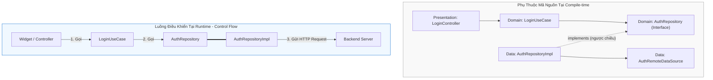

# Bài 4.1 — Kiến Trúc Phân Tầng Trong Flutter: Domain, Data & Presentation Layer

## Dẫn Chiếu Tài Liệu Chính Thức
- **The Clean Architecture (Robert C. Martin)**: [blog.cleancoder.com/uncle-bob/2012/08/13/the-clean-architecture.html](https://blog.cleancoder.com/uncle-bob/2012/08/13/the-clean-architecture.html)
- **Flutter Official Architecture Guide**: [docs.flutter.dev/app-architecture](https://docs.flutter.dev/app-architecture)
- **Dart Abstract Interface Classes**: [dart.dev/language/class-modifiers#abstract-interface](https://dart.dev/language/class-modifiers#abstract-interface)
- **Effective Dart: Architecture & Design**: [dart.dev/effective-dart/design](https://dart.dev/effective-dart/design)

---

## Phần 1 — Khái Niệm & Bài Toán Kiến Trúc (Nó Là Gì & Giải Quyết Bài Toán Gì?)

### 1.1 — Nó Là Gì? Định Vị Clean Architecture Trong Flutter
Clean Architecture (Kiến trúc Sạch) trong hệ sinh thái Flutter là một mô hình tổ chức mã nguồn phân tách hệ thống phần mềm thành các vòng tròn đồng tâm đại diện cho các phân tầng trừu tượng độc lập. Trong ứng dụng Flutter chuẩn enterprise, mô hình này được tinh chỉnh thành 3 phân tầng cốt lõi:

```
┌─────────────────────────────────────────────────────────────────────────┐
│                           PRESENTATION LAYER                            │
│           Widgets, Screens, State Management (BLoC / Riverpod)          │
└────────────────────────────────────┬────────────────────────────────────┘
                                     │ Phụ thuộc (Calls)
                                     ▼
┌─────────────────────────────────────────────────────────────────────────┐
│                              DOMAIN LAYER                               │
│        Entities, UseCases / Interactors, Repository Interfaces          │
│                       (Pure Dart — 0% Flutter)                          │
└────────────────────────────────────▲────────────────────────────────────┘
                                     │ Thực thi interface (Implements)
┌────────────────────────────────────┴────────────────────────────────────┐
│                               DATA LAYER                                │
│       Repository Implementations, Data Sources (Remote/Local), DTOs     │
└─────────────────────────────────────────────────────────────────────────┘
```

1. **Domain Layer (Lớp Nghiệp Vụ Cốt Lõi)**:
   - Là trung tâm của ứng dụng, hoàn toàn độc lập với mọi framework, cơ sở dữ liệu, hoặc giao thức mạng bên ngoài.
   - Viết bằng Dart thuần túy (**Pure Dart**). Tuyệt đối không import `package:flutter/*`, `dart:io`, `dio`, hay bất kỳ thư viện bên thứ ba nào.
   - Chứa: **Entities** (đối tượng nghiệp vụ), **UseCases** (hành vi nghiệp vụ cụ thể), và **Repository Interfaces** (hợp đồng trừu tượng).

2. **Data Layer (Lớp Dữ Liệu & Hạ Tầng)**:
   - Chịu trách nhiệm truy xuất, lưu trữ và đồng bộ dữ liệu từ các nguồn thực tế: REST API, GraphQL, WebSockets, Local Database (SQLite/Isar/Hive), hoặc SharedPreferences.
   - Chứa: **Data Sources** (giao tiếp trực tiếp với I/O), **DTOs / Models** (ánh xạ định dạng JSON/Database), và **Repository Implementations** (hiện thực hóa các hợp đồng mà Domain yêu cầu).

3. **Presentation Layer (Lớp Hiển Thị Giao Diện)**:
   - Chịu trách nhiệm render giao diện người dùng và quản lý trạng thái hiển thị.
   - Chứa: **Widgets / Pages**, **Controllers / BLoC / Notifier**, và các đối tượng định dạng UI (**ViewModels**).
   - Tương tác với Domain Layer thông qua việc kích hoạt các UseCases hoặc lắng nghe luồng dữ liệu nghiệp vụ.

**Quy Tắc Phụ Thuộc (The Dependency Rule)**:
> Mọi chiều phụ thuộc của mã nguồn (Source Code Dependency) **bắt buộc chỉ được hướng vào trong**, về phía Domain Layer. Tầng bên trong không bao giờ được phép biết bất kỳ thông tin nào về tầng bên ngoài.

---

### 1.2 — Giải Quyết Bài Toán Gì? Những Bế Tắc Kỹ Thuật Khi Ứng Dụng Mở Rộng
Khi một ứng dụng Flutter vượt qua quy mô ban đầu và đạt từ 20 đến hơn 100 màn hình, việc thiếu một kiến trúc phân tầng chặt chẽ sẽ gây ra 4 sự cố kiến trúc nghiêm trọng:

1. **Ghép nối chặt chẽ (Tight Coupling) và "Massive Widget"**:
   - Khi logic gọi API (`http.get`), logic xử lý nghiệp vụ (tính toán chiết khấu, kiểm tra quyền), và logic hiển thị UI nằm chung trong một `StatefulWidget`, mã nguồn trở nên không thể bảo trì. Thay đổi một logic nghiệp vụ nhỏ buộc phải sửa đổi và kiểm thử lại toàn bộ widget.
2. **Khó khăn trong kiểm thử tự động (Untestable Codebase)**:
   - Khi giao diện gắn liền với logic truy vấn I/O, việc viết Unit Test cho một quy tắc nghiệp vụ đòi hỏi phải khởi tạo cây widget giả lập hoặc cấu hình mock server phức tạp. Clean Architecture cho phép kiểm thử toàn bộ Domain Layer chỉ với các lệnh `dart test` thuần túy, thực thi hàng nghìn ca kiểm thử trong vài giây.
3. **Hiệu ứng sụp đổ dây chuyền khi API thay đổi (Contract Fragility)**:
   - Nếu tầng UI tiêu thụ trực tiếp các cấu trúc JSON trả về từ backend, chỉ một thay đổi nhỏ về tên trường (ví dụ: `user_name` đổi thành `name`) sẽ làm phát sinh lỗi biên dịch và lỗi runtime trên hàng chục màn hình hiển thị.
4. **Xung đột mã nguồn khi nhiều kỹ sư cùng làm việc (Merge Conflicts)**:
   - Tổ chức mã nguồn theo kiểu phân loại tầng phẳng (`/controllers`, `/models`, `/views` cho toàn bộ app) khiến các tính năng bị phân mảnh. Nhiều kỹ sư cùng sửa chung các thư mục tập trung dẫn đến xung đột git liên tục.

---

### 1.3 — Bảng Phân Định Trách Nhiệm Kỹ Thuật Giữa 3 Phân Tầng

| Tiêu Chí | Domain Layer | Data Layer | Presentation Layer |
| :--- | :--- | :--- | :--- |
| **Bản chất công nghệ** | Pure Dart thuần túy. | Dart + Thư viện I/O (Dio, Isar, DB). | Flutter SDK (Widgets, Canvas, Animations). |
| **Phụ thuộc ai?** | **Không phụ thuộc bất kỳ tầng nào.** | Phụ thuộc Domain Layer. | Phụ thuộc Domain Layer. |
| **Mục đích chính** | Định nghĩa quy tắc kinh doanh và hợp đồng dữ liệu. | Thu thập, lưu đệm và chuyển đổi dữ liệu mạng/DB. | Nhận tương tác người dùng và hiển thị đồ họa. |
| **Xử lý Exception** | Định nghĩa các lớp lỗi nghiệp vụ (`Failure`). | Bắt exception I/O (`DioException`) và ánh xạ sang `Failure`. | Hiển thị thông báo lỗi thân thiện cho người dùng. |
| **Kiểm thử** | Unit Test thuần Dart (Tốc độ tối đa). | Unit Test với Mock HTTP / DB Client. | Widget Test & Goldens Test. |

---

### 1.4 — Mục Tiêu Kỹ Thuật Cần Đạt Được
- Nắm vững nguyên lý Đảo ngược Phụ thuộc (DIP) và cách thiết lập ranh giới biên dịch bằng `abstract interface class`.
- Thành thạo cấu trúc thư mục **Feature-First** chuẩn enterprise để cô lập phạm vi tính năng.
- Triển khai luồng dữ liệu 2 chiều an toàn: Request đi xuống từ UI qua Domain đến Data; Response đi ngược lên và được biến đổi từ DTO sang Entity.
- Nhận diện và loại bỏ các vi phạm ranh giới kiến trúc (Architectural Boundary Leaks).

---

## Phần 2 — Bản Chất Là Gì? (Under the Hood & Cơ Chế Hoạt Động)

### 2.1 — Bản Chất Của Đảo Ngược Phụ Thuộc (Dependency Inversion Principle - DIP)
Vấn đề nghịch lý thường thấy trong các kiến trúc truyền thống là: **Tầng nghiệp vụ (Domain) cần dữ liệu từ Tầng hạ tầng (Data), nhưng Tầng nghiệp vụ lại không được phép phụ thuộc vào Tầng hạ tầng.**

Clean Architecture giải quyết nghịch lý này bằng nguyên lý Đảo ngược Phụ thuộc (DIP):
- Thay vì Domain gọi trực tiếp một class cụ thể của Data (`AuthRemoteDataSource`), Domain tự định ra một hợp đồng trừu tượng: **`AuthRepository` (Interface)**.
- Data Layer ở tầng ngoài đóng vai trò là bên thực thi (`AuthRepositoryImpl implements AuthRepository`).
- Tại thời điểm biên dịch (Compile-time), mã nguồn của Domain hoàn toàn không có bất kỳ dòng import nào liên quan tới Data Layer.
- Tại thời điểm thực thi (Runtime), thông qua cơ chế Đa hình (Polymorphism) và Tiêm phụ thuộc (Dependency Injection với `get_it` hoặc Riverpod), instance thực tế của Data Layer được chuyển vào cho Domain sử dụng.



---

### 2.2 — Cấu Trúc Thư Mục: Feature-First So Với Layer-First

Trong phát triển Flutter thực chiến, có 2 cách tiếp cận tổ chức mã nguồn:

1. **Layer-First (Tổ chức theo tầng kỹ thuật)**:
   ```text
   lib/
   ├── controllers/
   ├── models/
   ├── repositories/
   └── views/
   ```
   *Hạn chế*: Khi thêm mới hoặc sửa đổi tính năng "Auth", lập trình viên phải mở 4 thư mục cách xa nhau. Khi dự án lớn dần, mỗi thư mục chứa hàng trăm tệp tin, gây khó khăn cho việc định vị và kiểm soát phạm vi tác động.

2. **Feature-First (Tổ chức theo ranh giới tính năng - Bounded Context)**:
   - Mỗi tính năng là một module độc lập khép kín chứa cả 3 tầng `domain`, `data`, và `presentation`.
   - Các logic dùng chung toàn ứng dụng được gom về thư mục `core/`.
   - **Đây là tiêu chuẩn bắt buộc cho các dự án Enterprise**: Giúp tăng tính cô lập, dễ dàng xóa bỏ hoặc tái cấu trúc một tính năng mà không ảnh hưởng tới phần còn lại của ứng dụng.

```
lib/
├── core/                           # Thành phần dùng chung toàn hệ thống
│   ├── constants/                  # Hằng số cấu hình, asset paths
│   ├── error/                      # Failure & Exception classes
│   ├── network/                    # Dio client, Interceptors, NetworkInfo
│   ├── theme/                      # Material 3 ThemeData, ColorScheme
│   └── di/                         # Service Locator / Dependency Injection
│
└── features/                       # Các module tính năng độc lập
    ├── auth/                       # Tính năng xác thực người dùng
    │   ├── domain/                 # Domain của Auth (Pure Dart)
    │   ├── data/                   # Data của Auth (API, Models)
    │   └── presentation/           # Giao diện & BLoC/Cubit của Auth
    │
    ├── products/                   # Tính năng danh mục sản phẩm
    │   ├── domain/
    │   ├── data/
    │   └── presentation/
    │
    └── checkout/                   # Tính năng thanh toán & giỏ hàng
        ├── domain/
        ├── data/
        └── presentation/
```

---

## Phần 3 — Triển Khai Kỹ Thuật (Triển Khai Như Nào? Step-by-Step Implementation)

Xây dựng hoàn chỉnh phân tầng Clean Architecture cho tính năng Xác Thực Người Dùng (`features/auth/`).

### 3.1 — Bước 1: Xây Dựng Domain Layer (Pure Dart)

#### 1. Entity Nghiệp Vụ: `user.dart`
Entity đại diện cho đối tượng cốt lõi của doanh nghiệp. Sử dụng thuộc tính `final`, toán tử `==` và phương thức `copyWith` để đảm bảo tính bất biến (Immutability).

```dart
// lib/features/auth/domain/entities/user.dart

import 'package:flutter/foundation.dart';

enum UserTier { standard, premium, enterprise }

@immutable
class User {
  final String id;
  final String email;
  final String fullName;
  final UserTier tier;
  final DateTime createdAt;

  const User({
    required this.id,
    required this.email,
    required this.fullName,
    required this.tier,
    required this.createdAt,
  });

  // Quy tắc nghiệp vụ (Business Rule) trực thuộc Entity
  bool get canAccessVipFeatures => tier == UserTier.premium || tier == UserTier.enterprise;
  bool get isNewlyRegistered => DateTime.now().difference(createdAt).inDays < 7;

  User copyWith({
    String? id,
    String? email,
    String? fullName,
    UserTier? tier,
    DateTime? createdAt,
  }) {
    return User(
      id: id ?? this.id,
      email: email ?? this.email,
      fullName: fullName ?? this.fullName,
      tier: tier ?? this.tier,
      createdAt: createdAt ?? this.createdAt,
    );
  }

  @override
  bool operator ==(Object other) =>
      identical(this, other) ||
      other is User &&
          runtimeType == other.runtimeType &&
          id == other.id &&
          email == other.email &&
          tier == other.tier;

  @override
  int get hashCode => Object.hash(id, email, tier);
}
```

#### 2. Định Nghĩa Lỗi Nghiệp Vụ: `failures.dart`
Thay vì để ngoại lệ dạng thô thoát lên UI, Domain định nghĩa các lớp lỗi được kiểu hóa:

```dart
// lib/core/error/failures.dart

import 'package:flutter/foundation.dart';

@immutable
sealed class Failure {
  final String message;
  const Failure(this.message);
}

class ServerFailure extends Failure {
  final int? statusCode;
  const ServerFailure({required String message, this.statusCode}) : super(message);
}

class NetworkFailure extends Failure {
  const NetworkFailure({String message = 'Không có kết nối mạng.'}) : super(message);
}

class AuthFailure extends Failure {
  const AuthFailure({required String message}) : super(message);
}
```

#### 3. Repository Interface (Hợp Đồng): `auth_repository.dart`
Sử dụng `abstract interface class` của Dart 3 để ngăn ngừa việc kế thừa sai quy chuẩn:

```dart
// lib/features/auth/domain/repositories/auth_repository.dart

import '../entities/user.dart';

abstract interface class AuthRepository {
  Future<User> login({
    required String email,
    required String password,
  });

  Future<void> logout();

  Future<User?> getAuthenticatedUser();

  Stream<User?> get authStateChanges;
}
```

---

### 3.2 — Bước 2: Xây Dựng Data Layer (Hạ Tầng & DTO)

#### 1. DTO (Data Transfer Object): `user_model.dart`
Model chịu trách nhiệm ánh xạ cấu trúc JSON của API hoặc Schema của CSDL sang Dart và ngược lại, đồng thời cung cấp hàm chuyển đổi sang Entity nghiệp vụ:

```dart
// lib/features/auth/data/models/user_model.dart

import '../../domain/entities/user.dart';

class UserModel {
  final String id;
  final String emailAddress;
  final String name;
  final String accountType;
  final String registeredAt;

  const UserModel({
    required this.id,
    required this.emailAddress,
    required this.name,
    required this.accountType,
    required this.registeredAt,
  });

  factory UserModel.fromJson(Map<String, dynamic> json) {
    return UserModel(
      id: json['id'] as String,
      emailAddress: json['email_address'] as String,
      name: json['full_name'] as String? ?? '',
      accountType: json['account_type'] as String? ?? 'standard',
      registeredAt: json['registered_at'] as String,
    );
  }

  Map<String, dynamic> toJson() {
    return {
      'id': id,
      'email_address': emailAddress,
      'full_name': name,
      'account_type': accountType,
      'registered_at': registeredAt,
    };
  }

  // Ánh xạ an toàn từ DTO sang Domain Entity
  User toEntity() {
    return User(
      id: id,
      email: emailAddress,
      fullName: name,
      tier: switch (accountType.toLowerCase()) {
        'premium' => UserTier.premium,
        'enterprise' => UserTier.enterprise,
        _ => UserTier.standard,
      },
      createdAt: DateTime.tryParse(registeredAt) ?? DateTime.now(),
    );
  }
}
```

#### 2. Data Sources: Remote & Local
Tách biệt nguồn dữ liệu mạng và nguồn lưu trữ cục bộ:

```dart
// lib/features/auth/data/datasources/auth_remote_datasource.dart

import '../models/user_model.dart';

abstract interface class AuthRemoteDataSource {
  Future<UserModel> loginWithEmail(String email, String password);
  Future<void> revokeToken(String token);
}

// Giả lập hiện thực DataSource với HTTP Client
class AuthRemoteDataSourceImpl implements AuthRemoteDataSource {
  const AuthRemoteDataSourceImpl();

  @override
  Future<UserModel> loginWithEmail(String email, String password) async {
    // Trong thực tế sẽ gọi Dio/Http client
    await Future.delayed(const Duration(milliseconds: 600));
    
    if (email == 'error@test.com') {
      throw Exception('Tài khoản hoặc mật khẩu không chính xác.');
    }

    return UserModel(
      id: 'usr_10293',
      emailAddress: email,
      name: 'Nguyễn Văn A',
      accountType: 'premium',
      registeredAt: '2026-01-15T08:30:00.000Z',
    );
  }

  @override
  Future<void> revokeToken(String token) async {
    await Future.delayed(const Duration(milliseconds: 300));
  }
}
```

#### 3. Repository Implementation: `auth_repository_impl.dart`
Hiện thực hóa hợp đồng `AuthRepository` của Domain, điều phối giữa Remote và Local, đồng thời bao bọc xử lý ngoại lệ:

```dart
// lib/features/auth/data/repositories/auth_repository_impl.dart

import 'dart:async';
import '../../domain/entities/user.dart';
import '../../domain/repositories/auth_repository.dart';
import '../datasources/auth_remote_datasource.dart';

class AuthRepositoryImpl implements AuthRepository {
  final AuthRemoteDataSource _remoteDataSource;
  final StreamController<User?> _authStateController = StreamController<User?>.broadcast();
  User? _currentUser;

  AuthRepositoryImpl({
    required AuthRemoteDataSource remoteDataSource,
  }) : _remoteDataSource = remoteDataSource;

  @override
  Future<User> login({required String email, required String password}) async {
    try {
      final userModel = await _remoteDataSource.loginWithEmail(email, password);
      final entity = userModel.toEntity();
      
      _currentUser = entity;
      _authStateController.add(_currentUser);
      return entity;
    } catch (e) {
      // Chuyển đổi ngoại lệ tầng hạ tầng thành ngoại lệ kỹ thuật có kiểm soát
      throw Exception('Lỗi đăng nhập: ${e.toString()}');
    }
  }

  @override
  Future<void> logout() async {
    _currentUser = null;
    _authStateController.add(null);
  }

  @override
  Future<User?> getAuthenticatedUser() async => _currentUser;

  @override
  Stream<User?> get authStateChanges => _authStateController.stream;
}
```

---

### 3.3 — Bước 3: Xây Dựng Presentation Layer (Giao Diện & Quản Lý Trạng Thái)

Kết nối Domain Layer vào giao diện người dùng thông qua State Management (ở đây minh họa bằng Cubit chuẩn hóa):

```dart
// lib/features/auth/presentation/cubit/auth_cubit.dart

import 'package:flutter_bloc/flutter_bloc.dart';
import 'package:flutter/foundation.dart';
import '../../domain/entities/user.dart';
import '../../domain/repositories/auth_repository.dart';

@immutable
sealed class AuthState {
  const AuthState();
}

class AuthInitial extends AuthState {
  const AuthInitial();
}

class AuthLoading extends AuthState {
  const AuthLoading();
}

class AuthAuthenticated extends AuthState {
  final User user;
  const AuthAuthenticated(this.user);
}

class AuthError extends AuthState {
  final String message;
  const AuthError(this.message);
}

class AuthCubit extends Cubit<AuthState> {
  final AuthRepository _authRepository;

  AuthCubit({required AuthRepository authRepository})
      : _authRepository = authRepository,
        super(const AuthInitial());

  Future<void> submitLogin(String email, String password) async {
    emit(const AuthLoading());
    try {
      final user = await _authRepository.login(email: email, password: password);
      emit(AuthAuthenticated(user));
    } catch (error) {
      emit(AuthError(error.toString()));
    }
  }
}
```

---

## Phần 4 — Best Practices & Phòng Chống Cạm Bẫy (Defensive Engineering)

### 4.1 — ❌ Anti-pattern 1: Domain Layer Nhúng Thư Viện UI Hoặc Công Nghệ Hạ Tầng

#### Mô tả lỗi:
Khai báo các thuộc tính liên quan tới giao diện (`Color`, `IconData`, `BuildContext`) hoặc hạ tầng (`DioException`, `SharedPreferences`) bên trong Domain Entity:

```dart
// ❌ LỖI KIẾN TRÚC NGHIÊM TRỌNG: Domain import Flutter UI
import 'package:flutter/material.dart';

class AccountBadge {
  final String label;
  final Color backgroundColor; // Phụ thuộc vào Flutter Engine!
  final IconData icon;          // Phụ thuộc vào Material Icons!

  const AccountBadge({
    required this.label,
    required this.backgroundColor,
    required this.icon,
  });
}
```

#### Phân tích cơ chế gây lỗi:
- Domain Layer không còn là Pure Dart.
- Không thể chạy các bài Unit Test độc lập với lệnh `dart test` trên môi trường CI/CD không cài đặt Flutter SDK.
- Khi muốn chuyển đổi từ Material sang Cupertino hoặc chia sẻ mã nguồn với backend Dart (Shelf / Dart Frog), toàn bộ Domain Layer sẽ bị lỗi biên dịch.

#### Biện pháp phòng chống chuẩn xác:
Chỉ lưu trữ các giá trị dữ liệu trung lập (Primitive types / Enums) trong Domain. Việc ánh xạ sang `Color` hoặc `Icon` thuộc về trách nhiệm của Presentation Layer:

```dart
// ✅ ĐÚNG: Domain chỉ sử dụng Enum và Dart Types
enum BadgePriority { low, medium, high }

class AccountBadge {
  final String label;
  final BadgePriority priority;

  const AccountBadge({
    required this.label,
    required this.priority,
  });
}

// Tại Presentation Layer: Tạo extension để ánh xạ sang UI
extension BadgePriorityUI on BadgePriority {
  Color get backgroundColor => switch (this) {
    BadgePriority.low => Colors.grey,
    BadgePriority.medium => Colors.blue,
    BadgePriority.high => Colors.red,
  };
}
```

---

### 4.2 — ❌ Anti-pattern 2: Presentation Layer Bỏ Qua Domain Và Gọi Trực Tiếp Data Source

#### Mô tả lỗi:
Cubit / ViewModel hoặc Widget trực tiếp khởi tạo và gọi Data Source để lấy dữ liệu:

```dart
// ❌ LỖI: Controller tầng Presentation gọi trực tiếp DataSource
class ProductCubit extends Cubit<ProductState> {
  final ProductRemoteDataSource _apiDataSource; // Bỏ qua Domain!

  ProductCubit(this._apiDataSource) : super(ProductInitial());

  Future<void> fetch() async {
    final dtoList = await _apiDataSource.getRawProducts();
    // Bắt buộc Presentation phải hiểu cấu trúc DTO!
  }
}
```

#### Phân tích cơ chế gây lỗi:
- Phá vỡ hoàn toàn Dependency Rule.
- Presentation bị phụ thuộc trực tiếp vào định dạng API response. Nếu backend thay đổi cấu trúc bảng hoặc payload, Presentation Layer sẽ bị sụp đổ.
- Làm mất đi khả năng lưu đệm (Caching) và quản lý trạng thái ngoại tuyến (Offline sync) vốn được xử lý bên trong Repository Implementation.

#### Biện pháp phòng chống:
Presentation Layer chỉ được phép tương tác với Repository Interface hoặc UseCase của Domain Layer:

```dart
// ✅ ĐÚNG: Presentation chỉ phụ thuộc vào Repository Interface
class ProductCubit extends Cubit<ProductState> {
  final ProductRepository _productRepository;

  ProductCubit({required ProductRepository productRepository})
      : _productRepository = productRepository,
        super(ProductInitial());

  Future<void> fetch() async {
    final products = await _productRepository.getProducts();
    emit(ProductLoaded(products));
  }
}
```

---

### 4.3 — ❌ Anti-pattern 3: Khớp Nối Chặt Chẽ Xuyên Tính Năng (Cross-Feature Coupling)

#### Mô tả lỗi:
Feature `Order` import trực tiếp các class nội bộ của Feature `Cart` nằm sâu trong cấu trúc `data/`:

```dart
// ❌ LỖI: Feature Order phụ thuộc vào file nội bộ của Feature Cart
import 'package:app/features/cart/data/datasources/cart_local_datasource.dart';
```

#### Biện pháp phòng chống:
1. Giao tiếp giữa các feature chỉ được phép thực hiện thông qua **Domain Layer** (Entity hoặc Repository Interface công khai).
2. Thiết lập tệp xuất khẩu (Barrel file `cart.dart`) tại thư mục gốc của feature và chỉ công khai các thành phần được phép dùng chung.
3. Nếu dữ liệu dùng chung quá lớn (ví dụ: `UserSession`), di chuyển nó về tầng `core/` hoặc tạo một feature nền tảng riêng biệt.

---

## Phần 5 — Khảo Sát Bản Chất Kỹ Thuật & Thử Thách Thẩm Định

### 5.1 — Khảo Sát Bản Chất Kỹ Thuật

#### Câu hỏi 1: Tại sao việc để Domain Layer phụ thuộc vào `package:flutter` bị coi là vi phạm kiến trúc nghiêm trọng?
*Phân tích kỹ thuật:*
1. **Ranh giới biên dịch**: Clean Architecture coi UI framework chỉ là một "chi tiết hạ tầng" (Delivery Mechanism). Domain chứa logic kinh doanh cốt lõi — thứ tồn tại lâu dài hơn vòng đời của bất kỳ framework nào.
2. **Chi phí kiểm thử**: Khi test một file Pure Dart, `dart test` chỉ cần khởi động một tiến trình Dart Isolate siêu nhẹ (thời gian tính bằng miligiây). Nếu có import Flutter, hệ thống buộc phải khởi tạo môi trường giả lập Flutter Engine (`flutter test`), làm tăng thời gian chạy test lên 5 đến 10 lần trên quy mô lớn.

---

#### Câu hỏi 2: Sự khác biệt cơ bản giữa luồng điều khiển (Control Flow) và luồng phụ thuộc mã nguồn (Dependency Flow) trong Clean Architecture là gì?
*Phân tích kỹ thuật:*
- **Luồng điều khiển (Runtime)**: Đi từ ngoài vào trong rồi lại ra ngoài: Người dùng bấm nút (UI) $\to$ Controller gọi UseCase $\to$ UseCase gọi Repository Implementation $\to$ Gọi tiếp Remote DataSource $\to$ Gửi gói tin qua mạng.
- **Luồng phụ thuộc (Compile-time)**: Nhờ có Inversion of Control, mã nguồn của Data Layer phụ thuộc vào Domain Layer (`AuthRepositoryImpl` phụ thuộc `AuthRepository`). Domain Layer nằm ở vị trí trung tâm độc lập và không phụ thuộc vào bất kỳ ai.

---

#### Câu hỏi 3: DTO và Entity khác nhau như thế nào về mặt cấu trúc và vòng đời?
*Phân tích kỹ thuật:*
- **DTO (Data Transfer Object)**: Đại diện cho cấu trúc dữ liệu của bên thứ ba (JSON từ server, Row từ SQL). Vòng đời của DTO rất ngắn: nó được sinh ra khi parse dữ liệu từ I/O và kết thúc ngay khi được chuyển đổi (`toEntity()`) sang Domain Entity.
- **Entity**: Đại diện cho thực thể nghiệp vụ của doanh nghiệp, mang tính bất biến, có thể chứa các quy tắc logic tự thân và tồn tại xuyên suốt vòng đời xử lý của phiên ứng dụng.

---

### 5.2 — Bài Tập Thực Hành: Thiết Kế Khung Kiến Trúc Products Feature

**Mục tiêu**: Xây dựng cấu trúc khung (Skeleton) hoàn chỉnh cho module `features/products/` bao gồm:
1. `Product` Entity (Pure Dart) với các thuộc tính: `id`, `name`, `priceInCents`, `stockCount`, cùng getter `isInStock`.
2. `ProductRepository` Interface với các phương thức: `getProducts()`, `getProductById(String id)`.
3. `ProductModel` DTO với hàm parse JSON và hàm chuyển đổi `toEntity()`.
4. Viết 1 bài Unit Test thuần Dart kiểm tra tính hợp lệ của hàm chuyển đổi `toEntity()` mà không dùng `flutter_test`.
