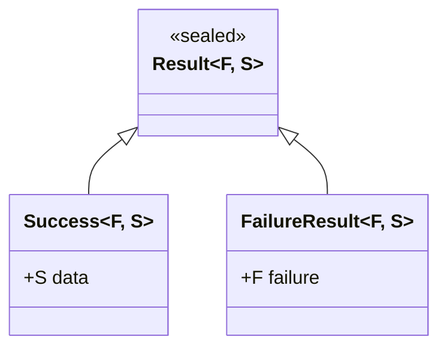
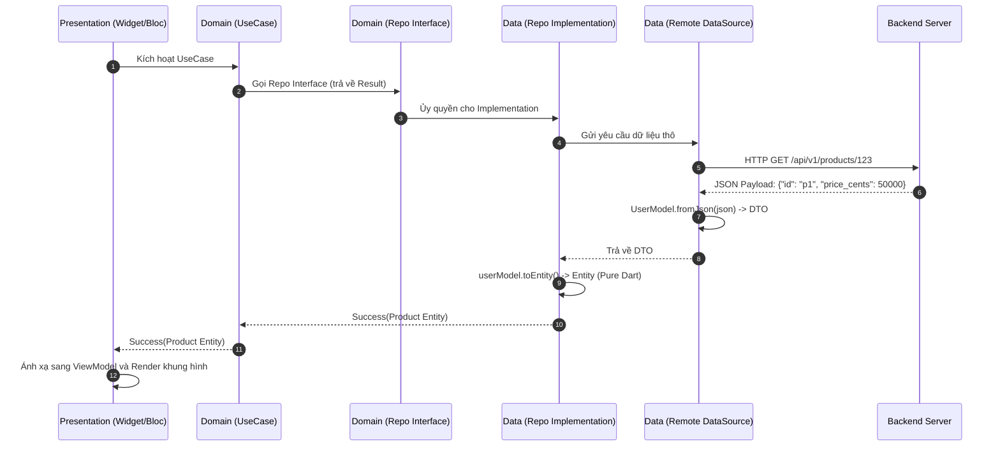

# Bài 4.2 — Hợp Đồng Dữ Liệu & Ranh Giới Miền: Entity, DTO & Repository Interface

## Dẫn Chiếu Tài Liệu Chính Thức
- **Martin Fowler: Data Transfer Object (DTO)**: [martinfowler.com/eaaCatalog/dataTransferObject.html](https://martinfowler.com/eaaCatalog/dataTransferObject.html)
- **Martin Fowler: Repository Pattern**: [martinfowler.com/eaaCatalog/repository.html](https://martinfowler.com/eaaCatalog/repository.html)
- **Dart 3 Patterns & Exhaustiveness Checking**: [dart.dev/language/patterns](https://dart.dev/language/patterns)
- **Dart 3 Sealed Classes Reference**: [dart.dev/language/class-modifiers#sealed](https://dart.dev/language/class-modifiers#sealed)

---

## Phần 1 — Khái Niệm & Bài Toán Kiến Trúc (Nó Là Gì & Giải Quyết Bài Toán Gì?)

### 1.1 — Nó Là Gì? Phân Định 3 Cấp Độ Biểu Diễn Dữ Liệu
Trong kiến trúc phần mềm chuyên nghiệp, việc sử dụng một đối tượng duy nhất để đại diện cho dữ liệu từ lúc nhận phản hồi mạng (API Response) cho tới khi vẽ lên màn hình (Widget) là nguyên nhân hàng đầu dẫn đến sự đổ vỡ cấu trúc. Clean Architecture phân định rõ ràng 3 đại diện dữ liệu riêng biệt:

```
┌─────────────────────────────────────────────────────────────────────────┐
│                        DATA TRANSFORMATION PIPELINE                     │
│                                                                         │
│   Backend JSON  ──> [ DTO / Model ] ──> [ Entity ] ──> [ ViewModel ]   │
│   (Network/DB)          Data Layer        Domain           Presentation │
│                                                                         │
│   Chuyển đổi:           .fromJson()     .toEntity()      .fromEntity()  │
└─────────────────────────────────────────────────────────────────────────┘
```

1. **Entity (Thực Thể Nghiệp Vụ — Domain Layer)**:
   - Đại diện cho các khái niệm kinh doanh cốt lõi của doanh nghiệp.
   - Mang tính **bất biến (Immutable)** và được nhận diện bằng một định danh duy nhất (`id`).
   - Có thể chứa các quy tắc nghiệp vụ tự thân (Invariants), các thuộc tính tính toán phái sinh (Computed Properties) và các **Value Objects**.
   - **Quy tắc tuyệt đối**: Không chứa bất kỳ phương thức nào liên quan đến serialization (như `fromJson`, `toJson`), không phụ thuộc vào tên trường của cơ sở dữ liệu hay mạng.

2. **DTO (Data Transfer Object / Model — Data Layer)**:
   - Là đối tượng tạm thời dùng để chuyên chở dữ liệu qua ranh giới mạng hoặc cơ sở dữ liệu.
   - Cấu trúc trường dữ liệu mô phỏng chính xác payload JSON của REST API hoặc schema của bảng SQL.
   - Chịu trách nhiệm thực thi việc tuần tự hóa (`toJson`) và giải tuần tự hóa (`fromJson`), bao gồm cả việc kiểm tra kiểu dữ liệu, giải quyết giá trị null và cung cấp giá trị mặc định (fallback).

3. **ViewModel / UI Model (Presentation Layer)**:
   - Dữ liệu đã được định dạng (format) để sẵn sàng hiển thị trực tiếp lên Widget mà không đòi hỏi thêm bất kỳ phép tính toán nào.
   - Ví dụ: Thay vì truyền `DateTime`, ViewModel chứa chuỗi `'15 phút trước'`; thay vì truyền số thực `double price`, ViewModel chứa chuỗi `'1.250.000 ₫'`.

4. **Repository Interface (Hợp Đồng Truy Xuất Dữ Liệu — Domain Layer)**:
   - Là một `abstract interface class` đặt tại Domain Layer.
   - Định nghĩa các thao tác dữ liệu theo ngôn ngữ nghiệp vụ thuần túy (Ubiquitous Language).
   - Che giấu hoàn toàn nguồn gốc thực tế của dữ liệu (ứng dụng lấy từ In-memory Cache, SQLite hay gửi HTTP GET lên Cloud).

---

### 1.2 — Giải Quyết Bài Toán Gì? Sự Cần Thiết Của Việc Tách Biệt DTO Và Entity

1. **Hiện tượng Trượt Hợp Đồng API (API Contract Drift)**:
   - Trong quá trình vận hành, đội ngũ backend có thể thay đổi định dạng JSON: đổi tên trường `registered_at` thành `created_timestamp`, hoặc chuyển kiểu dữ liệu `price` từ số thực `double` sang chuỗi `String` kèm đơn vị tiền tệ.
   - Nếu Entity dùng chung với DTO: Sự thay đổi này sẽ làm sập toàn bộ mã nguồn nghiệp vụ và giao diện.
   - Khi tách biệt: Chỉ duy nhất phương thức `fromJson` của DTO cần cập nhật. Domain Entity và toàn bộ Presentation Layer giữ nguyên vẹn 100%, không phát sinh bất kỳ lỗi biên dịch nào.
2. **Ngăn chặn Rò Rỉ Chi Tiết Hạ Tầng (Infrastructure Leakage)**:
   - Cơ sở dữ liệu và API thường chứa các trường kỹ thuật nội bộ như `_v`, `etag`, `mongo_id`, `is_deleted`. Các trường này hoàn toàn vô nghĩa với quy tắc kinh doanh của ứng dụng và không được phép xuất hiện trong Entity.
3. **Chuyển Từ Ngoại Lệ Không Kiểm Soát Sang Xử Lý Lỗi Kiểu Hóa (Typed Functional Error Handling)**:
   - Cơ chế ném ngoại lệ (`throw Exception`) làm gãy luồng điều khiển và không bắt buộc lập trình viên phải xử lý lỗi tại thời điểm biên dịch.
   - Clean Architecture áp dụng mô hình `Result<Failure, T>` (Sealed Class) để biểu diễn kết quả trả về của Repository: hoặc là Thất Bại (`Failure`), hoặc là Thành Công (`T`), ép buộc phải xử lý tường minh mọi nhánh lỗi.

---

### 1.3 — Bảng So Sánh Chi Tiết: Entity vs DTO vs ViewModel

| Đặc Điểm Kỹ Thuật | DTO / Model | Entity | ViewModel |
| :--- | :--- | :--- | :--- |
| **Phân tầng trực thuộc** | Data Layer | Domain Layer | Presentation Layer |
| **Tính bất biến** | Nên bất biến | **Bắt buộc bất biến tuyệt đối** | Bất biến |
| **Trách nhiệm tuần tự hóa** | `fromJson()`, `toJson()` | **Tuyệt đối không** | Có thể có `toMap()` cho lưu state |
| **Độ bền vững theo thời gian** | Thay đổi theo API/DB schema | Ổn định cao nhất trong hệ thống | Thay đổi theo thiết kế giao diện |
| **Tiêu chí so sánh (`==`)** | So sánh giá trị cấu thành | So sánh theo định danh (`id`) | So sánh giá trị hiển thị |

---

### 1.4 — Mục Tiêu Kỹ Thuật Cần Đạt Được
- Nắm vững kỹ thuật xây dựng **Value Objects** để tự động xác thực tính hợp lệ của dữ liệu ngay tại Domain Layer.
- Xây dựng hệ thống phân cấp lỗi kiểu hóa với **Dart 3 Sealed Class** (`Result<Failure, T>`).
- Cài đặt cơ chế chuyển đổi an toàn 2 chiều giữa DTO và Entity.
- Hiện thực hóa Repository Interface với cơ chế phục hồi lỗi và kiểm soát kiểu trả về toàn vẹn (Exhaustive Pattern Matching).

---

## Phần 2 — Bản Chất Là Gì? (Under the Hood & Cơ Chế Hoạt Động)

### 2.1 — Cơ Chế Hoạt Động Của Value Object Và Tính Đồng Nhất (Identity vs Value Equality)
Trong Domain-Driven Design (DDD), một trong những sai lầm phổ biến nhất là sử dụng kiểu dữ liệu nguyên thủy (`String`, `double`) cho các thuộc tính mang tính nghiệp vụ cao (hiện tượng **Primitive Obsession**).

- **Entity**: Được định danh bởi thuộc tính `id`. Hai đối tượng `User` có tên và email khác nhau nhưng nếu cùng `id`, về mặt bản chất chúng vẫn là một thực thể trong hệ thống.
- **Value Object**: Không có thuộc tính `id`. Tính đồng nhất được xác định hoàn toàn bởi giá trị của các trường cấu thành. Value Object phải bất biến và tự đảm bảo tính hợp lệ khi được tạo ra (Self-validating).

```dart
// Ví dụ về Value Object: Money
@immutable
class Money {
  final int amountInCents;
  final String currency;

  const Money({required this.amountInCents, required this.currency})
      : assert(amountInCents >= 0, 'Số tiền không được âm.'),
        assert(currency.length == 3, 'Mã tiền tệ phải theo chuẩn ISO 3 ký tự.');

  @override
  bool operator ==(Object other) =>
      identical(this, other) ||
      other is Money &&
          amountInCents == other.amountInCents &&
          currency == other.currency;

  @override
  int get hashCode => Object.hash(amountInCents, currency);
}
```

---

### 2.2 — Bản Chất Của Mô Hình Functional Error Handling Với Sealed Class
Thay vì sử dụng các thư viện bên thứ ba như `dartz` hay `fpdart` vốn mang nhiều cú pháp phức tạp từ lập trình hàm, Dart 3 cung cấp giải pháp tối ưu thông qua **Sealed Classes** kết hợp với **Pattern Matching**:



- Trình biên dịch của Dart kiểm soát tính toàn vẹn (Exhaustiveness Check). Khi một phương thức trả về `Result<Failure, Product>`, nếu tầng Presentation sử dụng câu lệnh `switch` mà quên xử lý trường hợp `FailureResult`, trình biên dịch sẽ báo lỗi cú pháp ngay lập tức:
  ```text
  The type 'Result<Failure, Product>' is not exhaustively matched by the switch cases.
  Missing case: FailureResult()
  ```

---

### 2.3 — Luồng Dữ Liệu Qua Ranh Giới Kiến Trúc (Sequence Diagram)



---

## Phần 3 — Triển Khai Kỹ Thuật (Triển Khai Như Nào? Step-by-Step Implementation)

Xây dựng module quản lý Sản Phẩm (`features/products/`) tích hợp đầy đủ Value Objects, DTO Mapping và Typed Error Handling.

### 3.1 — Bước 1: Thiết Lập Hệ Thống Kết Quả `Result` & `Failure`

```dart
// lib/core/functional/result.dart

import 'package:flutter/foundation.dart';

@immutable
sealed class Result<F, S> {
  const Result();

  // Tiện ích kiểm tra nhanh trạng thái
  bool get isSuccess => this is Success<F, S>;
  bool get isFailure => this is FailureResult<F, S>;

  S? get dataOrNull => switch (this) {
    Success(:final data) => data,
    FailureResult() => null,
  };

  F? get failureOrNull => switch (this) {
    Success() => null,
    FailureResult(:final failure) => failure,
  };
}

final class Success<F, S> extends Result<F, S> {
  final S data;
  const Success(this.data);
}

final class FailureResult<F, S> extends Result<F, S> {
  final F failure;
  const FailureResult(this.failure);
}
```

```dart
// lib/core/error/failures.dart

import 'package:flutter/foundation.dart';

@immutable
sealed class Failure {
  final String message;
  const Failure(this.message);
}

final class NetworkFailure extends Failure {
  const NetworkFailure([super.message = 'Lỗi kết nối mạng, vui lòng kiểm tra tín hiệu.']);
}

final class ServerFailure extends Failure {
  final int statusCode;
  const ServerFailure({required super.message, required this.statusCode});
}

final class CacheFailure extends Failure {
  const CacheFailure([super.message = 'Dữ liệu cục bộ không khả dụng hoặc bị hỏng.']);
}
```

---

### 3.2 — Bước 2: Xây Dựng Domain Entity & Value Object

```dart
// lib/features/products/domain/entities/product.dart

import 'package:flutter/foundation.dart';

@immutable
class Money {
  final int cents;
  final String currency;

  const Money({required this.cents, required this.currency});

  double get inMajorUnits => cents / 100.0;

  @override
  bool operator ==(Object other) =>
      identical(this, other) ||
      other is Money && cents == other.cents && currency == other.currency;

  @override
  int get hashCode => Object.hash(cents, currency);
}

enum ProductStatus { inStock, outOfStock, discontinued }

@immutable
class Product {
  final String id;
  final String sku;
  final String title;
  final Money price;
  final int availableStock;
  final ProductStatus status;

  const Product({
    required this.id,
    required this.sku,
    required this.title,
    required this.price,
    required this.availableStock,
    required this.status,
  });

  // Quy tắc nghiệp vụ tự thân
  bool get canBePurchased =>
      status == ProductStatus.inStock && availableStock > 0;

  bool get isLowStock => availableStock > 0 && availableStock <= 5;

  Product copyWith({
    String? id,
    String? sku,
    String? title,
    Money? price,
    int? availableStock,
    ProductStatus? status,
  }) {
    return Product(
      id: id ?? this.id,
      sku: sku ?? this.sku,
      title: title ?? this.title,
      price: price ?? this.price,
      availableStock: availableStock ?? this.availableStock,
      status: status ?? this.status,
    );
  }

  @override
  bool operator ==(Object other) =>
      identical(this, other) || other is Product && id == other.id;

  @override
  int get hashCode => id.hashCode;
}
```

---

### 3.3 — Bước 3: Định Nghĩa Repository Interface

```dart
// lib/features/products/domain/repositories/product_repository.dart

import '../../../../core/error/failures.dart';
import '../../../../core/functional/result.dart';
import '../entities/product.dart';

abstract interface class ProductRepository {
  Future<Result<Failure, List<Product>>> getProducts();
  Future<Result<Failure, Product>> getProductById(String id);
}
```

---

### 3.4 — Bước 4: Xây Dựng DTO & Repository Implementation Tại Data Layer

```dart
// lib/features/products/data/models/product_model.dart

import '../../domain/entities/product.dart';

class ProductModel {
  final String id;
  final String skuCode;
  final String name;
  final int priceCents;
  final String currencyCode;
  final int stockQuantity;
  final String statusCode;

  const ProductModel({
    required this.id,
    required this.skuCode,
    required this.name,
    required this.priceCents,
    required this.currencyCode,
    required this.stockQuantity,
    required this.statusCode,
  });

  factory ProductModel.fromJson(Map<String, dynamic> json) {
    return ProductModel(
      id: json['id'] as String,
      skuCode: json['sku_code'] as String? ?? 'UNKNOWN',
      name: json['name'] as String? ?? 'Sản phẩm không có tên',
      priceCents: json['price_cents'] as int? ?? 0,
      currencyCode: json['currency_code'] as String? ?? 'VND',
      stockQuantity: json['stock_quantity'] as int? ?? 0,
      statusCode: json['status_code'] as String? ?? 'OUT_OF_STOCK',
    );
  }

  Map<String, dynamic> toJson() {
    return {
      'id': id,
      'sku_code': skuCode,
      'name': name,
      'price_cents': priceCents,
      'currency_code': currencyCode,
      'stock_quantity': stockQuantity,
      'status_code': statusCode,
    };
  }

  // Chuyển đổi DTO -> Domain Entity
  Product toEntity() {
    return Product(
      id: id,
      sku: skuCode,
      title: name,
      price: Money(cents: priceCents, currency: currencyCode),
      availableStock: stockQuantity,
      status: switch (statusCode.toUpperCase()) {
        'ACTIVE' when stockQuantity > 0 => ProductStatus.inStock,
        'DISCONTINUED' => ProductStatus.discontinued,
        _ => ProductStatus.outOfStock,
      },
    );
  }
}
```

```dart
// lib/features/products/data/repositories/product_repository_impl.dart

import '../../../../core/error/failures.dart';
import '../../../../core/functional/result.dart';
import '../../domain/entities/product.dart';
import '../../domain/repositories/product_repository.dart';
import '../datasources/product_remote_datasource.dart';

class ProductRepositoryImpl implements ProductRepository {
  final ProductRemoteDataSource _remoteDataSource;

  const ProductRepositoryImpl({
    required ProductRemoteDataSource remoteDataSource,
  }) : _remoteDataSource = remoteDataSource;

  @override
  Future<Result<Failure, List<Product>>> getProducts() async {
    try {
      final models = await _remoteDataSource.fetchProducts();
      final entities = models.map((model) => model.toEntity()).toList();
      return Success(entities);
    } on NetworkException {
      return const FailureResult(NetworkFailure());
    } on ServerException catch (e) {
      return FailureResult(ServerFailure(message: e.message, statusCode: e.code));
    } catch (e) {
      return FailureResult(ServerFailure(message: 'Lỗi không xác định: $e', statusCode: 500));
    }
  }

  @override
  Future<Result<Failure, Product>> getProductById(String id) async {
    try {
      final model = await _remoteDataSource.fetchProductById(id);
      return Success(model.toEntity());
    } on NetworkException {
      return const FailureResult(NetworkFailure());
    } catch (e) {
      return FailureResult(ServerFailure(message: e.toString(), statusCode: 500));
    }
  }
}
```

---

### 3.5 — Bước 5: Tiêu Thụ Dữ Liệu Tại Presentation Layer

```dart
// lib/features/products/presentation/cubit/product_list_cubit.dart

import 'package:flutter_bloc/flutter_bloc.dart';
import 'package:flutter/foundation.dart';
import '../../../../core/functional/result.dart';
import '../../domain/entities/product.dart';
import '../../domain/repositories/product_repository.dart';

@immutable
sealed class ProductListState {
  const ProductListState();
}

class ProductListLoading extends ProductListState {
  const ProductListLoading();
}

class ProductListLoaded extends ProductListState {
  final List<Product> products;
  const ProductListLoaded(this.products);
}

class ProductListError extends ProductListState {
  final String errorMessage;
  const ProductListError(this.errorMessage);
}

class ProductListCubit extends Cubit<ProductListState> {
  final ProductRepository _repository;

  ProductListCubit({required ProductRepository repository})
      : _repository = repository,
        super(const ProductListLoading());

  Future<void> loadProducts() async {
    emit(const ProductListLoading());
    final result = await _repository.getProducts();

    // Sử dụng Pattern Matching của Dart 3 để xử lý triệt để 2 nhánh
    switch (result) {
      case Success(:final data):
        emit(ProductListLoaded(data));
      case FailureResult(:final failure):
        emit(ProductListError(failure.message));
    }
  }
}
```

---

## Phần 4 — Best Practices & Phòng Chống Cạm Bẫy (Defensive Engineering)

### 4.1 — ❌ Anti-pattern 1: Sử Dụng Trực Tiếp DTO / Model Lên Tầng Giao Diện

#### Mô tả lỗi:
Presentation Layer trực tiếp lắng nghe và render dữ liệu từ `ProductModel`:

```dart
// ❌ LỖI: Widget nhận trực tiếp Model từ Data Layer
class ProductTile extends StatelessWidget {
  final ProductModel productModel; // Lệ thuộc trực tiếp vào Data DTO!

  const ProductTile({super.key, required this.productModel});

  @override
  Widget build(BuildContext context) {
    return Text(productModel.name);
  }
}
```

#### Phân tích cơ chế gây lỗi:
- Phá vỡ tính đóng gói của Data Layer.
- Nếu Backend thay đổi tên trường JSON `name` thành `product_title`, lập trình viên buộc phải cập nhật lại tất cả Widget đang sử dụng trường này.
- Mất khả năng áp dụng các quy tắc kinh doanh (Business Invariants) được bảo vệ bởi Entity.

#### Biện pháp phòng chống:
Widget và Controller tầng Presentation **chỉ nhận và làm việc với Domain Entity**:

```dart
// ✅ ĐÚNG: Widget chỉ biết tới Domain Entity
class ProductTile extends StatelessWidget {
  final Product product;

  const ProductTile({super.key, required this.product});

  @override
  Widget build(BuildContext context) {
    return Text(product.title);
  }
}
```

---

### 4.2 — ❌ Anti-pattern 2: Entity Chứa Logic Giải Tuần Tự Hóa (`fromJson`)

#### Mô tả lỗi:
Viết phương thức `fromJson` trực tiếp trong Domain Entity để "tiết kiệm số lượng file":

```dart
// ❌ LỖI: Domain Entity chứa logic parse JSON
class Product {
  final String id;
  final String title;

  const Product({required this.id, required this.title});

  // Vi phạm: Domain Layer bị ràng buộc với định dạng JSON
  factory Product.fromJson(Map<String, dynamic> json) => ...;
}
```

#### Phân tích cơ chế gây lỗi:
- Khi có thêm một nguồn dữ liệu mới (ví dụ: Local Database sử dụng SQLite trả về `Map<String, Object?>` hoặc Protobuf nhị phân), Domain Entity sẽ bị phình to bởi các factory constructor hạ tầng.
- Vi phạm nguyên lý Đơn trách nhiệm (Single Responsibility Principle - SRP): Entity vừa phải chịu trách nhiệm về quy tắc nghiệp vụ, vừa phải gánh vác logic phân tích cú pháp dữ liệu bên ngoài.

---

### 4.3 — ❌ Anti-pattern 3: Nuốt Ngoại Lệ (Exception Swallowing) Tại Data Mapper

#### Mô tả lỗi:
Bọc toàn bộ hàm chuyển đổi DTO sang Entity bằng một khối `try/catch` rỗng và trả về Entity với giá trị mặc định:

```dart
// ❌ LỖI: Nuốt ngoại lệ âm thầm
User toEntity() {
  try {
    return User(
      id: id,
      createdAt: DateTime.parse(registeredAtString),
    );
  } catch (_) {
    return User.empty(); // Lỗi dữ liệu bị che giấu hoàn toàn!
  }
}
```

#### Phân tích cơ chế gây lỗi:
- Khi backend trả về định dạng ngày tháng không hợp lệ, ứng dụng không hề ghi nhận lỗi (Crashlytics/Sentry không có log), nhưng người dùng sẽ thấy thông tin tài khoản bị rỗng hoặc sai lệch thời gian đăng ký.

#### Biện pháp phòng chống:
Sử dụng các phương thức phân tích an toàn (`DateTime.tryParse`) kèm theo chiến lược fallback tường minh hoặc ném ra ngoại lệ kỹ thuật `DataParsingException` để tầng Repository bắt và ánh xạ thành `FailureResult`.

---

## Phần 5 — Khảo Sát Bản Chất Kỹ Thuật & Thử Thách Thẩm Định

### 5.1 — Khảo Sát Bản Chất Kỹ Thuật

#### Câu hỏi 1: Tại sao việc so sánh Entity dựa trên định danh (`id`), trong khi Value Object lại so sánh theo toàn bộ giá trị thuộc tính?
*Phân tích kỹ thuật:*
- **Entity** là một thực thể có tính kế thừa thời gian và định danh (Continuity & Identity). Một người dùng đổi tên từ "Nguyễn A" sang "Nguyễn B" thì về mặt nghiệp vụ vẫn là cùng một cá nhân (giữ nguyên User ID).
- **Value Object** đại diện cho một đại lượng đo lường hoặc mô tả thuần túy (Measurement or Description). Ví dụ tờ 50.000 VND này hoàn toàn có giá trị tương đương tờ 50.000 VND khác. Nếu hai Value Object có cùng thuộc tính, chúng có thể thay thế hoàn toàn cho nhau mà không làm thay đổi trạng thái của hệ thống.

---

#### Câu hỏi 2: Lợi ích cốt lõi của việc dùng Dart 3 Sealed Class thay vì thư viện `Either` của `dartz` là gì?
*Phân tích kỹ thuật:*
1. **Hiệu năng & Kích thước gói**: Không phụ thuộc vào package bên thứ ba, giảm kích thước binary ứng dụng.
2. **Hỗ trợ cấp độ ngôn ngữ (Language-level Support)**: Dart 3 phân tích trực tiếp cú pháp `switch`. Nếu có một trạng thái kết quả mới được thêm vào, trình biên dịch sẽ cưỡng chế kiểm tra tại mọi vị trí đang dùng (Compile-time exhaustiveness check), ngăn chặn hoàn toàn lỗi quên xử lý case.

---

### 5.2 — Bài Tập Thực Hành: Xây Dựng Mapper An Toàn Cho CartItem

**Mục tiêu**:
1. Viết `CartItemModel` (DTO) ánh xạ từ JSON API.
2. Viết `CartItem` (Entity) với Value Object `Money` và thuộc tính tính toán `totalPrice = unitPrice * quantity`.
3. Cài đặt hàm `toEntity()` với khả năng kiểm tra an toàn: nếu `quantity <= 0` hoặc `price < 0`, hàm phải xử lý như thế nào để không làm sập giao diện?
4. Viết 3 ca Unit Test kiểm tra tính đúng đắn của logic tính toán `totalPrice`.
