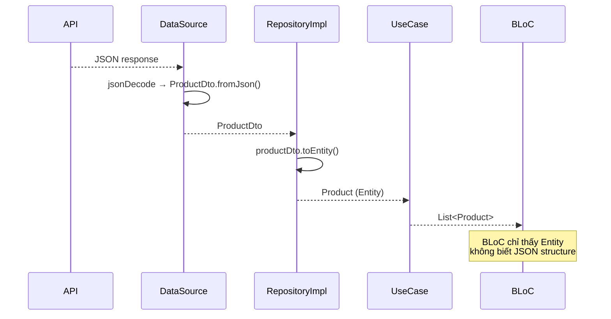

# Bài 4.2 — Entity, DTO & Repository Interface

## Phần 1 — Khái Niệm & Mục Tiêu Bài Học

### Entity vs DTO vs Model — sự nhầm lẫn phổ biến nhất

Ba khái niệm này thường bị dùng lẫn lộn, nhưng chúng có mục đích khác nhau:

| | Entity | DTO (Model) | ViewModel |
|---|---|---|---|
| Layer | Domain | Data | Presentation |
| Mục đích | Business object | API mapping | UI display |
| Dependency | Không có | JSON/network | UI framework |
| Ví dụ | `Product(price: Money)` | `ProductDto(price: double)` | `ProductVM(priceText: String)` |

### Bạn sẽ hiểu được sau bài này:
- Tại sao tách Entity và DTO (chứ không dùng chung)
- Repository Interface — inversion of control
- Mapping layer: DTO → Entity và Entity → ViewModel
- `Either<Failure, T>` pattern vs Exception

---

## Phần 2 — Cơ Chế Hoạt Động (Under the Hood)

### Data Flow qua các layers



---

## Phần 3 — Code Mẫu Chuẩn Google

### 3.1 — Entity với value objects

```dart
// domain/entities/product.dart
// Entity: chỉ business-relevant fields và business rules
class Product {
  final String id;
  final String name;
  final Money price;
  final String category;
  final int stockQuantity;
  final List<String> imageUrls;
  final ProductStatus status;

  const Product({
    required this.id,
    required this.name,
    required this.price,
    required this.category,
    required this.stockQuantity,
    required this.imageUrls,
    required this.status,
  });

  // Business rules thuộc về Entity
  bool get isInStock => stockQuantity > 0 && status == ProductStatus.active;
  bool get isLowStock => stockQuantity > 0 && stockQuantity <= 5;
  String get primaryImageUrl => imageUrls.isNotEmpty ? imageUrls.first : '';

  Product copyWith({
    String? id,
    String? name,
    Money? price,
    int? stockQuantity,
    ProductStatus? status,
  }) => Product(
    id: id ?? this.id,
    name: name ?? this.name,
    price: price ?? this.price,
    category: category,
    stockQuantity: stockQuantity ?? this.stockQuantity,
    imageUrls: imageUrls,
    status: status ?? this.status,
  );

  @override
  bool operator ==(Object other) => other is Product && id == other.id;

  @override
  int get hashCode => id.hashCode;
}

// Value object — bao bọc primitive với business rules
class Money {
  final double amount;
  final String currency;

  const Money({required this.amount, this.currency = 'VND'});

  bool get isZero => amount == 0;
  bool get isNegative => amount < 0;

  Money operator +(Money other) {
    assert(currency == other.currency, 'Cannot add different currencies');
    return Money(amount: amount + other.amount, currency: currency);
  }

  String get formatted {
    if (currency == 'VND') {
      return '${amount.toStringAsFixed(0).replaceAllMapped(
        RegExp(r'\B(?=(\d{3})+(?!\d))'),
        (m) => '.',
      )}đ';
    }
    return '\$${amount.toStringAsFixed(2)}';
  }

  @override
  bool operator ==(Object other) =>
      other is Money && amount == other.amount && currency == other.currency;

  @override
  int get hashCode => Object.hash(amount, currency);
}

enum ProductStatus { active, inactive, outOfStock, discontinued }
```

### 3.2 — DTO với mapping

```dart
// data/models/product_model.dart
// DTO: mirror API JSON — có thể thay đổi khi API thay đổi
// Không ảnh hưởng đến Entity
class ProductDto {
  final String id;
  final String name;
  final double price;
  final String currency;
  final String category;
  final int stock;
  final List<String> images;
  final String status;
  final Map<String, dynamic>? metadata;

  const ProductDto({
    required this.id,
    required this.name,
    required this.price,
    this.currency = 'VND',
    required this.category,
    required this.stock,
    required this.images,
    required this.status,
    this.metadata,
  });

  factory ProductDto.fromJson(Map<String, dynamic> json) {
    return ProductDto(
      id: json['id'] as String,
      name: json['name'] as String,
      price: (json['price'] as num).toDouble(),
      currency: json['currency'] as String? ?? 'VND',
      category: json['category_id'] as String,
      stock: json['stock_quantity'] as int? ?? 0,
      images: (json['images'] as List<dynamic>?)
              ?.map((e) => e as String)
              .toList() ??
          [],
      status: json['status'] as String? ?? 'active',
    );
  }

  Map<String, dynamic> toJson() => {
    'id': id,
    'name': name,
    'price': price,
    'currency': currency,
    'category_id': category,
    'stock_quantity': stock,
    'images': images,
    'status': status,
  };

  // Mapping DTO → Entity
  Product toEntity() => Product(
    id: id,
    name: name,
    price: Money(amount: price, currency: currency),
    category: category,
    stockQuantity: stock,
    imageUrls: images,
    status: _mapStatus(status),
  );

  static ProductStatus _mapStatus(String status) => switch (status) {
    'active' => ProductStatus.active,
    'inactive' => ProductStatus.inactive,
    'out_of_stock' => ProductStatus.outOfStock,
    'discontinued' => ProductStatus.discontinued,
    _ => ProductStatus.inactive,
  };
}
```

### 3.3 — Repository Interface với typed failures

```dart
// domain/repositories/product_repository.dart
abstract interface class ProductRepository {
  Future<List<Product>> getProducts({
    String? categoryId,
    int page = 1,
    int limit = 20,
  });

  Future<Product> getProductById(String id);

  Future<void> toggleFavorite(String productId);

  // Stream: realtime updates (e.g., inventory changes)
  Stream<Product> watchProduct(String id);
}

// core/error/failures.dart — sealed class cho typed failures
sealed class Failure {
  final String message;
  const Failure(this.message);
}

final class NetworkFailure extends Failure {
  final int? statusCode;
  const NetworkFailure(super.message, {this.statusCode});
}

final class CacheFailure extends Failure {
  const CacheFailure(super.message);
}

final class NotFoundFailure extends Failure {
  final String resource;
  const NotFoundFailure(this.resource) : super('$resource not found');
}

final class UnauthorizedFailure extends Failure {
  const UnauthorizedFailure() : super('Unauthorized');
}
```

---

## Phần 4 — Lỗi Sai Phổ Biến & Best Practices

### ❌ Anti-pattern 1: Dùng DTO trực tiếp trong UI

```dart
// ❌ UI phụ thuộc DTO → khi API thay đổi, UI phải sửa
BlocBuilder<ProductsBloc, ProductsState>(
  builder: (context, state) {
    final product = state.productDto; // ProductDto — API object
    return Text(product.category_id); // ← API field name lọt vào UI!
  },
)

// ✅ UI chỉ nhìn thấy Entity
BlocBuilder<ProductsBloc, ProductsState>(
  builder: (context, state) {
    final product = state.product; // Product entity
    return Text(product.category); // ← Domain field name
  },
)
```

### ❌ Anti-pattern 2: Repository Implementation trong Domain layer

```dart
// ❌ Domain biết về cụ thể cách fetch data
// domain/repositories/product_repository.dart
class ProductRepository {       // Class, không phải interface!
  final Dio _dio;               // ← Dio trong Domain!
  Future<List<Product>> getProducts() async {
    final response = await _dio.get('/products'); // ← HTTP trong Domain!
  }
}

// ✅ Domain chỉ có interface (abstract)
abstract interface class ProductRepository {
  Future<List<Product>> getProducts({int page, int limit});
}
// Implementation ở Data layer
```

---

## Phần 5 — Bài Tập Củng Cố Tư Duy

### Challenge: Order Domain

**Yêu cầu:**
1. Entity `Order` với: `id`, `items: List<OrderItem>`, `status: OrderStatus`, `total: Money`
2. Business rules trên Order: `canCancel`, `canReturn`, `itemCount`
3. DTO `OrderDto` mapping từ API JSON
4. `OrderRepository` interface với: `getOrders`, `getOrderById`, `cancelOrder`
5. Sealed class `OrderFailure` với 3 subclasses

### Thử thách thẩm định kỹ thuật:

1. **"Tại sao cần tách Entity và DTO khi chúng giống nhau?"**
   - Lúc đầu có thể giống — theo thời gian diverge
   - API trả `snake_case`, domain dùng `camelCase`
   - API có fields thừa (metadata, audit fields) mà domain không cần
   - Decoupling: API thay đổi không ảnh hưởng domain logic

2. **"Value Object vs Entity — khác nhau gì?"**
   - Entity: có identity (id) — `user.id == user2.id` → cùng user
   - Value Object: không có identity, equal by value — `Money(100) == Money(100)`
