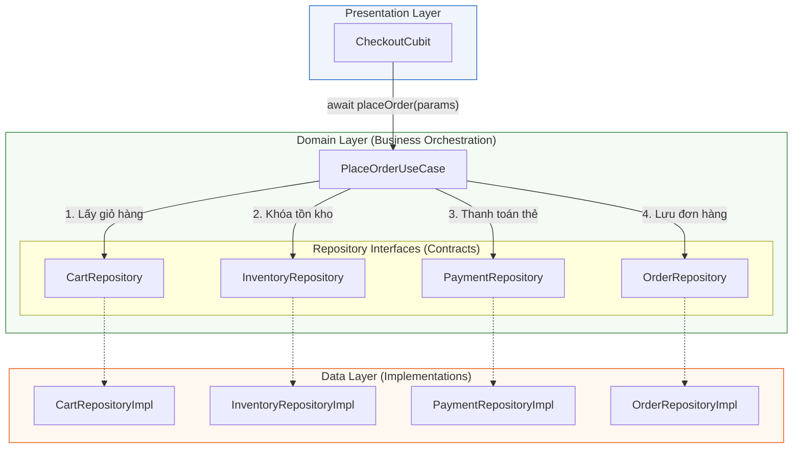

# Bài 4.3 — Đóng Gói Nghiệp Vụ Chuyên Trách: UseCase (Interactor) Pattern

## Dẫn Chiếu Tài Liệu Chính Thức
- **Clean Architecture: Use Cases & Interactors**: [blog.cleancoder.com/uncle-bob/2012/08/13/the-clean-architecture.html](https://blog.cleancoder.com/uncle-bob/2012/08/13/the-clean-architecture.html)
- **Dart Callable Classes**: [dart.dev/language/callable-objects](https://dart.dev/language/callable-objects)
- **Single Responsibility Principle (SOLID)**: [en.wikipedia.org/wiki/Single-responsibility_principle](https://en.wikipedia.org/wiki/Single-responsibility_principle)
- **Compensating Transactions Pattern**: [learn.microsoft.com/en-us/azure/architecture/patterns/compensating-transaction](https://learn.microsoft.com/en-us/azure/architecture/patterns/compensating-transaction)

---

## Phần 1 — Khái Niệm & Bài Toán Kiến Trúc (Nó Là Gì & Giải Quyết Bài Toán Gì?)

### 1.1 — Nó Là Gì? Định Vị UseCase Trong Hệ Thống
`UseCase` (trong tài liệu kinh điển của Clean Architecture còn được gọi là **Interactor**) là một lớp đối tượng thuộc Domain Layer, chịu trách nhiệm đóng gói duy nhất một quy trình nghiệp vụ hoặc ca sử dụng cụ thể của hệ thống.

Mỗi UseCase đại diện cho một động từ hành động của người dùng hoặc sự kiện của hệ thống:
- `AuthenticateWithEmailUseCase` — Đăng nhập bằng email.
- `PlaceOrderUseCase` — Thực hiện quy trình đặt hàng và thanh toán.
- `WatchCryptoPricesUseCase` — Lắng nghe luồng giá tiền ảo theo thời gian thực.

Trong Dart, UseCase được hiện thực hóa dưới dạng **Callable Class** (lớp có cài đặt phương thức `call()`). Cú pháp này cho phép kích hoạt UseCase tương tự như một hàm thuần túy:

```dart
// Khởi tạo instance
final loginUseCase = LoginUseCase(authRepository);

// Kích hoạt thông qua toán tử call()
final result = await loginUseCase(LoginParams(email: 'user@test.com', password: 'secretPassword'));
```

---

### 1.2 — Giải Quyết Bài Toán Gì? Sự Bất Cập Khi Thiếu Tầng Nghiệp Vụ Chuyên Trách

Khi ứng dụng không có UseCase và Presentation Layer (BLoC, Cubit, ViewModel) tương tác trực tiếp với các Repositories, hệ thống sẽ nhanh chóng đối mặt với 3 vấn đề kỹ thuật lớn:

1. **Hiện tượng "Fat BLoC / Fat Controller"**:
   - Khi một tác vụ đòi hỏi sự phối hợp của nhiều nguồn dữ liệu (ví dụ: Đặt hàng cần gọi `CartRepository`, `InventoryRepository`, `PaymentRepository`, và `NotificationRepository`), nếu đặt toàn bộ logic này trong BLoC, BLoC sẽ chứa hàng trăm dòng code điều phối luồng. BLoC bị vi phạm nguyên lý Đơn trách nhiệm (SRP) khi vừa phải quản lý trạng thái UI, vừa phải gánh vác quy trình nghiệp vụ phức tạp.
2. **Trùng lặp logic nghiệp vụ (Business Rule Duplication)**:
   - Một hành động nghiệp vụ có thể được kích hoạt từ nhiều nơi khác nhau trong ứng dụng:
     * Đăng xuất có thể được gọi từ `SettingsScreen`, từ hộp thoại `SessionExpiredDialog`, hoặc khi nhận một sự kiện bảo mật từ `WebSocketService`.
     * Nếu không có `LogoutUseCase`, logic đăng xuất (hủy token, xóa database cục bộ, ngắt kết nối socket, điều hướng về màn hình đăng nhập) buộc phải sao chép qua nhiều Controllers khác nhau. Khi quy trình thay đổi, lập trình viên rất dễ bỏ sót các màn hình thứ cấp.
3. **Phức tạp hóa việc Kiểm thử Đơn vị (Unit Testing)**:
   - Để kiểm thử logic nghiệp vụ trong một BLoC, lập trình viên phải giả lập toàn bộ môi trường Stream, các sự kiện đầu vào và luồng phát xạ trạng thái. Với UseCase, việc kiểm thử chỉ là gọi một hàm và so sánh giá trị trả về của `Future<Result>` trong môi trường Pure Dart siêu tốc.

---

### 1.3 — Bảng So Sánh Khi Có Và Không Có UseCase

| Tiêu Chí Kỹ Thuật | Khi Không Có UseCase (BLoC $\to$ Repo) | Khi Có UseCase (BLoC $\to$ UseCase $\to$ Repo) |
| :--- | :--- | :--- |
| **Trách nhiệm của BLoC** | Quản lý UI state + Điều phối nghiệp vụ đa Repo. | **Chỉ thuần túy quản lý trạng thái hiển thị UI.** |
| **Khả năng tái sử dụng** | Kém; logic bị khóa chặt bên trong Controller cụ thể. | **Tối đa; UseCase có thể gọi từ bất kỳ Controller nào.** |
| **Ranh giới phụ thuộc** | BLoC phụ thuộc vào 4–5 Repositories khác nhau. | BLoC chỉ phụ thuộc vào 1–2 UseCases cần thiết. |
| **Kiểm thử nghiệp vụ** | Phụ thuộc vào `bloc_test`, test stream phức tạp. | Unit Test thuần túy, nhanh, độc lập với UI. |

---

### 1.4 — Mục Tiêu Kỹ Thuật Cần Đạt Được
- Nắm vững cú pháp **Callable Class** trong Dart và xây dựng hệ thống base abstract class `UseCase<Type, Params>` chuẩn hóa.
- Phân biệt các loại UseCase: Bất đồng bộ (`Future`), Đồng bộ (`Sync`), và Luồng phản ứng (`Stream`).
- Triển khai thành công quy trình điều phối đa Repository phức tạp có cơ chế bù trừ giao dịch (Compensating Transaction / Rollback).
- Phân tích ranh giới kỹ thuật: Khi nào UseCase thực sự cần thiết và khi nào nó biến thành boilerplate thừa.

---

## Phần 2 — Bản Chất Là Gì? (Under the Hood & Cơ Chế Hoạt Động)

### 2.1 — Cơ Chế Hoạt Động Của Callable Class Trong Dart Runtime
Trong ngôn ngữ Dart, bất kỳ lớp nào định nghĩa phương thức có tên `call` đều có thể được gọi như một hàm ẩn danh:

```dart
class Multiplier {
  final int factor;
  const Multiplier(this.factor);

  int call(int input) => input * factor;
}

void main() {
  final triple = Multiplier(3);
  print(triple(10)); // Tương đương: triple.call(10) -> In ra: 30
}
```

*Cơ chế bên dưới*: Khi gặp cú pháp `instance(...)`, Dart Compiler tự động kiểm tra xem lớp đối tượng có định nghĩa phương thức `call` với danh sách tham số phù hợp hay không. Nếu có, compiler sẽ dịch mã thành lệnh gọi phương thức `.call(...)`. Điều này giúp mã nguồn ở tầng Presentation gọn gàng, mang tính biểu cảm cao và biến UseCase thành một đối tượng hàm (First-class Function Object).

---

### 2.2 — Bản Chất Điều Phối Nghiệp Vụ (Orchestration Pipeline)
UseCase hoạt động như một nhạc trưởng (Orchestrator). Nó tiếp nhận các tham số nghiệp vụ thuần túy, kiểm tra tính toàn vẹn (Validation), và điều hướng dữ liệu qua nhiều Repository độc lập mà Presentation hoàn toàn không hay biết:



---

### 2.3 — Tranh Luận Kiến Trúc: Có Nên Tạo UseCase Cho Mọi Thao Tác (Passthrough UseCases)?

Một câu hỏi kinh điển trong thiết kế Clean Architecture: *Nếu một UseCase chỉ làm đúng 1 việc là chuyển tiếp lệnh xuống Repository (`return _repository.getProducts()`), thì UseCase này có phải là boilerplate thừa thãi không?*

1. **Quan điểm Nghiêm Ngặt (Strict Clean Architecture)**:
   - *Bắt buộc tạo UseCase*: Đảm bảo tính nhất quán (Consistency) 100% cho toàn bộ kiến trúc. Tầng Presentation không bao giờ được phép phụ thuộc trực tiếp vào bất kỳ Repository nào. Nếu trong tương lai thao tác đọc sản phẩm cần bổ sung logic ghi log, kiểm tra quyền hoặc lưu cache, chỉ cần sửa tại UseCase mà không phải đụng tới Presentation.
2. **Quan điểm Thực Dụng (Pragmatic Architecture)**:
   - *Bỏ qua UseCase nếu chỉ là Passthrough*: Cho phép Presentation gọi trực tiếp Repository Interface đối với các tác vụ đọc dữ liệu đơn giản (CRUD cơ bản không có logic điều phối). Chỉ tạo UseCase khi có logic điều phối $\ge 2$ Repositories hoặc có quy tắc nghiệp vụ phức tạp.

> **Khuyến nghị cho Enterprise**: Luôn duy trì base UseCase đồng nhất. Chi phí viết thêm một lớp UseCase mỏng là rất nhỏ so với chi phí tái cấu trúc khi dự án mở rộng quy mô.

---

## Phần 3 — Triển Khai Kỹ Thuật (Triển Khai Như Nào? Step-by-Step Implementation)

Triển khai quy trình Đặt Hàng (`PlaceOrderUseCase`) hoàn chỉnh với cơ chế bù trừ giao dịch (Compensating Transaction) khi xảy ra lỗi mạng giữa chừng.

### 3.1 — Bước 1: Xây Dựng Hệ Thống Base UseCase Contracts

```dart
// lib/core/usecase/usecase.dart

import '../functional/result.dart';
import '../error/failures.dart';

/// Hợp đồng chuẩn cho các tác vụ bất đồng bộ (Future)
abstract interface class UseCase<Type, Params> {
  Future<Result<Failure, Type>> call(Params params);
}

/// Hợp đồng chuẩn cho các luồng phản ứng liên tục (Stream)
abstract interface class StreamUseCase<Type, Params> {
  Stream<Result<Failure, Type>> call(Params params);
}

/// Đại diện cho các UseCase không yêu cầu tham số đầu vào
final class NoParams {
  const NoParams();
}
```

---

### 3.2 — Bước 2: Định Nghĩa Các Repository Interfaces Phụ Thuộc

```dart
// lib/features/order/domain/repositories/order_repositories.dart

import '../../../../core/functional/result.dart';
import '../../../../core/error/failures.dart';
import '../entities/order_entities.dart';

abstract interface class CartRepository {
  Future<Result<Failure, Cart>> getCart();
  Future<Result<Failure, void>> clearCart();
}

abstract interface class InventoryRepository {
  Future<Result<Failure, void>> reserveStock(List<CartItem> items);
  Future<Result<Failure, void>> releaseStock(List<CartItem> items);
}

abstract interface class PaymentRepository {
  Future<Result<Failure, PaymentReceipt>> processPayment({
    required String orderId,
    required int amountCents,
  });
  Future<Result<Failure, void>> refundPayment(String transactionId);
}

abstract interface class OrderRepository {
  Future<Result<Failure, Order>> createOrder({
    required Cart cart,
    required PaymentReceipt receipt,
  });
}
```

---

### 3.3 — Bước 3: Triển Khai `PlaceOrderUseCase` Điều Phối & Xử Lý Giao Dịch

```dart
// lib/features/order/domain/usecases/place_order_usecase.dart

import '../../../../core/usecase/usecase.dart';
import '../../../../core/functional/result.dart';
import '../../../../core/error/failures.dart';
import '../entities/order_entities.dart';
import '../repositories/order_repositories.dart';

final class PlaceOrderParams {
  final String customerNotes;
  const PlaceOrderParams({this.customerNotes = ''});
}

final class PlaceOrderUseCase implements UseCase<Order, PlaceOrderParams> {
  final CartRepository _cartRepository;
  final InventoryRepository _inventoryRepository;
  final PaymentRepository _paymentRepository;
  final OrderRepository _orderRepository;

  const PlaceOrderUseCase({
    required CartRepository cartRepository,
    required InventoryRepository inventoryRepository,
    required PaymentRepository paymentRepository,
    required OrderRepository orderRepository,
  })  : _cartRepository = cartRepository,
        _inventoryRepository = inventoryRepository,
        _paymentRepository = paymentRepository,
        _orderRepository = orderRepository;

  @override
  Future<Result<Failure, Order>> call(PlaceOrderParams params) async {
    // 1. Lấy thông tin giỏ hàng hiện tại
    final cartResult = await _cartRepository.getCart();
    if (cartResult is FailureResult<Failure, Cart>) {
      return FailureResult(cartResult.failure);
    }
    final cart = (cartResult as Success<Failure, Cart>).data;

    // Kiểm tra quy tắc nghiệp vụ: Giỏ hàng phải có sản phẩm
    if (cart.items.isEmpty) {
      return const FailureResult(ValidationFailure('Không thể đặt hàng với giỏ hàng rỗng.'));
    }

    // 2. Khóa tồn kho (Reserve Stock)
    final reserveResult = await _inventoryRepository.reserveStock(cart.items);
    if (reserveResult is FailureResult<Failure, void>) {
      return FailureResult(reserveResult.failure);
    }

    // 3. Tiến hành thanh toán
    final paymentResult = await _paymentRepository.processPayment(
      orderId: 'pending_${DateTime.now().millisecondsSinceEpoch}',
      amountCents: cart.totalAmountCents,
    );

    // Xử lý bù trừ: Nếu thanh toán thất bại, phải giải phóng tồn kho đã khóa
    if (paymentResult is FailureResult<Failure, PaymentReceipt>) {
      await _inventoryRepository.releaseStock(cart.items);
      return FailureResult(paymentResult.failure);
    }
    final receipt = (paymentResult as Success<Failure, PaymentReceipt>).data;

    // 4. Tạo bản ghi đơn hàng chính thức
    final orderResult = await _orderRepository.createOrder(
      cart: cart,
      receipt: receipt,
    );

    // Xử lý bù trừ cấp cao: Nếu lưu đơn hàng thất bại, hoàn tiền và nhả tồn kho
    if (orderResult is FailureResult<Failure, Order>) {
      await Future.wait([
        _paymentRepository.refundPayment(receipt.transactionId),
        _inventoryRepository.releaseStock(cart.items),
      ]);
      return FailureResult(orderResult.failure);
    }

    // 5. Dọn dẹp giỏ hàng sau khi đặt thành công
    await _cartRepository.clearCart();

    return orderResult;
  }
}
```

---

### 3.4 — Bước 4: Tích Hợp Vào Presentation Layer (Cubit)

```dart
// lib/features/order/presentation/cubit/checkout_cubit.dart

import 'package:flutter_bloc/flutter_bloc.dart';
import 'package:flutter/foundation.dart';
import '../../../../core/functional/result.dart';
import '../../domain/entities/order_entities.dart';
import '../../domain/usecases/place_order_usecase.dart';

@immutable
sealed class CheckoutState {
  const CheckoutState();
}

final class CheckoutInitial extends CheckoutState {
  const CheckoutInitial();
}

final class CheckoutSubmitting extends CheckoutState {
  const CheckoutSubmitting();
}

final class CheckoutSuccess extends CheckoutState {
  final Order order;
  const CheckoutSuccess(this.order);
}

final class CheckoutFailure extends CheckoutState {
  final String errorMessage;
  const CheckoutFailure(this.errorMessage);
}

class CheckoutCubit extends Cubit<CheckoutState> {
  final PlaceOrderUseCase _placeOrderUseCase;

  CheckoutCubit({required PlaceOrderUseCase placeOrderUseCase})
      : _placeOrderUseCase = placeOrderUseCase,
        super(const CheckoutInitial());

  Future<void> submitOrder({String notes = ''}) async {
    emit(const CheckoutSubmitting());

    // Kích hoạt UseCase thông qua cú pháp hàm gọi callable
    final result = await _placeOrderUseCase(PlaceOrderParams(customerNotes: notes));

    switch (result) {
      case Success(:final data):
        emit(CheckoutSuccess(data));
      case FailureResult(:final failure):
        emit(CheckoutFailure(failure.message));
    }
  }
}
```

---

## Phần 4 — Best Practices & Phòng Chống Cạm Bẫy (Defensive Engineering)

### 4.1 — ❌ Anti-pattern 1: "God UseCase" Vi Phạm Nguyên Lý Đơn Trách Nhiệm (SRP)

#### Mô tả lỗi:
Tạo ra một lớp duy nhất chứa tất cả các phương thức liên quan đến một đối tượng:

```dart
// ❌ LỖI THIẾT KẾ: God UseCase
class UserUseCase {
  final UserRepository _repo;
  UserUseCase(this._repo);

  Future<User> login(...) => ...;
  Future<void> logout() => ...;
  Future<void> updateAvatar(...) => ...;
  Future<void> changePassword(...) => ...;
  Future<UserSettings> getSettings() => ...;
}
```

#### Phân tích cơ chế gây lỗi:
- `UserUseCase` thực chất chỉ là một lớp bọc vô nghĩa sao chép lại toàn bộ `UserRepository`.
- Khi viết Unit Test cho một tính năng nhỏ (ví dụ: màn hình cập nhật ảnh đại diện), lập trình viên phải mock và tiêm vào toàn bộ `UserUseCase` khổng lồ.
- Nhiều kỹ sư cùng sửa các luồng nghiệp vụ khác nhau của người dùng sẽ gây ra xung đột git liên tục trên một tệp tin duy nhất.

#### Biện pháp phòng chống:
Tuân thủ nghiêm ngặt nguyên lý **1 UseCase = 1 Hành Động Nghiệp Vụ**:
- `LoginUseCase`
- `LogoutUseCase`
- `UpdateAvatarUseCase`
- `ChangePasswordUseCase`

---

### 4.2 — ❌ Anti-pattern 2: UseCase Chứa Trạng Thái Nội Bộ (Stateful UseCase)

#### Mô tả lỗi:
Khai báo các biến trạng thái có thể biến đổi (mutable state) bên trong UseCase:

```dart
// ❌ LỖI: UseCase lưu giữ trạng thái nội bộ
class GetProductsUseCase implements UseCase<List<Product>, NoParams> {
  final ProductRepository _repo;
  List<Product> _cachedList = []; // Nguy cơ rò rỉ trạng thái

  GetProductsUseCase(this._repo);

  @override
  Future<Result<Failure, List<Product>>> call(NoParams params) async {
    if (_cachedList.isNotEmpty) return Success(_cachedList);
    // ...
  }
}
```

#### Phân tích cơ chế gây lỗi:
- UseCase là thành phần logic thuần túy, không có vòng đời gắn với giao diện. Việc lưu trạng thái nội bộ sẽ dẫn đến tình trạng trạng thái bị phân mảnh giữa BLoC, Cache Repository và UseCase.
- Khi có hai màn hình cùng gọi UseCase này đồng thời, dữ liệu rác hoặc trạng thái race-condition sẽ làm sai lệch kết quả trả về.

#### Biện pháp phòng chống:
**UseCase bắt buộc phải là Stateless**: Mọi dữ liệu phụ thuộc đều phải được lấy qua Repositories hoặc truyền vào thông qua tham số `Params`.

---

### 4.3 — ❌ Anti-pattern 3: Nhận `BuildContext` Hoặc Kiểu Dữ Liệu UI Vào Tham Số UseCase

#### Mô tả lỗi:
Truyền `BuildContext` vào hàm `call()` của UseCase để tiện kiểm tra kích thước màn hình hoặc lấy `ThemeData`:

```dart
// ❌ LỖI: Nhận BuildContext vào UseCase
class GetOptimizedImageUseCase {
  Future<String> call(BuildContext context, String rawUrl) async {
    final isTablet = MediaQuery.of(context).size.width > 600;
    // ...
  }
}
```

#### Biện pháp phòng chống:
Domain Layer không được phép phụ thuộc vào Flutter framework. Thay vì truyền `BuildContext`, hãy truyền trực tiếp một enum hoặc cờ boolean đại diện cho nhu cầu nghiệp vụ: `call(ImageResolutionParams(isHighResolution: true))`.

---

## Phần 5 — Khảo Sát Bản Chất Kỹ Thuật & Thử Thách Thẩm Định

### 5.1 — Khảo Sát Bản Chất Kỹ Thuật

#### Câu hỏi 1: Tại sao UseCase nên trả về `Result<Failure, T>` thay vì ném ra Exception trực tiếp?
*Phân tích kỹ thuật:*
1. **Kiểm soát luồng thực thi**: Ném exception làm gián đoạn ngăn xếp lời gọi hàm (Unwinding Stack). `Result` biến lỗi thành một giá trị dữ liệu thông thường được mô hình hóa rõ ràng.
2. **Ép buộc kiểm tra tại compile-time**: Giúp lập trình viên ở Presentation Layer không thể "quên" xử lý trường hợp thất bại.

---

#### Câu hỏi 2: Mô hình bù trừ giao dịch (Compensating Transaction) trong UseCase là gì và tại sao cần thiết trong ứng dụng di động?
*Phân tích kỹ thuật:*
Trên thiết bị di động, các thao tác phân tán qua mạng không có cơ chế phân tán 2-Phase Commit như trong hệ thống CSDL lớn. Nếu bước 2 (Trừ tiền thẻ tín dụng) thành công nhưng bước 3 (Lưu hóa đơn vào server) gặp sự cố mất sóng 4G, UseCase có trách nhiệm chủ động kích hoạt thao tác đảo ngược (Rollback: hoàn tiền) để đưa trạng thái tài khoản của người dùng về điểm an toàn ban đầu.

---

### 5.2 — Bài Tập Thực Hành: Thiết Kế Unit Test Cho PlaceOrderUseCase

**Mục tiêu**:
1. Sử dụng thư viện `mocktail` để tạo các Mock Repositories cho `CartRepository`, `InventoryRepository`, `PaymentRepository`, và `OrderRepository`.
2. Viết ca Unit Test kiểm tra kịch bản: Khi `paymentRepository.processPayment` trả về `ServerFailure`, UseCase phải gọi phương thức `inventoryRepository.releaseStock(...)` chính xác 1 lần và trả về đúng `ServerFailure` đó.
3. Đo đạc thời gian thực thi của bài test bằng lệnh `dart test` và đối chiếu tốc độ.
