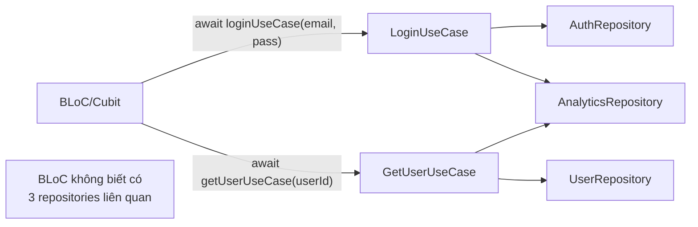

# Bài 4.3 — UseCase Pattern

## Phần 1 — Khái Niệm & Mục Tiêu Bài Học

### UseCase là gì và tại sao cần?

UseCase (hay Interactor) là class đại diện cho một **business action** cụ thể của user:
- `LoginUseCase` — user đăng nhập
- `PlaceOrderUseCase` — user đặt hàng
- `GetProductsUseCase` — lấy danh sách sản phẩm

```dart
// Không UseCase: BLoC gọi nhiều repositories, logic phân tán
class OrderBloc extends Bloc<...> {
  final ProductRepository _products;
  final CartRepository _cart;
  final OrderRepository _orders;
  final PaymentRepository _payment;
  final NotificationRepository _notifications;

  Future<void> _onPlaceOrder(_, emit) async {
    // 50 dòng business logic trong BLoC!
    final cart = await _cart.getCart();
    await _products.checkStock(cart.items);
    final order = await _orders.create(cart);
    await _payment.charge(order);
    await _notifications.send(order);
  }
}

// Với UseCase: BLoC chỉ gọi 1 UseCase
class OrderBloc extends Bloc<...> {
  final PlaceOrderUseCase _placeOrder;

  Future<void> _onPlaceOrder(_, emit) async {
    final result = await _placeOrder(userId: userId); // Gọn!
  }
}
```

### Bạn sẽ hiểu được sau bài này:
- UseCase class pattern với `call()` operator
- Single Responsibility: 1 UseCase = 1 action
- UseCase orchestrate nhiều Repositories
- Input validation ở UseCase

---

## Phần 2 — Cơ Chế Hoạt Động (Under the Hood)

### UseCase trong Clean Architecture



---

## Phần 3 — Code Mẫu Chuẩn Google

### 3.1 — UseCase base class

```dart
// core/usecase/usecase.dart
// Base abstract class — optional nhưng tạo convention thống nhất
abstract class UseCase<Type, Params> {
  Future<Type> call(Params params);
}

// Cho UseCase không có params
class NoParams {
  const NoParams();
}

// Cho UseCase sync
abstract class SyncUseCase<Type, Params> {
  Type call(Params params);
}
```

### 3.2 — Concrete UseCases

```dart
// features/auth/domain/usecases/login_usecase.dart
class LoginUseCase implements UseCase<User, LoginParams> {
  final AuthRepository _authRepository;
  final AnalyticsRepository _analytics;

  const LoginUseCase({
    required AuthRepository authRepository,
    required AnalyticsRepository analytics,
  }) : _authRepository = authRepository, _analytics = analytics;

  @override
  Future<User> call(LoginParams params) async {
    // 1. Validate input tại UseCase level (business validation)
    if (!params.email.contains('@')) {
      throw const ValidationException('Email không hợp lệ');
    }
    if (params.password.length < 6) {
      throw const ValidationException('Mật khẩu quá ngắn');
    }

    // 2. Execute business logic
    final user = await _authRepository.login(
      email: params.email.toLowerCase().trim(),
      password: params.password,
    );

    // 3. Orchestrate side effects (analytics, caching, etc.)
    await _analytics.track('user_logged_in', {'userId': user.id});

    return user;
  }
}

class LoginParams {
  final String email;
  final String password;

  const LoginParams({required this.email, required this.password});
}
```

```dart
// features/orders/domain/usecases/place_order_usecase.dart
// Complex UseCase: orchestrate nhiều repositories
class PlaceOrderUseCase implements UseCase<Order, PlaceOrderParams> {
  final CartRepository _cart;
  final ProductRepository _products;
  final OrderRepository _orders;
  final PaymentRepository _payment;
  final NotificationRepository _notifications;

  const PlaceOrderUseCase({
    required CartRepository cart,
    required ProductRepository products,
    required OrderRepository orders,
    required PaymentRepository payment,
    required NotificationRepository notifications,
  })  : _cart = cart,
        _products = products,
        _orders = orders,
        _payment = payment,
        _notifications = notifications;

  @override
  Future<Order> call(PlaceOrderParams params) async {
    // Step 1: Validate cart
    final cart = await _cart.getCart(params.userId);
    if (cart.items.isEmpty) throw const EmptyCartException();

    // Step 2: Check stock availability
    for (final item in cart.items) {
      final product = await _products.getProductById(item.productId);
      if (!product.isInStock || product.stockQuantity < item.quantity) {
        throw OutOfStockException(product.name);
      }
    }

    // Step 3: Create order
    final order = await _orders.create(
      userId: params.userId,
      items: cart.items,
      shippingAddress: params.shippingAddress,
    );

    // Step 4: Process payment
    await _payment.charge(
      orderId: order.id,
      amount: order.total,
      paymentMethod: params.paymentMethod,
    );

    // Step 5: Clear cart
    await _cart.clear(params.userId);

    // Step 6: Send notification (non-blocking — don't await, don't fail if this fails)
    _notifications.sendOrderConfirmation(order).ignore();

    return order;
  }
}
```

### 3.3 — BLoC sử dụng UseCase

```dart
// Clean BLoC: chỉ gọi UseCase, không có business logic
class AuthBloc extends Bloc<AuthEvent, AuthState> {
  final LoginUseCase _loginUseCase;
  final LogoutUseCase _logoutUseCase;
  final GetCurrentUserUseCase _getCurrentUser;

  AuthBloc({
    required LoginUseCase loginUseCase,
    required LogoutUseCase logoutUseCase,
    required GetCurrentUserUseCase getCurrentUser,
  })  : _loginUseCase = loginUseCase,
        _logoutUseCase = logoutUseCase,
        _getCurrentUser = getCurrentUser,
        super(const AuthInitial()) {
    on<AuthStarted>(_onStarted);
    on<AuthLoginRequested>(_onLoginRequested);
    on<AuthLogoutRequested>(_onLogoutRequested);
  }

  Future<void> _onLoginRequested(
    AuthLoginRequested event,
    Emitter<AuthState> emit,
  ) async {
    emit(const AuthLoading());
    try {
      // BLoC chỉ biết: gọi UseCase → nhận User
      // Không biết: có analytics, có validation, có trim email...
      final user = await _loginUseCase(
        LoginParams(email: event.email, password: event.password),
      );
      emit(AuthAuthenticated(user));
    } on ValidationException catch (e) {
      emit(AuthFailure(e.message));
    } on NetworkException catch (e) {
      emit(AuthFailure(e.message));
    }
  }
}
```

---

## Phần 4 — Lỗi Sai Phổ Biến & Best Practices

### ❌ Anti-pattern 1: UseCase quá nhỏ (thin UseCase)

```dart
// ❌ UseCase chỉ forward sang Repository — không cần thiết
class GetProductByIdUseCase {
  final ProductRepository _repo;
  Future<Product> call(String id) => _repo.getProductById(id); // Quá thin!
}

// ✅ Chỉ tạo UseCase khi có business logic đáng kể
// Nếu chỉ forward → BLoC gọi Repository trực tiếp cũng được
// Hoặc group lại: GetProductsUseCase có filtering, sorting logic
```

### ❌ Anti-pattern 2: UseCase biết về UI/framework

```dart
// ❌ UseCase import Flutter → không test được với dart test
import 'package:flutter/material.dart';

class ShowProductUseCase {
  final BuildContext context; // ❌ UI concern trong UseCase!
  Future<void> call(String id) async {
    final product = await repository.getProductById(id);
    Navigator.push(context, ...); // ← Navigation trong UseCase!
  }
}

// ✅ UseCase chỉ return data — Presentation layer handle navigation
class GetProductUseCase {
  Future<Product> call(String id) => repository.getProductById(id);
  // BLoC emit state → UI navigate khi thấy state
}
```

---

## Phần 5 — Bài Tập Củng Cố Tư Duy

### Challenge: E-Commerce UseCase Suite

**Yêu cầu:**
1. `AddToCartUseCase`: validate product còn hàng, check duplicate, update quantity nếu đã có
2. `CheckoutUseCase`: validate cart không trống, tính shipping fee theo địa chỉ, tạo order
3. `ApplyPromoCodeUseCase`: validate code hợp lệ, check expiry date, tính discount
4. Tất cả UseCase không import Flutter
5. BLoC sử dụng 3 UseCases trên

### Thử thách thẩm định kỹ thuật:

1. **"Khi nào thì tạo UseCase, khi nào để BLoC gọi thẳng Repository?"**
   - Tạo UseCase: orchestrate > 1 repository, có business validation, cần test riêng
   - Gọi thẳng Repository: đơn giản CRUD, không cần logic

2. **"UseCase có thể gọi UseCase khác không?"**
   - Có thể, nhưng nên hạn chế — tạo chain dài khó debug
   - Prefer: UseCase orchestrate Repository, không orchestrate UseCase khác
