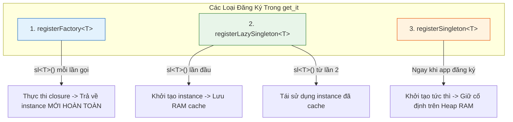
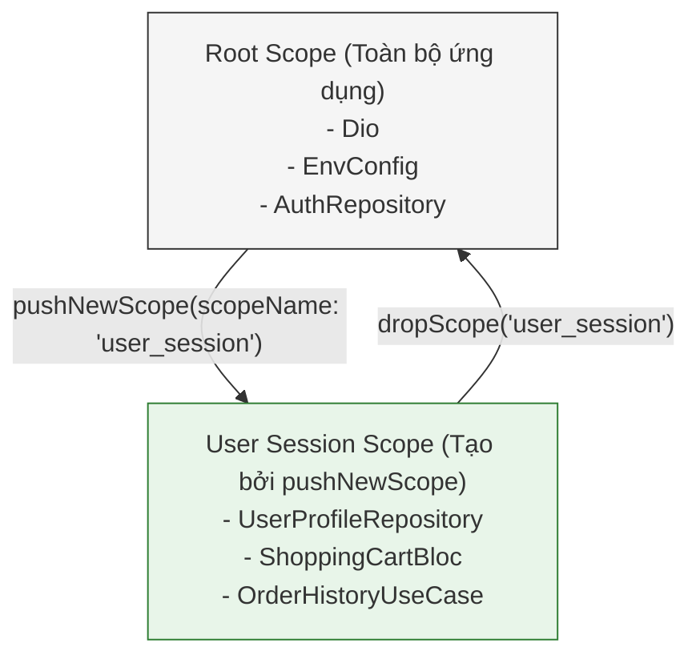

# Bài 4.4 — Tiêm Phụ Thuộc & Quản Lý Vòng Đời Đối Tượng: Service Locator get_it

## Dẫn Chiếu Tài Liệu Chính Thức
- **get_it Package Documentation**: [pub.dev/packages/get_it](https://pub.dev/packages/get_it)
- **Martin Fowler: Inversion of Control Containers and the Dependency Injection pattern**: [martinfowler.com/articles/injection.html](https://martinfowler.com/articles/injection.html)
- **Martin Fowler: Service Locator Pattern**: [martinfowler.com/articles/injection.html#UsingAServiceLocator](https://martinfowler.com/articles/injection.html#UsingAServiceLocator)
- **Dart Type System & Generic Lookup**: [dart.dev/guides/language/type-system](https://dart.dev/guides/language/type-system)

---

## Phần 1 — Khái Niệm & Bài Toán Kiến Trúc (Nó Là Gì & Giải Quyết Bài Toán Gì?)

### 1.1 — Nó Là Gì? Phân Biệt Dependency Injection & Service Locator
Trong phát triển phần mềm, **Dependency Injection (DI)** là một nguyên lý thiết kế (Design Principle) thuộc nhóm Đảo ngược Điều khiển (Inversion of Control - IoC). Nguyên lý này quy định: *Một đối tượng không được tự ý tạo lập các phụ thuộc mà nó cần; thay vào đó, các phụ thuộc này phải được cung cấp (tiêm) từ bên ngoài thông qua hàm khởi tạo (Constructor Injection).*

`get_it` là một thư viện cài đặt mẫu thiết kế **Service Locator** viết bằng Dart thuần túy:
- Hoạt động như một thanh ghi định tuyến trung tâm (Central Registry) lưu trữ các quy tắc tạo lập và instance của các dịch vụ.
- **Độc lập hoàn toàn với Flutter Framework**: Không đòi hỏi `BuildContext`, không yêu cầu widget tree, có thể truy xuất từ bất kỳ đâu (Background Isolate, WorkManager, Unit Test runner, Middleware).
- Cung cấp tốc độ tra cứu $O(1)$ dựa trên bảng băm kiểu dữ liệu (Type-based HashMap).

```
┌─────────────────────────────────────────────────────────────────────────┐
│                           CENTRAL SERVICE LOCATOR                       │
│                                 (get_it)                                │
│                                                                         │
│   sl<Dio>()                     ──> [ Dio Client Instance ]             │
│   sl<AuthRepository>()          ──> [ AuthRepositoryImpl Instance ]     │
│   sl<LoginUseCase>()            ──> [ LoginUseCase Instance ]           │
│   sl<AuthBloc>() (Factory)      ──> [ Tạo mới AuthBloc Instance ]       │
└─────────────────────────────────────────────────────────────────────────┘
```

---

### 1.2 — Giải Quyết Bài Toán Gì? Sự Bế Tắc Của Khởi Tạo Thủ Công (Manual Wiring)
Khi một ứng dụng Clean Architecture phát triển tới quy mô hàng chục tính năng, việc lắp ráp các phân tầng thủ công sẽ tạo ra 3 thảm họa kỹ thuật:

1. **"Constructor Drilling" và "Dependency Hell"**:
   - Hãy xem xét chuỗi khởi tạo phụ thuộc để hiển thị một màn hình danh sách sản phẩm:
     ```dart
     // Khởi tạo thủ công: Cồng kềnh, dễ sai sót, liên kết chặt
     final dio = Dio();
     final authInterceptor = AuthInterceptor(SecureStorage());
     dio.interceptors.add(authInterceptor);
     final remoteDataSource = ProductRemoteDataSourceImpl(dio);
     final localDataSource = ProductLocalDataSourceImpl(HiveDatabase());
     final repository = ProductRepositoryImpl(
       remoteDataSource: remoteDataSource,
       localDataSource: localDataSource,
     );
     final getProductsUseCase = GetProductsUseCase(repository);
     final productBloc = ProductBloc(getProductsUseCase: getProductsUseCase);
     ```
   - Nếu không có hệ thống DI tập trung, chuỗi khởi tạo này buộc phải viết lại hoặc truyền xuyên qua hàng chục tầng widget/constructor trung gian, làm ô nhiễm mã nguồn.
2. **Khó kiểm soát vòng đời và xung đột bộ nhớ**:
   - Nếu mỗi màn hình tự `new Dio()` hoặc `new Database()`, ứng dụng sẽ mở hàng chục kết nối mạng và kết nối file cùng lúc, gây tràn bộ nhớ (Memory Bloat) và suy giảm hiệu năng.
3. **Bế tắc trong việc tráo đổi Mock khi Kiểm thử tự động**:
   - Khi một class tự khởi tạo phụ thuộc bằng từ khóa `new` (ví dụ: `class AuthRepo { final api = ApiClient(); }`), việc viết Unit Test cô lập là bất khả thi vì không thể tráo đổi `ApiClient` thật bằng `MockApiClient`. DI qua constructor và Service Locator cho phép đăng ký mock dependencies chỉ với 1 dòng lệnh.

---

### 1.3 — Bảng So Sánh Các Cơ Chế Quản Lý Phụ Thuộc Trong Flutter

| Tiêu Chí | `get_it` (Service Locator) | `InheritedWidget` / `Provider` | `Riverpod` (Reactive DI) |
| :--- | :--- | :--- | :--- |
| **Phụ thuộc BuildContext?** | **Không** (Dùng được ở mọi nơi). | **Có** (Bắt buộc phải nằm trên cây UI). | **Không bắt buộc** (Thông qua `ProviderContainer`). |
| **Độ phức tạp tra cứu** | $O(1)$ (HashMap lookup). | $O(N)$ (Duyệt ngược cây phần tử). | $O(1)$ (Đồ thị DAG). |
| **Mục đích chính** | Tiêm các Service hạ tầng, Repository, UseCase, BLoC. | Quản lý trạng thái và truyền dữ liệu UI. | Kết hợp cả Quản lý trạng thái và DI phản ứng. |
| **Hỗ trợ Scopes** | Có (Ngăn xếp `pushNewScope`). | Có (Dựa theo vị trí Widget Tree). | Có (Thông qua Scoped ProviderContainer). |

---

### 1.4 — Mục Tiêu Kỹ Thuật Cần Đạt Được
- Nắm vững cơ chế bên dưới của 3 chiến lược đăng ký vòng đời: `Factory`, `LazySingleton`, và `Singleton`.
- Thiết lập quy trình lắp ráp phụ thuộc (Wiring Hierarchy) 5 phân tầng nghiêm ngặt.
- Xử lý bài toán khởi tạo bất đồng bộ (Async Dependencies) với `allReady()` và `isReady<T>()`.
- Quản lý phân vùng bộ nhớ theo phiên người dùng bằng `pushNewScope` và `dropScope`.
- Phòng chống triệt để lỗi Service Locator Antipattern tại Presentation Layer.

---

## Phần 2 — Bản Chất Là Gì? (Under the Hood & Cơ Chế Hoạt Động)

### 2.1 — Cấu Trúc Dữ Liệu Nội Tại Của `get_it`
Về mặt bản chất kỹ thuật, `get_it` duy trì một bảng băm các Factory closures:

```dart
// Mô phỏng cấu trúc nội bộ đơn giản hóa của GetIt
class _ServiceFactory<T> {
  final InstanceFactoryType factoryType; // factory, singleton, lazySingleton
  T? instance;
  final FactoryFunc<T> creationFunction;
  final DisposerFunc<T>? disposingFunction;
  // ...
}

class GetIt {
  final Map<Type, _ServiceFactory<dynamic>> _factories = {};
  final List<Map<Type, _ServiceFactory<dynamic>>> _scopes = [];
  // ...
}
```

- Khi gọi `sl.registerLazySingleton<ApiClient>(() => ApiClient(sl()))`:
  - `get_it` lưu trữ kiểu dữ liệu `ApiClient` làm khóa (Key) và lưu hàm tạo `() => ApiClient(sl())` vào `_factories`. Lúc này, `ApiClient` **chưa hề được khởi tạo trong bộ nhớ**.
- Khi lần đầu tiên có lệnh `sl<ApiClient>()`:
  - `get_it` tra cứu `_factories[ApiClient]` với độ phức tạp $O(1)$.
  - Nhận diện kiểu `lazySingleton`, kiểm tra `instance == null`.
  - Thực thi hàm tạo, gán kết quả vào thuộc tính `instance` của node đó.
  - Các lần gọi tiếp theo sẽ trả về trực tiếp `instance` đã lưu trong cache mà không chạy lại hàm tạo.

---

### 2.2 — Phân Biệt 3 Chiến Lược Đăng Ký Vòng Đời Đối Tượng



1. **`registerSingleton<T>(instance)`**:
   - Cấp phát đối tượng ngay lập tức khi chạy hàm khởi động hệ thống.
   - Thích hợp cho: Các dịch vụ nền tảng bắt buộc phải sẵn sàng ngay lập tức (e.g. `PackageInfo`, cấu hình môi trường `EnvConfig`).
2. **`registerLazySingleton<T>(factoryFunc)`**:
   - Trì hoãn việc khởi tạo cho đến khi có thành phần đầu tiên trong ứng dụng thực sự yêu cầu.
   - Thích hợp cho: Phần lớn các dịch vụ hạ tầng, `DioClient`, CSDL cục bộ, `Repositories`, và `UseCases`.
3. **`registerFactory<T>(factoryFunc)`**:
   - Cấp phát một vùng nhớ mới hoàn toàn mỗi khi có lời gọi `sl<T>()`.
   - Thích hợp cho: `BLoC` và `Cubit` tầng Presentation. Mỗi khi màn hình mở ra, một instance Controller mới được tạo và sẽ được giải phóng khi màn hình đóng lại.

---

### 2.3 — Cơ Chế Phân Vùng Bộ Nhớ: Scoped Registrations (Quản Lý Phiên)

Ứng dụng thường có các dịch vụ chỉ được phép tồn tại trong lúc người dùng đã đăng nhập (ví dụ: `UserProfileCache`, `UserOrderHistory`). Khi người dùng đăng xuất, các đối tượng này bắt buộc phải bị hủy để tránh rò rỉ dữ liệu sang tài khoản khác.

`get_it` giải quyết bài toán này bằng **Ngăn xếp Phân vùng (Scope Stack)**:



- Khi đăng nhập thành công: Gọi `sl.pushNewScope(scopeName: 'user_session')` và đăng ký các dịch vụ riêng tư của người dùng vào scope này.
- Khi đăng xuất: Gọi `await sl.dropScope('user_session')`. Toàn bộ các instance đăng ký trong scope này sẽ tự động được gọi hàm hủy (`disposer`) và giải phóng sạch sẽ khỏi RAM.

---

## Phần 3 — Triển Khai Kỹ Thuật (Triển Khai Như Nào? Step-by-Step Implementation)

Xây dựng hệ thống cấu hình Tiêm phụ thuộc hoàn chỉnh theo thứ tự phân tầng 5 lớp trong tệp tin `injection.dart`.

### 3.1 — Bước 1: Thiết Lập File Cấu Hình Hệ Thống `injection.dart`

```dart
// lib/core/di/injection.dart

import 'package:get_it/get_it.dart';
import 'package:dio/dio.dart';

// Biến truy xuất toàn cục duy nhất
final GetIt sl = GetIt.instance;

Future<void> configureDependencies() async {
  // THỨ TỰ BẮT BUỘC: Đi từ hạ tầng thấp nhất lên tầng ứng dụng cao nhất
  _registerExternal();
  _registerCore();
  _registerDataSources();
  _registerRepositories();
  _registerUseCases();
  _registerBlocs();

  // Đảm bảo toàn bộ các tác vụ async singleton đã hoàn tất
  await sl.allReady();
}
```

---

### 3.2 — Bước 2: Đăng Ký Từng Phân Tầng Chi Tiết

```dart
// lib/core/di/injection_modules.dart

import 'package:dio/dio.dart';
import 'package:get_it/get_it.dart';
import '../../features/auth/data/datasources/auth_remote_datasource.dart';
import '../../features/auth/data/repositories/auth_repository_impl.dart';
import '../../features/auth/domain/repositories/auth_repository.dart';
import '../../features/auth/domain/usecases/login_usecase.dart';
import '../../features/auth/presentation/cubit/auth_cubit.dart';

final GetIt sl = GetIt.instance;

// 1. TẦNG NGOẠI VI (External Libraries)
void _registerExternal() {
  sl.registerLazySingleton<Dio>(() {
    final dio = Dio(
      BaseOptions(
        baseUrl: 'https://api.enterprise.com/v1',
        connectTimeout: const Duration(seconds: 10),
        receiveTimeout: const Duration(seconds: 15),
      ),
    );
    dio.interceptors.add(LogInterceptor(responseBody: false));
    return dio;
  });
}

// 2. TẦNG LÕI DÙNG CHUNG (Core Utilities)
void _registerCore() {
  // Ví dụ: NetworkInfo, SecureStorage
}

// 3. TẦNG NGUỒN DỮ LIỆU (Data Sources)
void _registerDataSources() {
  sl.registerLazySingleton<AuthRemoteDataSource>(
    () => AuthRemoteDataSourceImpl(dio: sl<Dio>()),
  );
}

// 4. TẦNG KHO CHỨA DỮ LIỆU (Repositories)
// Bắt buộc liên kết kiểu Interface trừu tượng với Implementation cụ thể
void _registerRepositories() {
  sl.registerLazySingleton<AuthRepository>(
    () => AuthRepositoryImpl(remoteDataSource: sl<AuthRemoteDataSource>()),
  );
}

// 5. TẦNG NGHIỆP VỤ (UseCases)
void _registerUseCases() {
  sl.registerLazySingleton<LoginUseCase>(
    () => LoginUseCase(authRepository: sl<AuthRepository>()),
  );
}

// 6. TẦNG ĐIỀU KHIỂN GIAO DIỆN (Presentation BLoCs / Cubits)
// Bắt buộc sử dụng registerFactory để mỗi màn hình nhận một Controller mới
void _registerBlocs() {
  sl.registerFactory<AuthCubit>(
    () => AuthCubit(loginUseCase: sl<LoginUseCase>()),
  );
}
```

---

### 3.3 — Bước 3: Khởi Động Tại `main.dart`

```dart
// lib/main.dart

import 'package:flutter/material.dart';
import 'core/di/injection.dart';
import 'features/auth/presentation/pages/login_page.dart';

void main() async {
  // Bắt buộc gọi trước khi can thiệp vào các dịch vụ nền
  WidgetsFlutterBinding.ensureInitialized();

  // Khởi tạo toàn bộ dependency graph
  await configureDependencies();

  runApp(const MainApplication());
}

class MainApplication extends StatelessWidget {
  const MainApplication({super.key});

  @override
  Widget build(BuildContext context) {
    return MaterialApp(
      theme: ThemeData(useMaterial3: true),
      home: const LoginPage(),
    );
  }
}
```

---

### 3.4 — Bước 4: Kết Nối An Toàn Vào Flutter Widget Tree

Không gọi trực tiếp `sl()` trong phương thức `build()`. Sử dụng `BlocProvider` để quản lý vòng đời đóng (`close()`):

```dart
// lib/features/auth/presentation/pages/login_page.dart

import 'package:flutter/material.dart';
import 'package:flutter_bloc/flutter_bloc.dart';
import '../../../../core/di/injection.dart';
import '../cubit/auth_cubit.dart';

class LoginPage extends StatelessWidget {
  const LoginPage({super.key});

  @override
  Widget build(BuildContext context) {
    return BlocProvider<AuthCubit>(
      // Khởi tạo Cubit thông qua Service Locator
      create: (_) => sl<AuthCubit>(),
      child: const Scaffold(
        body: Center(child: Text('Màn Hình Đăng Nhập')),
      ),
    );
  }
}
```

---

## Phần 4 — Best Practices & Phòng Chống Cạm Bẫy (Defensive Engineering)

### 4.1 — ❌ Anti-pattern 1: Gọi `sl<T>()` Trực Tiếp Trong Hàm `build()` Của Widget (Service Locator Antipattern)

#### Mô tả lỗi:
Truy xuất trực tiếp các dependency ngay bên trong hàm vẽ giao diện:

```dart
// ❌ LỖI KIẾN TRÚC: Widget gọi Service Locator trực tiếp trong build
@override
Widget build(BuildContext context) {
  final userRepo = sl<UserRepository>(); // Ẩn giấu phụ thuộc!
  return ElevatedButton(
    onPressed: () => userRepo.fetchProfile(),
    child: const Text('Tải hồ sơ'),
  );
}
```

#### Phân tích cơ chế gây lỗi:
- **Ẩn giấu phụ thuộc (Hidden Dependencies)**: Khi nhìn vào constructor của Widget `MyWidget()`, người khác không thể biết widget này cần những dịch vụ nào để chạy.
- **Phá hủy khả năng Widget Testing**: Để viết Widget Test cho `MyWidget`, lập trình viên buộc phải dựng toàn bộ hệ thống `get_it` giả lập, thay vì chỉ cần truyền mock qua constructor hoặc qua `Provider`.

#### Biện pháp phòng chống:
Chỉ sử dụng `sl()` tại điểm cấu hình (Composition Root), ví dụ trong hàm `create` của `BlocProvider` hoặc truyền qua constructor của StatefulWidget:

```dart
// ✅ ĐÚNG: Nhận Cubit qua BlocProvider hoặc Constructor
class ProfileScreen extends StatelessWidget {
  final ProfileCubit cubit;
  const ProfileScreen({super.key, required this.cubit});
}
```

---

### 4.2 — ❌ Anti-pattern 2: Đăng Ký Sai Thứ Tự Khởi Tạo Trong `injection.dart`

#### Mô tả lỗi:
Đăng ký một service sử dụng dependency chưa được đăng ký trước đó:

```dart
// ❌ LỖI: Đăng ký Repository TRƯỚC DataSource
void configureDependencies() {
  sl.registerLazySingleton<AuthRepository>(
    () => AuthRepositoryImpl(remoteDataSource: sl<AuthRemoteDataSource>()),
  );

  // AuthRemoteDataSource được đăng ký SAU!
  sl.registerLazySingleton<AuthRemoteDataSource>(
    () => AuthRemoteDataSourceImpl(dio: sl<Dio>()),
  );
}
```

#### Phân tích cơ chế gây lỗi:
Khi một class gọi `sl<AuthRepository>()`, `get_it` sẽ cố gắng giải quyết `sl<AuthRemoteDataSource>()`. Nếu lúc này `AuthRemoteDataSource` chưa được đăng ký vào bảng băm, hệ thống sẽ ném ra ngoại lệ runtime nghiêm trọng:
`GetIt: Object/factory with type AuthRemoteDataSource is not registered inside GetIt`.

#### Biện pháp phòng chống:
Luôn tuân thủ quy tắc hình tháp 5 tầng: **Tầng độc lập thấp nhất phải được đăng ký trước, tầng phụ thuộc cao hơn đăng ký sau**.

---

### 4.3 — ❌ Anti-pattern 3: Rò Rỉ Trạng Thái Trong Unit Test Do Không `reset()` Container

#### Mô tả lỗi:
Chạy nhiều bài test nối tiếp nhau nhưng không xóa trạng thái đăng ký của `get_it`:

```dart
// ❌ LỖI: Trạng thái của Test 1 làm nhiễm bẩn Test 2
void main() {
  test('Test 1: Đăng ký Mock Repository', () {
    sl.registerSingleton<UserRepository>(MockUserRepoA());
    // ...
  });

  test('Test 2: Đăng ký Mock Repository khác', () {
    // SẬP RUNTIME: Type UserRepository đã được đăng ký trước đó!
    sl.registerSingleton<UserRepository>(MockUserRepoB());
  });
}
```

#### Biện pháp phòng chống:
Luôn sử dụng `tearDown` hoặc `setUp` để làm sạch thanh ghi `get_it`:

```dart
// ✅ ĐÚNG: Reset container sau mỗi ca kiểm thử
setUp(() async {
  await sl.reset();
});
```

---

## Phần 5 — Khảo Sát Bản Chất Kỹ Thuật & Thử Thách Thẩm Định

### 5.1 — Khảo Sát Bản Chất Kỹ Thuật

#### Câu hỏi 1: Tại sao nên đăng ký BLoC/Cubit bằng `registerFactory` thay vì `registerLazySingleton`?
*Phân tích kỹ thuật:*
BLoC và Cubit quản lý trạng thái của một màn hình cụ thể. Khi người dùng rời màn hình, `BlocProvider` sẽ kích hoạt hàm hủy `close()` để giải phóng luồng Stream. Nếu đăng ký dưới dạng `Singleton`, instance này vẫn bị giữ trên RAM; khi người dùng mở lại màn hình lần thứ hai, ứng dụng sẽ cố gắng lắng nghe một StreamController đã bị đóng (`isClosed == true`), dẫn đến ngoại lệ `StateError`. Sử dụng `registerFactory` đảm bảo mỗi lần màn hình mở ra đều có một instance mới hoàn toàn với StreamController hợp lệ.

---

#### Câu hỏi 2: Sự khác nhau về mặt cơ chế giữa `sl.reset()` và `sl.resetLazySingleton<T>()` là gì?
*Phân tích kỹ thuật:*
- `sl.reset()`: Xóa bỏ toàn bộ mọi định nghĩa factory, singleton, và scope hiện có trong `get_it`. Thường dùng trong `setUp`/`tearDown` của bài test suite.
- `sl.resetLazySingleton<T>()`: Không xóa đăng ký trong bảng băm, mà chỉ giải phóng instance hiện tại đang lưu trong RAM cache của kiểu `T`. Lần gọi `sl<T>()` kế tiếp sẽ kích hoạt hàm tạo để tạo ra một instance mới. Rất hữu ích khi cần làm mới hoàn toàn một dịch vụ (như xóa cache sau khi đổi tài khoản).

---

### 5.2 — Bài Tập Thực Hành: Thiết Lập Test Environment Cho Authentication

**Mục tiêu**:
1. Viết một hàm tiện ích `setupTestInjection()` chuyên biệt cho môi trường kiểm thử tự động.
2. Đăng ký các phiên bản Mock của `Dio` và `AuthRemoteDataSource` bằng thư viện `mocktail`.
3. Viết 2 ca Unit Test kiểm tra tính độc lập của việc truy xuất dependencies thông qua `sl<AuthRepository>()`.
4. Đảm bảo toàn bộ test case chạy vượt qua với `dart test` và không để lại rò rỉ bộ nhớ.
