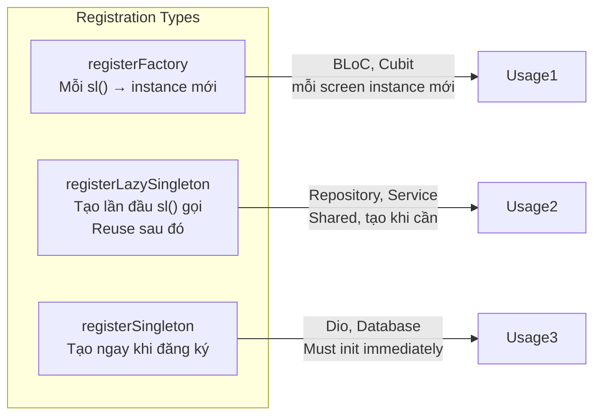

# Bài 4.4 — Dependency Injection với get_it

## Phần 1 — Khái Niệm & Mục Tiêu Bài Học

### Tại sao cần Dependency Injection?

Trong Clean Architecture, các class nhận dependencies qua constructor (không tự tạo). Vấn đề: ai tạo ra các dependencies này?

```dart
// Manual wiring: verbose, error-prone
final dio = Dio();
final apiService = ProductApiService(dio);
final cache = ProductLocalCache();
final repository = ProductRepositoryImpl(apiService: apiService, cache: cache);
final getProducts = GetProductsUseCase(repository: repository);
final bloc = ProductsBloc(getProductsUseCase: getProducts);
```

**get_it** là service locator — đăng ký một lần, access ở bất kỳ đâu:

```dart
// Đăng ký một lần trong injection.dart
sl.registerFactory(() => ProductsBloc(getProductsUseCase: sl()));

// Access ở bất kỳ đâu
BlocProvider(create: (_) => sl<ProductsBloc>())
```

### Bạn sẽ hiểu được sau bài này:
- `registerFactory` vs `registerLazySingleton` vs `registerSingleton`
- Thứ tự đăng ký dependencies
- Scoped dependencies với `pushNewScope`
- Phân biệt get_it (service locator) vs Riverpod/Provider (reactive DI)

---

## Phần 2 — Cơ Chế Hoạt Động (Under the Hood)

### get_it Registration Types



---

## Phần 3 — Code Mẫu Chuẩn Google

### 3.1 — injection.dart — Wiring toàn bộ app

```dart
// core/di/injection.dart
import 'package:get_it/get_it.dart';

// Global service locator — sl() shorthand
final sl = GetIt.instance;

Future<void> configureDependencies() async {
  // Thứ tự: External → Core → Data → Domain → Presentation
  _registerExternal();
  _registerCore();
  _registerDataLayer();
  _registerDomainLayer();
  _registerPresentationLayer();
}

void _registerExternal() {
  // Singleton: tạo ngay, dùng chung toàn app
  sl.registerSingleton<Dio>(_configureDio());

  // LazySingleton: tạo khi cần lần đầu
  sl.registerLazySingleton<SharedPreferences>(
    () => throw Exception('Init SharedPreferences before calling'),
  );
}

Dio _configureDio() {
  final dio = Dio(BaseOptions(
    baseUrl: 'https://api.example.com',
    connectTimeout: const Duration(seconds: 10),
    receiveTimeout: const Duration(seconds: 15),
  ));
  dio.interceptors.addAll([
    LogInterceptor(responseBody: false),
    _AuthInterceptor(),
  ]);
  return dio;
}

void _registerCore() {
  sl.registerLazySingleton<NetworkInfo>(
    () => NetworkInfoImpl(Connectivity()),
  );
}

void _registerDataLayer() {
  // Data Sources — LazySingleton: shared, stateless
  sl.registerLazySingleton<ProductRemoteDataSource>(
    () => ProductRemoteDataSourceImpl(dio: sl()),
  );
  sl.registerLazySingleton<ProductLocalDataSource>(
    () => ProductLocalDataSourceImpl(sharedPrefs: sl()),
  );

  // Repositories — LazySingleton: interface implementation
  sl.registerLazySingleton<ProductRepository>(
    () => ProductRepositoryImpl(
      remoteDataSource: sl(),
      localDataSource: sl(),
      networkInfo: sl(),
    ),
  );
  sl.registerLazySingleton<AuthRepository>(
    () => AuthRepositoryImpl(remoteDataSource: sl(), localDataSource: sl()),
  );
}

void _registerDomainLayer() {
  // UseCases — Factory: mỗi lần tạo instance mới (nhẹ, stateless)
  sl.registerFactory(() => LoginUseCase(
    authRepository: sl(),
    analytics: sl(),
  ));
  sl.registerFactory(() => GetProductsUseCase(repository: sl()));
  sl.registerFactory(() => PlaceOrderUseCase(
    cart: sl(),
    products: sl(),
    orders: sl(),
    payment: sl(),
    notifications: sl(),
  ));
}

void _registerPresentationLayer() {
  // BLoC/Cubit — Factory: mỗi screen tạo instance mới
  // KHÔNG dùng Singleton cho BLoC → state leak giữa sessions
  sl.registerFactory(() => ProductsBloc(
    getProductsUseCase: sl(),
  ));
  sl.registerFactory(() => AuthBloc(
    loginUseCase: sl(),
    logoutUseCase: sl(),
  ));
}
```

### 3.2 — main.dart — Khởi tạo

```dart
void main() async {
  WidgetsFlutterBinding.ensureInitialized();

  // Khởi tạo async dependencies trước
  final sharedPrefs = await SharedPreferences.getInstance();

  // Đăng ký dependencies đã init
  sl.registerSingleton<SharedPreferences>(sharedPrefs);

  // Wire toàn bộ app
  await configureDependencies();

  runApp(const MyApp());
}

// Widget — dùng get_it để inject BLoC
class HomeScreen extends StatelessWidget {
  @override
  Widget build(BuildContext context) {
    return BlocProvider(
      // sl() tạo ProductsBloc mới với tất cả dependencies tự động inject
      create: (_) => sl<ProductsBloc>()..add(const ProductsStarted()),
      child: const HomeView(),
    );
  }
}
```

### 3.3 — Async initialization với registerSingletonAsync

```dart
// Khi dependency cần async init (Database, Firebase)
sl.registerSingletonAsync<Database>(() async {
  final db = await openDatabase('app.db', version: 1);
  return db;
});

// Đảm bảo tất cả async singletons đã ready
await sl.allReady();
runApp(const MyApp());
```

---

## Phần 4 — Lỗi Sai Phổ Biến & Best Practices

### ❌ Anti-pattern 1: registerSingleton cho BLoC

```dart
// ❌ BLoC singleton: state tồn tại xuyên sessions, memory leak
sl.registerSingleton<AuthBloc>(AuthBloc(loginUseCase: sl()));
// Navigate away → BLoC không bị dispose!

// ✅ Factory: mỗi lần tạo mới, lifecycle theo BlocProvider
sl.registerFactory<AuthBloc>(() => AuthBloc(loginUseCase: sl()));
// BlocProvider dispose BLoC khi widget unmount
```

### ❌ Anti-pattern 2: Không đăng ký đúng thứ tự

```dart
// ❌ ProductBloc đăng ký trước Repository → GetIt throw khi resolve
sl.registerFactory(() => ProductsBloc(getProductsUseCase: sl())); // sl<GetProductsUseCase>() fail!
sl.registerFactory(() => GetProductsUseCase(repository: sl())); // Đăng ký SAU
sl.registerLazySingleton<ProductRepository>(() => ProductRepositoryImpl(...));

// ✅ Thứ tự: External → Data → Domain → Presentation
// GetIt resolve lazy — thực ra registerFactory không resolve ngay
// Nhưng về convention: đăng ký theo dependency order để dễ đọc
```

### ❌ Anti-pattern 3: sl() trong Widget build()

```dart
// ❌ sl() trong build() → tạo instance mới mỗi rebuild (với Factory)
Widget build(BuildContext context) {
  final bloc = sl<ProductsBloc>(); // Tạo mới mỗi build!
  return BlocProvider.value(value: bloc, ...);
}

// ✅ sl() trong BlocProvider.create hoặc initState
BlocProvider(
  create: (_) => sl<ProductsBloc>(), // Tạo một lần khi widget mount
  child: ...
)
```

---

## Phần 5 — Bài Tập Củng Cố Tư Duy

### Challenge: Full DI Setup cho Feature Profile

**Yêu cầu:**
1. `ProfileRemoteDataSource` + `ProfileLocalDataSource`
2. `ProfileRepository` interface + `ProfileRepositoryImpl`
3. `GetProfileUseCase` + `UpdateProfileUseCase`
4. `ProfileCubit`
5. Đăng ký toàn bộ vào `injection.dart` đúng thứ tự
6. `ProfileScreen` dùng `BlocProvider(create: (_) => sl<ProfileCubit>())`

### Câu hỏi phỏng vấn:

1. **"get_it vs Riverpod/Provider cho DI?"**
   - get_it: service locator pattern, imperative, simple — không reactive
   - Riverpod: reactive DI — provider rebuild khi dep thay đổi, autoDispose
   - Thực tế: get_it cho repositories/services, Riverpod cho state management

2. **"registerFactory vs registerLazySingleton — khi nào dùng cái nào?"**
   - Factory: stateful (BLoC, Cubit) — mỗi màn hình cần instance mới
   - LazySingleton: stateless shared services (Repository, ApiService, Cache)

3. **"Làm sao test với get_it?"**
   - `sl.reset()` trong `setUp()` để clear all registrations
   - Đăng ký mock implementations thay vì real ones
