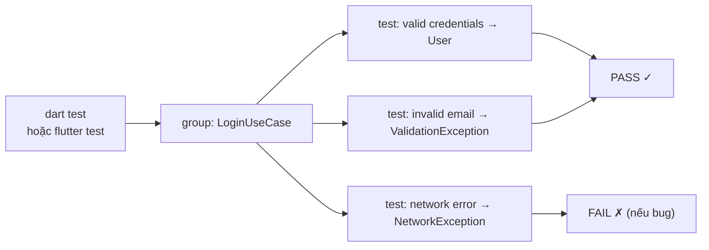

# Bài 5.1 — Unit Testing trong Dart

## Phần 1 — Khái Niệm & Mục Tiêu Bài Học

### Tại sao unit test quan trọng?

Unit test là lưới an toàn khi refactor. Advanced chapter "Testing Pyramid" trong `flutter-advanced/` giả định bạn đã biết viết unit test cơ bản. Không có nền tảng này → không thể test UseCase, Repository, BLoC.

```dart
// Không có test: sửa LoginUseCase → run app → đăng nhập tay để check
// Có unit test: sửa LoginUseCase → run dart test → 3 giây biết kết quả
```

### Bạn sẽ hiểu được sau bài này:
- `test()`, `group()`, `expect()` — cấu trúc cơ bản
- `setUp()` / `tearDown()` — prepare/cleanup
- Matchers phổ biến: `equals`, `isA`, `throwsA`, `completes`
- Test coverage: đo lường và đặt ngưỡng

---

## Phần 2 — Cơ Chế Hoạt Động (Under the Hood)

### Test Runner Flow



**AAA Pattern** — cấu trúc chuẩn cho mỗi test:
- **Arrange**: Setup data, mocks
- **Act**: Gọi function/method
- **Assert**: Kiểm tra kết quả

---

## Phần 3 — Code Mẫu Chuẩn Google

### 3.1 — Cấu trúc test cơ bản

```dart
// test/features/auth/domain/usecases/login_usecase_test.dart
import 'package:flutter_test/flutter_test.dart';
import 'package:mocktail/mocktail.dart';

// Test cho LoginUseCase (Pure Dart — chạy rất nhanh)
void main() {
  // group: nhóm tests liên quan
  group('LoginUseCase', () {
    late LoginUseCase sut; // sut = System Under Test
    late MockAuthRepository mockAuthRepository;
    late MockAnalyticsRepository mockAnalytics;

    // setUp: chạy trước MỖI test trong group
    setUp(() {
      mockAuthRepository = MockAuthRepository();
      mockAnalytics = MockAnalyticsRepository();
      sut = LoginUseCase(
        authRepository: mockAuthRepository,
        analytics: mockAnalytics,
      );
    });

    // Happy path
    test('should return User when credentials are valid', () async {
      // Arrange
      const email = 'user@test.com';
      const password = 'secret123';
      final expectedUser = User(
        id: '1',
        name: 'Test User',
        email: email,
        role: UserRole.user,
        createdAt: DateTime.now(),
      );

      when(() => mockAuthRepository.login(
            email: email,
            password: password,
          )).thenAnswer((_) async => expectedUser);
      when(() => mockAnalytics.track(any(), any())).thenAnswer((_) async {});

      // Act
      final result = await sut(LoginParams(email: email, password: password));

      // Assert
      expect(result, equals(expectedUser));
      // Verify repository was called with correct args
      verify(() => mockAuthRepository.login(email: email, password: password)).called(1);
    });

    // Validation tests
    test('should throw ValidationException when email is invalid', () async {
      // Arrange
      const invalidEmail = 'not-an-email';

      // Act & Assert
      expect(
        () => sut(LoginParams(email: invalidEmail, password: 'password123')),
        throwsA(isA<ValidationException>()),
      );
      // Ensure repository was NOT called
      verifyNever(() => mockAuthRepository.login(email: any(named: 'email'), password: any(named: 'password')));
    });

    test('should throw ValidationException when password is too short', () {
      expect(
        () => sut(LoginParams(email: 'user@test.com', password: '12345')),
        throwsA(
          isA<ValidationException>()
              .having((e) => e.message, 'message', contains('ngắn')),
        ),
      );
    });

    // Network error
    test('should propagate NetworkException when repository throws', () async {
      // Arrange
      when(() => mockAuthRepository.login(
            email: any(named: 'email'),
            password: any(named: 'password'),
          )).thenThrow(const NetworkException('No internet'));

      // Act & Assert
      expect(
        () => sut(LoginParams(email: 'user@test.com', password: 'password123')),
        throwsA(isA<NetworkException>()),
      );
    });

    // Email normalization
    test('should trim and lowercase email before calling repository', () async {
      // Arrange
      when(() => mockAuthRepository.login(
            email: 'user@test.com', // Normalized
            password: 'password123',
          )).thenAnswer((_) async => _fakeUser);
      when(() => mockAnalytics.track(any(), any())).thenAnswer((_) async {});

      // Act — send with spaces and uppercase
      await sut(LoginParams(email: '  User@Test.COM  ', password: 'password123'));

      // Assert — verify repository received normalized email
      verify(() => mockAuthRepository.login(
        email: 'user@test.com',
        password: 'password123',
      )).called(1);
    });
  });

  // Tests cho Money Value Object
  group('Money', () {
    test('should format VND correctly', () {
      const money = Money(amount: 299000);
      expect(money.formatted, equals('299.000đ'));
    });

    test('should add two Money values', () {
      const a = Money(amount: 100000);
      const b = Money(amount: 50000);
      expect(a + b, equals(const Money(amount: 150000)));
    });

    test('should throw when adding different currencies', () {
      const vnd = Money(amount: 100000, currency: 'VND');
      const usd = Money(amount: 5, currency: 'USD');
      expect(() => vnd + usd, throwsAssertionError);
    });
  });
}

// Fake data helper
User get _fakeUser => User(
  id: '1',
  name: 'Test',
  email: 'test@test.com',
  role: UserRole.user,
  createdAt: DateTime(2024),
);
```

### 3.2 — setUp vs setUpAll

```dart
group('ProductRepository', () {
  late MockDio mockDio;
  late ProductRepositoryImpl sut;

  // setUpAll: chạy MỘT LẦN trước tất cả tests trong group
  setUpAll(() {
    registerFallbackValue(const ProductDto(...));
  });

  // setUp: chạy trước MỖI test — reset mocks
  setUp(() {
    mockDio = MockDio();
    sut = ProductRepositoryImpl(dio: mockDio);
  });

  // tearDown: cleanup sau mỗi test
  tearDown(() {
    reset(mockDio); // Reset mock state
  });

  test('...', () { ... });
});
```

### 3.3 — Async tests

```dart
test('should emit products stream when inventory updates', () async {
  // Arrange
  final controller = StreamController<List<Product>>();

  when(() => mockDataSource.watchProducts())
      .thenAnswer((_) => controller.stream);

  // Act
  final stream = sut.watchProducts();

  // Assert — expectLater cho streams
  expectLater(
    stream,
    emitsInOrder([
      [],
      [product1],
      [product1, product2],
    ]),
  );

  // Emit values
  controller.add([]);
  controller.add([product1]);
  controller.add([product1, product2]);
  await controller.close();
});
```

---

## Phần 4 — Lỗi Sai Phổ Biến & Best Practices

### ❌ Anti-pattern 1: Test quá broad (nhiều assertions cho 1 test)

```dart
// ❌ Test quá nhiều thứ cùng lúc → khó biết lỗi ở đâu khi fail
test('login works', () async {
  final user = await sut(params);
  expect(user.id, '1');
  expect(user.name, 'Test');
  expect(user.email, 'test@test.com');
  expect(user.role, UserRole.user);
  // Nếu id sai → 4 expectations fail cùng lúc
});

// ✅ Focused assertions, hoặc dùng isA với specific matchers
test('should return user with correct email', () async {
  final user = await sut(params);
  expect(user.email, 'test@test.com');
});
```

### ❌ Anti-pattern 2: Side-effecting tests (tests phụ thuộc nhau)

```dart
// ❌ Test 2 phụ thuộc state từ Test 1
late List<Product> sharedList;

test('test 1: setup data', () {
  sharedList = [product1]; // Side effect!
});

test('test 2: use data from test 1', () {
  expect(sharedList, isNotEmpty); // Phụ thuộc test 1 chạy trước
});

// ✅ Mỗi test độc lập — setUp reset state
setUp(() {
  products = []; // Reset mỗi test
});
```

---

## Phần 5 — Bài Tập Củng Cố Tư Duy

### Challenge: Test ProductRepositoryImpl

**Yêu cầu:**
1. Test `getProducts()`: cache hit → return cache, cache miss → call API
2. Test `getProductById()`: không tìm thấy → throw `NotFoundFailure`
3. Test `toggleFavorite()`: API fail → throw `NetworkFailure`
4. Coverage >= 90% cho `product_repository_impl.dart`

### Câu hỏi phỏng vấn:

1. **"AAA pattern là gì?"**
   - Arrange: Setup, Mocks
   - Act: Call the method
   - Assert: Verify result

2. **"setUp vs setUpAll?"**
   - `setUp`: trước MỖI test — dùng để reset mocks
   - `setUpAll`: MỘT LẦN trước tất cả — dùng cho expensive operations (DB connection)
