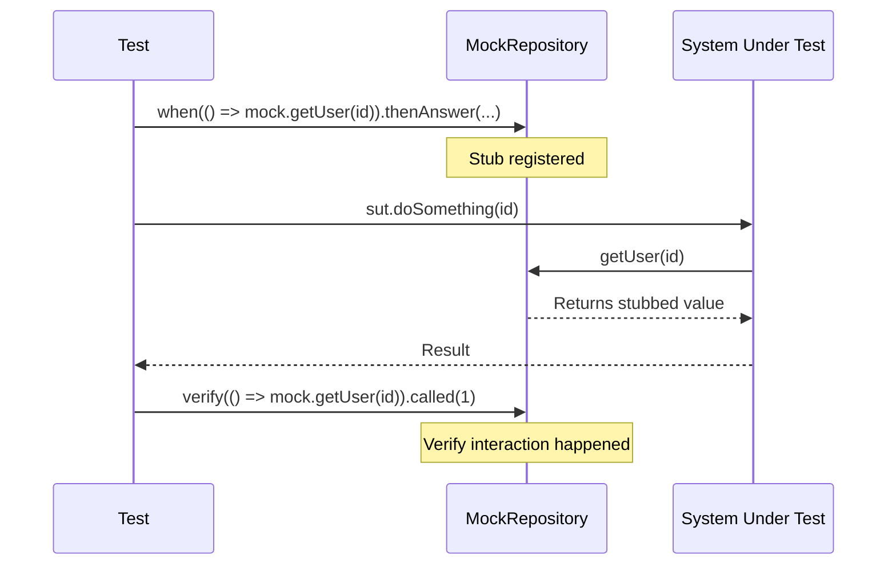

# Bài 5.2 — Mocking với mocktail

## Phần 1 — Khái Niệm & Mục Tiêu Bài Học

### Mock, Stub, Fake — không phải cùng một thứ

| | Mock | Stub | Fake |
|---|---|---|---|
| Mục đích | Verify interactions (was called?) | Control return values | Working implementation (lightweight) |
| Ví dụ | "Verify analytics.track() called once" | "When getUser() → return fakeUser" | In-memory repository |

**mocktail** (phiên bản hiện đại của mockito, không cần code generation):

```dart
// mockito: cần code gen, build_runner
@GenerateMocks([AuthRepository])
// mocktail: không cần code gen
class MockAuthRepository extends Mock implements AuthRepository {}
```

### Bạn sẽ hiểu được sau bài này:
- Tạo mock với `extends Mock`
- `when().thenReturn()`, `when().thenAnswer()`, `when().thenThrow()`
- `verify()`, `verifyNever()`, `verifyInOrder()`
- `registerFallbackValue` — xử lý non-nullable arguments

---

## Phần 2 — Cơ Chế Hoạt Động (Under the Hood)

### Mock Lifecycle



---

## Phần 3 — Code Mẫu Chuẩn Google

### 3.1 — Tạo Mock và Stub

```dart
import 'package:mocktail/mocktail.dart';

// Tạo Mock class — không cần @GenerateMocks hay build_runner
class MockAuthRepository extends Mock implements AuthRepository {}
class MockAnalyticsRepository extends Mock implements AnalyticsRepository {}
class MockNetworkInfo extends Mock implements NetworkInfo {}

// Cho class với generic type
class MockStreamController<T> extends Mock implements StreamController<T> {}

void main() {
  late MockAuthRepository mockRepo;

  setUp(() {
    mockRepo = MockAuthRepository();

    // registerFallbackValue: cần cho methods nhận non-nullable custom types
    registerFallbackValue(const LoginParams(email: '', password: ''));
  });

  group('Stub examples', () {
    test('thenReturn: giá trị synchronous', () {
      // Stub synchronous method
      when(() => mockRepo.isLoggedIn).thenReturn(true);

      expect(mockRepo.isLoggedIn, isTrue);
    });

    test('thenAnswer: giá trị async (Future)', () async {
      final user = _fakeUser;

      // thenAnswer cho Future/Stream — KHÔNG dùng thenReturn cho Future
      when(() => mockRepo.getCurrentUser())
          .thenAnswer((_) async => user);

      final result = await mockRepo.getCurrentUser();
      expect(result, equals(user));
    });

    test('thenThrow: throw exception', () async {
      when(() => mockRepo.getCurrentUser())
          .thenThrow(const NetworkException('Timeout'));

      expect(
        () => mockRepo.getCurrentUser(),
        throwsA(isA<NetworkException>()),
      );
    });

    test('thenAnswer với invocation: dynamic return based on args', () async {
      // Return khác nhau dựa trên argument
      when(() => mockRepo.getUserById(any()))
          .thenAnswer((invocation) async {
        final id = invocation.positionalArguments.first as String;
        return id == 'admin' ? _adminUser : _fakeUser;
      });

      final user = await mockRepo.getUserById('admin');
      expect(user.role, UserRole.admin);
    });

    test('thenAnswer nhiều lần với sequence', () async {
      // Lần gọi 1: trả thành công. Lần gọi 2: throw error
      var callCount = 0;
      when(() => mockRepo.getCurrentUser()).thenAnswer((_) async {
        callCount++;
        if (callCount == 1) return _fakeUser;
        throw const NetworkException('Session expired');
      });
    });
  });
}
```

### 3.2 — Verify interactions

```dart
group('Verify examples', () {
  test('verify called once', () async {
    // Arrange
    when(() => mockRepo.login(email: any(named: 'email'), password: any(named: 'password')))
        .thenAnswer((_) async => _fakeUser);
    when(() => mockAnalytics.track(any(), any())).thenAnswer((_) async {});

    // Act
    await loginUseCase(LoginParams(email: 'a@b.com', password: '123456'));

    // Assert interactions
    verify(() => mockRepo.login(
      email: 'a@b.com',
      password: '123456',
    )).called(1);

    // Verify analytics was also called
    verify(() => mockAnalytics.track('user_logged_in', any())).called(1);
  });

  test('verifyNever: repository should NOT be called', () {
    // Trigger validation failure
    expect(
      () => loginUseCase(LoginParams(email: 'invalid', password: '123')),
      throwsA(isA<ValidationException>()),
    );

    verifyNever(() => mockRepo.login(
      email: any(named: 'email'),
      password: any(named: 'password'),
    ));
  });

  test('verifyInOrder: check call sequence', () async {
    when(() => mockRepo.login(...)).thenAnswer((_) async => _fakeUser);
    when(() => mockCache.saveUser(any())).thenAnswer((_) async {});
    when(() => mockAnalytics.track(any(), any())).thenAnswer((_) async {});

    await loginUseCase(LoginParams(email: 'a@b.com', password: '123456'));

    // Verify calls happen in correct order
    verifyInOrder([
      () => mockRepo.login(email: 'a@b.com', password: '123456'),
      () => mockCache.saveUser(any()),
      () => mockAnalytics.track('user_logged_in', any()),
    ]);
  });
});
```

### 3.3 — Fake: working lightweight implementation

```dart
// Fake: implementation thật nhưng in-memory, không cần network/DB
// Dùng khi logic cần "real" behavior để test đúng
class FakeProductRepository implements ProductRepository {
  final List<Product> _products = [];

  @override
  Future<List<Product>> getProducts({int page = 1, int limit = 20}) async {
    final start = (page - 1) * limit;
    return _products.skip(start).take(limit).toList();
  }

  @override
  Future<Product> getProductById(String id) async {
    final product = _products.firstWhereOrNull((p) => p.id == id);
    if (product == null) throw NotFoundFailure('Product $id');
    return product;
  }

  // Helper để setup data trong test
  void addProduct(Product product) => _products.add(product);
  void clear() => _products.clear();

  @override
  Future<void> toggleFavorite(String productId) async {}

  @override
  Stream<Product> watchProduct(String id) => const Stream.empty();
}

// Sử dụng Fake trong tests
void main() {
  late FakeProductRepository fakeRepo;
  late GetProductsUseCase sut;

  setUp(() {
    fakeRepo = FakeProductRepository();
    sut = GetProductsUseCase(repository: fakeRepo);
  });

  test('should return paginated products', () async {
    // Setup fake data
    for (var i = 0; i < 25; i++) {
      fakeRepo.addProduct(Product(id: '$i', name: 'Product $i', ...));
    }

    // Page 1
    final page1 = await sut(GetProductsParams(page: 1, limit: 20));
    expect(page1.length, 20);

    // Page 2
    final page2 = await sut(GetProductsParams(page: 2, limit: 20));
    expect(page2.length, 5);
  });
}
```

---

## Phần 4 — Lỗi Sai Phổ Biến & Best Practices

### ❌ Anti-pattern 1: thenReturn cho Future

```dart
// ❌ thenReturn cho Future → không async-safe
when(() => mockRepo.getUser())
    .thenReturn(Future.value(_fakeUser)); // ❌

// ✅ thenAnswer cho Future/Stream
when(() => mockRepo.getUser())
    .thenAnswer((_) async => _fakeUser); // ✅
// hoặc
    .thenAnswer((_) => Future.value(_fakeUser));
```

### ❌ Anti-pattern 2: Quên registerFallbackValue cho custom types

```dart
// ❌ Sẽ throw nếu argument type là custom non-nullable class
when(() => mock.save(any()))  // 'any()' cần fallback value
    .thenAnswer((_) async {});
// MissingStubError hoặc "TypeError: type 'Null' is not a subtype of type 'User'"

// ✅ Register fallback trước khi dùng any()
setUpAll(() {
  registerFallbackValue(
    User(id: '', name: '', email: '', role: UserRole.user, createdAt: DateTime.now()),
  );
});
```

---

## Phần 5 — Bài Tập Củng Cố Tư Duy

### Challenge: Test OrderBloc với Mock

**Yêu cầu:**
1. Mock `PlaceOrderUseCase` với mocktail
2. Test: happy path → emit Loading → Success
3. Test: OutOfStockException → emit Error với đúng message
4. Test: verify `placeOrderUseCase.call()` được gọi đúng arguments
5. Test: verify order sau khi thành công được thêm vào list hiện tại

### Thử thách thẩm định kỹ thuật:

1. **"Mock vs Fake — khi nào dùng cái nào?"**
   - Mock: khi cần verify interactions (was method called? how many times?)
   - Fake: khi cần real behavior (e.g., pagination logic cần tính toán thật)

2. **"mocktail vs mockito?"**
   - mockito: cần `@GenerateMocks` + `build_runner` — type-safe nhưng có overhead
   - mocktail: không cần codegen — nhanh hơn, API tương tự, cần `registerFallbackValue`
