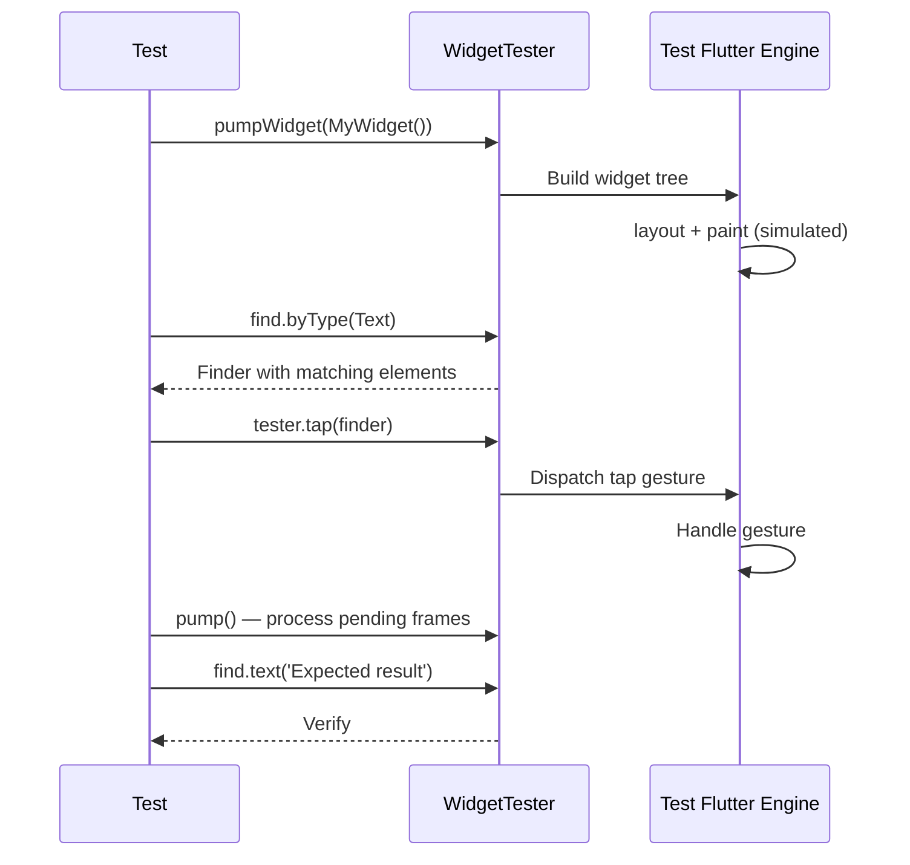

# Bài 5.3 — Widget Testing

## Phần 1 — Khái Niệm & Mục Tiêu Bài Học

### Widget test vs Unit test

- **Unit test**: test Pure Dart logic — nhanh, không cần Flutter
- **Widget test**: test một widget với simulated Flutter environment — test UI logic, gestures, rendering

```dart
// Unit test: dart test (milliseconds)
test('Money.formatted returns correct VND', () {
  expect(const Money(amount: 299000).formatted, '299.000đ');
});

// Widget test: flutter test (seconds, builds widget tree)
testWidgets('ProductCard shows price', (tester) async {
  await tester.pumpWidget(ProductCard(product: product));
  expect(find.text('299.000đ'), findsOneWidget);
});
```

### Bạn sẽ hiểu được sau bài này:
- `testWidgets()`, `pumpWidget()`, `pump()`
- `find.byType`, `find.byKey`, `find.text`, `find.byWidgetPredicate`
- `tester.tap()`, `tester.enterText()`, `tester.drag()`
- Inject BLoC/Provider vào widget test

---

## Phần 2 — Cơ Chế Hoạt Động (Under the Hood)

### testWidgets Lifecycle



---

## Phần 3 — Code Mẫu Chuẩn Google

### 3.1 — Widget test cơ bản

```dart
// test/features/products/presentation/widgets/product_card_test.dart
import 'package:flutter_test/flutter_test.dart';
import 'package:flutter/material.dart';

void main() {
  group('ProductCard', () {
    final product = Product(
      id: '1',
      name: 'iPhone 15 Pro',
      price: const Money(amount: 29990000),
      category: 'phone',
      stockQuantity: 10,
      imageUrls: ['https://example.com/image.jpg'],
      status: ProductStatus.active,
    );

    testWidgets('should display product name and price', (tester) async {
      // Arrange: wrap với MaterialApp (cần theme/directionality)
      await tester.pumpWidget(
        MaterialApp(
          theme: ThemeData(useMaterial3: true),
          home: Scaffold(
            body: ProductCard(product: product),
          ),
        ),
      );

      // Assert
      expect(find.text('iPhone 15 Pro'), findsOneWidget);
      expect(find.text('29.990.000đ'), findsOneWidget);
    });

    testWidgets('should show out of stock when stockQuantity is 0', (tester) async {
      final outOfStock = product.copyWith(stockQuantity: 0);

      await tester.pumpWidget(
        MaterialApp(home: Scaffold(body: ProductCard(product: outOfStock))),
      );

      expect(find.text('Hết hàng'), findsOneWidget);
      // Add to cart button should be disabled
      final button = tester.widget<ElevatedButton>(
        find.byType(ElevatedButton),
      );
      expect(button.onPressed, isNull); // Disabled
    });

    testWidgets('should call onTap when card is tapped', (tester) async {
      var tapCount = 0;

      await tester.pumpWidget(
        MaterialApp(
          home: Scaffold(
            body: ProductCard(
              product: product,
              onTap: () => tapCount++,
            ),
          ),
        ),
      );

      await tester.tap(find.byType(ProductCard));
      expect(tapCount, 1);
    });
  });
}
```

### 3.2 — Widget test với BLoC

```dart
// test/features/products/presentation/pages/products_screen_test.dart
void main() {
  group('ProductsScreen', () {
    late MockProductsBloc mockBloc;

    setUp(() {
      mockBloc = MockProductsBloc();
    });

    // Helper để tạo widget với BLoC injection
    Widget buildSubject() {
      return MaterialApp(
        home: BlocProvider<ProductsBloc>.value(
          value: mockBloc,
          child: const ProductsScreen(),
        ),
      );
    }

    testWidgets('shows loading indicator when state is loading', (tester) async {
      // Arrange: stub BLoC state stream
      when(() => mockBloc.state).thenReturn(const ProductsLoading());
      when(() => mockBloc.stream).thenAnswer(
        (_) => Stream.value(const ProductsLoading()),
      );

      await tester.pumpWidget(buildSubject());
      // pump() xử lý frame tiếp theo
      await tester.pump();

      expect(find.byType(CircularProgressIndicator), findsOneWidget);
    });

    testWidgets('shows product list when state is loaded', (tester) async {
      final products = List.generate(
        3,
        (i) => Product(id: '$i', name: 'Product $i', ...),
      );

      when(() => mockBloc.state).thenReturn(ProductsLoaded(products));
      when(() => mockBloc.stream).thenAnswer(
        (_) => Stream.value(ProductsLoaded(products)),
      );

      await tester.pumpWidget(buildSubject());
      await tester.pump();

      expect(find.byType(ProductTile), findsNWidgets(3));
      expect(find.text('Product 0'), findsOneWidget);
      expect(find.text('Product 2'), findsOneWidget);
    });

    testWidgets('adds ProductsStarted event when screen loads', (tester) async {
      when(() => mockBloc.state).thenReturn(const ProductsInitial());
      when(() => mockBloc.stream).thenAnswer((_) => const Stream.empty());
      when(() => mockBloc.add(any())).thenReturn(null);

      await tester.pumpWidget(buildSubject());
      await tester.pump();

      verify(() => mockBloc.add(const ProductsStarted())).called(1);
    });
  });
}
```

### 3.3 — Interaction tests (tap, scroll, enter text)

```dart
testWidgets('search field dispatches SearchQueryChanged on input', (tester) async {
  when(() => mockBloc.state).thenReturn(SearchInitial());
  when(() => mockBloc.stream).thenAnswer((_) => const Stream.empty());
  when(() => mockBloc.add(any())).thenReturn(null);

  await tester.pumpWidget(buildSubject());

  // Enter text in search field
  await tester.enterText(find.byType(TextField), 'flutter');
  await tester.pump();

  verify(() => mockBloc.add(const SearchQueryChanged('flutter'))).called(1);
});

testWidgets('pull to refresh dispatches ProductsRefreshed', (tester) async {
  when(() => mockBloc.state).thenReturn(ProductsLoaded([product]));
  when(() => mockBloc.stream).thenAnswer((_) => const Stream.empty());
  when(() => mockBloc.add(any())).thenReturn(null);

  await tester.pumpWidget(buildSubject());
  await tester.pump();

  // Simulate pull-to-refresh
  await tester.drag(find.byType(RefreshIndicator), const Offset(0, 300));
  await tester.pumpAndSettle(); // Wait for refresh animation

  verify(() => mockBloc.add(const ProductsRefreshed())).called(1);
});

testWidgets('can scroll list to reveal more items', (tester) async {
  final products = List.generate(20, (i) => Product(id: '$i', name: 'P$i', ...));
  when(() => mockBloc.state).thenReturn(ProductsLoaded(products));
  when(() => mockBloc.stream).thenAnswer((_) => const Stream.empty());

  await tester.pumpWidget(buildSubject());
  await tester.pump();

  // First item visible
  expect(find.text('P0'), findsOneWidget);

  // Scroll down
  await tester.scrollUntilVisible(find.text('P19'), 500);

  expect(find.text('P19'), findsOneWidget);
});
```

---

## Phần 4 — Lỗi Sai Phổ Biến & Best Practices

### ❌ Anti-pattern 1: pump() vs pumpAndSettle()

```dart
// pump(): process MỘT frame — cho animations đang chạy
// pumpAndSettle(): loop pump() cho đến khi không còn pending frames

// ❌ Sai: dùng pumpAndSettle() khi có infinite animation (CircularProgressIndicator)
await tester.pumpAndSettle(); // Timeout! Spinner chạy mãi không settle

// ✅ Dùng pump() với Duration cụ thể hoặc pump() đơn
await tester.pump(); // Process next frame
await tester.pump(const Duration(seconds: 1)); // Advance time 1 second
```

### ❌ Anti-pattern 2: find.text() case-sensitive mismatch

```dart
// ❌ Text hiển thị 'Hết hàng' nhưng test dùng 'hết hàng'
expect(find.text('hết hàng'), findsOneWidget); // FAIL!

// ✅ Dùng byWidgetPredicate cho case-insensitive
expect(
  find.byWidgetPredicate(
    (widget) => widget is Text &&
        (widget.data?.toLowerCase() ?? '') == 'hết hàng',
  ),
  findsOneWidget,
);
```

---

## Phần 5 — Bài Tập Củng Cố Tư Duy

### Challenge: Test LoginScreen

**Yêu cầu:**
1. Test: hiển thị email và password fields
2. Test: submit button disabled khi form trống
3. Test: submit button enabled sau khi nhập email + password
4. Test: hiển thị loading indicator khi state = LoginLoading
5. Test: hiển thị error message khi state = LoginFailure

### Thử thách thẩm định kỹ thuật:

1. **"pumpWidget vs pump vs pumpAndSettle?"**
   - `pumpWidget`: build widget lần đầu
   - `pump()`: process next frame (hoặc advance time)
   - `pumpAndSettle()`: loop đến khi stable — không dùng với infinite animations

2. **"Finder types quan trọng nhất?"**
   - `find.byType(T)`: theo widget type
   - `find.text('...')`: theo text content
   - `find.byKey(Key('...'))`: theo key — best practice cho custom widgets
   - `find.byWidgetPredicate`: custom logic
