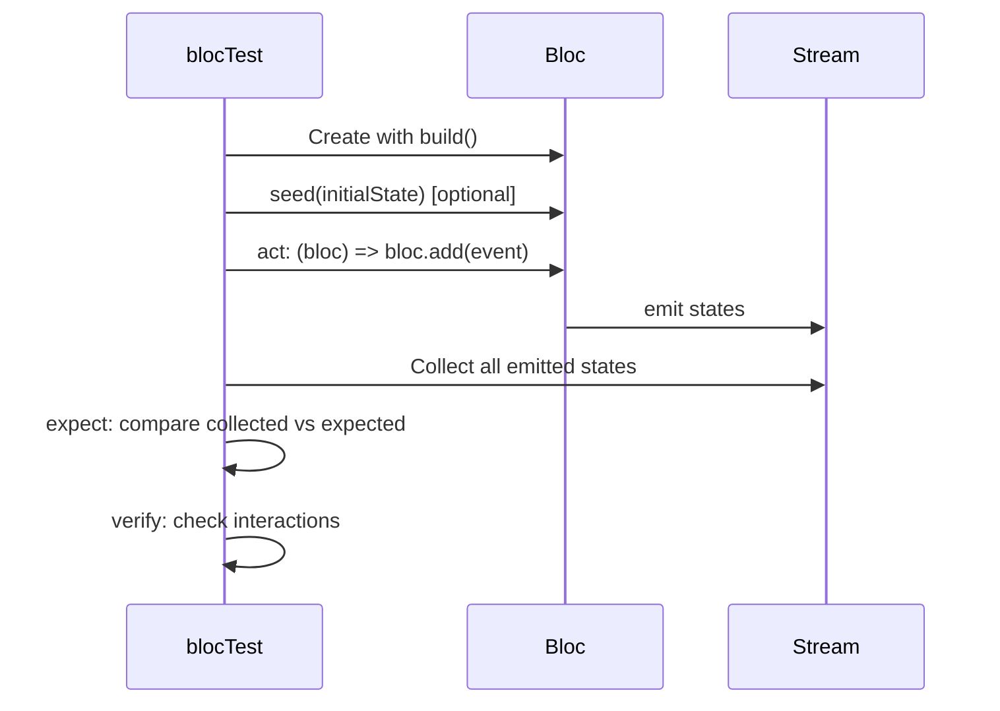

# Bài 5.4 — Testing BLoC & Riverpod

## Phần 1 — Khái Niệm & Mục Tiêu Bài Học

### Tại sao test BLoC/Riverpod riêng?

BLoC và Riverpod có test utilities chuyên biệt:

- **`bloc_test`** package: `blocTest()` — declarative test cho BLoC/Cubit
- **`ProviderContainer`** (Riverpod): test providers mà không cần Flutter widget tree

Cả hai đều có thể test hoàn toàn với Pure Dart (không cần `flutter test`), chạy rất nhanh.

### Bạn sẽ hiểu được sau bài này:
- `blocTest<Bloc, State>()` — test BLoC theo acts/expect pattern
- Test Cubit với `blocTest` hoặc manual
- `ProviderContainer` — test Riverpod providers
- Testing async states và streams

---

## Phần 2 — Cơ Chế Hoạt Động (Under the Hood)

### blocTest flow



---

## Phần 3 — Code Mẫu Chuẩn Google

### 3.1 — blocTest cho BLoC

```dart
// test/features/auth/bloc/auth_bloc_test.dart
import 'package:bloc_test/bloc_test.dart';
import 'package:flutter_test/flutter_test.dart';
import 'package:mocktail/mocktail.dart';

void main() {
  group('AuthBloc', () {
    late MockLoginUseCase mockLoginUseCase;
    late MockLogoutUseCase mockLogoutUseCase;

    setUp(() {
      mockLoginUseCase = MockLoginUseCase();
      mockLogoutUseCase = MockLogoutUseCase();
      registerFallbackValue(const LoginParams(email: '', password: ''));
    });

    // Tạo BLoC — helper
    AuthBloc buildBloc() => AuthBloc(
      loginUseCase: mockLoginUseCase,
      logoutUseCase: mockLogoutUseCase,
    );

    // Happy path
    blocTest<AuthBloc, AuthState>(
      'emits [Loading, Authenticated] when login succeeds',
      build: buildBloc,
      // act: gửi event
      act: (bloc) => bloc.add(AuthLoginRequested(
        email: 'user@test.com',
        password: 'password123',
      )),
      // setUp cho stub (chạy trước act)
      setUp: () {
        when(() => mockLoginUseCase(any()))
            .thenAnswer((_) async => _fakeUser);
      },
      // expect: states được emit theo thứ tự
      expect: () => [
        const AuthLoading(),
        AuthAuthenticated(_fakeUser),
      ],
      // verify: interactions sau khi act
      verify: (_) {
        verify(() => mockLoginUseCase(
          const LoginParams(email: 'user@test.com', password: 'password123'),
        )).called(1);
      },
    );

    // Error path
    blocTest<AuthBloc, AuthState>(
      'emits [Loading, Failure] when login throws NetworkException',
      build: buildBloc,
      setUp: () {
        when(() => mockLoginUseCase(any()))
            .thenThrow(const NetworkException('Timeout'));
      },
      act: (bloc) => bloc.add(AuthLoginRequested(
        email: 'user@test.com',
        password: 'password123',
      )),
      expect: () => [
        const AuthLoading(),
        const AuthFailure('Timeout'),
      ],
    );

    // Initial state
    blocTest<AuthBloc, AuthState>(
      'emits nothing on creation (initial state is AuthInitial)',
      build: buildBloc,
      // No act
      expect: () => [],
    );
  });

  // Test Cubit
  group('CounterCubit', () {
    blocTest<CounterCubit, CounterState>(
      'emits [CounterState(1)] when increment is called',
      build: CounterCubit.new,
      act: (cubit) => cubit.increment(),
      expect: () => [const CounterState(count: 1)],
    );

    blocTest<CounterCubit, CounterState>(
      'emits [Loading, incremented] when incrementAsync',
      build: CounterCubit.new,
      act: (cubit) => cubit.incrementAsync(),
      expect: () => [
        const CounterState(count: 0, isLoading: true),
        const CounterState(count: 1, isLoading: false),
      ],
    );

    blocTest<CounterCubit, CounterState>(
      'seed: start with custom initial state',
      build: CounterCubit.new,
      seed: () => const CounterState(count: 5), // Start at 5
      act: (cubit) => cubit.increment(),
      expect: () => [const CounterState(count: 6)],
    );
  });
}
```

### 3.2 — Riverpod với ProviderContainer

```dart
// test/features/products/providers/products_provider_test.dart
import 'package:flutter_riverpod/flutter_riverpod.dart';
import 'package:flutter_test/flutter_test.dart';

void main() {
  group('ProductsNotifier', () {
    late MockProductRepository mockRepository;

    setUp(() {
      mockRepository = MockProductRepository();
    });

    // ProviderContainer: test providers mà không cần widget tree
    ProviderContainer createContainer() {
      return ProviderContainer(
        // Override: thay real dependency bằng mock
        overrides: [
          productRepositoryProvider.overrideWithValue(mockRepository),
        ],
      );
    }

    test('initial state is AsyncLoading', () {
      when(() => mockRepository.getProducts())
          .thenAnswer((_) async => []);

      final container = createContainer();
      addTearDown(container.dispose); // Cleanup

      // State ngay sau tạo — AsyncLoading
      expect(
        container.read(productsProvider),
        isA<AsyncLoading<List<Product>>>(),
      );
    });

    test('state becomes AsyncData when products loaded', () async {
      final products = [_fakeProduct];
      when(() => mockRepository.getProducts())
          .thenAnswer((_) async => products);

      final container = createContainer();
      addTearDown(container.dispose);

      // Listen và chờ state change
      final result = await container.read(productsProvider.future);
      expect(result, equals(products));

      // Check final state
      expect(
        container.read(productsProvider),
        isA<AsyncData<List<Product>>>(),
      );
    });

    test('state becomes AsyncError when fetch fails', () async {
      when(() => mockRepository.getProducts())
          .thenThrow(const NetworkException('Timeout'));

      final container = createContainer();
      addTearDown(container.dispose);

      // Chờ cho đến khi có error
      try {
        await container.read(productsProvider.future);
        fail('Expected exception');
      } catch (e) {
        expect(e, isA<NetworkException>());
      }

      expect(
        container.read(productsProvider),
        isA<AsyncError<List<Product>>>(),
      );
    });

    test('addProduct updates state optimistically', () async {
      final initial = [_fakeProduct];
      when(() => mockRepository.getProducts()).thenAnswer((_) async => initial);
      when(() => mockRepository.addProduct(any())).thenAnswer((_) async {});

      final container = createContainer();
      addTearDown(container.dispose);

      // Wait for initial load
      await container.read(productsProvider.future);

      // Add product
      final newProduct = _fakeProduct.copyWith(id: 'new');
      await container.read(productsProvider.notifier).addProduct(newProduct);

      // Verify optimistic update
      final state = container.read(productsProvider);
      expect(
        state.requireValue.any((p) => p.id == 'new'),
        isTrue,
      );
    });
  });
}
```

### 3.3 — Test stream trong BLoC với skip

```dart
blocTest<SearchBloc, SearchState>(
  'emits results after debounce',
  build: () => SearchBloc(mockRepository),
  setUp: () {
    when(() => mockRepository.search('flutter'))
        .thenAnswer((_) async => [_fakeProduct]);
  },
  act: (bloc) {
    bloc.add(const SearchQueryChanged('flu'));
    bloc.add(const SearchQueryChanged('flut'));
    bloc.add(const SearchQueryChanged('flutter'));
    // Debounce: chỉ lần cuối được xử lý
  },
  // skip: bỏ qua N states đầu (intermediate loading states)
  skip: 0,
  wait: const Duration(milliseconds: 350), // Chờ debounce
  expect: () => [
    const SearchLoading('flutter'),
    SearchSuccess(results: [_fakeProduct], query: 'flutter'),
  ],
);
```

---

## Phần 4 — Lỗi Sai Phổ Biến & Best Practices

### ❌ Anti-pattern 1: Quên addTearDown cho ProviderContainer

```dart
// ❌ Container không dispose → resource leak trong test suite
test('test 1', () async {
  final container = ProviderContainer();
  // Không dispose!
});

// ✅ addTearDown: tự động dispose sau mỗi test
test('test 1', () async {
  final container = ProviderContainer();
  addTearDown(container.dispose); // Cleanup tự động
});
```

### ❌ Anti-pattern 2: Không await future trong ProviderContainer

```dart
// ❌ State vẫn là AsyncLoading khi check
test('should have data', () {
  final container = createContainer();
  // Không await!
  expect(container.read(productsProvider).hasValue, isTrue); // FAIL: still loading
});

// ✅ Await future trước khi check state
test('should have data', () async {
  final container = createContainer();
  addTearDown(container.dispose);
  await container.read(productsProvider.future); // Wait for async to complete
  expect(container.read(productsProvider).hasValue, isTrue); // PASS
});
```

---

## Phần 5 — Bài Tập Củng Cố Tư Duy

### Challenge: Full Test Suite cho CartCubit

**Yêu cầu:**
1. `blocTest` cho `AddToCartEvent`: happy path + out-of-stock error
2. `blocTest` cho `RemoveFromCartEvent`: verify state update
3. `blocTest` cho `ClearCartEvent`: emit empty cart state
4. `blocTest` cho `CheckoutEvent`: Loading → Success, Loading → Failure
5. Test `cartTotalProvider` với ProviderContainer (nếu dùng Riverpod)

### Thử thách thẩm định kỹ thuật:

1. **"blocTest vs manual test cho BLoC?"**
   - blocTest: declarative, compact, built-in expect/verify — preferred
   - Manual: dùng khi cần phức tạp hơn (multiple streams, timing)

2. **"ProviderContainer.overrides dùng để làm gì?"**
   - Override một provider với mock/fake trong test scope
   - Không ảnh hưởng providers khác trong container
   - Tương đương BlocProvider.value trong widget tests

3. **"skip parameter trong blocTest dùng khi nào?"**
   - Bỏ qua N states đầu khi không cần assert
   - Ví dụ: bỏ qua Loading state, chỉ assert final Success/Error state
