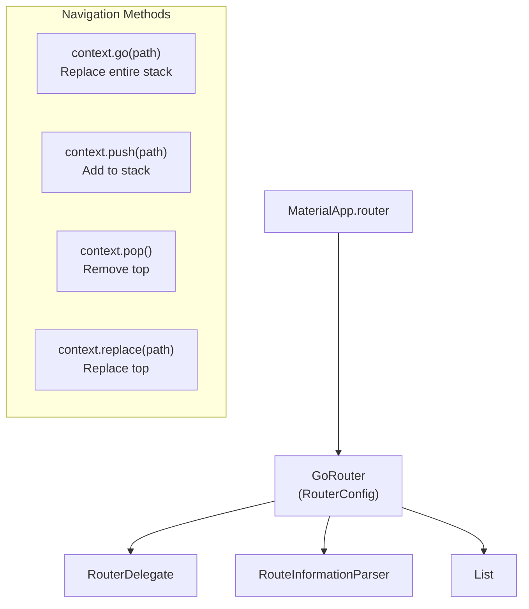

# Bài 6.1 — GoRouter: Routes & Navigation

## Phần 1 — Khái Niệm & Mục Tiêu Bài Học

### Từ Navigator 1.0 sang GoRouter

`flutter-fundamentals-v2/` đã dạy Navigator 1.0 (push/pop) và giới thiệu khái niệm GoRouter. Bài này đi vào **thực hành** GoRouter — đây là prerequisite cho Advanced Module 06 (StatefulShellRoute, Auth Guards, Deep Links).

```dart
// Navigator 1.0: imperative, không sync URL
Navigator.push(context, MaterialPageRoute(builder: (_) => ProductScreen(id: id)));

// GoRouter: declarative, URL-driven
context.go('/products/$id');
// URL tự update: https://myapp.com/products/123
```

### Bạn sẽ hiểu được sau bài này:
- `GoRouter` config: `routes`, `initialLocation`, `debugLogDiagnostics`
- `GoRoute` với `path`, `name`, path parameters (`:id`)
- `context.go()` vs `context.push()` vs `context.replace()`
- Query parameters và extra data

---

## Phần 2 — Cơ Chế Hoạt Động (Under the Hood)

### GoRouter Architecture



---

## Phần 3 — Code Mẫu Chuẩn Google

### 3.1 — GoRouter setup cơ bản

```dart
// router/app_router.dart
import 'package:go_router/go_router.dart';

// Route names — tránh typo với constants
abstract final class AppRoutes {
  static const home = '/';
  static const products = '/products';
  static const productDetail = '/products/:id';
  static const cart = '/cart';
  static const profile = '/profile';
  static const login = '/login';
}

// Tạo GoRouter
GoRouter createRouter() {
  return GoRouter(
    initialLocation: AppRoutes.home,
    debugLogDiagnostics: true, // Log navigation trong debug mode
    routes: [
      GoRoute(
        path: AppRoutes.home,
        name: 'home',
        builder: (context, state) => const HomeScreen(),
      ),

      GoRoute(
        path: AppRoutes.products,
        name: 'products',
        builder: (context, state) {
          // Query parameter
          final category = state.uri.queryParameters['category'];
          return ProductsScreen(category: category);
        },
        // Sub-routes: /products/:id
        routes: [
          GoRoute(
            path: ':id', // Relative path — full: /products/:id
            name: 'product-detail',
            builder: (context, state) {
              // Path parameter
              final productId = state.pathParameters['id']!;
              return ProductDetailScreen(productId: productId);
            },
          ),
        ],
      ),

      GoRoute(
        path: AppRoutes.cart,
        name: 'cart',
        builder: (context, state) => const CartScreen(),
      ),

      GoRoute(
        path: AppRoutes.profile,
        name: 'profile',
        builder: (context, state) => const ProfileScreen(),
      ),

      GoRoute(
        path: AppRoutes.login,
        name: 'login',
        builder: (context, state) => const LoginScreen(),
      ),
    ],

    // Error route: khi path không match
    errorBuilder: (context, state) => Scaffold(
      body: Center(child: Text('Page not found: ${state.uri}')),
    ),
  );
}

// main.dart
void main() {
  runApp(MyApp());
}

class MyApp extends StatelessWidget {
  final _router = createRouter();

  @override
  Widget build(BuildContext context) {
    return MaterialApp.router(
      routerConfig: _router,
      title: 'My App',
      theme: ThemeData(useMaterial3: true),
    );
  }
}
```

### 3.2 — Navigation methods

```dart
class ProductsScreen extends StatelessWidget {
  final String? category;
  const ProductsScreen({super.key, this.category});

  @override
  Widget build(BuildContext context) {
    return Scaffold(
      appBar: AppBar(title: const Text('Sản phẩm')),
      body: ListView.builder(
        itemCount: products.length,
        itemBuilder: (context, i) => ListTile(
          title: Text(products[i].name),
          onTap: () {
            // context.go: replace toàn bộ stack (back button không hoạt động)
            // Dùng cho bottom navigation, login → home
            // context.go('/products/${products[i].id}');

            // context.push: thêm vào stack (back button hoạt động)
            // Dùng khi muốn back về trang trước
            context.push('/products/${products[i].id}');

            // Named route navigation (avoid hardcoding paths)
            // context.pushNamed('product-detail', pathParameters: {'id': products[i].id});
          },
        ),
      ),
      floatingActionButton: FloatingActionButton(
        onPressed: () {
          // Query parameters
          context.go('/products?category=phones');
        },
        child: const Icon(Icons.filter_list),
      ),
    );
  }
}

// Nhận kết quả từ màn hình con (like Navigator.pop(result))
class EditScreen extends StatelessWidget {
  @override
  Widget build(BuildContext context) {
    return Scaffold(
      body: ElevatedButton(
        onPressed: () {
          // Pop với result
          context.pop({'updated': true, 'product': updatedProduct});
        },
        child: const Text('Lưu'),
      ),
    );
  }
}

// Caller nhận result
Future<void> _openEdit(BuildContext context) async {
  final result = await context.push<Map<String, dynamic>>('/edit');
  if (result?['updated'] == true) {
    // Refresh list
  }
}
```

### 3.3 — Extra: pass complex objects

```dart
// Path parameters chỉ là String — dùng extra cho complex objects
GoRoute(
  path: '/product-edit',
  builder: (context, state) {
    // extra: nhận object trực tiếp (không qua serialization)
    final product = state.extra as Product;
    return ProductEditScreen(product: product);
  },
),

// Navigation với extra
context.push('/product-edit', extra: product); // Pass Product object

// Lưu ý: extra không hoạt động với deep links (không serialize được)
// Nếu cần deep link → dùng path/query parameters và fetch lại từ Repository
```

---

## Phần 4 — Lỗi Sai Phổ Biến & Best Practices

### ❌ Anti-pattern 1: context.go() cho detail screens

```dart
// ❌ go() thay stack → không có back button từ /products/:id
context.go('/products/$id'); // User bị stuck, không thể back

// ✅ push() cho detail/nested screens
context.push('/products/$id'); // Back button hoạt động
```

### ❌ Anti-pattern 2: Hardcode path strings ở nhiều nơi

```dart
// ❌ Hardcode → typo lúc runtime
context.push('/product/$id'); // Sai path (thiếu 's')!

// ✅ Constants
abstract final class AppRoutes {
  static const productDetail = '/products/:id'; // Definition
  static String productDetailPath(String id) => '/products/$id'; // Builder
}

context.push(AppRoutes.productDetailPath(id)); // Type-safe
// Hoặc dùng named routes
context.pushNamed('product-detail', pathParameters: {'id': id});
```

---

## Phần 5 — Bài Tập Củng Cố Tư Duy

### Challenge: E-Commerce Router

**Yêu cầu:**
1. Routes: Home, Products (với query `?category=`), ProductDetail (`:id`), Cart, Checkout, OrderSuccess
2. Named route constants cho tất cả
3. Từ ProductDetail → Add to Cart → navigate đến Cart (go, replace stack)
4. Từ Checkout → OrderSuccess (replace Checkout trong stack)
5. Error page cho unknown routes

### Câu hỏi phỏng vấn:

1. **"context.go vs context.push vs context.replace?"**
   - `go`: replace toàn bộ navigation stack — bottom nav, login→home
   - `push`: add to stack — detail screens, keep back button
   - `replace`: replace chỉ screen hiện tại — checkout → order success

2. **"GoRouter vs Navigator 2.0 trực tiếp?"**
   - GoRouter: wrapper tốt hơn — URL sync, deep links, less boilerplate
   - Navigator 2.0 raw: full control nhưng rất phức tạp — hiếm khi cần
