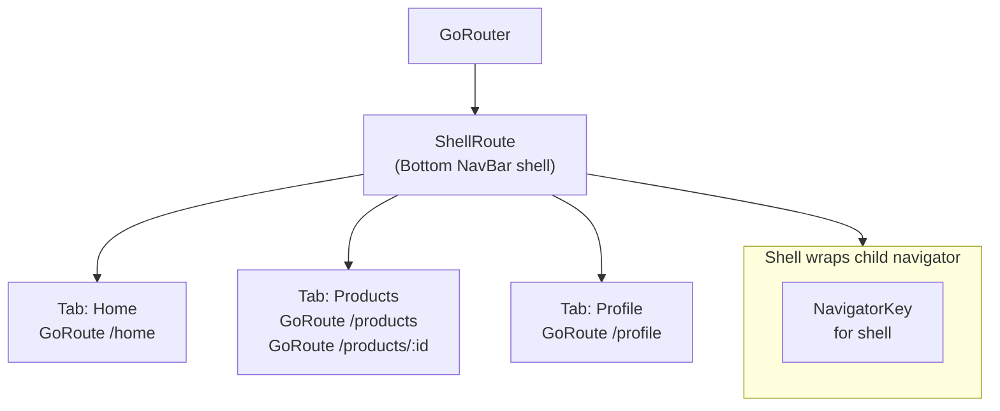

# Bài 6.2 — ShellRoute & Bottom Navigation Persistence

## Phần 1 — Khái Niệm & Mục Tiêu Bài Học

### Vấn đề: Bottom nav state bị reset khi navigate

Với Navigator 1.0, khi switch giữa bottom nav tabs — mỗi tab mất state (list scroll position, loaded data). `ShellRoute` giải quyết điều này.

```dart
// ShellRoute: wrap nhiều routes trong một persistent shell (bottom nav)
// Mỗi tab có navigator stack riêng → switch tab không reset state
```

`ShellRoute` là prerequisite cho Advanced chapter "StatefulShellRoute & Nested Navigation" trong `flutter-advanced/`.

### Bạn sẽ hiểu được sau bài này:
- `ShellRoute`: persistent UI wrapper cho nhóm routes
- Nested navigation trong mỗi tab
- So sánh `ShellRoute` vs `StatefulShellRoute`

---

## Phần 2 — Cơ Chế Hoạt Động (Under the Hood)

### ShellRoute Architecture



**ShellRoute**: child navigator reuse → tất cả routes trong shell share một navigator, bottom nav persist.

---

## Phần 3 — Code Mẫu Chuẩn Google

### 3.1 — ShellRoute với Bottom NavigationBar

```dart
// router/app_router.dart
final _shellNavigatorKey = GlobalKey<NavigatorState>();

GoRouter createRouter() {
  return GoRouter(
    initialLocation: '/home',
    routes: [
      // ShellRoute: wrapper với persistent UI (bottom nav)
      ShellRoute(
        navigatorKey: _shellNavigatorKey,
        // builder: tạo shell UI — nhận child (active tab content)
        builder: (context, state, child) => AppShell(child: child),
        routes: [
          // Tab routes — paths trong shell
          GoRoute(
            path: '/home',
            builder: (context, state) => const HomeTab(),
          ),
          GoRoute(
            path: '/products',
            builder: (context, state) => const ProductsTab(),
            routes: [
              // Nested route trong Products tab
              GoRoute(
                path: ':id',
                // QUAN TRỌNG: parentNavigatorKey = shell → opens in shell (không fullscreen)
                // Bỏ parentNavigatorKey → opens fullscreen (over bottom nav)
                builder: (context, state) => ProductDetailScreen(
                  productId: state.pathParameters['id']!,
                ),
              ),
            ],
          ),
          GoRoute(
            path: '/cart',
            builder: (context, state) => const CartTab(),
          ),
          GoRoute(
            path: '/profile',
            builder: (context, state) => const ProfileTab(),
          ),
        ],
      ),

      // Routes NGOÀI shell (fullscreen, không có bottom nav)
      GoRoute(
        path: '/login',
        builder: (context, state) => const LoginScreen(),
      ),
      GoRoute(
        path: '/checkout',
        builder: (context, state) => const CheckoutScreen(),
      ),
    ],
  );
}

// AppShell: persistent UI wrapper
class AppShell extends StatelessWidget {
  final Widget child;
  const AppShell({super.key, required this.child});

  @override
  Widget build(BuildContext context) {
    return Scaffold(
      body: child, // Active tab content
      bottomNavigationBar: BottomNavigationBar(
        currentIndex: _getCurrentIndex(context),
        onTap: (index) => _onTap(context, index),
        items: const [
          BottomNavigationBarItem(icon: Icon(Icons.home), label: 'Home'),
          BottomNavigationBarItem(icon: Icon(Icons.shopping_bag), label: 'Sản phẩm'),
          BottomNavigationBarItem(icon: Icon(Icons.shopping_cart), label: 'Giỏ hàng'),
          BottomNavigationBarItem(icon: Icon(Icons.person), label: 'Hồ sơ'),
        ],
      ),
    );
  }

  int _getCurrentIndex(BuildContext context) {
    final location = GoRouterState.of(context).uri.toString();
    if (location.startsWith('/home')) return 0;
    if (location.startsWith('/products')) return 1;
    if (location.startsWith('/cart')) return 2;
    if (location.startsWith('/profile')) return 3;
    return 0;
  }

  void _onTap(BuildContext context, int index) {
    // go() → navigate tới tab (replace stack để đúng behavior)
    switch (index) {
      case 0: context.go('/home');
      case 1: context.go('/products');
      case 2: context.go('/cart');
      case 3: context.go('/profile');
    }
  }
}
```

### 3.2 — NavigationBar M3 (thay thế BottomNavigationBar)

```dart
// M3 NavigationBar — preferred over BottomNavigationBar
class AppShell extends StatelessWidget {
  final Widget child;
  const AppShell({super.key, required this.child});

  static const _tabs = [
    (icon: Icons.home_outlined, activeIcon: Icons.home, label: 'Home', path: '/home'),
    (icon: Icons.search_outlined, activeIcon: Icons.search, label: 'Khám phá', path: '/products'),
    (icon: Icons.shopping_cart_outlined, activeIcon: Icons.shopping_cart, label: 'Giỏ', path: '/cart'),
    (icon: Icons.person_outline, activeIcon: Icons.person, label: 'Tôi', path: '/profile'),
  ];

  @override
  Widget build(BuildContext context) {
    final location = GoRouterState.of(context).uri.path;
    final currentIndex = _tabs.indexWhere((tab) => location.startsWith(tab.path));

    return Scaffold(
      body: child,
      bottomNavigationBar: NavigationBar(
        selectedIndex: currentIndex == -1 ? 0 : currentIndex,
        onDestinationSelected: (i) => context.go(_tabs[i].path),
        destinations: _tabs.map((tab) => NavigationDestination(
          icon: Icon(tab.icon),
          selectedIcon: Icon(tab.activeIcon),
          label: tab.label,
        )).toList(),
      ),
    );
  }
}
```

---

## Phần 4 — Lỗi Sai Phổ Biến & Best Practices

### ❌ Anti-pattern 1: Dùng push() thay vì go() khi switch tabs

```dart
// ❌ push() cho tab switching → stack keeps growing
// Home → Products → Home → Products... stack: [Home, Products, Home, Products]
context.push('/products');

// ✅ go() cho tab switching → replace location
context.go('/products'); // Stack: [Products]
```

### ❌ Anti-pattern 2: Quên parentNavigatorKey cho fullscreen routes trong shell

```dart
// ❌ Checkout hiển thị với bottom nav (không muốn)
GoRoute(path: '/checkout', builder: ...)
// Checkout nằm trong ShellRoute → có bottom nav!

// ✅ Để checkout fullscreen: đặt NGOÀI ShellRoute
GoRouter(routes: [
  ShellRoute(routes: [...]), // Tabs
  GoRoute(path: '/checkout', builder: ...), // Fullscreen route
])
```

---

## Phần 5 — Bài Tập Củng Cố Tư Duy

### Challenge: App với 4 tabs + Nested Navigation

**Yêu cầu:**
1. ShellRoute với 4 tabs: Feed, Explore, Notifications, Profile
2. Feed tab: list posts → tap → PostDetail (within shell)
3. Profile tab: user info → tap Settings → SettingsScreen (fullscreen — không có bottom nav)
4. Checkout từ Cart tab → fullscreen (ngoài shell)

### Câu hỏi phỏng vấn:

1. **"ShellRoute vs StatefulShellRoute?"**
   - ShellRoute: single navigator cho tất cả tabs — simple
   - StatefulShellRoute: mỗi tab có navigator riêng → tab state persistence (scroll position)
   - Advanced chapter đi sâu hơn về StatefulShellRoute

2. **"Tại sao go() thay vì push() cho bottom nav tabs?"**
   - push() stacks routes — switch tab nhiều lần → deep stack
   - go() sets location — clean, back button hoạt động đúng
