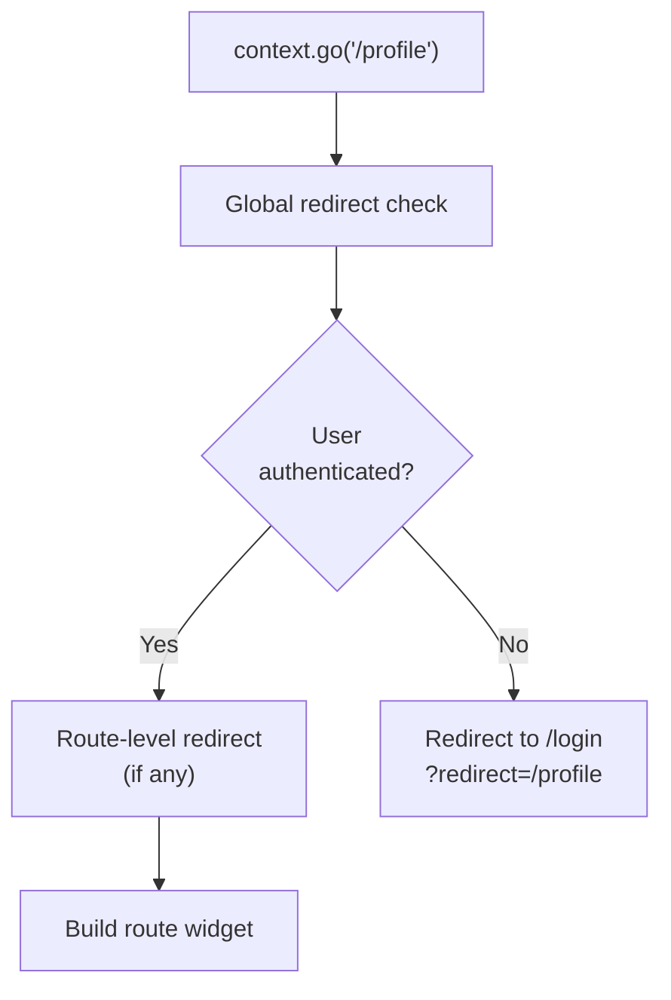

# Bài 6.3 — Redirect & Auth Guard

## Phần 1 — Khái Niệm & Mục Tiêu Bài Học

### Tại sao cần redirect?

Mọi app production đều có authentication guard — user chưa login không được vào màn hình protected. GoRouter `redirect` là cách khai báo auth logic một nơi, tự động áp dụng cho tất cả routes.

```dart
// Thay vì check auth trong từng widget:
// ❌ Phải check thủ công ở mỗi screen
class HomeScreen extends StatefulWidget {
  void initState() {
    if (!AuthService.isLoggedIn) Navigator.pushNamed(context, '/login');
  }
}

// ✅ Khai báo một lần trong GoRouter:
redirect: (context, state) {
  if (!isLoggedIn && !isPublicRoute(state.uri.path)) return '/login';
  return null; // null = no redirect
},
```

### Bạn sẽ hiểu được sau bài này:
- `redirect` callback: global và per-route
- Auth guard với BLoC/Riverpod state
- `refreshListenable`: router tự refresh khi auth state thay đổi
- Redirect sau login về intended destination

---

## Phần 2 — Cơ Chế Hoạt Động (Under the Hood)

### Redirect Flow



---

## Phần 3 — Code Mẫu Chuẩn Google

### 3.1 — Auth Guard với redirect

```dart
// router/app_router.dart
class AppRouter {
  final AuthRepository _authRepository;

  AppRouter(this._authRepository);

  // Set của public routes — không cần login
  static const _publicRoutes = {'/login', '/register', '/forgot-password'};

  late final GoRouter router = GoRouter(
    initialLocation: '/home',
    // refreshListenable: router tự re-evaluate redirect khi auth state thay đổi
    refreshListenable: _AuthStateNotifier(_authRepository),
    redirect: (context, state) async {
      final currentPath = state.uri.path;
      final isPublic = _publicRoutes.any((route) => currentPath.startsWith(route));

      final user = await _authRepository.getCurrentUser();
      final isLoggedIn = user != null;

      // Chưa login + route không public → redirect đến login
      if (!isLoggedIn && !isPublic) {
        // Lưu intended destination để redirect sau khi login
        final from = state.uri.toString();
        return '/login?redirect=${Uri.encodeComponent(from)}';
      }

      // Đã login + đang ở login/register → về home
      if (isLoggedIn && isPublic) {
        return '/home';
      }

      // Role-based: admin route cần admin role
      if (currentPath.startsWith('/admin') && user?.role != UserRole.admin) {
        return '/forbidden';
      }

      return null; // Không redirect
    },
    routes: [
      GoRoute(path: '/login', builder: (_, __) => const LoginScreen()),
      GoRoute(path: '/register', builder: (_, __) => const RegisterScreen()),
      GoRoute(path: '/forbidden', builder: (_, __) => const ForbiddenScreen()),

      ShellRoute(
        builder: (_, __, child) => AppShell(child: child),
        routes: [
          GoRoute(path: '/home', builder: (_, __) => const HomeScreen()),
          GoRoute(path: '/profile', builder: (_, __) => const ProfileScreen()),
        ],
      ),

      GoRoute(
        path: '/admin',
        builder: (_, __) => const AdminDashboard(),
      ),
    ],
  );
}

// Listenable để trigger router refresh khi auth state thay đổi
class _AuthStateNotifier extends ChangeNotifier {
  final AuthRepository _repo;
  StreamSubscription? _sub;

  _AuthStateNotifier(this._repo) {
    _sub = _repo.authStateChanges.listen((_) {
      notifyListeners(); // Trigger router re-evaluation
    });
  }

  @override
  void dispose() {
    _sub?.cancel();
    super.dispose();
  }
}
```

### 3.2 — Login screen với redirect-back

```dart
class LoginScreen extends StatefulWidget {
  const LoginScreen({super.key});
  @override State<LoginScreen> createState() => _LoginScreenState();
}

class _LoginScreenState extends State<LoginScreen> {
  final _emailController = TextEditingController();
  final _passwordController = TextEditingController();

  @override
  void dispose() {
    _emailController.dispose();
    _passwordController.dispose();
    super.dispose();
  }

  @override
  Widget build(BuildContext context) {
    return BlocConsumer<AuthBloc, AuthState>(
      listenWhen: (prev, curr) => prev.status != curr.status,
      listener: (context, state) {
        if (state.status == AuthStatus.authenticated) {
          // Lấy intended destination từ query parameter
          final redirect = GoRouterState.of(context).uri.queryParameters['redirect'];
          if (redirect != null && redirect.isNotEmpty) {
            context.go(Uri.decodeComponent(redirect)); // Về trang intended
          } else {
            context.go('/home'); // Default
          }
        }
      },
      builder: (context, state) => Scaffold(
        appBar: AppBar(title: const Text('Đăng nhập')),
        body: Padding(
          padding: const EdgeInsets.all(16),
          child: Column(
            children: [
              TextField(
                controller: _emailController,
                decoration: const InputDecoration(labelText: 'Email'),
              ),
              const SizedBox(height: 12),
              TextField(
                controller: _passwordController,
                obscureText: true,
                decoration: const InputDecoration(labelText: 'Mật khẩu'),
              ),
              const SizedBox(height: 24),
              if (state.status == AuthStatus.loading)
                const CircularProgressIndicator()
              else
                ElevatedButton(
                  onPressed: () => context.read<AuthBloc>().add(
                    AuthLoginRequested(
                      email: _emailController.text,
                      password: _passwordController.text,
                    ),
                  ),
                  child: const Text('Đăng nhập'),
                ),
              if (state.errorMessage != null)
                Text(
                  state.errorMessage!,
                  style: TextStyle(color: Theme.of(context).colorScheme.error),
                ),
            ],
          ),
        ),
      ),
    );
  }
}
```

### 3.3 — Per-route redirect

```dart
// Redirect chỉ áp dụng cho một route cụ thể
GoRoute(
  path: '/checkout',
  // Per-route redirect: bổ sung hoặc override global redirect
  redirect: (context, state) {
    // Check cart không trống trước khi vào checkout
    final cartState = context.read<CartCubit>().state;
    if (cartState.items.isEmpty) {
      return '/cart?message=empty'; // Redirect về cart với message
    }
    return null; // Tiếp tục
  },
  builder: (context, state) => const CheckoutScreen(),
),
```

---

## Phần 4 — Lỗi Sai Phổ Biến & Best Practices

### ❌ Anti-pattern 1: Không có refreshListenable

```dart
// ❌ Router không biết auth state thay đổi → không redirect sau logout
GoRouter(
  redirect: (context, state) async {
    final user = await authRepo.getCurrentUser();
    if (user == null) return '/login';
    return null;
  },
  // Thiếu refreshListenable!
)
// User logout → auth state thay đổi → nhưng router không redirect!

// ✅ refreshListenable: kết nối auth stream với router
GoRouter(
  refreshListenable: AuthStateNotifier(authRepo),
  redirect: ...
)
```

### ❌ Anti-pattern 2: Redirect loop

```dart
// ❌ Redirect loop: login redirect về login → infinite loop
redirect: (context, state) {
  if (!isLoggedIn) return '/login'; // Redirect về /login
  // Nhưng khi ở /login, redirect lại chạy → trả về /login lại!
}

// ✅ Kiểm tra current path trước khi redirect
redirect: (context, state) {
  if (!isLoggedIn && state.uri.path != '/login') {
    return '/login'; // Chỉ redirect nếu chưa ở /login
  }
  return null;
}
```

---

## Phần 5 — Bài Tập Củng Cố Tư Duy

### Challenge: Multi-level Auth Guard

**Yêu cầu:**
1. Public routes: `/login`, `/register`, `/terms`
2. User routes: `/home`, `/products`, `/profile` (cần login)
3. Premium routes: `/premium-content` (cần `user.isPremium`)
4. Admin routes: `/admin` (cần `user.isAdmin`)
5. `refreshListenable` với auth stream
6. Sau login: redirect về intended destination

### Thử thách thẩm định kỹ thuật:

1. **"redirect trả về null nghĩa là gì?"**
   - `null`: không redirect — tiếp tục navigation hiện tại

2. **"refreshListenable hoạt động như thế nào?"**
   - Router `addListener` vào Listenable
   - Khi `notifyListeners()` → router re-run redirect logic
   - Dùng để trigger re-evaluation sau login/logout

3. **"Khác biệt global redirect vs per-route redirect?"**
   - Global: chạy cho MỌI navigation request
   - Per-route: chỉ chạy cho route đó — tốt cho specialized logic (cart check)
   - Thứ tự: global redirect chạy trước, sau đó per-route
